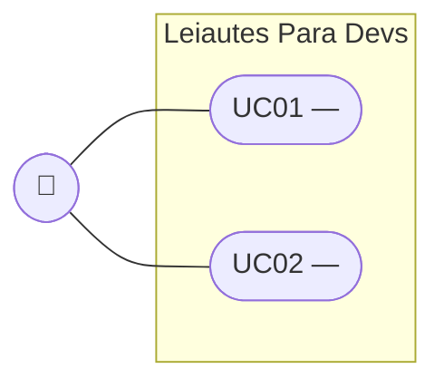

# Create US

This skill guides the creation of a brand new User Story for the **Leiautes Para Devs** project. Trello is the source of truth for the User Story itself: the skill numbers the story from the board, interviews the human about business rules and usability, writes the full Scrum/XP-style story into a new Trello card, and generates the matching `SPEC.md` on disk.

This skill does **not** create branches, does **not** open Pull Requests, and does **not** touch `docs/Backlog_Produto.md` or `docs/user stories/`. It only writes to Trello and to `docs/spec/<slug>/SPEC.md`.

## When to Use This Skill

Invoke this skill whenever the human asks to **create a new User Story**. Common triggers:

- "criar uma nova user story"
- "quero adicionar uma nova US"
- "create a new user story"
- `/create-us`

## Language Rule (very important)

**The SKILL.md itself is written in English so the LLM parses it reliably**, but **every human-facing message and every generated document (Trello card + SPEC.md) MUST match the language the human is speaking in the conversation**.

Detect the human's language from their first message and preserve it consistently. When in doubt, ask the human once: _"In which language should I run this session and generate the documents?"_ and follow the answer for the entire flow.

## Trello Access

- **Board:** "Leiautes Para Devs" — `https://trello.com/b/GyB8zl99/leiautes-para-devs`. **Never** read or write any other board, even if it appears in a listing (see the Trello guardrail in `CLAUDE.md`).
- **Credentials:** read `VITE_TRELLO_KEY` and `VITE_TRELLO_TOKEN` from the repo-root `.env` (via Bash, e.g. `set -a && source .env && set +a`). Never print the key/token values in a message to the human.
- **All calls go through the Trello REST API** (`https://api.trello.com/1/...`) via `curl` in Bash — there is no Trello MCP tool configured in this project.

**Step 0 — Resolve and verify the board** (do this once, at the start):

```bash
curl -s "https://api.trello.com/1/boards/GyB8zl99?fields=id,name,url&key=$VITE_TRELLO_KEY&token=$VITE_TRELLO_TOKEN"
```

Confirm the returned `name` is exactly `"Leiautes Para Devs"` before doing anything else — abort and warn the human if it isn't. Keep the returned `id` (the board ID) for every subsequent call in this session; do not reuse the short link (`GyB8zl99`) for list/card endpoints.

## Use Case Diagram Convention (UML)

Both deliverables (Trello card and `SPEC.md`) carry the **same** UML-style Use Case diagram, expressed as Mermaid source (the project's established diagramming tool — see `PLAN.md` examples). Mermaid has no native `usecaseDiagram`, so approximate standard UML use-case notation with a `flowchart`:

- **Actor** — a plain node labeled with a person emoji: `Ator(["🧍 <Persona>"])`. One per distinct actor role in the story.
- **System boundary** — a `subgraph` wrapping every use case, named after the product or the US area: `subgraph Sistema["Leiautes Para Devs"]`.
- **Use cases** — stadium-shaped nodes (the closest Mermaid shape to a UML oval): `UC01(["UC01 — <título curto>"])`, one per use case identified in Step 5/7 (must match the UC IDs used in SPEC's "Use Cases" section).
- **Association** (actor performs use case) — plain line, no arrowhead: `Ator --- UC01`.
- **«include» / «extend»** relationships between use cases, only when they actually exist — dashed arrow with the stereotype as label: `UC01 -.->|"«include»"| UC02` or `UC01 -.->|"«extend»"| UC03`. Omit this entirely when the story has a single flat use case.

Minimal template:



Build this once in Step 5 (right after identifying UC01, UC02… during the ultrathink pass) and reuse the identical Mermaid source for both deliverables — do not draft two different diagrams for the same story.

### Rendering the Diagram for Trello

`SPEC.md` always embeds the raw Mermaid source (GitHub and most editors render it natively). Trello does **not** render Mermaid, so for the card, render the same source to an SVG image and attach it as a real Trello attachment instead of pasting inert diagram text.

1. Check whether the renderer is available: `command -v mmdc >/dev/null 2>&1`. (`@mermaid-js/mermaid-cli` is expected to be installed **globally** on the machine running this skill — `npm install -g @mermaid-js/mermaid-cli` — specifically to avoid re-resolving this project's `package.json`, which has a pre-existing, unrelated peer-dependency conflict — adding any new devDependency there triggers a failing peer-dependency resolution. Never run `npm install` inside the repo to get `mmdc`.)
2. If available, write the Mermaid source to a temp file in the session scratchpad and render it:
   ```bash
   mmdc -i <scratchpad>/<slug>-use-case.mmd -o <scratchpad>/<slug>-use-case.svg -b transparent
   ```
   If the command errors for any reason (missing Chromium, timeout, etc.), treat it the same as "not available" below — don't let a render failure block the rest of the skill.
3. If `mmdc` is unavailable or rendering fails, **fall back** to embedding the raw ```` ```mermaid ```` fenced block directly in the card `desc`, exactly as before (see the fallback shown inside the template in Step 5). This keeps the skill working on a machine without the global install.
4. On success, the card's "## Diagrama de Casos de Uso" section is a short line noting the diagram is attached (see the Step 5 template) — the actual upload happens in Step 6, right after the card exists (a card `id` is required for the attachment endpoint).

## Step-by-Step Execution

### Step 1 — Assign the Next US Number from Trello

1. Fetch every card on the board (all lists, regardless of column):
   ```bash
   curl -s "https://api.trello.com/1/boards/<boardId>/cards?fields=name&key=$VITE_TRELLO_KEY&token=$VITE_TRELLO_TOKEN"
   ```
2. Extract every `US<N>` prefix from the card names (cards are named `US<N> — <Title>`) and take the highest `N`.
3. The new US number is `highest + 1`. This is the number that goes in the slug, the card title, and the SPEC frontmatter — do **not** cross-check it against `docs/Backlog_Produto.md` or `docs/spec/`, Trello is the single source of truth for numbering.

### Step 2 — Ask the Human to Describe the User Story

Send a single message, in the human's language, asking them to describe the new User Story they want to create. Give them freedom of form.

**Example (pt-BR):**

```
A próxima US no Trello é a **US29**. Me descreva a User Story que você quer criar — o que você planeja com essa implementação? Pode ser tão detalhado quanto quiser: qual é o problema, quem é o usuário, o que precisa acontecer.
```

Wait for the human's answer before proceeding.

### Step 3 — Decide the Slug

From the description received, pick a 2–3 word summary and compose the slug: **`us<N>-<summary>`**, lowercase, hyphen-separated, no accents (e.g. `us29-exportar-multiplos-arquivos`). This slug must appear identically in both deliverables: the Trello card and `SPEC.md`. You will surface it to the human when you present the draft in Step 5 — no separate approval round is needed just for the slug.

### Step 4 — Read Context and Conduct the Business/UX Interview

Silently read (do not narrate this reading):

- `docs/PRD_Leiautes_Para_Devs.md`
- `docs/HLD_Leiautes_Para_Devs.md`
- 2–3 recent reports under `docs/reports/dev/` and `docs/reports/qa/` that look related to the new story's area, if any exist
- Any `docs/spec/<slug>/SPEC.md` of existing US that overlaps with the new story's scope (grep for related keywords/components across `docs/spec/`)

Then conduct an interview with the human: **up to 8 questions, one at a time**. This round targets **business rules and usability only** — never ask implementation/technical questions (no component names, composables, state management, data shapes; that belongs to a separate technical-planning skill).

**Good question targets:**

- Edge cases and error paths implied by the story
- User expectations about visual feedback (toasts, badges, animations)
- Accessibility specifics beyond the global WCAG 2.1 AA baseline
- Empty/loading/error states
- Copy and tone (labels, tooltips, error messages)
- Behavior on mobile vs desktop
- Priority (P0/P1/P2) and dependencies on other USs
- What the story explicitly does NOT do

**Question format (one per turn):**

```
**[N/8] <question title>**

<question text>

- **Opção A:** <description> — <trade-off>
- **Opção B:** <description> — <trade-off>
- **Opção C (se aplicável):** <description> — <trade-off>
```

Omit the options block when the question is genuinely open-ended. Stop early once the business/usability picture is clear — 8 is a ceiling, not a target.

### Step 5 — Ultrathink and Draft the Trello Card

After the interview, **think hard** (ultrathink) about everything gathered: the description, the PRD/HLD context, related SPECs, and the interview answers. Consider:

- Who is the real user (dev, QA, integration analyst)?
- What is the concrete increment of value?
- What acceptance criteria are implied, and are they INVEST (Independent, Negotiable, Valuable, Estimable, Small, Testable)?
- Priority (P0/P1/P2) and dependencies on existing US numbers
- What is explicitly out of scope (XP discipline against scope creep)

Draft the full card content using this structure (Scrum statement + XP-style index-card discipline: small, testable, value-first). Write it as **plain markdown text inside the card description** — Trello's native Checklist feature is never used (see Constraints):

````markdown
**Slug:** `us<N>-<slug>`
**Status:** Created
**Prioridade:** P0 | P1 | P2
**Dependências:** US<x>, US<y> (ou "Nenhuma")

---

**Como** <persona>,
**quero/desejo/preciso** <capability>,
**para que** <business value>.

---

## Descrição

2–4 parágrafos focados em regras de negócio e comportamento visível ao usuário — sem detalhes técnicos (isso fica na SPEC).

## Diagrama de Casos de Uso

_Diagrama de casos de uso anexado a este card (ver anexos)._

## Critérios de Aceitação

- [ ] <critério testável 1>
- [ ] <critério testável 2>
- ...

## Fora de Escopo

- <não-objetivo explícito 1>
- ...
````

The "## Diagrama de Casos de Uso" line above is the **SVG-attachment case** (`mmdc` available — see "Rendering the Diagram for Trello"). If rendering isn't available, replace that one line with the raw fenced Mermaid block instead (same content as the `SPEC.md` diagram):

````markdown
## Diagrama de Casos de Uso


````

Decide which of the two variants applies **before** showing the draft (i.e., attempt the `mmdc` render now, in Step 5) so the human reviews the card exactly as it will be created.

See [examples/trello-card-example.md](examples/trello-card-example.md) for a full worked example (SVG-attachment case) and its fallback note.

Present this draft inline in the chat (card title + full description, and mention whether the diagram will be an attached image or inline text) and ask: _"Está de acordo com essa User Story? Se sim, crio o card no Trello e gero a SPEC.md."_ If the human requests changes, revise and re-show until approved. Do **not** call the Trello write API before this approval.

### Step 6 — Create the Trello Card

Once approved:

1. Find the **Backlog** list ID (do not hardcode it — resolve it fresh each run in case the board changes):
   ```bash
   curl -s "https://api.trello.com/1/boards/<boardId>/lists?fields=id,name&key=$VITE_TRELLO_KEY&token=$VITE_TRELLO_TOKEN"
   ```
   Pick the list whose `name` is exactly `"Backlog"`.
2. Create the card at the bottom of that list:
   ```bash
   curl -s -X POST "https://api.trello.com/1/cards" \
     --data-urlencode "idList=<backlogListId>" \
     --data-urlencode "name=US<N> — <Título>" \
     --data-urlencode "desc=<approved description>" \
     --data-urlencode "pos=bottom" \
     --data-urlencode "key=$VITE_TRELLO_KEY" \
     --data-urlencode "token=$VITE_TRELLO_TOKEN"
   ```
3. Keep the returned card `id` and `url` — the `id` is needed for the attachment upload below, the `url` goes into `SPEC.md` and the final summary.
4. **If the diagram was rendered to SVG in Step 5** (the `mmdc` path), attach it to the card now:
   ```bash
   curl -s -X POST "https://api.trello.com/1/cards/<cardId>/attachments" \
     -F "key=$VITE_TRELLO_KEY" \
     -F "token=$VITE_TRELLO_TOKEN" \
     -F "name=Diagrama de Casos de Uso" \
     -F "file=@<scratchpad>/<slug>-use-case.svg;type=image/svg+xml"
   ```
   Then delete the temp `.mmd`/`.svg` files from the scratchpad — they don't need to persist. If this upload call fails for any reason, don't block the rest of the skill: edit the card's `desc` (`PUT /1/cards/<cardId>` with a new `desc` value) to swap the "anexado a este card" line for the raw fenced Mermaid block (the fallback text from Step 5), so the card still carries the diagram in some form.

### Step 7 — Generate and Save SPEC.md

Create the folder `docs/spec/<slug>/` (the parent `docs/spec/` already exists — do not create a sibling `docs/specs/`).

Compose `SPEC.md` using this structure (matches the convention already used by every other US in `docs/spec/`):

1. **Frontmatter** — `us` (numeric, e.g. `29`), `slug`, `priority`, `status: draft`, `date`
2. **Title** — `# SPEC — <US title>`
3. **Dados da SPEC** — table: US, Prioridade, Status, Data, Slug, **Card Trello** (the URL from Step 6)
4. **Contexto** — 1–2 paragraphs: what problem this US solves and why it matters now
5. **Escopo** — **Incluso** and **Excluído** (bulleted)
6. **Regras de Negócio** — numbered rules (RN01, RN02…), each a declarative statement
7. **Use Cases** — named use cases (UC01, UC02…) with actor, precondition, main flow, alternative flows, postcondition. Open this section with the UML Use Case diagram (Mermaid, per the "Use Case Diagram Convention" above) — the same diagram already placed in the Trello card — then list each UC in full below it.
8. **Critérios de Aceitação** — expanded from the card's checklist using the interview answers, Gherkin-style where it clarifies behavior
9. **Custo da IA** — table with input tokens, output tokens, USD cost, BRL cost, model used (see Cost Tracking Guidance)

See [examples/spec-example.md](examples/spec-example.md) for the canonical structure.

Write the file with the Write tool. Confirm with: _"SPEC.md salvo em `docs/spec/<slug>/SPEC.md`."_

**Never invent CNAB/FEBRABAN spec details** — if a business rule depends on a precise FEBRABAN field spec not in the project docs, flag it as `<!-- TODO: verify against FEBRABAN spec -->`.

### Step 8 — Final Summary

Send a summary to the human, in their language, covering:

- The US number and slug assigned
- The Trello card URL (Step 6) and confirmation it's in the Backlog column with status "Created"
- The `SPEC.md` path
- A one-line highlight of the main decisions made in the interview (priority, dependencies, key scope calls)
- Estimated AI cost for the session

No approval or PR step follows this — the skill's job ends here.

## Cost Tracking Guidance

Populate the "Custo da IA" table with real estimates for the model in use during this session. Use Anthropic public pricing and the current USD→BRL rate (state the date). Be transparent that the numbers are estimates.

Table template:

| Métrica | Valor |
| --- | --- |
| Modelo | claude-sonnet-5 |
| Tokens de entrada | ~35k |
| Tokens de saída | ~8k |
| Custo estimado (USD) | ~$0.23 |
| Taxa de câmbio | 1 USD = R$5,80 (2026-08-30) |
| Custo estimado (BRL) | ~R$1,33 |

## Constraints and Guardrails

- **One question at a time** during the interview — never batch multiple questions in a single message.
- **Business/UX questions only** — technical implementation questions belong to a separate technical-planning skill, not here.
- **Ultrathink before drafting the card** — do not skip the reflective step in Step 5. This is where the quality of everything downstream is set.
- **Never create a Trello Checklist on the card** — acceptance criteria are a markdown list inside the card `desc`, never a call to `/1/checklists`. This board's existing cards use no checklists and no custom fields; keep it that way.
- **Never touch any other Trello board** than "Leiautes Para Devs", even if one appears in a listing.
- **Do not create the Trello card or the SPEC.md before the human approves the draft in Step 5.**
- **US numbering always comes from Trello** (Step 1), never from local files — they can drift.
- **Slug format:** `us<N>-<2-to-3-word-summary>`, lowercase, hyphen-separated, no accents (e.g. `us29-exportar-multiplos-arquivos`).
- **Match the human's language for every generated document and every human-facing message.**
- **Never print the Trello API key/token** in a message shown to the human.
- **Both deliverables carry the same UML Use Case diagram**, sourced from the same Mermaid `flowchart` (see "Use Case Diagram Convention" above). `SPEC.md` always embeds the raw Mermaid source. The Trello card gets a rendered **SVG attachment** when `mmdc` is available on the machine (preferred — Trello displays it as an actual image); otherwise it falls back to the raw fenced Mermaid block inline in the `desc` (inert text, but still documents the diagram).
- **Never run `npm install`/`npm install --save-dev` in this repo to obtain `mermaid-cli`** — the project has a pre-existing, unrelated peer-dependency conflict (`pinia` vs. `@quasar/quasar-app-extension-testing-unit-vitest`) that a fresh install re-resolution will hit. If `mmdc` isn't already installed globally, just use the fallback (raw Mermaid text) — don't try to install anything mid-skill.
