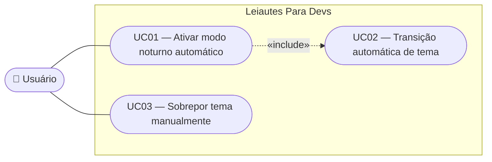

# Example — Trello Card Content

This shows the exact shape of a card created by this skill: `name` and `desc` as sent to `POST /1/cards`. It is not written to disk anywhere — it lives only in Trello. Replace all example content (US29, "modo noturno automático") with the real story; this only demonstrates the required sections and tone.

**Card name (list = Backlog):**

```
US29 — Ativar modo noturno automaticamente conforme o horário do usuário
```

**Card desc:**

````markdown
**Slug:** `us29-modo-noturno-automatico`
**Status:** Created
**Prioridade:** P2
**Dependências:** US19 (Alternar entre tema escuro e claro)

---

**Como** usuário que trabalha em turnos diferentes,
**quero** que a ferramenta alterne automaticamente entre tema claro e tema escuro conforme a hora local do meu dispositivo,
**para que** eu não precise trocar manualmente o tema toda vez que o meu ambiente de trabalho muda de luz natural.

---

## Descrição

Complementa a US19, que hoje escolhe o tema inicial via `prefers-color-scheme` do sistema operacional. Muitos usuários mantêm o SO em um único tema o dia inteiro por preferência pessoal, mas gostariam que a ferramenta acompanhasse a hora do dia — escuro à noite, claro durante o dia — sem depender da configuração global do SO.

O usuário liga/desliga o comportamento automático via um controle discreto próximo ao toggle de tema. Quando ativo, a preferência por horário sobrepõe a preferência do SO, mas nunca a escolha manual imediata do usuário: se ele clicou no toggle depois da última alternância automática, aquele estado é respeitado até a próxima transição de janela horária (06:00 ou 18:00).

Coerente com a decisão da US19, nenhuma preferência persiste entre sessões — o comportamento automático precisa ser reativado a cada nova visita.

## Diagrama de Casos de Uso

_Diagrama de casos de uso anexado a este card (ver anexos)._

## Critérios de Aceitação

- [ ] Existe um controle na interface, próximo ao toggle de tema, que ativa/desativa o modo noturno automático
- [ ] Quando ativo, o tema alterna para claro às 06:00 e para escuro às 18:00 (hora local do dispositivo)
- [ ] Quando ativo, ao carregar a página o tema inicial segue a janela horária corrente
- [ ] Uma alternância manual durante uma janela horária é respeitada até a próxima transição
- [ ] O controle tem rótulo acessível e touch target ≥ 44×44px em mobile
- [ ] O modo noturno automático não persiste entre sessões — inicia sempre desativado
- [ ] Nenhum dado é enviado a servidor externo para determinar o horário

## Fora de Escopo

- Configuração customizada da janela horária pelo usuário
- Persistência da preferência entre sessões
- Uso de geolocalização para calcular pôr do sol real
- Transição suave/gradual entre paletas
````

**Attachment (SVG-attachment case, the one shown above):**

The card above assumes `mmdc` was available, so the diagram was rendered from this Mermaid source and uploaded as `us29-modo-noturno-automatico-use-case.svg` via `POST /1/cards/<cardId>/attachments`, then the temp files were deleted:



This exact same Mermaid source also opens `SPEC.md`'s "Use Cases" section (rendered natively there).

**Fallback (no `mmdc` on the machine):**

If rendering wasn't possible, the "## Diagrama de Casos de Uso" section in the `desc` above is replaced with the raw fenced block instead of the "anexado" line — same Mermaid source as shown above, just pasted inline as inert text (Trello shows it unrendered, but it's still there for reference/copy-paste).

**Notes on the shape:**

- The metadata block (`Slug` / `Status` / `Prioridade` / `Dependências`) is the only place `Status: Created` is recorded — Trello has no custom field for it on this board, so it lives as text.
- Acceptance criteria use `- [ ]` markdown syntax **inside the description text** — this renders as a checklist-looking list in Trello's card preview, but it is NOT a Trello Checklist object. Never call `/1/checklists` for this card.
- No labels, no due date, no members are set unless the human explicitly asks.
