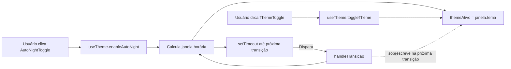

# PLAN — Ativar modo noturno automaticamente conforme o horário do usuário

## Dados do Plano

| Campo               | Valor                                |
| ------------------- | ------------------------------------ |
| Número da US        | US26                                 |
| Slug                | `us26-modo-noturno-automatico`       |
| Stack               | Quasar + Vue 3 + TypeScript + Vitest |
| Data de criação     | 2026-08-30                           |
| Data de modificação | —                                    |

---

## Resumo Técnico

Estender o composable singleton `useTheme()` (criado na US19) com uma nova responsabilidade opcional: um "auto scheduler" que alterna `themeAtivo` conforme a janela horária local. A UI ganha um `QBtn` toggle (`AutoNightToggle.vue`) adjacente ao `ThemeToggle` no `AppHeader`. O agendamento usa `setTimeout` recalculado a cada transição — mais preciso e barato que polling com `setInterval`, e mais fácil de testar com fake timers do Vitest.

---

## Componentes Afetados

| Componente                | Ação      | Notas                                                                                     |
| ------------------------- | --------- | ----------------------------------------------------------------------------------------- |
| `useTheme.ts`             | Modificar | Adicionar API `autoNightEnabled`, `enableAutoNight()`, `disableAutoNight()` e agendamento |
| `AutoNightToggle.vue`     | Criar     | Botão ícone-only (mdi-brightness-auto) com `q-tooltip`                                    |
| `AppHeader.vue`           | Modificar | Montar `AutoNightToggle` à esquerda do `ThemeToggle`                                      |
| `useTheme.spec.ts`        | Modificar | Novos casos de teste para o scheduler (fake timers)                                       |
| `AutoNightToggle.spec.ts` | Criar     | Testes de renderização, `aria-label`, tamanho de touch target                             |

---

## Estrutura de Dados

```ts
// src/composables/useTheme.ts (novos membros)

type Tema = 'dark' | 'light';

interface UseThemeAPI {
  themeAtivo: Ref<Tema>;
  toggleTheme(): void;
  init(): void;

  // novos
  autoNightEnabled: Ref<boolean>;
  enableAutoNight(): void;
  disableAutoNight(): void;
}

interface JanelaHoraria {
  tema: Tema;
  proximaTransicaoEm: number; // epoch ms
}
```

O `useTheme()` continua sendo um singleton — não é uma `Pinia store` (ver ADR-002 sobre store por leiaute; tema é UI transversal e não se enquadra ali).

---

## Lógica Principal

1. **Cálculo da janela horária corrente (RN02)** — dada uma `Date` local, retornar `{ tema: 'light' | 'dark', proximaTransicaoEm: number }` calculando o próximo múltiplo de 06:00 ou 18:00 futuro. Considerar virada de dia (23:xx → 06:00 do dia seguinte).
2. **Aplicação imediata ao ativar (RN03)** — em `enableAutoNight()`: calcular janela corrente; atribuir `themeAtivo.value = janela.tema`; agendar `setTimeout(handleTransicao, janela.proximaTransicaoEm - Date.now())`.
3. **Handler de transição** — no callback do timeout: se `autoNightEnabled.value === false`, sair (defesa). Caso contrário, recalcular janela; atualizar `themeAtivo`; reagendar próxima transição.
4. **Sobreposição manual (RN04)** — o `toggleTheme()` continua funcionando exatamente como em US19; ele altera `themeAtivo` mas **não cancela o timeout agendado**. Quando o timeout dispara, o valor do tema é sobrescrito pela janela corrente, restaurando o automatismo. Não precisa de flag extra.
5. **Desativação (RN05)** — em `disableAutoNight()`: `clearTimeout(timeoutId)`; `autoNightEnabled.value = false`. Não alterar `themeAtivo`.
6. **Sem persistência (RN01)** — não gravar nada em `localStorage`/`sessionStorage`; `autoNightEnabled` inicia `ref(false)` a cada bootstrap.

---

## Composables / Serviços

- `useTheme()` (existente) — ganha os métodos `enableAutoNight`, `disableAutoNight` e o estado `autoNightEnabled`.
- Nenhum novo composable é criado. A responsabilidade cabe dentro de `useTheme` para manter o singleton coeso e evitar coordenação entre dois composables sobre o mesmo `themeAtivo`.

---

## Eventos e Props (componente novo)

`AutoNightToggle.vue`:

- **Props:** nenhuma (o componente lê e escreve `useTheme()` diretamente).
- **Emits:** nenhum.
- **Interação:** clique alterna `enableAutoNight()` / `disableAutoNight()`. `aria-pressed` reflete `autoNightEnabled.value`.

---

## Fluxo de Dados



---

## Dependências Externas

**npm:** nenhuma nova dependência. Toda a lógica é possível com APIs nativas (`Date`, `setTimeout`).

**Inter-US:**

- **US19** (Done) — provê `useTheme()`, `themeAtivo`, `toggleTheme()`, `init()` e o `ThemeToggle` no `AppHeader`. Sem US19 esta US não faz sentido.
- Nenhuma US futura depende formalmente desta.

---

## Testes

### Unitários (Vitest)

- `useTheme.enableAutoNight()` durante a janela do dia (10:00) muda `themeAtivo` para `light` e agenda transição para 18:00 do mesmo dia.
- `useTheme.enableAutoNight()` durante a janela da noite (22:00) muda para `dark` e agenda transição para 06:00 do dia seguinte.
- `vi.setSystemTime(new Date('2026-08-30T18:00:00'))` + `vi.advanceTimersByTime` verifica que o handler dispara e agenda a próxima transição.
- `disableAutoNight()` limpa o timeout e mantém `themeAtivo` inalterado.
- Cliques manuais em `toggleTheme()` durante uma janela **não** cancelam o timeout — próxima transição sobrescreve o valor.

### Integração (Vue Test Utils)

- Montagem de `AutoNightToggle` reflete `autoNightEnabled` em `aria-pressed`.
- Clique no `AutoNightToggle` chama `enableAutoNight()` / `disableAutoNight()` alternadamente.

### E2E (Playwright)

- Ativar o modo automático e usar `page.clock.install()` + `page.clock.setFixedTime()` do Playwright para simular a virada 17:59 → 18:00 e verificar que `document.documentElement.dataset.theme` muda para `dark`.
- Verificar que `page.on('request')` não captura nenhuma requisição de rede durante a transição.

---

## Riscos e Decisões em Aberto

| Risco / Dúvida                                                                       | Impacto | Mitigação                                                                                            |
| ------------------------------------------------------------------------------------ | ------- | ---------------------------------------------------------------------------------------------------- |
| Aba em segundo plano por horas — `setTimeout` pode não disparar exatamente na virada | Baixo   | Aceitável: quando a aba volta ao foreground, o `visibilitychange` recomputa a janela e ressincroniza |
| Usuário muda o horário do SO manualmente                                             | Baixo   | Aceitável: comportamento não especificado; próxima transição usa o novo relógio                      |
| Alternância a cada virada em máquinas com data errada                                | Baixo   | Fora de escopo; mesma limitação da US19 (SO responsável por manter o relógio correto)                |
| Coordenação com futura US de "configurar janela horária"                             | Médio   | Manter a janela como constante interna do composable, fácil de extrair depois para prop configurável |

---

## Ordem sugerida de implementação

1. Estender tipos e API interna em `src/composables/useTheme.ts` (`autoNightEnabled`, esqueleto de `enableAutoNight`/`disableAutoNight` sem timer).
2. Adicionar função pura `calcularJanelaHoraria(agora: Date): JanelaHoraria` e cobrir com testes unitários (fake timers).
3. Implementar o agendamento com `setTimeout` recalculado no handler.
4. Adicionar handler de `visibilitychange` no `init()` para ressincronizar ao voltar do background.
5. Criar `src/components/AutoNightToggle.vue` (ícone-only, `q-tooltip`, `aria-pressed`).
6. Montar `AutoNightToggle` no `AppHeader.vue` à esquerda do `ThemeToggle`.
7. Testes de integração (mount) e testes E2E (Playwright com relógio virtual).
8. Verificação manual em navegador — ativar, aguardar transição forçada via DevTools clock override, confirmar sem requisições de rede.

---

## Custo da IA

| Métrica              | Valor                                     |
| -------------------- | ----------------------------------------- |
| Modelo               | claude-sonnet-4-6                         |
| Tokens de entrada    | ~<estimated input tokens>                 |
| Tokens de saída      | ~<estimated output tokens>                |
| Custo estimado (USD) | ~$<calculated cost>                       |
| Taxa de câmbio       | 1 USD = R$<current rate> (<today's date>) |
| Custo estimado (BRL) | ~R$<calculated cost BRL>                  |

> Estimativa de tokens: leitura de docs e contexto existente (~<N>k tokens entrada), escrita dos artefatos (~<N>k tokens saída), entrevista de refinamento (~<N>k entrada / ~<N>k saída).  
> Preços claude-sonnet-4-6: $3/M tokens entrada, $15/M tokens saída.

## Custo Estimado do Refinamento (<today's date>)

| Métrica              | Valor                                     |
| -------------------- | ----------------------------------------- |
| Modelo               | claude-sonnet-4-6                         |
| Tokens de entrada    | ~<estimated input tokens>                 |
| Tokens de saída      | ~<estimated output tokens>                |
| Custo estimado (USD) | ~$<calculated cost>                       |
| Taxa de câmbio       | 1 USD = R$<current rate> (<today's date>) |
| Custo estimado (BRL) | ~R$<calculated cost BRL>                  |

> Estimativa de tokens: leitura de docs e contexto existente (~<N>k tokens entrada), escrita dos artefatos (~<N>k tokens saída), entrevista de refinamento (~<N>k entrada / ~<N>k saída).  
> Preços claude-sonnet-4-6: $3/M tokens entrada, $15/M tokens saída.
