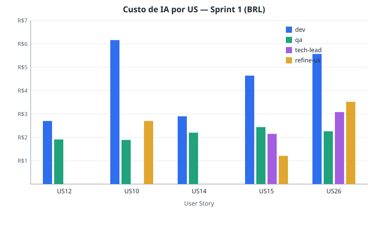
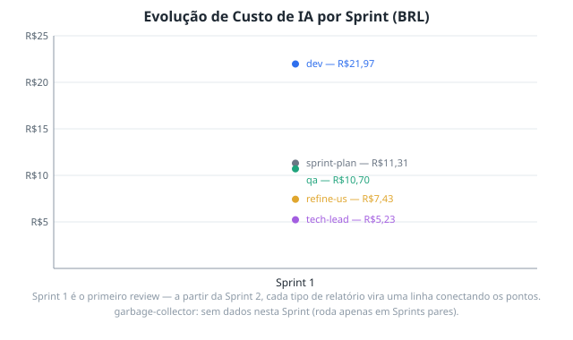

# Review — Sprint 1: Duplicar e excluir lotes

**Data:** 05/09/2026 21:34
**Branch:** `chore/sprint-1-review`
**Card Trello:** https://trello.com/c/bpoTJG2t/29-review-sprint-1-duplicar-e-excluir-lotes

---

## Resumo Executivo

A Sprint 1 entregou as 5 User Stories planejadas (US12, US10, US14, US15, US26), todas confirmadas como concluídas tanto no Backlog quanto no Trello, sem nenhuma divergência. A suíte de testes está inteiramente verde: typecheck, lint, 888 testes unitários e 216 testes E2E (Chromium, Firefox e WebKit) passaram sem falhas. O custo total de IA gasto na Sprint (implementação, QA, planejamento técnico, refinamentos e o próprio planejamento da Sprint) foi de aproximadamente **R$56,64**. Por ser a Sprint 1 (número ímpar), o `garbage-collector` não foi executado nesta rodada — ele roda a cada Sprint par.

---

## Meta da Sprint

Duplicar e excluir lotes.

---

## Status das User Stories (Backlog x Trello)

| US | Título | Status no Backlog | Status no Trello | Divergência? |
| -- | ------ | ------------------ | ----------------- | ------------- |
| US12 | Duplicar um lote | Done | Done (lista "Concluído 🎉") | Não |
| US10 | Alternar entre modo seguro e modo playground | Done | Done (lista "Concluído 🎉") | Não |
| US14 | Recolher e expandir lotes | Done | Done (lista "Concluído 🎉") | Não |
| US15 | Visualizar o arquivo gerado no painel lateral | Done | Done (lista "Concluído 🎉") | Não |
| US26 | Segmento B e múltiplos Registros de Detalhe por lote | Done | Done (lista "Concluído 🎉") | Não |

Os cards individuais das USs não trazem um campo `Status:` estruturado no `desc` (convenção mais recente, adotada após a criação destes cards) — o status foi inferido pela lista do board em que cada card está, que é "Concluído 🎉" para as 5 USs, consistente com o Backlog.

---

## Resultado dos Testes

| Suíte | Resultado | Observações |
| ----- | --------- | ----------- |
| typecheck (`vue-tsc`) | ✅ OK | Sem erros de tipo. |
| lint (`eslint`/`prettier`) | ✅ OK | Exit code 0. O script `lint:check` roda o `prettier` sem a flag `--check`, então o log despeja o conteúdo formatado de todo arquivo no stdout em vez de listar apenas divergências — ruidoso, mas não indica falha (nenhum erro/warning do ESLint foi reportado). |
| unit (`vitest`) | ✅ 888/888 passaram | 40 arquivos de teste, 46,6s de duração. |
| e2e (`playwright`) | ✅ 216/216 passaram | Chromium + Firefox + WebKit, ~15,6min. Diferente de relatórios de QA anteriores desta Sprint (que registraram WebKit não testável por dependências de sistema ausentes), o ambiente desta execução tinha as libs necessárias — os 216 testes rodaram nos três engines sem falhas. |

Nenhuma falha real de teste foi encontrada.

---

## Custo de IA por US e Tipo de Relatório

| US | dev | qa | tech-lead | refine-us | Total US |
| -- | --- | -- | --------- | --------- | -------- |
| US12 — Duplicar um lote | R$2,70 | R$1,91 | — | — | R$4,61 |
| US10 — Modo seguro x Playground | R$6,16 | R$1,89 | — | R$2,70 | R$10,75 |
| US14 — Recolher e expandir lotes | R$2,90 | R$2,20 | — | — | R$5,10 |
| US15 — Visualizador de arquivo | R$4,64 | R$2,44 | R$2,15 | R$1,21 | R$10,44 |
| US26 — Segmento B e múltiplos registros | R$5,57 | R$2,26 | R$3,08 | R$3,52 | R$14,43 |

> `refine-us` inclui, conforme o caso, tanto o custo de criação da SPEC (`## Custo da IA` em `SPEC.md`) quanto o de refinamentos posteriores (`## Custo Estimado do Refinamento`). Para a US10, o mesmo bloco de refinamento (R$2,70) aparece duplicado em `PLAN.md` e `SPEC.md` — contado uma única vez aqui. US12 e US14 não têm nenhuma seção de custo em `PLAN.md`/`SPEC.md` (cards antigos, anteriores à convenção de registro de custo de tech-lead/refine-us).

**Custos em nível de Sprint (não atribuídos a uma US específica):**

| Tipo de Relatório | Custo (BRL) |
| ------------------ | ----------- |
| garbage-collector | — (não rodou; Sprint ímpar) |
| sprint-plan | R$11,31 |

**Custo total da Sprint:** R$56,64

---

## Evolução de Custo de IA por Sprint

Esta é a primeira execução do `/sprint-review` no projeto — o gráfico mostra um único ponto por tipo de relatório (Sprint 1). A partir da Sprint 2, cada tipo de relatório passa a ser uma linha conectando os pontos ao longo das Sprints.

---

## Achados e Observações

- **Nenhuma divergência Trello x Backlog.** Todas as 5 USs da Sprint estão coerentes entre os dois sistemas.
- **Cards mais antigos (US12, US14) não seguem o template de `desc` estruturado** (`Status:`/`Prioridade:`) usado pelas skills mais recentes (`create-us`/`refine-us`) — não é um problema funcional (o status foi confirmado pela lista do board), mas dificulta auditorias automatizadas futuras que dependam de parsear o campo `Status:` do card.
- **US26 (relatório de dev):** o AC "No `FilePreviewModal`, todos os Segmentos A e B aparecem na ordem correta, cada linha com 240 caracteres" segue pendente — depende da US15, que nesta mesma Sprint foi implementada como "Visualizador de Arquivo" no painel lateral, mas sob o nome `Cnab240FilePreview`/painel lateral, não `FilePreviewModal`. Vale confirmar com Product se esse AC da US26 já está coberto pela US15 ou se ainda é uma lacuna real.
- **US26 (relatório de dev/QA):** o `SPEC.md` da US26 está desatualizado quanto ao escopo real de múltiplos Registros de Detalhe implementado — recomendação já registrada nos relatórios de dev e QA da própria US, reforçada aqui.
- **Ambiente de teste E2E melhorou desde os relatórios de QA da Sprint:** os relatórios de QA de US10/US26 registraram limitação de WebKit por dependências de sistema ausentes; nesta execução (ambiente diferente/atualizado) os 216 testes passaram nos três engines, incluindo WebKit. Não é uma regressão nem uma correção desta skill — apenas uma diferença de ambiente entre execuções.

---

## Totais de Custo por Tipo de Relatório (para o gráfico de evolução)

> Esta tabela é lida por futuras execuções de `/sprint-review` para montar o gráfico de linhas — não remova nem reformate.

| Sprint | Tipo de Relatório | Custo Total (BRL) |
| ------ | ------------------ | ------------------- |
| 1 | dev | R$21,97 |
| 1 | qa | R$10,70 |
| 1 | tech-lead | R$5,23 |
| 1 | refine-us | R$7,43 |
| 1 | sprint-plan | R$11,31 |

(Sem linha de `garbage-collector` — não rodou nesta Sprint, número ímpar.)

---

## Custo da IA (deste Review)

> Esta seção segue o mesmo formato usado nos relatórios de dev/QA/tech-lead/refine-us — é o custo de **rodar esta skill `/sprint-review`**, não o custo da Sprint em si (esse já está consolidado acima, em "Custo de IA por US e Tipo de Relatório").

| Métrica | Valor |
| --- | --- |
| Modelo | claude-sonnet-5 |
| Tokens de entrada | ~95.000 |
| Tokens de saída | ~9.000 |
| Custo estimado (USD) | ~$0,42 |
| Taxa de câmbio | 1 USD = R$5,40 (05/09/2026) |
| Custo estimado (BRL) | ~R$2,27 |

> Estimativa de tokens: leitura dos cards do Trello e dos 10 relatórios de dev/QA + 5 PLAN.md + 5 SPEC.md da Sprint (~55k tokens), execução da suíte de testes completa e geração dos dois gráficos SVG (~20k tokens), criação do card de review e escrita deste relatório (~20k tokens).
> Preços claude-sonnet-5: consulte a tabela de preços vigente do modelo em uso.
