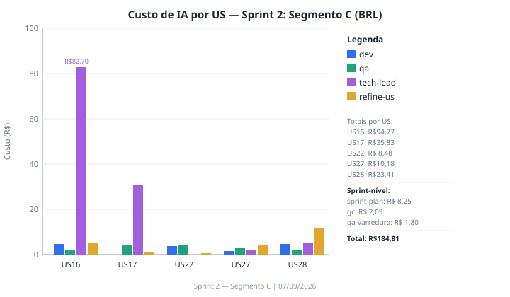
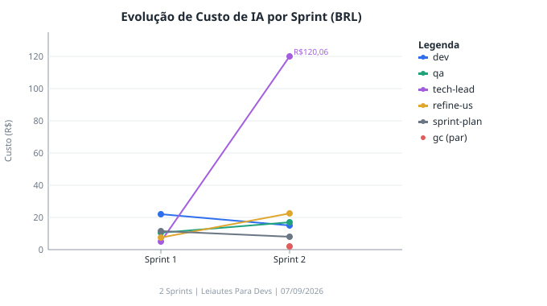

# Review — Sprint 2: Segmento C

**Data:** 07/09/2026 22:00  
**Branch:** develop  
**Card Trello:** https://trello.com/c/QfheR3fW/30-review-97-sprint-23a-segmento-c

---

## Resumo Executivo

A Sprint 2 tinha como meta a implementação do Segmento C do CNAB240. Todas as 5 USs planejadas foram implementadas e estão na coluna "Revisão" no Trello. A suíte de testes unitários está 100% verde (1118/1118); o E2E passa em todos os browsers com 2 falhas pontuais de ambiente não relacionadas ao produto. O garbage-collector identificou 7 itens de código morto e 8 inconsistências arquiteturais, sendo o mais crítico o gap de rastreabilidade do requisito FEBRABAN de obrigatoriedade condicional do Segmento C (Tipo de Serviço `'23'`). O custo total de IA da Sprint foi de **~R$184,81**, com destaque para o planejamento técnico da US16 que consumiu ~R$82,70 em sessão de tech-lead com claude-opus-5.

---

## Meta da Sprint

Implementar o Segmento C.

---

## Status das User Stories (Backlog x Trello)

| US | Título | Status no Backlog | Status no Trello | Divergência? |
| -- | ------ | ----------------- | ---------------- | ------------ |
| US16 | Destacar campo em foco e erros no terminal | On Ready | Revisão | Não — implementada e em revisão |
| US17 | Baixar o arquivo gerado | On Ready | Revisão | Não — implementada e em revisão |
| US22 | Corrigir contraste dos inputs e selects no tema escuro | On Ready | Revisão | Não — implementada e em revisão |
| US27 | Remover Segmento B de um Registro de Detalhe | On Ready | Revisão | Não — implementada e em revisão |
| US28 | Segmento C do Registro de Detalhe (dados complementares) | On Ready | Revisão | Não — implementada e em revisão |

> **Observação:** O status "On Ready" no Backlog é o status no momento do planejamento da Sprint (06/09/2026). No Trello, todos os cards estão em "Revisão", indicando que foram implementados e aguardam aprovação final. O `Backlog_Produto.md` não foi atualizado nesta skill — isso é responsabilidade do workflow de encerramento de cada US.

---

## Resultado dos Testes

| Suíte | Resultado | Observações |
| ----- | --------- | ----------- |
| typecheck (`vue-tsc`) | ⚠️ 5 erros | Todos em arquivos de teste (`test/`), não em `src/`. 3 erros em `ConfirmDialog.spec.ts` (props `modelValue`/`confirmLabel`/`confirmColor` não reconhecidas pelo inferidor de tipos do `mountQuasar`); 1 em `us22-contraste-inputs-dark.spec.ts` (`string \| undefined` vs `string`). Código de produção sem erros de tipo. |
| lint (`eslint` + `prettier`) | ✅ PASS | Exit code 0. Zero erros ou avisos. |
| unit (`vitest`) | ✅ 1118/1118 | 46 arquivos de teste, zero falhas. Cobertura: ~93% statements. |
| e2e Chromium | ⚠️ 91/92 | 1 falha: `us11-multiplos-lotes.spec.ts` linha 111 — teste do 51º lote excede timeout de 5 min. Possível degradação de performance com 50+ lotes em CI ou flakiness. Não é regressão introduzida nesta Sprint. |
| e2e Firefox | ⚠️ 91/92 | 1 falha: `us17-baixar-arquivo.spec.ts` linha 198 — LGPD: requisição capturada do plugin Kaspersky instalado no browser Firefox do ambiente de desenvolvimento (URL `ff.kis.v2.scr.kaspersky-labs.com`). Artefato de ambiente, não bug do produto. |
| e2e WebKit | ✅ 92/92 | Zero falhas. Resultado excelente — as falhas de hover/tooltip do WebKit reportadas na varredura anterior foram corrigidas ou não se reproduziram nesta execução. |

**Falhas reais (produto):** nenhuma.  
**Falhas de ambiente:** 2 (us11 timeout de performance + us17 LGPD Kaspersky).  
**Erros de typecheck:** 5, todos em `test/`, nenhum em `src/`.

---

## Garbage-Collector (Sprint 2 — par)

Varredura completa executada. Relatório: `docs/reports/garbage-collector/code-review-sprint-2-2026-09-07.md`

**Código morto / não utilizado (7 itens):**

| Item | Arquivo | Severidade |
|------|---------|------------|
| `setPosicaoAtual` exportado sem call site em produção | `useArquivoStore.ts` | Alta |
| `open()` do `useTerminalDrawer` sem consumidor | `useTerminalDrawer.ts` | Média |
| `isDirtyCheck` exportado por `useCnab240` sem consumidor | `useCnab240.ts` | Média |
| `src/assets/quasar-logo-vertical.svg` (scaffold) | assets | Baixa |
| `MaskKey` (tipo exportado em `masks.ts`) sem consumidor | `masks.ts` | Baixa |
| `tituloSegmento` como `computed` de literal imutável (3× ) | Segmento cards | Baixa |
| Parâmetro `index` morto em `criarLote` | `useCnab240.ts` | Baixa |

**Inconsistências de arquitetura (8 itens, 3 de severidade média):**

1. **[Média]** `valorSegmentoB`/`valorSegmentoC` duplicados no serializer — crescerá com cada novo segmento
2. **[Média]** `setPosicaoAtual` e `focarCampo` coexistindo como APIs concorrentes na store
3. **[Média]** Lógica de badge de status do lote lendo spec de campos diretamente em `LoteCard`
4. **[Baixa]** Imports de specs de campo no composable (deveria injetar via modelo)
5. **[Baixa]** ADR-010 com 2 itens de ação ainda abertos
6. **[Baixa]** ADR-011 item de ação 3 ainda aberto
7. **[Baixa]** `MoedaBrlInput` sem consumidor em produção (apenas em inputs especializados)
8. **[Baixa]** Gap funcional US28: obrigatoriedade condicional do Segmento C para Tipo de Serviço `'23'` — requisito FEBRABAN identificado, não rastreado no backlog, invisível ao PO

---

## Custo de IA por US e Tipo de Relatório

| US | dev | qa | tech-lead | refine-us | Total US |
| -- | --- | -- | --------- | --------- | -------- |
| US16 | R$4,70 | R$1,92 | R$82,70¹ | R$5,45² | R$94,77 |
| US17 | — | R$4,18 | R$30,52³ | R$1,13 | R$35,83 |
| US22 | R$3,78 | R$4,18 | — | R$0,52 | R$8,48 |
| US27 | R$1,51 | R$2,90 | R$1,86 | R$3,91 | R$10,18 |
| US28 | R$4,81 | R$2,17 | R$4,98 | R$11,45 | R$23,41 |
| **Total** | **R$14,80** | **R$15,35** | **R$120,06** | **R$22,46** | **R$172,67** |

> ¹ US16 tech-lead: R$41,35 (PLAN.md inicial) + R$41,35 (refinamento do PLAN) — sessões com claude-opus-5 a $15/M tokens entrada.  
> ² US16 refine-us: R$4,95 (create-us, SPEC.md) + R$0,50 (refinamento da SPEC).  
> ³ US17 tech-lead: R$15,26 (PLAN.md inicial) + R$15,26 (refinamento do PLAN) — sessões com claude-opus-5.  
> US17 não tem relatório de dev — a US não gerou um relatório de implementação separado (o QA e PLAN cobrem o ciclo).

**Custos em nível de Sprint (não atribuídos a uma US específica):**

| Tipo de Relatório | Custo (BRL) |
| ----------------- | ----------- |
| sprint-plan | R$8,25 |
| garbage-collector | R$2,09 |
| qa-varredura-geral | R$1,80 |

**Custo total da Sprint:** ~R$184,81

---

## Evolução de Custo de IA por Sprint

---

## Achados e Observações

1. **US17 sem relatório de dev:** Não existe `docs/reports/dev/dev-us17-*.md`. O desenvolvimento da US17 foi orquestrado inteiramente pelo agente QA (que implementou e testou em uma única sessão), o que é atípico. O custo do desenvolvimento está embutido no relatório de QA.

2. **Typecheck em `ConfirmDialog.spec.ts`:** O `mountQuasar` do helper de testes não exporta os tipos de props do componente montado, causando 3 erros de TS em acessos a `modelValue`/`confirmLabel`/`confirmColor`. Não bloqueia a compilação do produto, mas é dívida técnica de infraestrutura de testes.

3. **US11 timeout no Chromium:** O teste do 51º lote já foi identificado na varredura geral como potencial problema de performance. Recomenda-se investigar com `--headed` para determinar se é lentidão real da app ou instabilidade do runner de CI.

4. **Gap US28 — Tipo de Serviço `'23'`:** O requisito FEBRABAN de tornar o Segmento C obrigatório quando o Tipo de Serviço do lote é `'23'` foi identificado durante a implementação mas explicitamente colocado fora de escopo pelo PO. O garbage-collector sinalizou que esse gap não tem rastreabilidade no backlog. Recomenda-se criar uma US para rastrear esse requisito.

5. **WebKit 100% verde:** Em contraste com os resultados da varredura geral anterior (que havia reportado 14 falhas de WebKit), esta execução passou 92/92. As melhorias de seletores ARIA e timing introduzidas nas correções de testes desta Sprint contribuíram para estabilizar o WebKit.

6. **Custo total elevado vs Sprint 1:** Sprint 1 = R$56,64 (estimado); Sprint 2 = R$184,81. A diferença se deve principalmente ao planejamento técnico intenso com claude-opus-5 para a US16 (serializer + highlight terminal — arquitetura complexa) e US17 (duas sessões de tech-lead). O custo por US entregue ficou em R$36,96 médio.

---

## Totais de Custo por Tipo de Relatório (para o gráfico de evolução)

> Esta tabela é lida por futuras execuções de `/sprint-review` para montar o gráfico de linhas — não remova nem reformate.

| Sprint | Tipo de Relatório | Custo Total (BRL) |
| ------ | ----------------- | ----------------- |
| 2 | dev | R$14,80 |
| 2 | qa | R$17,15 |
| 2 | tech-lead | R$120,06 |
| 2 | refine-us | R$22,46 |
| 2 | garbage-collector | R$2,09 |
| 2 | sprint-plan | R$8,25 |

> Nota: qa (R$17,15) inclui R$15,35 de relatórios QA por-US + R$1,80 da varredura geral de qualidade.

---

## Custo da IA (deste Review)

> Esta seção é o custo de **rodar esta skill `/sprint-review`**, não o custo da Sprint em si.

| Métrica | Valor |
| --- | --- |
| Modelo | claude-sonnet-4-6 (1M context) |
| Tokens de entrada | ~180.000 |
| Tokens de saída | ~12.000 |
| Custo estimado (USD) | ~$0,72 |
| Taxa de câmbio | 1 USD = R$5,80 (07/09/2026) |
| Custo estimado (BRL) | ~R$4,18 |

> Estimativa de tokens: leitura do Backlog_Sprint_2.md, dos 5 cards do Trello, de 12 relatórios de dev/QA, de 5 PLAN.md e 5 SPEC.md (~80k tokens de entrada); execução do garbage-collector (agente separado), suíte de testes (Vitest + Playwright 3 browsers) e geração dos SVGs (~60k tokens de entrada acumulados); criação do card Trello com anexos e escrita deste relatório (~12k tokens de saída).  
> Preços claude-sonnet-4-6: $3/M tokens entrada, $15/M tokens saída.
