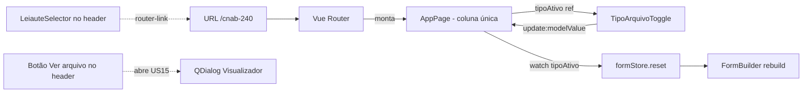

# PLAN — Selecionar leiaute e tipo de arquivo

## Resumo Técnico

O leiaute selecionado é resolvido via **Vue Router** — cada leiaute tem uma rota própria (`/cnab-240`, `/rcb-001`, `/cnab-400`). Não há store dedicada para o leiaute: a URL é a fonte da verdade. Apenas `/cnab-240` renderiza o App funcional; as outras rotas renderizam uma página placeholder "em breve". A seleção de tipo (remessa/retorno) é estado local do componente da página do App (via `ref`), com valor inicial `remessa` e reset direto do formulário na troca. A verificação de "dirty state" antes da troca de tipo **fica de fora desta US** — cada store de seção do formulário (US02+) exporá seu próprio getter `isDirty`, e o `TipoArquivoToggle` será atualizado depois para consultá-los antes de resetar. Um `TODO` no código marca esse ponto.

A `AppPage` usa **layout de coluna única em container fluido**; o visualizador de arquivo (implementação em US15) será aberto em um QDialog disparado por um botão no header — nesta US apenas o botão-gatilho fica previsto, sem o conteúdo do modal.

## Componentes Afetados

| Componente | Ação | Notas |
|---|---|---|
| `router/routes.ts` | criar | Definição das rotas: `/cnab-240` → `AppPage`, `/rcb-001` e `/cnab-400` → `LeiautePlaceholderPage`. |
| `MainLayout.vue` | modificar | Adicionar `AppHeader.vue` no `q-header`; `<router-view />` no `q-page-container`. |
| `AppHeader.vue` | criar | Header global com logo, `LeiauteSelector`, botão "Ver arquivo" (gatilho do modal do visualizador — US15), badge de privacidade (US20), toggle de tema (US19). |
| `LeiauteSelector.vue` | criar | Chips-navegação: `router-link` para `/cnab-240` (ativo) + chips desabilitados para RCB001/CNAB400 com badge "em breve". |
| `TipoArquivoToggle.vue` | criar | Toggle Remessa/Retorno; `v-model` no tipo local; contém o `TODO` para a integração futura de dirty check. |
| `pages/AppPage.vue` | criar | Página do App: coluna única em container fluido; mantém `tipoAtivo` como `ref`, renderiza `TipoArquivoToggle` + área do formulário (placeholder nesta US). |
| `pages/LeiautePlaceholderPage.vue` | criar | Página "em breve" para leiautes futuros; recebe nome do leiaute via `route.meta`. |

## Estrutura de Dados

```ts
// router/routes.ts
type LeiauteId = 'CNAB240' | 'RCB001' | 'CNAB400';

interface LeiauteRouteMeta {
  leiauteId: LeiauteId;
  label: string;         // "CNAB240", "RCB001", "CNAB400"
  disponivel: boolean;   // true apenas para CNAB240 no MVP
}

// components/LeiauteSelector.vue — lista renderizada
interface LeiauteLink {
  id: LeiauteId;
  label: string;
  path: string;           // "/cnab-240", etc.
  disponivel: boolean;
  badge?: string;         // "em breve" quando disponivel === false
}

// pages/AppPage.vue — estado local
type TipoArquivo = 'remessa' | 'retorno';
// const tipoAtivo = ref<TipoArquivo>('remessa');
```

## Lógica Principal

1. **Rotas (RN01, RN03)** — `router/routes.ts` registra três rotas: `/cnab-240` monta `AppPage`; `/rcb-001` e `/cnab-400` montam `LeiautePlaceholderPage` com `meta.leiauteId` e `meta.label`. Rota raiz `/` continua sendo a landing (US21).
2. **Estado inicial do tipo (RN02)** — Em `AppPage.vue`, `const tipoAtivo = ref<TipoArquivo>('remessa')`. Reset ao entrar/sair da rota é automático (o componente é remontado pelo router).
3. **Navegação entre leiautes (RN04)** — `LeiauteSelector` renderiza os chips a partir de uma lista estática `LeiauteLink[]`. Chips com `disponivel: true` são `<router-link :to="link.path">`; chips desabilitados são `<span aria-disabled="true">` sem `router-link`.
4. **Troca de tipo (RN06)** — `TipoArquivoToggle` usa `v-model` para atualizar o `tipoAtivo` do `AppPage`. Ao alterar, um `watch` em `AppPage` chama `formStore.reset()` e re-renderiza o formulário. **Sem verificação de dirty state** — ver TODO abaixo.
5. **TODO para dirty check futuro** — Dentro de `TipoArquivoToggle.vue`, comentário explícito:
   ```ts
   // TODO(US02+): antes de emitir a troca de tipo, consultar isDirty
   // das stores de seção (header, lote, segmento, trailers) e, se true,
   // abrir um QDialog de confirmação. Enquanto essas stores não existem,
   // a troca é imediata e descarta os dados sem aviso (limitação US01).
   ```
6. **Página placeholder** — `LeiautePlaceholderPage` lê `route.meta.label`, renderiza título "Em breve", copy curta e botão que navega para `/cnab-240`.
7. **Visibilidade permanente (RN07)** — `AppHeader` fica em `q-header` (Quasar já cuida do sticky). `TipoArquivoToggle` é wrappado em um `<div>` com `position: sticky; top: <altura do header>; z-index: 1;`.

## Composables / Serviços

Nenhum composable dedicado. A URL (via `useRoute()`) é o único mecanismo de leitura do leiaute; o tipo é `ref` local no `AppPage`.

## Eventos e Props (componentes novos)

### `LeiauteSelector.vue`
- Props: nenhuma (a lista de leiautes é estática dentro do componente).
- Emits: nenhum.
- Comportamento: usa `useRoute()` para saber qual chip está ativo e destacar via `aria-current="page"`.

### `TipoArquivoToggle.vue`
- Props:
  - `modelValue: TipoArquivo` — tipo atual.
- Emits:
  - `update:modelValue` — v-model padrão; emite o novo tipo diretamente ao clicar.

### `pages/AppPage.vue`
- Sem props (é uma rota).
- Estado local: `const tipoAtivo = ref<TipoArquivo>('remessa')`.

### `pages/LeiautePlaceholderPage.vue`
- Sem props (lê `route.meta.label`).

## Fluxo de Dados



## Dependências Externas

- **Vue Router** — já parte do stack Quasar padrão; nenhuma dependência nova.

## Testes

### Unitários
- `LeiauteSelector`: renderiza três chips; apenas o de CNAB240 é `router-link`; RCB001/CNAB400 têm `aria-disabled="true"` e não têm `href`.
- `LeiauteSelector`: chip correspondente à rota atual tem `aria-current="page"`.
- `TipoArquivoToggle`: emite `update:modelValue` com o novo valor ao clicar em Retorno estando em Remessa.
- `LeiautePlaceholderPage`: renderiza o `label` de `route.meta` e o botão "Voltar para CNAB240" navega para `/cnab-240`.

### Integração
- Entrar em `/cnab-240`: `AppPage` monta com `tipoAtivo = remessa` e formulário renderizado.
- Trocar de Remessa para Retorno em `/cnab-240`: `formStore.reset()` é chamado e o formulário re-renderiza (sem QDialog).
- Navegar de `/cnab-240` para `/rcb-001`: `LeiautePlaceholderPage` monta; header mantém `RCB001` como chip desabilitado (não muda de estilo, apenas o "atual" volta a ser nenhum).
- Entrar direto em `/rcb-001`: placeholder é exibido.

### E2E (se aplicável)
- Fluxo landing → CTA "Abrir ferramenta" → aterrissa em `/cnab-240` com CNAB240 ativo e Remessa selecionado (CA01).
- Header global e toggle de tipo permanecem visíveis ao rolar o formulário longo (CA05).
- Navegação por teclado nos chips (Tab pula os desabilitados) e no toggle (setas alternam remessa/retorno).

## Riscos e Decisões em Aberto

| Risco / Dúvida | Impacto | Mitigação |
|---|---|---|
| Troca de tipo com dados preenchidos descarta o formulário sem aviso. | Alto (UX) | Aceito nesta US — TODO no código + nota no arquivo `Historias_de_Usuario_CNAB240.md`. A US02+ (stores de seção) precisa expor `isDirty` para viabilizar a confirmação. |
| Comportamento de rotas inexistentes (ex.: `/cnab-500`). | Baixo | Delegar ao setup padrão do Quasar/Vue Router (página 404). Se preferir redirecionar para `/cnab-240`, decidir no PR do router. |
| Semântica ARIA dos chips-navegação: `role="tablist"` vs. `role="radiogroup"`. | Baixo | Como são links de navegação, o mais correto é usar `<nav>` + `<a>` com `aria-current="page"`; não usar `role="tab"` (não são tabs de painel). Decidir na implementação. |

## Ordem de Implementação Sugerida

1. **Router** — Criar `router/routes.ts` com as três rotas + `meta`; smoke test de navegação direta.
2. **Página placeholder** — Criar `LeiautePlaceholderPage.vue` (leitura de `route.meta`, botão de retorno).
3. **LeiauteSelector** — Chips-navegação estáticos usando `router-link` + `aria-current`; unit tests.
4. **TipoArquivoToggle** — Toggle com v-model + TODO comentado no arquivo.
5. **AppHeader** — Compõe `LeiauteSelector` + botão "Ver arquivo" (stub sem comportamento nesta US, a US15 implementa o modal) + placeholders para US19 (tema) e US20 (badge de privacidade).
6. **AppPage** — Coluna única em container fluido; estado local `tipoAtivo`, watch chamando `formStore.reset()` (pode ser stub por enquanto), monta `TipoArquivoToggle` + placeholder da área do formulário.
7. **MainLayout** — Ligar `AppHeader` no `q-header`; garantir sticky do toggle.
8. **Testes de integração e E2E** — CA01, CA02, CA03, CA04, CA05, CA06.
