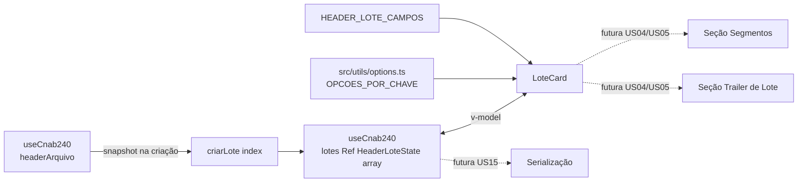

# PLAN — Preencher o Header de Lote

## Resumo Técnico

Implementar o `LoteCard.vue`, um card colapsável que hospeda a seção Header de Lote (27 campos, data-driven, mesma interface `CampoLeiaute` de US02/ADR-008). A spec dos campos vive em `src/model/cnab240/headerLote.ts`. As opções dos dois `q-select` (Tipo de Serviço, Forma de Lançamento) são centralizadas em `src/utils/options.ts`, um arquivo compartilhado para todas as opções de `q-select` do projeto. O composable `useCnab240` (US02) ganha o slice `lotes: Ref<HeaderLoteState[]>`, inicializado com um elemento (`lotes[0]`) cujos campos herdados copiam o valor corrente de `headerArquivo` no momento da criação. `LoteCard` é adicionado à `Cnab240Page` abaixo do `HeaderArquivoCard`. US04 e US05 vão editar o mesmo `LoteCard.vue` para adicionar as seções de Segmentos de Detalhe e Trailer de Lote dentro do mesmo wrapper colapsável — não há placeholder para elas nesta US.

## Componentes Afetados

| Componente | Ação | Notas |
|---|---|---|
| `src/model/cnab240/types.ts` | modificar | `CampoLeiaute` ganha `opcoesKey?: string` (referencia uma lista em `src/utils/options.ts`) |
| `src/model/cnab240/headerLote.ts` | criar | Constante `HEADER_LOTE_CAMPOS: CampoLeiaute[]` com os 27 campos (ver RN01 do SPEC) |
| `src/utils/options.ts` | criar | Registro central de opções de `q-select` do projeto; exporta `OPCOES_TIPO_SERVICO` e `OPCOES_FORMA_LANCAMENTO` (mapa `{ [key: string]: { value: string; label: string }[] }`) |
| `src/composables/useCnab240.ts` | modificar | Adiciona `lotes: Ref<HeaderLoteState[]>`, inicializado com `[criarLote(0)]`; função interna `criarLote(index)` aplica RN02/RN03 |
| `src/components/cnab240/LoteCard.vue` | criar | Card colapsável (chevron, título "Lote N", `ref<boolean>` local para expanded/collapsed) contendo a seção Header de Lote, iterando `HEADER_LOTE_CAMPOS` |
| `src/pages/Cnab240Page.vue` | modificar | Adiciona `<LoteCard :lote="lotes[0]" :index="0" />` (ou prop equivalente) abaixo do `HeaderArquivoCard` |

## Estrutura de Dados

```ts
// src/model/cnab240/types.ts (extensão)
interface CampoLeiaute {
  id: string;
  label: string;
  posicaoInicial: number;
  posicaoFinal: number;
  tamanho: number;
  tipo: 'Num' | 'Alfa';
  obrigatorio: boolean;
  visivel: boolean;
  readonly?: boolean;
  valorFixo?: string;
  opcoesKey?: string;   // novo — chave em src/utils/options.ts, presente só nos campos q-select
}

// src/utils/options.ts
interface OpcaoSelect {
  value: string;
  label: string;
}
// export const OPCOES_TIPO_SERVICO: OpcaoSelect[]
// export const OPCOES_FORMA_LANCAMENTO: OpcaoSelect[]
// export const OPCOES_POR_CHAVE: Record<string, OpcaoSelect[]> = { tipoServico: OPCOES_TIPO_SERVICO, formaLancamento: OPCOES_FORMA_LANCAMENTO }

// src/composables/useCnab240.ts — extensão de estado de módulo
type HeaderLoteState = Record<string, string>;
// uma chave por campo editável de HEADER_LOTE_CAMPOS (readonly ausente/false)
// 8 chaves nascem preenchidas com o valor corrente de headerArquivo (RN02); as demais nascem ''

interface UseCnab240Return {
  headerArquivo: HeaderArquivoState;   // US02
  isDirtyCheck: ComputedRef<boolean>;  // US02
  lotes: Ref<HeaderLoteState[]>;       // novo — array desde já (US11 adiciona/remove elementos)
}
```

## Lógica Principal

1. **Definição da spec (RN01, RN06, RN07)** — `HEADER_LOTE_CAMPOS` lista os 27 campos com metadados completos. Campos fixos e `numeroLote` têm `readonly: true`; Tipo de Serviço e Forma de Lançamento têm `opcoesKey` (`'tipoServico'` / `'formaLancamento'`).

2. **Criação do lote (RN02, RN03, RN09)** — Função `criarLote(index: number): HeaderLoteState`, chamada uma vez na inicialização do módulo com `index = 0`:
   - Para cada campo editável em `HEADER_LOTE_CAMPOS`: se o `id` corresponder a um dos 8 campos herdados (mapa fixo `id lote → id headerArquivo`, ex. `tipoInscricaoEmpresa → tipoInscricao`), o valor inicial é `headerArquivo[idCorrespondente]`; caso contrário, `''`
   - `numeroLote` (exibido, não parte de `HeaderLoteState`) é resolvido como `String(index + 1).padStart(4, '0')` diretamente no template/computed do `LoteCard`, não armazenado no estado
   - `lotes` é inicializado como `ref([criarLote(0)])` no nível de módulo

3. **Resolução de opções de `q-select` (RN04)** — `LoteCard` importa `OPCOES_POR_CHAVE` de `src/utils/options.ts`; para um campo com `campo.opcoesKey` definido, as opções do `q-select` vêm de `OPCOES_POR_CHAVE[campo.opcoesKey]`.

4. **Renderização data-driven da seção Header de Lote (RN01, RN03, RN06, RN07)** — `LoteCard` itera `HEADER_LOTE_CAMPOS` (27 entradas):
   - `numeroLote`: renderizado à parte (fora do loop, ou tratado como caso especial dentro dele) como `readonly`, `model-value` = valor calculado no passo 2
   - Campos com `campo.readonly === true` (exceto `numeroLote`, já coberto): `readonly`/`disable`, `model-value` = `campo.valorFixo`
   - Campos com `campo.opcoesKey`: `q-select`, `:options="OPCOES_POR_CHAVE[campo.opcoesKey]"`, `v-model="lotes[0][campo.id]"`, `emit-value`, `map-options`
   - Demais campos editáveis: `q-input`, `v-model="lotes[0][campo.id]"`, `maxlength`, hint de capacidade (mesmo padrão de US02), `:required` quando `obrigatorio`

5. **Card colapsável (RN05)** — `LoteCard` mantém `const expanded = ref(true)` local. Chevron alterna `expanded.value`. Título computado: `` `Lote ${Number(numeroLote)}` `` (ex. "Lote 1", sem zero-padding). `v-show`/`v-if` no conteúdo interno conforme `expanded`.

6. **Integração na página (CA01)** — `Cnab240Page` monta `<LoteCard />` abaixo de `<HeaderArquivoCard />`. Nesta US, `LoteCard` não recebe índice via prop de forma essencial (só há `lotes[0]`), mas já aceita `index` opcional (default `0`) para não exigir refatoração em US11.

## Composables / Serviços

- `useCnab240()` — estendido nesta US com `lotes` e a função interna `criarLote`. Continua singleton de módulo (ADR-009).

## Eventos e Props

### `LoteCard.vue`

- Props: `index?: number` (default `0`) — índice do lote em `useCnab240().lotes`; não usado para adicionar/remover lotes nesta US (US11)
- Emits: nenhum

## Fluxo de Dados



## Dependências Externas

Nenhuma dependência nova. `ref`, `computed` do Vue 3 e `q-input`, `q-select`, `q-card`, `q-icon` (chevron) do Quasar já fazem parte do stack.

## Testes

### Unitários

- `HEADER_LOTE_CAMPOS` tem exatamente 27 entradas; soma de `tamanho` = 240
- `HEADER_LOTE_CAMPOS` — exatamente os campos esperados têm `readonly: true` (fixos + `numeroLote`, conforme RN01)
- `OPCOES_POR_CHAVE.tipoServico` e `OPCOES_POR_CHAVE.formaLancamento` não são vazios e cada opção tem `value`/`label`
- `criarLote(0)` — os 8 campos herdados refletem `headerArquivo` no momento da chamada; os demais campos editáveis são `''`
- `criarLote(0)` — `Código do Convênio no Banco` (não herdado) nasce `''` mesmo com `headerArquivo` preenchido
- `useCnab240().lotes` — inicializado com exatamente 1 elemento
- `LoteCard` — renderiza 27 campos de formulário na seção Header de Lote (2 `q-select` + 25 `q-input`)
- `LoteCard` — chevron alterna estado expandido/colapsado; conteúdo preserva valores ao colapsar/reexpandir
- `LoteCard` — campo "Lote de Serviço" exibe `'0001'` e é `readonly`

### Integração

- Preencher Header de Arquivo → em seguida verificar que `lotes[0]` (recém-criado) reflete os valores herdados apenas se a criação ocorrer depois do preenchimento (ordem de inicialização do composable é fixa na carga do módulo; teste cobre o snapshot no momento certo)
- Digitar em um campo editável do Header de Lote → `useCnab240().lotes[0][campo]` reflete o valor
- Selecionar uma opção em Tipo de Serviço → valor selecionado (código) é persistido em `lotes[0].tipoServico`
- Clicar no chevron do `LoteCard` → conteúdo colapsa; clicar novamente → reexpande com valores preservados

### E2E (se aplicável)

- Acessar `/cnab-240` → `LoteCard` "Lote 1" visível e expandido abaixo do Header de Arquivo
- Colapsar o `LoteCard` → seção Header de Lote não é mais visível na tela
- Preencher um campo do Header de Lote, colapsar e reexpandir o card → valor digitado permanece

## Riscos e Decisões em Aberto

| Risco / Dúvida | Impacto | Mitigação |
|---|---|---|
| Lista de 27 campos do Header de Lote reconstruída de memória da spec FEBRABAN v10.11, não de um documento do projeto | Alto — posições/tamanhos incorretos geram arquivo inválido | `<!-- TODO: verify against FEBRABAN spec -->` no SPEC (RN01); validar contra a spec oficial ou um arquivo de retorno real de banco antes de fechar a constante `HEADER_LOTE_CAMPOS` |
| Tabelas de opções de Tipo de Serviço e Forma de Lançamento (códigos e descrições) não confirmadas quanto a variação remessa/retorno | Médio — `q-select` pode oferecer opção inválida para o tipo de arquivo ativo | `<!-- TODO: verify against FEBRABAN spec -->` no SPEC (RN04); validar tabelas completas antes de popular `src/utils/options.ts` |
| Campo 27.0 (Ocorrências para Retorno) tratado como `readonly`/branco nesta US, mas pode ter uso real em retorno | Baixo nesta US (fora de escopo declarado), mas afeta US04+/serialização | Revisitar quando a diferenciação remessa/retorno for tratada de forma sistemática (possivelmente uma US técnica futura, análoga à decisão de US04 com `segmentoA.ts`) |
| `src/utils/options.ts` compartilhado entre USs — primeira US a criá-lo define a convenção (`OPCOES_POR_CHAVE`, shape de `OpcaoSelect`) | Baixo | Estrutura simples e extensível (`Record<string, OpcaoSelect[]>`); USs futuras (US04 Segmento A/B) só adicionam entradas |

## Ordem de Implementação Sugerida

1. **`src/model/cnab240/types.ts`** — adicionar `opcoesKey?: string` a `CampoLeiaute`
2. **`src/utils/options.ts`** — `OPCOES_TIPO_SERVICO`, `OPCOES_FORMA_LANCAMENTO`, `OPCOES_POR_CHAVE`; validar tabelas contra spec FEBRABAN antes de finalizar
3. **`src/model/cnab240/headerLote.ts`** — constante `HEADER_LOTE_CAMPOS`; teste unitário de integridade (contagem e soma de tamanhos = 240); validar campos contra spec FEBRABAN antes de finalizar
4. **`src/composables/useCnab240.ts`** — `criarLote`, slice `lotes`; testes unitários de herança de defaults e estado inicial
5. **`src/components/cnab240/LoteCard.vue`** — card colapsável com seção Header de Lote data-driven; testes unitários de renderização e collapse
6. **`src/pages/Cnab240Page.vue`** — adicionar `<LoteCard />` abaixo do `HeaderArquivoCard`
7. **Testes de integração e E2E** — fluxo completo de preenchimento, herança e collapse
