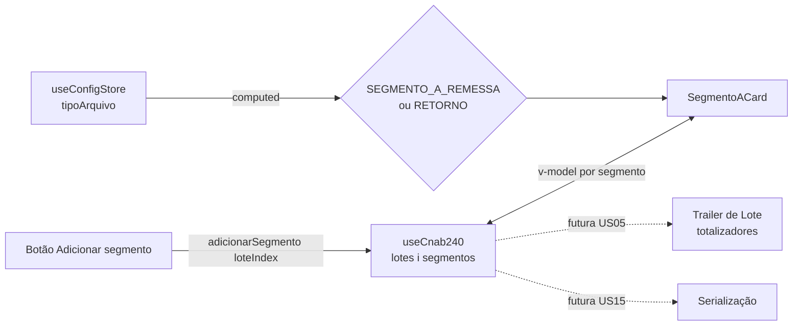

# PLAN — Preencher Segmentos de Detalhe

## Resumo Técnico

Implementar `SegmentoACard.vue`, um card data-driven (mesmo padrão de US02/US03) para os campos do Segmento A, renderizado dentro do `LoteCard` (US03) abaixo da seção Header de Lote. A spec vive em `src/model/cnab240/segmentoA.ts` como duas constantes (`SEGMENTO_A_REMESSA_CAMPOS`, `SEGMENTO_A_RETORNO_CAMPOS`); `SegmentoACard` escolhe a constante correta lendo `useConfigStore().tipoArquivo`. O composable `useCnab240` (US02/US03) ganha `segmentos: SegmentoState[]` aninhado em cada elemento de `lotes`, e o método `adicionarSegmento(loteIndex)`. `LoteCard.vue` (US03) é modificado para incluir o botão "Adicionar segmento" e a lista de `SegmentoACard` logo abaixo da seção Header de Lote — sem placeholder para o Trailer de Lote (US05), que será adicionado depois.

## Componentes Afetados

| Componente | Ação | Notas |
|---|---|---|
| `src/model/cnab240/segmentoA.ts` | criar | `SEGMENTO_A_REMESSA_CAMPOS` e `SEGMENTO_A_RETORNO_CAMPOS: CampoLeiaute[]` (26 campos cada, ver RN01/RN02) |
| `src/composables/useCnab240.ts` | modificar | `HeaderLoteState` ganha... não, `lotes` passa a ser `Ref<LoteState[]>` onde `LoteState = HeaderLoteState & { segmentos: SegmentoState[] }`; adiciona `adicionarSegmento(loteIndex: number)` |
| `src/components/cnab240/SegmentoACard.vue` | criar | Card data-driven, itera a constante correta conforme `tipoArquivo`; `v-model` nos campos editáveis de `lotes[loteIndex].segmentos[segmentoIndex]` |
| `src/components/cnab240/LoteCard.vue` | modificar | Adiciona botão "Adicionar segmento" + `v-for` de `SegmentoACard` sobre `lotes[index].segmentos`, abaixo da seção Header de Lote |

## Estrutura de Dados

```ts
// src/composables/useCnab240.ts — extensão
type SegmentoState = Record<string, string>;
// uma chave por campo editável da spec ativa (SEGMENTO_A_REMESSA_CAMPOS ou _RETORNO_CAMPOS)
// campos readonly (fixos ou computados) não entram aqui

interface LoteState extends HeaderLoteState {
  segmentos: SegmentoState[];
}

interface UseCnab240Return {
  headerArquivo: HeaderArquivoState;      // US02
  isDirtyCheck: ComputedRef<boolean>;     // US02
  lotes: Ref<LoteState[]>;                // estendido nesta US (era HeaderLoteState[] em US03)
  adicionarSegmento: (loteIndex: number) => void;  // novo
}
```

## Lógica Principal

1. **Definição da spec (RN01, RN02)** — `SEGMENTO_A_REMESSA_CAMPOS` e `SEGMENTO_A_RETORNO_CAMPOS` listam os 26 campos cada, com `readonly`/`valorFixo` conforme a categorização das tabelas do SPEC. Os campos 01.0–21.0 e 24.0 são idênticos entre as duas; 22.0/23.0/25.0/26.0 divergem.

2. **`adicionarSegmento` (RN06, RN09)** — `function adicionarSegmento(loteIndex: number) { const campos = tipoArquivoAtivo === 'remessa' ? SEGMENTO_A_REMESSA_CAMPOS : SEGMENTO_A_RETORNO_CAMPOS; const novo: SegmentoState = {}; campos.filter(c => !c.readonly).forEach(c => novo[c.id] = ''); lotes.value[loteIndex].segmentos.push(novo); }`. Lê `useConfigStore().tipoArquivo` no momento da criação apenas para decidir as chaves iniciais — a spec exibida depois é sempre reativa (passo 4).

3. **Numeração de exibição (RN04)** — `SegmentoACard` recebe `index: number` (posição no array) como prop; título computado `` `Segmento A — Registro ${index + 1}` ``. O campo 04.0 (Número do Registro no Lote) é renderizado como `readonly`, `model-value = String(index + 1).padStart(5, '0')`.

4. **Seleção reativa da spec (RN03, RN08)** — `SegmentoACard` usa `computed(() => configStore.tipoArquivo === 'remessa' ? SEGMENTO_A_REMESSA_CAMPOS : SEGMENTO_A_RETORNO_CAMPOS)`. Ao trocar `tipoArquivo`, o card re-renderiza com a nova constante; `v-model` em cada campo aponta para `lotes[loteIndex].segmentos[index][campo.id]`, preservando valores para `id`s presentes em ambas as constantes.

5. **Renderização data-driven (RN01, RN02, RN07)** — mesmo padrão de US02/US03: itera a constante ativa, renderiza `q-input` (ou `q-select` quando `campo.opcoesKey` estiver presente, reaproveitando `src/utils/options.ts` de US03) por campo, aplicando `readonly`/`disable` + `valorFixo` ou valor computado (passo 3) quando `campo.readonly === true`.

6. **Botão "Adicionar segmento" e lista (RN06)** — `LoteCard` renderiza, abaixo da seção Header de Lote: `<q-btn label="Adicionar segmento" @click="adicionarSegmento(index)" />` seguido de `<SegmentoACard v-for="(seg, i) in lotes[index].segmentos" :key="i" :lote-index="index" :index="i" />`.

## Composables / Serviços

- `useCnab240()` — estendido com `segmentos` aninhado em `lotes` e `adicionarSegmento`. Continua singleton de módulo (ADR-009).

## Eventos e Props

### `SegmentoACard.vue`

- Props: `loteIndex: number`, `index: number` (posição do segmento em `lotes[loteIndex].segmentos`)
- Emits: nenhum

### `LoteCard.vue` (extensão de US03)

- Sem mudança de props/emits — apenas template estendido internamente

## Fluxo de Dados



## Dependências Externas

Nenhuma dependência nova. `ref`, `computed` do Vue 3 e `q-input`, `q-select`, `q-btn`, `q-card` do Quasar já fazem parte do stack.

## Testes

### Unitários

- `SEGMENTO_A_REMESSA_CAMPOS` e `SEGMENTO_A_RETORNO_CAMPOS` têm exatamente 26 entradas cada; soma de `tamanho` = 240 em ambas
- `adicionarSegmento(0)` — empurra um `SegmentoState` com as chaves editáveis corretas (vazias) para `lotes[0].segmentos`
- `adicionarSegmento(0)` chamado 2x — `lotes[0].segmentos.length === 2`
- `SegmentoACard` — com `tipoArquivo === 'remessa'`, renderiza campos de `SEGMENTO_A_REMESSA_CAMPOS` (Data/Valor Real `readonly`)
- `SegmentoACard` — com `tipoArquivo === 'retorno'`, renderiza campos de `SEGMENTO_A_RETORNO_CAMPOS` (Data/Valor Real editáveis)
- `SegmentoACard` — título exibido é `"Segmento A — Registro N"` conforme `index` prop
- `SegmentoACard` — campo Tipo de Registro é `readonly` com valor `'3'`
- `LoteCard` — sem segmentos, exibe só o botão "Adicionar segmento"; após clique, exibe 1 `SegmentoACard`

### Integração

- Clicar em "Adicionar segmento" duas vezes → dois `SegmentoACard` visíveis, títulos "Registro 1" e "Registro 2"
- Digitar em um campo editável do segundo segmento → `useCnab240().lotes[0].segmentos[1][campo]` reflete o valor, sem afetar `segmentos[0]`
- Alternar `tipoArquivo` de remessa para retorno com um segmento já preenchido → card passa a exibir os campos de retorno; valores dos campos comuns (ex. Nome do Favorecido) permanecem

### E2E (se aplicável)

- Acessar `/cnab-240`, expandir `LoteCard` → seção de segmentos vazia, só o botão visível
- Clicar em "Adicionar segmento" → novo card aparece com título "Segmento A — Registro 1"
- Preencher campos do segmento, adicionar um segundo segmento → dados do primeiro permanecem intactos

## Riscos e Decisões em Aberto

| Risco / Dúvida | Impacto | Mitigação |
|---|---|---|
| Lista de campos do Segmento A (remessa e retorno) reconstruída de memória, especialmente bytes 170–240 | Alto — posições/tamanhos incorretos geram arquivo inválido | `<!-- TODO: verify against FEBRABAN spec -->` no SPEC (RN01/RN02); validar contra a spec oficial ou um arquivo de retorno real de banco antes de fechar `segmentoA.ts` |
| Comportamento ao trocar `tipoArquivo` com dados já digitados (RN08) não tem confirmação/dirty-check | Médio — usuário pode perder contexto sobre por que um campo sumiu | Aceito como fora de escopo nesta US; revisitar quando o dirty-check global (US01/US02) for implementado |
| AC original do backlog ("segmento colapsável") foi substituído por "sempre expandido" (RN05) — pode gerar confusão se alguém consultar só o backlog | Baixo | Backlog deve ser atualizado após a implementação para refletir RN05 como decisão de refinamento |

## Ordem de Implementação Sugerida

1. **`src/model/cnab240/segmentoA.ts`** — constantes `SEGMENTO_A_REMESSA_CAMPOS`/`SEGMENTO_A_RETORNO_CAMPOS`; testes unitários de integridade (contagem e soma de tamanhos = 240 em cada)
2. **`src/composables/useCnab240.ts`** — estender `LoteState` com `segmentos`, implementar `adicionarSegmento`; testes unitários
3. **`src/components/cnab240/SegmentoACard.vue`** — card data-driven, seleção reativa da spec por `tipoArquivo`; testes unitários de renderização remessa/retorno
4. **`src/components/cnab240/LoteCard.vue`** — adicionar botão "Adicionar segmento" e lista de `SegmentoACard`
5. **Testes de integração e E2E** — fluxo de adicionar múltiplos segmentos e trocar tipo de arquivo
