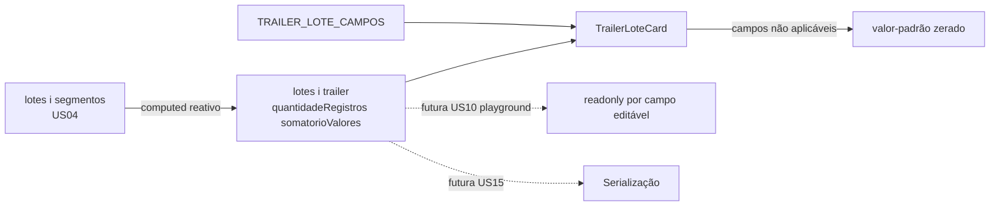

# PLAN — Trailer de Lote gerado automaticamente

## Resumo Técnico

Implementar `TrailerLoteCard.vue`, um card somente-leitura data-driven (mesmo padrão de US02–US04) para os 10 campos do Trailer de Lote, renderizado dentro do `LoteCard` (US03) sempre ao final da seção de segmentos (US04) — depois do último `SegmentoACard`/botão "Adicionar segmento". A spec vive em `src/model/cnab240/trailerLote.ts`. O composable `useCnab240` ganha `trailer: ComputedRef<TrailerLoteState>` embutido em cada elemento de `lotes`, criado junto com o lote (`criarLote`, US03) e recalculado reativamente sobre `lotes[i].segmentos`. Não há estado editável nesta US — `TrailerLoteCard` só lê `lotes[i].trailer`.

## Componentes Afetados

| Componente | Ação | Notas |
|---|---|---|
| `src/model/cnab240/trailerLote.ts` | criar | Constante `TRAILER_LOTE_CAMPOS: CampoLeiaute[]` com os 10 campos (ver RN01), todos `readonly: true` |
| `src/composables/useCnab240.ts` | modificar | `LoteState` (US04) ganha `trailer: ComputedRef<TrailerLoteState>`; `criarLote` passa a criar esse computed junto com `segmentos` |
| `src/components/cnab240/TrailerLoteCard.vue` | criar | Card somente-leitura, itera `TRAILER_LOTE_CAMPOS`, resolve cada valor a partir de `lotes[loteIndex].trailer` (calculados) ou `valorFixo` (fixos) |
| `src/components/cnab240/LoteCard.vue` | modificar | Adiciona `<TrailerLoteCard :lote-index="index" />` incondicionalmente, após a lista de `SegmentoACard`/botão "Adicionar segmento" |

## Estrutura de Dados

```ts
// src/composables/useCnab240.ts — extensão
type TrailerLoteState = Record<string, string>;
// uma chave por campo COMPUTADO do Trailer de Lote (quantidadeRegistros, somatorioValores)
// campos fixos/não-aplicáveis (valor-padrão) resolvem direto da constante no componente,
// não precisam existir em TrailerLoteState

interface LoteState extends HeaderLoteState {
  segmentos: SegmentoState[];         // US04
  trailer: ComputedRef<TrailerLoteState>;  // novo
}
```

## Lógica Principal

1. **Definição da spec (RN01, RN07)** — `TRAILER_LOTE_CAMPOS` lista os 10 campos, todos com `readonly: true`. Campos fixos (Código do Banco, Lote de Serviço, Tipo de Registro `'5'`, dois blocos de uso exclusivo) têm `valorFixo`. Campos calculados (`quantidadeRegistros`, `somatorioValores`) e não aplicáveis (`somatorioQuantidadeMoeda`, `numeroAvisoDebito`) não têm `valorFixo` — resolvidos em runtime (passos 2–4).

2. **Cálculo de `trailer` na criação do lote (RN02, RN03, RN05)** — dentro de `criarLote(index)` (US03), depois de inicializar `segmentos: []`:
   ```
   lote.trailer = computed(() => ({
     quantidadeRegistros: String(lote.segmentos.length + 2).padStart(6, '0'),
     somatorioValores: String(
       lote.segmentos.reduce((acc, seg) => acc + Number(seg.valorPagamento || '0'), 0)
     ).padStart(18, '0'),
   }))
   ```
   Por `lote` ser um objeto reativo (elemento de `lotes: Ref<LoteState[]>`), o acesso a `lote.segmentos` dentro do `computed` cria a dependência reativa automaticamente — qualquer `push` em `segmentos` ou edição de `valorPagamento` de um segmento existente dispara recomputação.

3. **Valores-padrão de campos não aplicáveis (RN04)** — resolvidos diretamente no template do `TrailerLoteCard`, sem passar por `TrailerLoteState`: `'0'.repeat(campo.tamanho)` para `somatorioQuantidadeMoeda` (18) e `numeroAvisoDebito` (16).

4. **Renderização data-driven (RN01, RN06, RN07)** — `TrailerLoteCard` itera `TRAILER_LOTE_CAMPOS`; para cada campo:
   - Se `campo.valorFixo` definido → `model-value = campo.valorFixo`
   - Se `campo.id` em `['quantidadeRegistros', 'somatorioValores']` → `model-value = lotes[loteIndex].trailer[campo.id]`
   - Senão (não aplicável) → `model-value = '0'.repeat(campo.tamanho)`
   - Todos com `readonly`/`disable`, fonte `--lpd-font-mono`

5. **Posicionamento no `LoteCard` (RN06)** — `LoteCard` renderiza `<TrailerLoteCard :lote-index="index" />` incondicionalmente, logo após a lista de `SegmentoACard` e o botão "Adicionar segmento" (US04) — nunca condicionado a `segmentos.length > 0`.

## Composables / Serviços

- `useCnab240()` — `criarLote` (US03) estendido para também inicializar `trailer` como `ComputedRef`. Nenhum novo método público é exposto — `trailer` é lido via `lotes[i].trailer`.

## Eventos e Props

### `TrailerLoteCard.vue`

- Props: `loteIndex: number`
- Emits: nenhum

## Fluxo de Dados



## Dependências Externas

Nenhuma dependência nova. `computed` do Vue 3 e `q-input`, `q-card` do Quasar já fazem parte do stack.

## Testes

### Unitários

- `TRAILER_LOTE_CAMPOS` tem exatamente 10 entradas, todas `readonly: true`; soma de `tamanho` = 240
- `criarLote(0).trailer.value.quantidadeRegistros === '000002'` quando `segmentos` está vazio
- Após `segmentos.push(...)` duas vezes, `trailer.value.quantidadeRegistros === '000004'` (2 + 2)
- `trailer.value.somatorioValores` soma corretamente `valorPagamento` de múltiplos segmentos, tratando `''` como `0`
- `trailer.value.somatorioValores` não divide por 100 — soma bruta dos dígitos
- `TrailerLoteCard` — renderiza 10 campos `readonly`/`disable`, nenhum aceita `v-model`
- `TrailerLoteCard` — Somatório de Quantidade de Moeda e Número do Aviso de Débito sempre exibem zero-padding independente do estado dos segmentos

### Integração

- Adicionar um segmento e preencher `valorPagamento` → `TrailerLoteCard` atualiza Quantidade de Registros e Somatório sem reload
- Adicionar dois segmentos com valores diferentes → Somatório reflete a soma bruta dos dois
- Lote sem segmentos → `TrailerLoteCard` visível com Quantidade de Registros `'000002'` e Somatório zerado

### E2E (se aplicável)

- Acessar `/cnab-240`, expandir `LoteCard` sem segmentos → `TrailerLoteCard` visível com valores de lote vazio
- Adicionar um segmento e preencher o valor do pagamento → Trailer atualiza os totalizadores em tempo real, visível na tela sem interação adicional

## Riscos e Decisões em Aberto

| Risco / Dúvida | Impacto | Mitigação |
|---|---|---|
| Lista de campos do Trailer de Lote reconstruída de memória (posições/tamanhos) | Alto — contadores/totalizadores incorretos invalidam o arquivo gerado | `<!-- TODO: verify against FEBRABAN spec -->` no SPEC (RN01); validar contra a spec oficial ou um arquivo de retorno real de banco antes de fechar `trailerLote.ts` |
| `Number(seg.valorPagamento)` pode resultar em `NaN` se o usuário digitar caracteres inválidos (sem validação até US07–US10) | Médio — Somatório exibiria `'NaN'` na tela | Aceito como fora de escopo nesta US; validação de tipo do campo (US07–US10) previne o caso na origem |
| Diferenciação remessa/retorno no Trailer de Lote não investigada (SPEC assume campos idênticos) | Baixo/Médio | Se a spec oficial revelar diferença, seguir o padrão já usado em `segmentoA.ts` (US04): duas constantes separadas |

## Ordem de Implementação Sugerida

1. **`src/model/cnab240/trailerLote.ts`** — constante `TRAILER_LOTE_CAMPOS`; teste unitário de integridade (contagem e soma de tamanhos = 240)
2. **`src/composables/useCnab240.ts`** — estender `criarLote` com o `computed` de `trailer`; testes unitários de cálculo (vazio, com segmentos, valores não numéricos)
3. **`src/components/cnab240/TrailerLoteCard.vue`** — card somente-leitura data-driven; testes unitários de renderização
4. **`src/components/cnab240/LoteCard.vue`** — adicionar `TrailerLoteCard` incondicionalmente ao final da seção de segmentos
5. **Testes de integração e E2E** — fluxo de adicionar segmentos e observar o Trailer atualizar em tempo real
