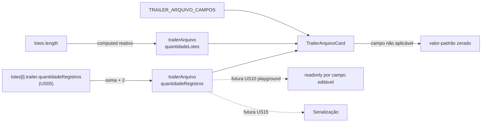

# PLAN — Trailer de Arquivo gerado automaticamente

## Resumo Técnico

Implementar `TrailerArquivoCard.vue`, um card somente-leitura data-driven (mesmo padrão de US02–US05) para os 8 campos do Trailer de Arquivo, renderizado ao final da página, abaixo da lista de lotes — irmão da lista de lotes, não filho de nenhum `LoteCard`. A spec vive em `src/model/cnab240/trailerArquivo.ts`. O composable `useCnab240` ganha `trailerArquivo: ComputedRef<TrailerArquivoState>` no nível de topo (ao lado de `headerArquivo` e `lotes`) — o primeiro getter derivado cross-lote do composable (ADR-009), que soma `lotes[i].trailer.quantidadeRegistros` (já computado por US05) em vez de recontar segmentos do zero. Não há estado editável nesta US — `TrailerArquivoCard` só lê `trailerArquivo`.

## Componentes Afetados

| Componente | Ação | Notas |
|---|---|---|
| `src/model/cnab240/trailerArquivo.ts` | criar | Constante `TRAILER_ARQUIVO_CAMPOS: CampoLeiaute[]` com os 8 campos (ver RN01), todos `readonly: true` |
| `src/composables/useCnab240.ts` | modificar | Novo `trailerArquivo: ComputedRef<TrailerArquivoState>` no nível de topo, ao lado de `headerArquivo` e `lotes` |
| `src/components/cnab240/TrailerArquivoCard.vue` | criar | Card somente-leitura, itera `TRAILER_ARQUIVO_CAMPOS`, resolve cada valor a partir de `trailerArquivo` (calculados) ou `valorFixo` (fixos) |
| `src/pages/Cnab240Page.vue` (ou equivalente da página do formulário) | modificar | Adiciona `<TrailerArquivoCard />` incondicionalmente, após a lista de `LoteCard` |

## Estrutura de Dados

```ts
// src/composables/useCnab240.ts — extensão
type TrailerArquivoState = Record<string, string>;
// uma chave por campo COMPUTADO do Trailer de Arquivo (quantidadeLotes, quantidadeRegistros)
// campos fixos/não-aplicáveis (valor-padrão) resolvem direto da constante no componente,
// não precisam existir em TrailerArquivoState

// useCnab240() retorna, além de headerArquivo e lotes:
// trailerArquivo: ComputedRef<TrailerArquivoState>
```

## Lógica Principal

1. **Definição da spec (RN01, RN07)** — `TRAILER_ARQUIVO_CAMPOS` lista os 8 campos, todos com `readonly: true`. Campos fixos (Código do Banco, Lote de Serviço `'9999'`, Tipo de Registro `'9'`, dois blocos de uso exclusivo) têm `valorFixo`. Campos calculados (`quantidadeLotes`, `quantidadeRegistros`) e não aplicável (`quantidadeContasConciliacao`) não têm `valorFixo` — resolvidos em runtime (passos 2–3).

2. **Cálculo de `trailerArquivo` no nível de topo do composable (RN02, RN03, RN05)** — dentro de `useCnab240()`, ao lado da definição de `lotes`:
   ```
   const trailerArquivo = computed<TrailerArquivoState>(() => ({
     quantidadeLotes: String(lotes.value.length).padStart(6, '0'),
     quantidadeRegistros: String(
       lotes.value.reduce((acc, lote) => acc + Number(lote.trailer.quantidadeRegistros), 0) + 2
     ).padStart(6, '0'),
   }))
   ```
   Por acessar `lotes.value.length` e, para cada lote, `lote.trailer.quantidadeRegistros` (que já é ele mesmo um `ComputedRef` de US05), o Vue registra as dependências reativas automaticamente em ambos os níveis — qualquer `push`/remoção em `lotes`, ou mudança em `lotes[i].segmentos` que altere `lotes[i].trailer`, dispara recomputação de `trailerArquivo`.

3. **Valor-padrão do campo não aplicável (RN04)** — resolvido diretamente no template do `TrailerArquivoCard`, sem passar por `TrailerArquivoState`: `'0'.repeat(campo.tamanho)` para `quantidadeContasConciliacao` (6).

4. **Renderização data-driven (RN01, RN06, RN07)** — `TrailerArquivoCard` itera `TRAILER_ARQUIVO_CAMPOS`; para cada campo:
   - Se `campo.valorFixo` definido → `model-value = campo.valorFixo`
   - Se `campo.id` em `['quantidadeLotes', 'quantidadeRegistros']` → `model-value = trailerArquivo[campo.id]`
   - Senão (não aplicável) → `model-value = '0'.repeat(campo.tamanho)`
   - Todos com `readonly`/`disable`, fonte `--lpd-font-mono`

5. **Posicionamento na página (RN06, RN08)** — a página do formulário renderiza `<TrailerArquivoCard />` incondicionalmente, logo após a lista de `LoteCard` (US03), nunca condicionado a `lotes.length > 0`. Usa `--lpd-surface` (não `--lpd-surface-2`), mesmo nível visual do `HeaderArquivoCard` (US02).

## Composables / Serviços

- `useCnab240()` — ganha `trailerArquivo: ComputedRef<TrailerArquivoState>` no retorno público, ao lado de `headerArquivo` e `lotes`. Nenhum novo método é exposto — `trailerArquivo` é somente leitura.

## Eventos e Props

### `TrailerArquivoCard.vue`

- Props: nenhuma (lê `trailerArquivo` diretamente de `useCnab240()`, mesmo padrão de `HeaderArquivoCard`, US02)
- Emits: nenhum

## Fluxo de Dados



## Dependências Externas

Nenhuma dependência nova. `computed` do Vue 3 e `q-input`, `q-card` do Quasar já fazem parte do stack.

## Testes

### Unitários

- `TRAILER_ARQUIVO_CAMPOS` tem exatamente 8 entradas, todas `readonly: true`; soma de `tamanho` = 240
- `trailerArquivo.value.quantidadeLotes === '000000'` e `quantidadeRegistros === '000002'` quando `lotes` está vazio
- Após adicionar um lote sem segmentos (`lote.trailer.quantidadeRegistros === '000002'`), `trailerArquivo.value.quantidadeLotes === '000001'` e `quantidadeRegistros === '000004'`
- Com dois lotes de `quantidadeRegistros` diferentes, `trailerArquivo.value.quantidadeRegistros` soma corretamente ambos os valores convertidos para número, mais 2
- Adicionar um segmento a um lote existente (alterando `lote.trailer.quantidadeRegistros`) propaga a mudança para `trailerArquivo.value.quantidadeRegistros`
- `TrailerArquivoCard` — renderiza 8 campos `readonly`/`disable`, nenhum aceita `v-model`
- `TrailerArquivoCard` — Quantidade de Contas para Conciliação sempre exibe zero-padding independente do estado dos lotes

### Integração

- Adicionar um lote → `TrailerArquivoCard` atualiza Quantidade de Lotes e Quantidade de Registros sem reload
- Adicionar um segmento a um lote existente → `TrailerArquivoCard` reflete a nova soma de registros automaticamente
- Nenhum lote cadastrado → `TrailerArquivoCard` visível com Quantidade de Lotes `'000000'` e Quantidade de Registros `'000002'`

### E2E (se aplicável)

- Acessar `/cnab-240` sem nenhum lote cadastrado → `TrailerArquivoCard` visível ao final da página com valores de arquivo vazio
- Adicionar um lote e um segmento → Trailer de Arquivo atualiza os totalizadores globais em tempo real, visível na tela sem interação adicional

## Riscos e Decisões em Aberto

| Risco / Dúvida | Impacto | Mitigação |
|---|---|---|
| Lista de campos do Trailer de Arquivo reconstruída de memória (posições/tamanhos) | Alto — contadores globais incorretos invalidam o arquivo gerado | `<!-- TODO: verify against FEBRABAN spec -->` no SPEC (RN01); validar contra a spec oficial ou um arquivo de retorno real de banco antes de fechar `trailerArquivo.ts` |
| `trailerArquivo` depende de um `computed` aninhado sobre outro `computed` (`lotes[i].trailer`, de US05) | Baixo — Vue resolve dependências aninhadas de `computed` nativamente, sem necessidade de padrão especial | Nenhuma mitigação necessária; comportamento padrão do Vue 3 |
| Diferenciação remessa/retorno no Trailer de Arquivo não investigada (SPEC assume campos idênticos) | Baixo/Médio | Se a spec oficial revelar diferença, seguir o padrão já usado em `segmentoA.ts` (US04): duas constantes separadas |

## Ordem de Implementação Sugerida

1. **`src/model/cnab240/trailerArquivo.ts`** — constante `TRAILER_ARQUIVO_CAMPOS`; teste unitário de integridade (contagem e soma de tamanhos = 240)
2. **`src/composables/useCnab240.ts`** — adicionar `trailerArquivo` como `computed` no nível de topo; testes unitários de cálculo (zero lotes, um lote, múltiplos lotes)
3. **`src/components/cnab240/TrailerArquivoCard.vue`** — card somente-leitura data-driven; testes unitários de renderização
4. **Página do formulário** — adicionar `TrailerArquivoCard` incondicionalmente ao final, abaixo da lista de lotes
5. **Testes de integração e E2E** — fluxo de adicionar lotes/segmentos e observar o Trailer de Arquivo atualizar em tempo real
