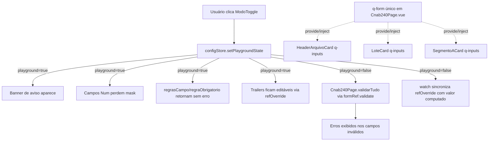

# PLAN — Alternar entre modo seguro e modo playground

## Dados do Plano

| Campo               | Valor                                |
| --------------------- | -------------------------------------- |
| Número da US          | US10                                    |
| Slug                  | `us10-modo-playground`                  |
| Stack                 | Quasar + Vue 3 + TypeScript + Vitest    |
| Data de criação       | 2026-08-31                              |
| Data de modificação   | —                                       |

---

## Resumo Técnico

Cria o `ModoToggle.vue` (UI) e conecta `getModoPlayground` (já existente em `useConfigStore` desde US07) a três pontos do sistema: (1) `validation.ts`, para desligar regras; (2) `mask` dos `q-input` numéricos, substituindo o filtro proativo em JS; (3) `readonly`/`disable` dos campos de Trailer. Consolida a validação programática da página em um único `q-form` de topo em `Cnab240Page.vue`, removendo os `q-form`s locais e redundantes hoje existentes em `HeaderArquivoCard`, `LoteCard` e `SegmentoACard`.

---

## Componentes Afetados

| Componente                    | Ação       | Notas                                                                                   |
| ------------------------------ | ----------- | ----------------------------------------------------------------------------------------- |
| `ModoToggle.vue`               | Criar      | `QBtnToggle`, opções Seguro/Playground, tokens `--lpd-*`                                  |
| `Cnab240Page.vue`               | Modificar  | Monta `ModoToggle`, banner de aviso, `<q-form ref="formRef">` único, `validarTudo()`      |
| `HeaderArquivoCard.vue`         | Modificar  | Remove `formRef`/`validarFormulario()`/`defineExpose` locais; campos Num ganham `mask`    |
| `LoteCard.vue`                  | Modificar  | Remove `formRef`/`validarFormulario()`/`defineExpose` locais (Header de Lote + agregação de segmentos); campos Num ganham `mask` |
| `SegmentoACard.vue`             | Modificar  | Remove `formRef`/`validarFormulario()`/`defineExpose` locais; campos Num ganham `mask`    |
| `TrailerLoteCard.vue`           | Modificar  | `:readonly`/`:disable` dinâmicos, `refOverride`, handler `@update:model-value`            |
| `TrailerArquivoCard.vue`        | Modificar  | Idem `TrailerLoteCard.vue`                                                                |
| `validation.ts`                 | Modificar  | `regrasCampo`/`regraObrigatorio` consultam `getModoPlayground`                            |
| `field-filters.ts`              | Remover    | Substituído por `mask` nativa do Quasar                                                   |
| `useCnab240.ts`                 | Modificar  | Adiciona `refOverride` por campo de Trailer + `watch` de sincronização                    |
| `ModoToggle.spec.ts`            | Criar      | Renderização, `aria-*`, clique alterna `togglePlayground`/`setPlaygroundState`            |
| `Cnab240Page.spec.ts`           | Criar/Modificar | Testa `validarTudo()` via `q-form` único, captura de campos filhos                    |
| `HeaderArquivoCard.spec.ts`     | Modificar  | Remove asserções de `validarFormulario()`/`defineExpose` local; adiciona asserção de `mask` |
| `LoteCard.spec.ts`              | Modificar  | Idem                                                                                       |
| `SegmentoACard.spec.ts`         | Modificar  | Idem                                                                                       |
| `TrailerLoteCard.spec.ts`       | Modificar  | Testa override editável em Playground e sincronização ao desativar                        |
| `TrailerArquivoCard.spec.ts`    | Modificar  | Idem                                                                                       |
| `field-filters.test.ts`         | Remover    | Arquivo fonte removido                                                                     |
| `validation.spec.ts`            | Modificar  | Novos casos: `regrasCampo`/`regraObrigatorio` com `getModoPlayground = true`               |

---

## Estrutura de Dados

```ts
// src/stores/config-store.ts — sem alteração de shape (US07 já define tudo):
// modoPlayground: boolean; getModoPlayground; setPlaygroundState(ativo); togglePlayground()

// src/composables/useCnab240.ts (novos membros para Trailers)
interface TrailerOverrideState {
  [campoId: string]: Ref<string>; // valor manual digitado em Playground, por campo
}

// Cnab240Page.vue
interface Cnab240PageExpose {
  validarTudo(): Promise<boolean>;
}
```

Nenhuma mudança em `CampoLeiaute` (ADR-008) — a mask é derivada de `campo.tamanho` e `campo.tipo` no template, não requer novo campo na spec de leiaute.

---

## Lógica Principal

1. **`ModoToggle.vue`** — `QBtnToggle` com `v-model` computado a partir de `configStore.getModoPlayground` (`'safe' | 'playground'`). No handler `@update:model-value`: se `'playground'` → `configStore.setPlaygroundState(true)`; se `'safe'` → `configStore.setPlaygroundState(false)` seguido de `emit('retornar-seguro')` (ou acesso direto via `inject`/prop callback) para que `Cnab240Page.vue` dispare `formRef.value.validate()` (RN08).
2. **QForm único em `Cnab240Page.vue`** — envolve `<HeaderArquivoCard />`, o `v-for` de `<LoteCard />` e `<TrailerArquivoCard />` num único `<q-form ref="formRef" greedy>`. `validarTudo()` chama `formRef.value?.validate()` e é exposto via `defineExpose`.
3. **Remoção dos `q-form`s locais** — em `HeaderArquivoCard.vue`, `LoteCard.vue`, `SegmentoACard.vue`: remove o `<q-form>` wrapper do template (os `q-input`/`q-select` continuam com `:rules`, apenas deixam de estar dentro de um `QForm` próprio — passam a ser capturados pelo `QForm` ancestral de `Cnab240Page.vue` via provide/inject do Quasar), remove `formRef`, `validarFormulario()` e `defineExpose({ validarFormulario })` do `<script setup>`. Em `LoteCard.vue`, remove também a agregação `segmentoRefs`/`Promise.all` (não é mais necessária).
4. **Mask condicionada ao Playground** — em cada `q-input` de campo `tipo: 'Num'` editável (Header/Lote/Segmento): `:mask="configStore.getModoPlayground ? undefined : '#'.repeat(campo.tamanho)"`. Handler `atualizarCampo()` passa a gravar `String(val ?? '')` diretamente, sem chamar `filtrarEntrada`.
5. **Remoção de `field-filters.ts`** — arquivo e teste (`field-filters.test.ts`) deletados; imports removidos dos três cards.
6. **Bypass em `validation.ts`** — `regraNumerico`/`regraAlfanumerico`/`regraObrigatorio` recebem `useConfigStore()` internamente; se `getModoPlayground` for `true`, retornam `true` imediatamente antes de qualquer outra checagem.
7. **Banner de aviso** — `div` em `Cnab240Page.vue` com `v-show="configStore.getModoPlayground"` + `q-slide-transition`, texto fixo, `--lpd-warning`.
8. **Override dos Trailers** — `useCnab240.ts` ganha um `Map<string, Ref<string>>` (ou refs individuais) por campo de Trailer aplicável. `TrailerLoteCard`/`TrailerArquivoCard`: `:readonly="!getModoPlayground"`, `:disable="!getModoPlayground"`, `:model-value="getModoPlayground ? override[campo.id] : computado"`, `@update:model-value` grava no override. `watch(() => configStore.getModoPlayground, (ativo) => { if (!ativo) sincronizarOverridesComComputado(); })` no composable.

---

## Composables / Serviços

- `useConfigStore()` — sem novas actions/getters (US07 já entrega tudo).
- `useCnab240()` — ganha o estado de override dos Trailers e a função interna de sincronização, chamada pelo `watch`.
- Nenhum novo composable dedicado — a lógica de override cabe dentro de `useCnab240` por já deter o estado dos Trailers.

---

## Eventos e Props (componente novo)

`ModoToggle.vue`:

- **Props:** nenhuma (lê/escreve `useConfigStore()` diretamente, mesmo padrão de `TipoArquivoToggle.vue`).
- **Emits:** `retornar-seguro` — emitido quando o usuário seleciona "Seguro", para que `Cnab240Page.vue` dispare `validarTudo()`.
- **Interação:** `QBtnToggle` com opções `[{ label: 'Seguro', value: 'safe' }, { label: 'Playground', value: 'playground' }]`.

---

## Fluxo de Dados



---

## Dependências Externas

**npm:** nenhuma nova dependência — `QBtnToggle`, `mask` e `q-form`/provide-inject são nativos do Quasar.

**Inter-US:**

- **US07** (Done) — fornece `modoPlayground`, `getModoPlayground`, `setPlaygroundState`, `togglePlayground` em `useConfigStore`; e `regrasCampo`/`regraObrigatorio` em `validation.ts` (que esta US estende).
- **US02/US03/US04** (Done) — `HeaderArquivoCard`, `LoteCard`, `SegmentoACard` perdem seus `q-form`s locais nesta US; comportamento funcional de validação é preservado, só a estrutura muda.
- **US23** (Done) — `CpfCnpjInput.vue` já consome `getModoPlayground` independentemente desta US; não é afetado.
- **US17** (futura) — consumirá `Cnab240Page.vue`'s `validarTudo()` (via `defineExpose`) antes do download.

---

## Testes

### Unitários (Vitest)

- `validation.spec.ts`: `regrasCampo`/`regraObrigatorio` retornam sem erro quando `getModoPlayground = true` (mock de `useConfigStore`).
- `HeaderArquivoCard.spec.ts`/`LoteCard.spec.ts`/`SegmentoACard.spec.ts`: campo `Num` tem `mask` igual a `'#'.repeat(tamanho)` em modo Seguro e `undefined` em Playground; nenhuma asserção remanescente sobre `validarFormulario()`/`defineExpose` local (removidos).
- `TrailerLoteCard.spec.ts`/`TrailerArquivoCard.spec.ts`: campo aceita edição via `@update:model-value` quando `getModoPlayground = true`; `watch` restaura valor computado ao desativar o Playground.
- `ModoToggle.spec.ts`: renderização, clique alterna `setPlaygroundState`, emite `retornar-seguro` ao voltar para Seguro.

### Integração (Vue Test Utils)

- Montagem de `Cnab240Page.vue` completa: preencher um campo `Num` inválido (via edição direta do estado, contornando a mask) e chamar `validarTudo()` — deve retornar `false` e o campo deve exibir erro, confirmando que o `q-form` único captura campos de componentes filhos aninhados.
- Alternar `ModoToggle` para Playground e de volta para Seguro — banner aparece/desaparece; erros reaparecem no retorno.

### E2E (Playwright)

- Ativar Playground, digitar letras num campo numérico do Header, confirmar que o valor é aceito (sem mask bloqueando).
- Deixar campo obrigatório em branco em Playground, tentar prosseguir — nenhum erro visual bloqueia.
- Retornar ao modo Seguro — erro reaparece no campo previamente inválido.
- Editar campo do Trailer de Lote em Playground, retornar ao Seguro, confirmar que o valor volta a ser o computado.

---

## Riscos e Decisões em Aberto

| Risco / Dúvida                                                                                          | Impacto | Mitigação                                                                                                   |
| ----------------------------------------------------------------------------------------------------------- | -------- | ---------------------------------------------------------------------------------------------------------------- |
| Remover os `q-form`s locais pode quebrar testes existentes que chamam `.validarFormulario()` diretamente em `HeaderArquivoCard`/`LoteCard`/`SegmentoACard` | Alto | Os specs desses três componentes precisam ser atualizados nesta mesma US (listados em Componentes Afetados) |
| `mask` do Quasar em campo já preenchido com valor mais longo que a mask nova (ex.: campo tinha "AB123" de uma sessão Playground anterior, mask volta a ativar) | Médio | Comportamento nativo do Quasar trunca/reformata ao reativar mask; aceitável, mesmo padrão de `CpfCnpjInput.vue` |
| `field-filters.ts` remoção pode ter outros usos não mapeados fora dos 3 cards | Baixo | Confirmado por grep nesta sessão: único uso é nos 3 cards listados; nenhum outro consumidor |
| provide/inject do Quasar para `QForm` através de múltiplos componentes filhos aninhados (Header → nenhum, Lote → Segmento) não tem teste automatizado prévio no projeto | Médio | Cobrir explicitamente no teste de integração de `Cnab240Page.vue` (ver seção Testes) antes de dar a US como concluída |

---

## Ordem sugerida de implementação

1. Remover `field-filters.ts` e seu teste; atualizar `regrasCampo`/`regraObrigatorio`/`regraNumerico`/`regraAlfanumerico` em `validation.ts` para checar `getModoPlayground`.
2. Adicionar `:mask` condicionada em campos `Num` de `HeaderArquivoCard.vue`, `LoteCard.vue`, `SegmentoACard.vue`; remover chamadas a `filtrarEntrada` dos handlers `atualizarCampo`.
3. Remover `formRef`/`validarFormulario()`/`defineExpose` locais desses três componentes (e a agregação `segmentoRefs` em `LoteCard.vue`); atualizar os specs correspondentes.
4. Criar o `<q-form ref="formRef">` único em `Cnab240Page.vue`, envolvendo Header + lista de lotes + `TrailerArquivoCard`; implementar `validarTudo()` e `defineExpose`.
5. Criar `ModoToggle.vue` e montá-lo ao lado de `TipoArquivoToggle.vue`; implementar o banner de aviso.
6. Implementar o retorno ao modo Seguro (`setPlaygroundState(false)` + `validarTudo()`).
7. Implementar override editável em `TrailerLoteCard.vue`/`TrailerArquivoCard.vue` + estado/`watch` de sincronização em `useCnab240.ts`.
8. Testes unitários e de integração (incluindo a verificação de que o `q-form` único captura campos filhos aninhados).
9. Testes E2E (Playwright).
10. Verificação manual em navegador: alternar modos, digitar valores fora do tipo, editar Trailers, retornar ao Seguro e confirmar reexibição de erros.

---

## Custo Estimado do Refinamento (31/08/2026)

| Métrica              | Valor                          |
| --------------------- | ------------------------------- |
| Modelo                | claude-sonnet-4-6                |
| Tokens de entrada     | ~95k                             |
| Tokens de saída       | ~14k                             |
| Custo estimado (USD)  | ~$0.50                           |
| Taxa de câmbio        | 1 USD = R$5,40 (31/08/2026)      |
| Custo estimado (BRL)  | ~R$2,70                          |

> Estimativa de tokens: leitura de docs, código-fonte (validation.ts, field-filters.ts, Cnab240Page.vue, HeaderArquivoCard.vue, LoteCard.vue, SegmentoACard.vue, Trailer*.vue, CpfCnpjInput.vue, config-store.ts) e backlog (~85k tokens entrada), escrita dos artefatos (~10k tokens saída), entrevista de refinamento (~10k entrada / ~4k saída).
> Preços claude-sonnet-4-6: $3/M tokens entrada, $15/M tokens saída.
