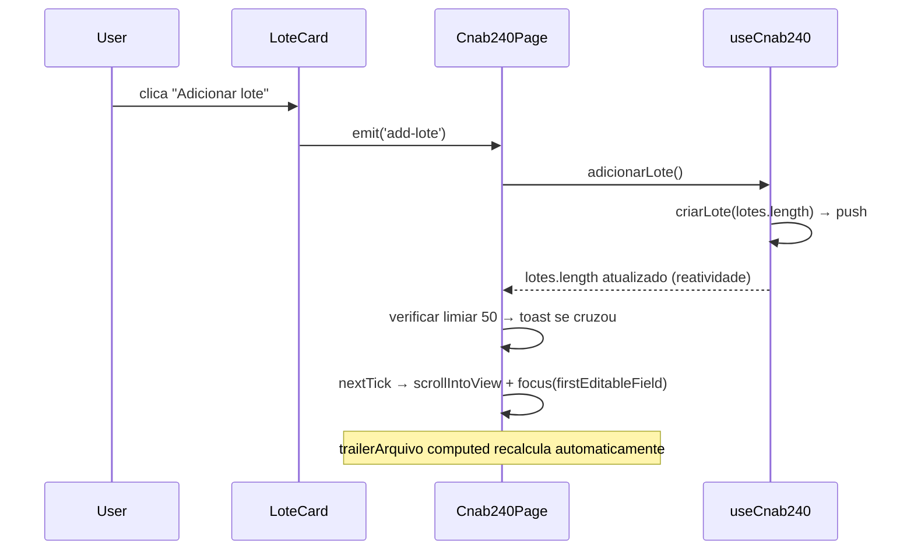

# PLAN — Adicionar múltiplos lotes

## Resumo Técnico

Habilita a criação de múltiplos lotes expondo o método público `adicionarLote()` em `useCnab240`, adaptando `LoteCard.vue` para aceitar a prop `isLast` que controla a visibilidade do botão "Adicionar lote" no footer, e integrando scroll automático + foco no primeiro campo editável do novo card via `nextTick` em `Cnab240Page.vue`. O array `lotes: Ref<LoteState[]>` já existe desde US03; esta US apenas expõe um método de adição e ajusta a renderização condicional do footer.

## Componentes Afetados

| Componente        | Ação      | Notas                                                                                        |
| ----------------- | --------- | -------------------------------------------------------------------------------------------- |
| `useCnab240.ts`   | modificar | Adicionar método público `adicionarLote()`                                                   |
| `LoteCard.vue`    | modificar | Adicionar prop `isLast` e slot de footer condicional com botão + evento `add-lote`           |
| `Cnab240Page.vue` | modificar | Passar `isLast` para cada `LoteCard`; tratar evento `add-lote`; scroll + foco via `nextTick` |

## Estrutura de Dados

Sem novos tipos ou interfaces. O método `adicionarLote()` reutiliza `criarLote(index)` já previsto em US03. A assinatura pública de `useCnab240` é estendida:

```ts
interface Cnab240Composable {
  lotes: Ref<LoteState[]>;
  adicionarLote: () => void; // novo
  // demais membros existentes (headerArquivo, trailerArquivo, adicionarSegmento...)
}
```

A lógica de rastreamento do limiar de 50 lotes vive como estado local em `Cnab240Page.vue`:

```ts
interface PerformanceWarningState {
  lastMaxLotes: number; // rastreia o máximo já atingido para detectar cruzamento de limiar
}
```

## Lógica Principal

1. **`adicionarLote()`** — chama `criarLote(lotes.value.length)` (função existente de US03 que inicializa campos com os valores correntes de `headerArquivo`) e executa `lotes.value.push(resultado)`. A numeração do novo lote é derivada do índice no array na renderização (RN02), sem armazenar no estado.

2. **Numeração dinâmica** — `LoteCard` deriva o campo "Lote de Serviço" a partir da prop `index` como `String(index + 1).padStart(4, '0')` em um `computed` local, sem armazenar no `LoteState` (RN02).

3. **Renderização condicional do footer** — `Cnab240Page.vue` passa `:is-last="index === lotes.length - 1"` para cada `LoteCard`. O footer usa `justify-between`: o lado esquerdo é reservado para o resumo do lote (US14, vazio nesta US); o lado direito exibe o botão "Adicionar lote" apenas quando `isLast === true`, caso contrário fica vazio (RN01, RN06).

4. **Scroll + foco após adição** — em `Cnab240Page.vue`, no handler do evento `add-lote`: (a) chama `adicionarLote()`; (b) aguarda `nextTick()`; (c) localiza o elemento DOM do novo card via `ref` de array ou `id` dinâmico; (d) chama `scrollIntoView({ behavior: prefersReducedMotion ? 'auto' : 'smooth', block: 'start' })`; (e) localiza o primeiro campo não-`disabled` e não-`readonly` dentro do card e chama `.focus()` (RN04).

5. **Toast de performance** — após o `push`, verifica se `lotes.value.length > 50` e se o valor anterior era `≤ 50` (cruzamento). A variável `lastMaxLotes` rastreia o máximo já atingido: ao cair abaixo de 50, reseta para o valor atual; ao cruzar 51, exibe o toast e atualiza `lastMaxLotes`. Isso permite que o toast reapareça a cada cruzamento (RN05).

## Composables / Serviços

- `useCnab240()` — recebe novo método público `adicionarLote()`; sem novo composable

## Eventos e Props (LoteCard modificado)

**Props:**

| Prop     | Tipo      | Obrigatória | Descrição                                           |
| -------- | --------- | ----------- | --------------------------------------------------- |
| `index`  | `number`  | sim         | Posição no array `lotes` (já existente)             |
| `isLast` | `boolean` | sim         | Controla se o footer exibe o botão "Adicionar lote" |

**Eventos emitidos:**

| Evento     | Payload | Descrição                                       |
| ---------- | ------- | ----------------------------------------------- |
| `add-lote` | —       | Emitido ao clicar em "Adicionar lote" no footer |

## Fluxo de Dados



## Dependências Externas

Nenhuma nova dependência npm. O mecanismo de toast reutiliza o já definido no design system (4s auto-dismiss, `--lpd-info`).

## Testes

### Unitários

- `adicionarLote()`: `lotes.length` aumenta em 1 após cada chamada
- `adicionarLote()`: novo lote tem campos inicializados com valores correntes de `headerArquivo`
- `adicionarLote()`: novo lote não herda campos de `lotes[lotes.length - 2]`
- Numeração: campo "Lote de Serviço" de `lotes[0]` é `"0001"`, de `lotes[1]` é `"0002"`, etc.
- Limiar de toast: adicionar o 51º lote dispara sinal; adicionar o 52º não dispara; reduzir para <50 e voltar a 51 dispara novamente

### Integração

- Footer condicional: botão "Adicionar lote" aparece no lado direito do footer do último `LoteCard`; footer usa `justify-between` com lado esquerdo vazio (reservado para US14)
- Footer dos cards não-últimos: sem nenhum elemento de ação à direita; lado esquerdo vazio (reservado para US14)
- `TrailerArquivoCard`: `quantidadeLotes` reflete `lotes.length` após cada adição
- `TrailerArquivoCard`: `quantidadeRegistros` inclui os registros do novo lote

### E2E

- Adicionar 3 lotes: verificar numeração sequencial (`Lote de Serviço`: `0001`, `0002`, `0003`)
- Verificar scroll automático para o novo `LoteCard` após adição
- Verificar foco no primeiro campo editável do novo card
- Verificar toast ao adicionar o 51º lote
- Verificar que o toast reexibe ao reduzir para <50 lotes e voltar a cruzar 51

## Riscos e Decisões em Aberto

| Risco / Dúvida                                                                                                     | Impacto | Mitigação                                                                                                          |
| ------------------------------------------------------------------------------------------------------------------ | ------- | ------------------------------------------------------------------------------------------------------------------ |
| `criarLote(index)` pode ter assinatura ou nome diferente se US03 não foi implementada exatamente como especificada | Alto    | Verificar a assinatura real em `useCnab240.ts` antes de implementar                                                |
| `scrollIntoView` com `behavior: 'smooth'` conflita com `prefers-reduced-motion`                                    | Baixo   | Verificar `window.matchMedia('(prefers-reduced-motion: reduce)')` antes de chamar; usar `'auto'` como fallback     |
| Primeiro campo editável pode variar conforme `tipoArquivo` (remessa vs. retorno)                                   | Baixo   | Usar `querySelector('input:not([disabled]):not([readonly]), select:not([disabled])')` no elemento DOM do novo card |
| `ref` de array para os cards pode não estar disponível imediatamente após o `push`                                 | Médio   | Garantir que o `nextTick` é aguardado antes de acessar os elementos DOM                                            |

## Ordem de Implementação Sugerida

1. Adicionar método `adicionarLote()` em `useCnab240.ts` e cobrir com testes unitários
2. Adicionar prop `isLast` e evento `add-lote` em `LoteCard.vue`; renderizar footer condicional
3. Integrar em `Cnab240Page.vue`: passar `:is-last`, tratar `@add-lote`, implementar scroll + foco via `nextTick`
4. Implementar lógica de toast de performance (rastreamento de `lastMaxLotes`)
5. Verificar reatividade automática de `TrailerArquivoCard` após adição (deve ser zero-cost)
6. Rodar testes E2E do fluxo completo com múltiplos lotes
