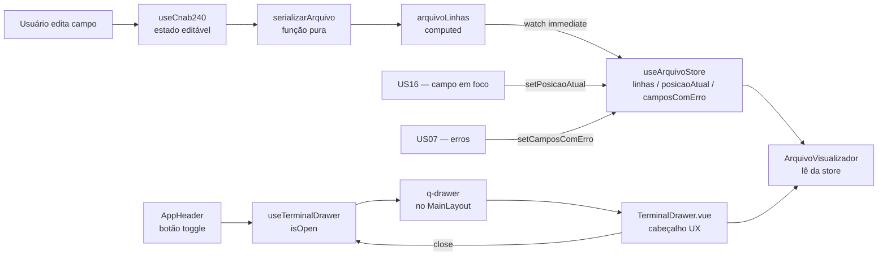

# PLAN — Visualizar o arquivo gerado no painel lateral

## Dados do Plano

| Campo               | Valor                                    |
| ------------------- | ---------------------------------------- |
| Número da US        | US15                                     |
| Slug                | `us15-visualizador-arquivo`              |
| Stack               | Quasar + Vue 3 + TypeScript + Vitest     |
| Data de criação     | 2026-08-30                               |
| Data de modificação | —                                        |

---

## Resumo Técnico

Esta US introduz o painel lateral de visualização do arquivo CNAB240 — a feature central de UX do produto. A implementação requer quatro camadas coordenadas:

1. **Serialização reativa**: `computed arquivoLinhas` dentro de `useCnab240` que converte o estado do formulário em `LinhaArquivo[]` a cada mutação. A função pura de serialização vive em `src/utils/serializer.ts`.
2. **Store centralizada**: `useArquivoStore` (Pinia) armazena as linhas geradas, a posição atual e os campos com erro. O `useCnab240` alimenta a store via `watch`; o terminal lê exclusivamente da store — desacoplando a visualização do composable CNAB240 e viabilizando futuros leiautes (RCB001, CNAB400) sem alterar o terminal.
3. **Layout de duas colunas**: integração do `q-drawer` do Quasar no `MainLayout.vue` para criar o painel lateral direito que empurra o formulário ao abrir (não sobrepõe).
4. **Componentes de visualização**: `TerminalDrawer.vue` (wrapper do `q-drawer` com cabeçalho UX responsivo a tema) e `ArquivoVisualizador.vue` (régua 1–300, números de linha, texto em cores fixas de terminal — imune à troca de tema).

A decisão de serialização reativa reverte as ADR-004 e ADR-005. Dois novos ADRs documentam a nova decisão: ADR-011 (serialização reativa via `computed`) e ADR-012 (`q-drawer` lateral em vez de `FilePreviewModal`).

---

## Componentes Afetados

| Componente                          | Ação      | Notas                                                                 |
| ----------------------------------- | --------- | --------------------------------------------------------------------- |
| `src/utils/serializer.ts`           | Criar     | Função pura `serializarArquivo`; tipos `LinhaArquivo`, `TrechoArquivo` |
| `src/stores/useArquivoStore.ts`     | Criar     | Pinia store: `linhas`, `posicaoAtual`, `camposComErro`; alimentada por `useCnab240` |
| `src/composables/useCnab240.ts`     | Modificar | Adicionar `arquivoLinhas` computed + `watch` que sincroniza para `useArquivoStore` |
| `src/composables/useTerminalDrawer.ts` | Criar  | Singleton: `isOpen`, `toggle()`, `open()`, `close()`                 |
| `src/layouts/MainLayout.vue`        | Modificar | Integrar `q-drawer side="right"` e `useTerminalDrawer()`             |
| `src/components/TerminalDrawer.vue` | Criar     | Wrapper do `q-drawer`; cabeçalho usa tokens `--lpd-*` (responsivo a tema) |
| `src/components/ArquivoVisualizador.vue` | Criar | Régua 1–300, números de linha, linhas do arquivo; cores fixas (não variam com tema) |
| `src/components/AppHeader.vue`      | Modificar | Botão toggle da drawer (visível apenas em `$q.screen.gt.xs`)         |
| `src/pages/Cnab240Page.vue`         | Modificar | Remove qualquer referência a `FilePreviewModal`; não necessita mudança estrutural se drawer estiver no layout |
| `docs/adr/ADR-011-serializacao-reativa.md` | Criar | Reverte ADR-004; justifica serialização via `computed` em tempo real |
| `docs/adr/ADR-012-q-drawer-lateral.md`     | Criar | Reverte ADR-005; justifica `q-drawer` em vez de `FilePreviewModal`  |

---

## Estrutura de Dados

```ts
// src/utils/serializer.ts

/** Um trecho contíguo de texto dentro de uma linha do arquivo. */
export type TrechoArquivo = {
  texto: string;
  posInicio: number; // 1-based, inclusive
  posFim: number;    // 1-based, inclusive
  campo?: CampoLeiaute; // campo FEBRABAN que originou este trecho (undefined = padding)
};

/** Uma linha completa de 240 chars, representada como array de trechos. */
export type LinhaArquivo = {
  numero: number;    // número sequencial 1-based (linha 1 = Header de Arquivo)
  trechos: TrechoArquivo[];
};
```

A `useArquivoStore` (Pinia):

```ts
// src/stores/useArquivoStore.ts
import { defineStore } from 'pinia';
import { ref } from 'vue';
import type { LinhaArquivo } from 'src/utils/serializer';

export const useArquivoStore = defineStore('arquivo', () => {
  /** Linhas serializadas do arquivo atual, alimentadas por useCnab240 via watch. */
  const linhas = ref<LinhaArquivo[]>([]);

  /**
   * Byte (1-based) do campo em foco no formulário.
   * null = nenhum campo em foco. Alimentado por US16.
   */
  const posicaoAtual = ref<{ linhaIndex: number; posInicio: number; posFim: number } | null>(null);

  /**
   * Identificadores dos campos com erro de validação.
   * Chave = `${tipoRegistro}.${campo.nome}`. Alimentado por US07/US16.
   */
  const camposComErro = ref<Set<string>>(new Set());

  function setLinhas(novasLinhas: LinhaArquivo[]) {
    linhas.value = novasLinhas;
  }

  function setPosicaoAtual(pos: typeof posicaoAtual.value) {
    posicaoAtual.value = pos;
  }

  function setCamposComErro(keys: string[]) {
    camposComErro.value = new Set(keys);
  }

  return { linhas, posicaoAtual, camposComErro, setLinhas, setPosicaoAtual, setCamposComErro };
});
```

O `computed arquivoLinhas` em `useCnab240` — e o `watch` que alimenta a store:

```ts
// src/composables/useCnab240.ts (trecho adicionado)
import { serializarArquivo } from 'src/utils/serializer';
import { useArquivoStore } from 'src/stores/useArquivoStore';

// ... estado existente (headerArquivo, lotes, ...)

const arquivoLinhas = computed<LinhaArquivo[]>(() =>
  serializarArquivo({
    headerArquivo,
    lotes,
    tipoArquivo: useConfigStore().tipoArquivo,
  })
);

// Sincroniza para a store centralizada — o terminal lê da store, não do composable.
watch(arquivoLinhas, (novas) => useArquivoStore().setLinhas(novas), { immediate: true });

export function useCnab240() {
  return {
    // ... exports existentes
    // arquivoLinhas não precisa ser exportado; consumidores usam useArquivoStore.
  };
}
```

> **Por que store e não prop?** `ArquivoVisualizador` não tem relação de parentesco direta com `useCnab240`. A store desacopla o terminal do leiaute específico — quando RCB001 e CNAB400 forem implementados, cada um alimenta a mesma `useArquivoStore` sem alterar o componente de visualização.

O `useTerminalDrawer`:

```ts
// src/composables/useTerminalDrawer.ts
const isOpen = ref(true); // inicia aberto (RN01)

export function useTerminalDrawer() {
  return {
    isOpen: readonly(isOpen),
    toggle: () => (isOpen.value = !isOpen.value),
    open:   () => (isOpen.value = true),
    close:  () => (isOpen.value = false),
  };
}
```

---

## Lógica de Serialização

A função `serializarArquivo` em `src/utils/serializer.ts` recebe o estado e retorna `LinhaArquivo[]`:

```
HeaderArquivo  → 1 linha  (Tipo de Registro = 0)
Por lote:
  HeaderLote   → 1 linha  (Tipo de Registro = 1)
  Por registro de detalhe:
    SegmentoA  → 1 linha  (Tipo de Registro = 3)
    SegmentoB? → 1 linha  (Tipo de Registro = 3, se presente)
    SegmentoC? → 1 linha  (Tipo de Registro = 3, se presente)
  TrailerLote  → 1 linha  (Tipo de Registro = 5)
TrailerArquivo → 1 linha  (Tipo de Registro = 9)
```

Para cada registro, a serialização percorre os `CampoLeiaute[]` da spec correspondente:

1. Para cada campo: lê o valor em `state`; se em branco usa o valor fixo ou padrão
2. Aplica padding:
   - Numérico (`tipo === 'N'`): `valor.padStart(campo.tamanho, '0').slice(-campo.tamanho)`
   - Alfanumérico (`tipo === 'A' | 'AN'`): `valor.padEnd(campo.tamanho, ' ').slice(0, campo.tamanho)`
3. Gera um `TrechoArquivo` com o texto e `posInicio`/`posFim` da `CampoLeiaute`
4. Concatena todos os trechos; o total deve somar 240 chars

A concatenação final é `trechos.map(t => t.texto).join('')` — útil para download/cópia (US17/US18) que precisam apenas de `string`.

**Regra de invariância (testável):** `trechos.reduce((acc, t) => acc + t.texto.length, 0) === 240` para toda `LinhaArquivo`.

---

## Integração do q-drawer no MainLayout

O `MainLayout.vue` usa `q-layout` com o `q-drawer` do lado direito. O comportamento de "empurrar" o conteúdo é o padrão do Quasar quando `overlay` não está definido (ou é `false`) em desktop.

```html
<!-- src/layouts/MainLayout.vue -->
<q-layout view="hHh lpR lFf">
  <q-header>
    <AppHeader />
  </q-header>

  <!-- Drawer direito — não renderizado em mobile (xs) -->
  <q-drawer
    v-if="$q.screen.gt.xs"
    v-model="isOpen"
    side="right"
    bordered
    :width="drawerWidth"
    :breakpoint="0"
  >
    <TerminalDrawer />
  </q-drawer>

  <q-page-container>
    <router-view />
  </q-page-container>
</q-layout>
```

O `drawerWidth` é calculado reativamente:

```ts
const { width } = useWindowSize(); // @vueuse/core ou window.innerWidth reativo
const drawerWidth = computed(() => Math.max(320, Math.floor(width.value * 0.4)));
```

Alternativa sem @vueuse: `const drawerWidth = computed(() => Math.max(320, Math.floor(window.innerWidth * 0.4)))` — aceita um refresh manual ao redimensionar via `resize` event listener no `onMounted`.

**Nota sobre o `view` do `q-layout`:** o `R` maiúsculo em `"hHh lpR lFf"` indica que o drawer direito é fixo (não floating). Isso é exatamente o comportamento "empurra o formulário".

---

## Componente TerminalDrawer

`TerminalDrawer.vue` é o conteúdo montado dentro do `q-drawer`. Não é o `q-drawer` em si — o `q-drawer` vive no `MainLayout.vue`.

```html
<!-- src/components/TerminalDrawer.vue -->
<template>
  <div class="terminal-drawer-root column no-wrap full-height">
    <!--
      Cabeçalho: usa tokens --lpd-* e varia com o tema (dark/light).
      É UX, não conteúdo do arquivo.
    -->
    <div class="terminal-drawer-header row items-center q-px-md q-py-sm">
      <span class="terminal-drawer-title text-caption text-weight-bold">
        CNAB240 — {{ tipoArquivo === 'remessa' ? 'Remessa' : 'Retorno' }}
      </span>
      <q-space />
      <!-- Stubs para US17 e US18 -->
      <q-btn flat dense icon="content_copy" aria-label="Copiar arquivo" disabled />
      <q-btn flat dense icon="download" aria-label="Baixar arquivo" disabled />
      <!-- Toggle close (secundário — o primário está no AppHeader) -->
      <q-btn flat dense icon="chevron_right" aria-label="Fechar painel" @click="close()" />
    </div>
    <q-separator />
    <!--
      ArquivoVisualizador lê de useArquivoStore.
      Sem prop :linhas — a store é injetada internamente no componente.
    -->
    <ArquivoVisualizador class="col" />
  </div>
</template>
```

---

## Componente ArquivoVisualizador

`ArquivoVisualizador.vue` lê as linhas diretamente de `useArquivoStore` e renderiza a régua e o conteúdo do arquivo.

```html
<!-- src/components/ArquivoVisualizador.vue -->
<template>
  <div class="arquivo-container" ref="containerEl">
    <!-- Régua fixa (sticky) — 300 posições para comportar arquivos inválidos -->
    <div class="regua-wrapper">
      <span class="line-num-placeholder" />
      <span class="regua">{{ reguaTexto }}</span>
    </div>
    <!-- Linhas do arquivo lidas da store -->
    <div
      v-for="linha in arquivoStore.linhas"
      :key="linha.numero"
      class="linha-wrapper"
    >
      <span class="line-num">{{ linha.numero }}</span>
      <span
        v-for="(trecho, i) in linha.trechos"
        :key="i"
        class="trecho"
      >{{ trecho.texto }}</span>
    </div>
  </div>
</template>
```

**CSS crítico — cores fixas, imunes à troca de tema:**

O conteúdo do terminal (`.arquivo-container` e filhos) usa cores hardcoded que **não variam** quando o usuário alterna dark/light mode. Isso preserva a estética de terminal e evita que a visualização do arquivo "pule" de cor junto com a UI ao lado.

```css
/* Área de conteúdo do terminal — cores fixas, sem var(--lpd-*) */
.arquivo-container {
  background: #0e0e0f;          /* preto terminal fixo */
  color: #c5c8c6;               /* cinza claro terminal fixo */
  font-family: var(--lpd-font-mono); /* fonte mono OK — é funcional, não decorativa */
  font-size: 12px;
  overflow-y: auto;
  overflow-x: auto;
  height: 100%;
}

.regua-wrapper {
  position: sticky;
  top: 0;
  z-index: 1;
  background: #161618;          /* levemente mais claro que o fundo */
  border-bottom: 1px solid #2c2c30;
  color: #4b5263;               /* muted fixo para régua */
  display: flex;
}

.line-num {
  min-width: 4ch;
  text-align: right;
  color: #3e4451;               /* muted fixo para números de linha */
  margin-right: 8px;
  user-select: none;
  flex-shrink: 0;
}

.linha-wrapper {
  display: flex;
}

.linha-wrapper:hover {
  background: #16181a;          /* hover sutil, fixo */
}

.trecho {
  white-space: pre;             /* mantém os espaços do CNAB */
}
```

> **Somente o cabeçalho de `TerminalDrawer.vue`** (título, botões copy/download/close) usa tokens `--lpd-*` e responde à troca de tema. O conteúdo do arquivo em si é sempre "modo terminal".

**Régua de 300 posições:**

A régua cobre 300 caracteres — 60 a mais que o limite de 240 da spec FEBRABAN. Isso permite inspecionar linhas inválidas (ex.: modo playground com overflow de campo) sem que a régua termine antes do conteúdo.

```ts
const reguaTexto = computed(() => {
  let r = '';
  for (let i = 1; i <= 300; i++) {
    r += String(i % 10); // dígito do ciclo 0-9
  }
  return r;
});
```

A régua exibe os dígitos de 0–9 ciclicamente (`1234567890123...`). Marcadores de dezena são visualmente implícitos pela contagem; versões futuras podem adicionar ticks a cada 10 posições.

---

## Fluxo de Dados



---

## Dependências Externas

**npm:** nenhuma nova dependência obrigatória.
- Se adotado `@vueuse/core` (já pode estar no projeto): `useWindowSize()` simplifica o cálculo reativo da `drawerWidth`. Alternativa: listener de `resize` manual no `MainLayout`.

**Inter-US:**

- **US02–US06** (Done) — proveem `useCnab240`, `CampoLeiaute[]` de todas as seções e o estado do arquivo. Requisito prático para serializar um arquivo completo.
- **US07** (Done) — valida campos; o `TrechoArquivo` inclui `campo?: CampoLeiaute` para US futura de highlight de erro, mas não é consumido nesta US.
- **US16** (On Ready) — depende de `useArquivoStore` (com `posicaoAtual` e `camposComErro`) e `useTerminalDrawer()` existirem. A estrutura `TrechoArquivo` com `campo` já está preparada para o highlight. US16 vai chamar `useArquivoStore().setPosicaoAtual(...)`.
- **US17** (On Ready) — depende de `TerminalDrawer` montado e do botão "Baixar" stub. A lógica de download usa `useArquivoStore().linhas.map(l => l.trechos.map(t => t.texto).join('')).join('\r\n')`.
- **US18** (On Ready) — depende do botão "Copiar" stub em `TerminalDrawer`. Mesma lógica de serialização de US17 a partir de `useArquivoStore`.

---

## ADRs a Criar

### ADR-011 — Serialização reativa em tempo real via `computed` (reverte ADR-004)

**Decisão:** Adotar `computed arquivoLinhas: ComputedRef<LinhaArquivo[]>` dentro de `useCnab240`, tornando a serialização reativa. A escolha por UI contínua sem fricção extra supera o risco de performance que motivou o ADR-004 — para um arquivo CNAB240 com lotes típicos de homologação (1–5 pagamentos), o custo de serialização é negligenciável (<5ms). O risco de performance reaparece apenas com dezenas de lotes/segmentos, quando um aviso via Toast informará o usuário (análogo ao aviso de US11 para >50 lotes).

**Reverte:** ADR-004 (status: Superado por ADR-011).

### ADR-012 — `q-drawer` lateral em vez de `FilePreviewModal` (reverte ADR-005)

**Decisão:** Substituir o `FilePreviewModal` (sob demanda, modal) pelo `q-drawer` lateral direito (persistente, inicia aberto), que empurra o conteúdo sem sobrepô-lo. O ganho de feedback contínuo justifica o custo de implementação; o `q-drawer` do Quasar resolve a mecânica de push-layout sem CSS customizado.

**Reverte:** ADR-005 (status: Superado por ADR-012).

---

## Testes

### Unitários (Vitest)

`src/utils/serializer.spec.ts`:
- `serializarArquivo` com estado mínimo (apenas header de arquivo) retorna exatamente 1 `LinhaArquivo`
- Cada `LinhaArquivo` tem `trechos` cuja soma de `texto.length` é exatamente 240
- Campo numérico com valor `"1"` e tamanho `3` gera trecho `"001"`
- Campo alfanumérico com valor `"AB"` e tamanho `5` gera trecho `"AB   "`
- Campo com valor fixo usa o valor fixo independente do estado editável
- Caracteres especiais do charset ISO-8859-1 (ã, ç, é) são preservados sem truncar

`src/stores/useArquivoStore.spec.ts`:
- `linhas` inicia como array vazio
- `posicaoAtual` inicia `null`
- `camposComErro` inicia como `Set` vazio
- `setLinhas([...])` atualiza `linhas`
- `setPosicaoAtual({ linhaIndex: 0, posInicio: 1, posFim: 10 })` atualiza `posicaoAtual`
- `setCamposComErro(['headerArquivo.nomeEmpresa'])` popula o Set corretamente

`src/composables/useTerminalDrawer.spec.ts`:
- `isOpen` inicia `true`
- `toggle()` alterna `true → false → true`
- `open()` idempotente (`isOpen` permanece `true` se já aberto)
- `close()` idempotente (`isOpen` permanece `false` se já fechado)

### Integração (Vitest + Vue Test Utils)

`src/components/TerminalDrawer.spec.ts`:
- Monta `TerminalDrawer` com store pré-populada via `useArquivoStore().setLinhas([...])` e verifica que `ArquivoVisualizador` renderiza o conteúdo esperado
- Botão "Fechar painel" chama `useTerminalDrawer().close()`
- Botões "Copiar" e "Baixar" estão presentes e `disabled`

`src/components/ArquivoVisualizador.spec.ts`:
- Régua tem exatamente 300 caracteres
- Régua começa com `"123456789"` e o décimo char é `"0"` (ciclo de dígito)
- Renderiza o número de linha `1` para a primeira linha da store
- Cada `TrechoArquivo` é renderizado como texto com `white-space: pre`
- O CSS do container não usa `var(--lpd-base)` ou qualquer outro token `--lpd-*` para cor de fundo e cor de texto (cores são hardcoded)

### E2E (Playwright)

- Ao carregar `/cnab-240`, o drawer está visível e possui o atributo/classe que indica estado aberto
- Preencher um campo do Header de Arquivo e verificar que o texto do arquivo no visualizador atualiza sem nenhum clique adicional
- Fechar o drawer e verificar que o formulário expande sem sobreposição
- Em viewport 400px, verificar que o drawer não está presente no DOM
- Alternar dark/light mode e verificar que o **fundo do terminal permanece escuro** (`background-color` do `.arquivo-container` é igual antes e depois da troca de tema)

---

## Riscos e Decisões em Aberto

| Risco / Dúvida | Impacto | Mitigação |
| --- | --- | --- |
| Serialização reativa com muitos lotes pode causar lag | Médio — formulários com >20 lotes | Alertar com Toast informativo ao ultrapassar 20 lotes (análogo ao de US11 com >50); se necessário, migrar para `watchDebounced` com 150ms |
| `q-layout view` string incorreta pode fazer o drawer flutuar em vez de empurrar | Alto — UX quebrada | Testar com E2E em viewport 900px; usar `view="hHh lpR lFf"` (R maiúsculo = fixed sidebar direita) |
| `drawerWidth` fixo em px pode não se adaptar bem ao redimensionamento da janela | Baixo | Usar `useWindowSize()` de @vueuse/core se já estiver no projeto; listener de resize como fallback |
| `TerminalDrawer` no `MainLayout` afeta todas as rotas | Médio — `/rcb-001` e `/cnab-400` também herdarão o drawer | Usar `v-if="route.name === 'cnab240'"` no `q-drawer` para restringir ao CNAB240 no MVP |
| Scroll horizontal necessário para ver posição 300 | Baixo | `overflow-x: auto` no container; régua e linhas devem ter `min-width: max-content` para rolar juntos |

---

## Ordem Sugerida de Implementação

1. Criar `src/utils/serializer.ts` com tipos `TrechoArquivo`/`LinhaArquivo` e função `serializarArquivo`. Cobrir com testes unitários antes de avançar.
2. Criar `src/stores/useArquivoStore.ts` com `linhas`, `posicaoAtual`, `camposComErro` e seus setters. Cobrir com testes unitários.
3. Adicionar `arquivoLinhas` computed + `watch` ao `useCnab240.ts`; o watch chama `useArquivoStore().setLinhas(novas)` com `{ immediate: true }`.
4. Criar `src/composables/useTerminalDrawer.ts` com o singleton `isOpen` iniciando em `true`. Cobrir com testes unitários.
5. Criar `src/components/ArquivoVisualizador.vue`: lê de `useArquivoStore`, renderiza régua de 300 chars, números de linha e trechos com cores hardcoded. Cobrir com testes de integração.
6. Criar `src/components/TerminalDrawer.vue` (cabeçalho UX com tokens `--lpd-*` + stubs download/cópia + `ArquivoVisualizador`). Cobrir com testes de integração.
7. Modificar `src/layouts/MainLayout.vue` para incluir `q-drawer side="right"` com `v-if="$q.screen.gt.xs && isRouteCnab240"` e `v-model="isOpen"`.
8. Adicionar botão toggle da drawer no `src/components/AppHeader.vue` (visível apenas em `$q.screen.gt.xs`).
9. Criar ADR-011 e ADR-012 em `docs/adr/`.
10. Testes E2E com Playwright (carga, atualização em tempo real, mobile, invariância de cor do terminal na troca de tema).
11. Verificação manual: abrir/fechar drawer, preencher campos e confirmar atualização; inspecionar que nenhuma linha tem ≠ 240 chars via DevTools; alternar dark/light mode e confirmar que o terminal permanece escuro.

---

## Custo da IA

| Métrica           | Valor           |
| ----------------- | --------------- |
| Tokens de entrada | ~14.200         |
| Tokens de saída   | ~3.800          |
| Custo (USD)       | ~$0,39          |
| Custo (BRL)       | ~R$2,15         |
| Modelo            | claude-sonnet-4-6 |

> Valores aproximados, apenas para a fase de geração do PLAN (a partir das entrevistas de negócios e técnica).
