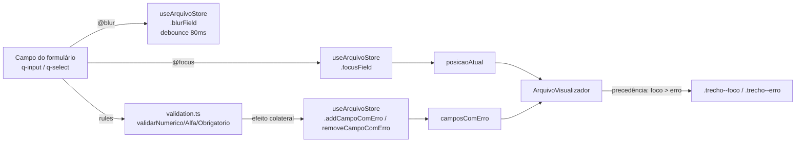

# PLAN — Destacar campo em foco e erros no terminal

## Dados do Plano

| Campo               | Valor                                |
| -------------------- | -------------------------------------- |
| Número da US          | US16                                    |
| Slug                   | `us16-highlight-terminal`                |
| Stack                  | Quasar + Vue 3 + TypeScript + Vitest      |
| Data de criação        | 2026-08-30                                 |
| Data de modificação    | —                                            |

---

## Resumo Técnico

Esta US conecta dois sinais que já existem no formulário (foco de campo e erro de validação) ao terminal criado na US15, sem introduzir uma nova fonte de verdade para nenhum dos dois. O foco é comunicado pelos próprios cards CNAB240 via `@focus`/`@blur`, que chamam actions Pinia diretamente em `useArquivoStore` (`focusField`/`blurField`), com debounce de 80ms encapsulado dentro da própria store. O erro é comunicado como efeito colateral das funções de regra já existentes em `src/utils/validation.ts` — quando o Quasar invoca uma regra (`validarNumerico`, `validarAlfa`, `validarObrigatorio`) no timing `lazy-rules` já estabelecido pela US07, a função grava ou remove a chave correspondente em `camposComErro`.

A chave usada tanto para foco quanto para erro é `` `linha-${linhaIndex}.${campo.nome}` ``, onde `linhaIndex` é o índice do registro dentro de `arquivoLinhas` (US15) — evita reconstruir a hierarquia lote/segmento na chave, já que o índice de linha já identifica a instância exata sem ambiguidade.

A renderização em `ArquivoVisualizador` (US15) passa a inspecionar `posicaoAtual` e `camposComErro` da store para decidir a cor de cada `TrechoArquivo`, aplicando a regra de precedência (foco > erro) e o reforço visual de sublinhado ondulado. Cores usam hex fixo, coerente com a paleta hardcoded do terminal já estabelecida na US15 (não `var(--lpd-*)`).

Escopo de integração nesta US: apenas os cards já existentes (`HeaderArquivoCard`, `LoteCard` — que cobre o Header de Lote — e `SegmentoACard`). `SegmentoBCard`/`SegmentoCCard` (US26/US28) ainda não existem; o padrão de integração fica documentado abaixo para ser replicado quando esses cards forem criados.

---

## Componentes Afetados

| Componente                                   | Ação      | Notas                                                                                     |
| ---------------------------------------------- | --------- | ------------------------------------------------------------------------------------------- |
| `src/stores/useArquivoStore.ts`                | Modificar | Adiciona `focusField`, `blurField` (com debounce interno), `addCampoComErro`, `removeCampoComErro` |
| `src/utils/validation.ts`                      | Modificar | `validarNumerico`, `validarAlfa`, `validarObrigatorio` ganham parâmetro de chave e chamam as actions de erro da store como efeito colateral |
| `src/components/cnab240/HeaderArquivoCard.vue` | Modificar | Adiciona `@focus`/`@blur` nos campos editáveis, chamando `useArquivoStore().focusField/blurField` |
| `src/components/cnab240/LoteCard.vue`          | Modificar | Idem, nos campos do Header de Lote                                                          |
| `src/components/cnab240/SegmentoACard.vue`     | Modificar | Idem, nos campos do Segmento A                                                              |
| `src/components/ArquivoVisualizador.vue`       | Modificar | Lê `posicaoAtual`/`camposComErro` da store; aplica cor/sublinhado por `TrechoArquivo`; adiciona tooltip on hover |
| `src/css/app.scss`                             | Modificar | Classes `.trecho--foco`, `.trecho--erro` com hex fixo e `text-decoration: underline wavy`   |

---

## Estrutura de Dados

```ts
// src/stores/useArquivoStore.ts (trecho adicionado — estende a store da US15)

export const useArquivoStore = defineStore('arquivo', () => {
  // ... linhas, camposComErro (Set<string>) já existentes da US15

  /**
   * Chave da posição atualmente em foco, no formato `linha-${linhaIndex}.${campo.nome}`.
   * null = nenhum campo em foco.
   */
  const posicaoAtual = ref<{
    key: string;
    linhaIndex: number;
    posInicio: number;
    posFim: number;
  } | null>(null);

  let blurTimeoutId: ReturnType<typeof setTimeout> | null = null;

  function focusField(payload: NonNullable<typeof posicaoAtual.value>) {
    if (blurTimeoutId) {
      clearTimeout(blurTimeoutId);
      blurTimeoutId = null;
    }
    posicaoAtual.value = payload;
  }

  function blurField() {
    blurTimeoutId = setTimeout(() => {
      posicaoAtual.value = null;
      blurTimeoutId = null;
    }, 80);
  }

  function addCampoComErro(key: string) {
    camposComErro.value.add(key);
  }

  function removeCampoComErro(key: string) {
    camposComErro.value.delete(key);
  }

  return {
    // ... exports existentes
    posicaoAtual,
    focusField,
    blurField,
    addCampoComErro,
    removeCampoComErro,
  };
});
```

```ts
// src/utils/validation.ts (assinatura estendida)

/**
 * `key` identifica a instância exata do campo no terminal
 * (`linha-${linhaIndex}.${campo.nome}`) — usada como efeito colateral
 * para popular `camposComErro` na useArquivoStore sem duplicar a
 * fonte de verdade da validação.
 */
export function validarNumerico(
  value: string,
  key: string,
  mensagem?: string
): true | string {
  const resultado = /* lógica existente */;
  const store = useArquivoStore();
  if (resultado === true) {
    store.removeCampoComErro(key);
  } else {
    store.addCampoComErro(key);
  }
  return resultado;
}

// validarAlfa e validarObrigatorio seguem o mesmo padrão
```

---

## Lógica Principal

1. Cada card calcula a `key` do campo (`` `linha-${linhaIndex}.${campo.nome}` ``) a partir do `linhaIndex` que a serialização da US15 já atribui àquele registro (o card conhece seu próprio índice de lote/segmento; a tradução para `linhaIndex` usa a mesma lógica de `serializarArquivo`, exposta como helper — ver Composables/Serviços).
2. No `@focus` do `q-input`/`q-select`: chama `useArquivoStore().focusField({ key, linhaIndex, posInicio: campo.inicio, posFim: campo.fim })` (RN01).
3. No `@blur`: chama `useArquivoStore().blurField()`, que agenda a limpeza com debounce de 80ms; se outro `focusField` for chamado antes de o timeout disparar, o `clearTimeout` cancela a limpeza pendente (RN02).
4. As `rules` do `q-input`/`q-select` continuam chamando `validarNumerico`/`validarAlfa`/`validarObrigatorio`, agora passando a `key` do campo; a função grava/remove a chave em `camposComErro` como efeito colateral, sem alterar o valor de retorno usado pelo Quasar (RN03).
5. `ArquivoVisualizador`, ao renderizar cada `TrechoArquivo`, calcula sua própria `key` (`` `linha-${linha.numero - 1}.${trecho.campo?.nome}` ``, usando o mesmo índice 0-based de `linhaIndex`) e decide a classe CSS:
   - Se `key === posicaoAtual?.key` → `.trecho--foco` (RN01, cor de foco), independentemente de estar em `camposComErro` (RN05 — foco prevalece)
   - Senão, se `camposComErro.has(key)` → `.trecho--erro` (RN04/RN06 — cor de erro + sublinhado ondulado)
   - Senão → sem classe adicional
6. Tooltip: `title` nativo ou `q-tooltip` do Quasar posicionado sobre o `<span class="trecho">`, com texto condicional ("Em edição" para foco, ou a mensagem de erro reaproveitada de `validation.ts`/US08 para erro) (RN07).
7. Campos `readonly: true` nunca recebem os handlers `@focus`/`@blur` nem participam de `rules` — o comportamento já existente (US02+) garante RN08 sem mudança adicional.

---

## Composables / Serviços

- Nenhum composable novo é criado (decisão da entrevista técnica: a lógica fica em `useArquivoStore`, não em um `useTerminalHighlight` dedicado).
- `useArquivoStore` ganha as 4 novas actions descritas em Estrutura de Dados.
- `src/utils/validation.ts` ganha o parâmetro `key: string` em `validarNumerico`, `validarAlfa` e `validarObrigatorio` — breaking change de assinatura; todos os call sites nos 3 cards existentes precisam ser atualizados para passar a `key`.

---

## Eventos e Props

Nenhum componente novo é criado nesta US — apenas handlers adicionados a componentes existentes. Nenhuma prop ou evento novo é introduzido nas interfaces públicas de `HeaderArquivoCard`, `LoteCard` ou `SegmentoACard`.

---

## Fluxo de Dados



---

## Dependências Externas

**npm:** nenhuma nova dependência. Tooltip usa `q-tooltip` do Quasar (já disponível).

**Inter-US:**

- **US15** (On Ready, ainda não implementada) — bloqueante: `useArquivoStore`, `ArquivoVisualizador` e `arquivoLinhas`/`linhaIndex` precisam existir antes desta US.
- **US07** (Done) — fornece as funções de `validation.ts` que serão estendidas com o parâmetro `key`.
- **US08** (mensagens de erro específicas) — se implementada antes desta US, a mensagem usada no tooltip de erro (RN07) reaproveita o texto já formatado; se não, o tooltip usa uma mensagem genérica até US08 chegar.
- **US26/US28** (Segmento B/C, On Ready, não implementadas) — quando implementadas, seus cards devem seguir o mesmo padrão de integração desta US (handlers `@focus`/`@blur` + `key` nas `rules`), documentado aqui para referência futura, sem código especulativo criado agora.

---

## Testes

> **Decisão explícita:** esta US **não terá testes E2E** (Playwright). Cobertura via testes unitários e de integração (Vitest) apenas.

### Unitários

`src/stores/useArquivoStore.spec.ts` (estende os testes da US15):
- `focusField` define `posicaoAtual` corretamente
- `blurField` limpa `posicaoAtual` após 80ms (`vi.useFakeTimers()` + `vi.advanceTimersByTime(80)`)
- `focusField` chamado antes dos 80ms do `blurField` anterior cancela a limpeza pendente (sem "flicker") — testado avançando o timer parcialmente (ex.: 40ms) e verificando que `posicaoAtual` não foi limpo
- `addCampoComErro`/`removeCampoComErro` atualizam o `Set` corretamente
- Chamar `addCampoComErro` duas vezes com a mesma chave não duplica (comportamento nativo de `Set`)

`src/utils/validation.test.ts` (estende os testes da US07):
- `validarNumerico` com valor inválido chama `addCampoComErro` com a `key` recebida
- `validarNumerico` com valor válido chama `removeCampoComErro` com a `key` recebida
- Idem para `validarAlfa` e `validarObrigatorio`

### Integração (Vitest + Vue Test Utils)

`src/components/ArquivoVisualizador.spec.ts` (estende os testes da US15):
- Trecho cuja `key` corresponde a `posicaoAtual.key` recebe a classe `.trecho--foco`
- Trecho cuja `key` está em `camposComErro` recebe a classe `.trecho--erro`
- Trecho em foco **e** com erro simultaneamente recebe apenas `.trecho--foco` (não `.trecho--erro`) — valida RN05
- Múltiplos trechos em `camposComErro` ao mesmo tempo recebem `.trecho--erro` simultaneamente — valida RN04
- Trecho sem `campo` associado (padding) nunca recebe nenhuma das duas classes
- `q-tooltip` está presente nos trechos destacados com o texto esperado

`src/components/cnab240/HeaderArquivoCard.spec.ts` / `LoteCard.spec.ts` / `SegmentoACard.spec.ts` (estendem os testes existentes):
- `@focus` de um campo editável chama `useArquivoStore().focusField` com a `key` esperada
- `@blur` chama `useArquivoStore().blurField`
- Campos `readonly` não têm handlers `@focus`/`@blur` anexados

---

## Riscos e Decisões em Aberto

| Risco / Dúvida | Impacto | Mitigação |
| --- | --- | --- |
| Mudar a assinatura de `validarNumerico`/`validarAlfa`/`validarObrigatorio` (adicionar `key`) é breaking change para todos os call sites existentes | Médio — 3 componentes precisam ser tocados | Mudança mecânica e coberta pelos testes já existentes da US07; nenhuma lógica de validação muda, só o parâmetro extra |
| Se US15 mudar a forma de calcular `linhaIndex` antes de ser implementada, a `key` desta US pode precisar ajuste | Baixo — ambas dependem da mesma fonte (`arquivoLinhas`) | Calcular `key` a partir do mesmo helper de serialização, não duplicar a lógica de índice nos cards |
| Tooltip com texto de erro genérico até US08 existir | Baixo — cosmético | Mensagem padrão neutra ("Campo inválido") até US08 fornecer o texto formatado |
| `Set<string>` reativo do Pinia (`camposComErro`) pode não disparar reatividade fina o suficiente em componentes com muitos trechos (múltiplos lotes) | Baixo — Vue 3 reactive Set dispara re-render no componente todo, não por trecho | Aceitável no volume esperado (dezenas de linhas); revisitar com `computed` memoizado por linha se houver relato de lag |

---

## Ordem Sugerida de Implementação

1. Adicionar `posicaoAtual`, `focusField`, `blurField` (com debounce) e `addCampoComErro`/`removeCampoComErro` a `useArquivoStore.ts`. Cobrir com testes unitários (incluindo fake timers) antes de avançar.
2. Estender `validarNumerico`, `validarAlfa`, `validarObrigatorio` em `validation.ts` com o parâmetro `key`, chamando as novas actions como efeito colateral. Atualizar os testes existentes da US07.
3. Atualizar os call sites das `rules` em `HeaderArquivoCard.vue`, `LoteCard.vue` e `SegmentoACard.vue` para passar a `key` calculada; adicionar `@focus`/`@blur` chamando `focusField`/`blurField`.
4. Atualizar `ArquivoVisualizador.vue` para calcular a `key` de cada `TrechoArquivo`, aplicar a precedência foco > erro, as classes `.trecho--foco`/`.trecho--erro` e o `q-tooltip`.
5. Adicionar as classes CSS em `app.scss` com hex fixo (coerente com a paleta hardcoded da US15) e `text-decoration: underline wavy` para erro.
6. Testes de integração para os 3 cards e para `ArquivoVisualizador`, cobrindo todas as regras (RN01–RN08).
7. Verificação manual: focar campos, gerar erros deixando campos obrigatórios vazios, corrigir e observar o terminal; testar tabulação rápida entre campos para confirmar ausência de flicker; passar o mouse sobre trechos destacados para validar o tooltip.

---

## Custo da IA

| Métrica           | Valor            |
| ------------------ | ----------------- |
| Tokens de entrada  | ~98.000             |
| Tokens de saída    | ~12.800              |
| Custo (USD)        | ~$1,21                |
| Custo (BRL)        | ~R$6,66 (cotação 30/08/2026: R$5,50) |
| Modelo             | claude-sonnet-5        |

> Valores aproximados, cobrindo a fase de geração do PLAN (Steps 9–10, incluindo a entrevista técnica).
