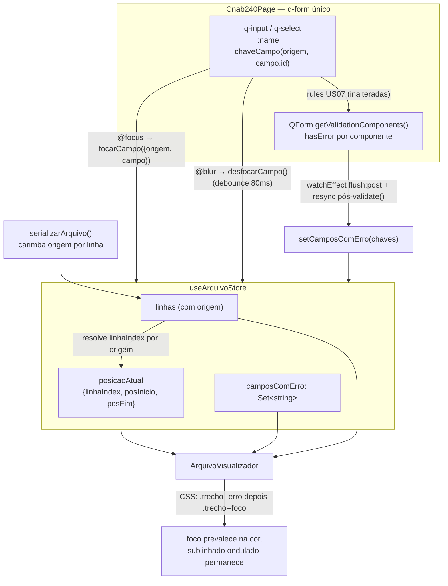
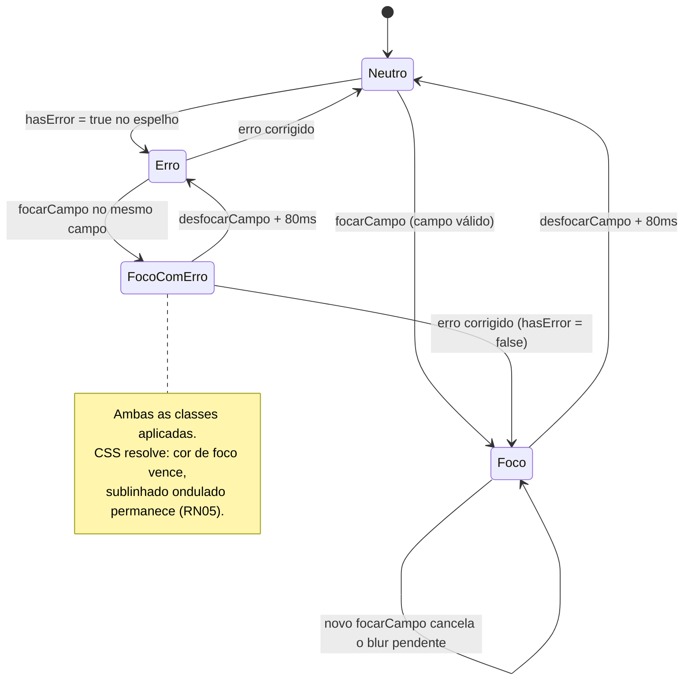

# PLAN — Destacar campo em foco e erros no terminal

## Dados do Plano

| Campo               | Valor                                |
| ------------------- | ------------------------------------ |
| Número da US        | US16                                 |
| Slug                | `us16-highlight-terminal`            |
| Stack               | Quasar + Vue 3 + TypeScript + Vitest |
| Data de criação     | 2026-08-30                           |
| Data de modificação | 2026-09-06                           |

> **Revisão de 2026-09-06.** A versão anterior deste plano foi escrita quando a US15 ainda **não** estava implementada e descrevia uma arquitetura que não corresponde ao código atual (assinaturas inexistentes em `validation.ts`, caminhos de teste em `src/`, `SegmentoBCard` tratado como inexistente). Esta revisão substitui integralmente aquelas decisões, mantendo apenas o que continua válido: a store como fonte única de `posicaoAtual`/`camposComErro`, a precedência foco > erro e as cores hardcoded do terminal.

---

## Resumo Técnico

A US16 liga dois sinais que já existem no formulário — foco de campo e estado de erro do Quasar — ao terminal da US15, sem criar nenhuma fonte de verdade nova para nenhum dos dois.

O **erro** é lido diretamente do `QForm` único de `Cnab240Page` via a API pública `formRef.getValidationComponents()`, filtrando os componentes cujo `hasError` é `true` e coletando o `name` de cada um. Isso significa que `src/utils/validation.ts` **não é tocado**: nenhuma regra ganha efeito colateral, nenhuma assinatura muda, e o espelhamento do estado de erro é exato por construção (é literalmente o estado do Quasar). A sincronização é híbrida: um `watchEffect` com `flush: 'post'` mantém o espelho em dia campo a campo durante a digitação, e uma ressincronização explícita roda logo após todo `validate()` programático (saída do Playground hoje, download na US17).

O **foco** é comunicado por handlers `@focus`/`@blur` explícitos nos quatro cards editáveis, que chamam `arquivoStore.focarCampo({ origem, campo })` com uma identidade **semântica** (seção + índice do lote + tipo do segmento). A store — e só ela — traduz essa identidade em `linhaIndex`, procurando em `linhas` a linha cuja `origem` corresponde, e grava `posicaoAtual` no formato `{ linhaIndex, posInicio, posFim }` já modelado na US15. Nenhum card faz aritmética de índice de linha.

Isso exige o único acréscimo estrutural do plano: `serializarArquivo` passa a carimbar cada `LinhaArquivo` com um campo `origem: OrigemLinha`, e `serializer.ts` passa a exportar o helper puro `chaveCampo(origem, campoId)`. A mesma chave serve aos dois lados do highlight de erro — é o `:name` de cada input no formulário e o identificador que o `ArquivoVisualizador` recompõe por trecho. O highlight de foco, por decisão da entrevista, permanece resolvido por comparação de posição (`linhaIndex` + `posInicio`/`posFim`), sem usar a chave.

Sem tooltip (RN07/CA08 removidos da SPEC) e sem spec E2E: cobertura exclusivamente por Vitest.

---

## Componentes Afetados

| Componente                                     | Ação      | Notas                                                                                                            |
| ---------------------------------------------- | --------- | ---------------------------------------------------------------------------------------------------------------- |
| `src/utils/serializer.ts`                      | Modificar | Tipo `OrigemLinha`; campo `origem` em `LinhaArquivo`; helper puro `chaveCampo(origem, campoId)`; **seleção da spec de campos por `_tipo` do segmento** (correção do gap A/B) |
| `src/stores/useArquivoStore.ts`                | Modificar | Actions `focarCampo(alvo)` e `desfocarCampo()` (debounce 80ms interno) + resolução de `linhaIndex` a partir da origem |
| `src/pages/Cnab240Page.vue`                    | Modificar | `sincronizarErros()` inline: `watchEffect` (`flush: 'post'`) sobre `getValidationComponents()` + ressincronização pós-`validate()` |
| `src/components/ArquivoVisualizador.vue`       | Modificar | Classes `.trecho--foco` / `.trecho--erro` por trecho + CSS com hex fixo                                            |
| `src/components/cnab240/HeaderArquivoCard.vue` | Modificar | `:name="chave"` + `@focus`/`@blur` nos campos editáveis                                                            |
| `src/components/cnab240/LoteCard.vue`          | Modificar | Idem, nos campos editáveis do Header de Lote                                                                      |
| `src/components/cnab240/SegmentoACard.vue`     | Modificar | Idem, nos campos editáveis do Segmento A                                                                          |
| `src/components/cnab240/SegmentoBCard.vue`     | Modificar | Idem, nos campos editáveis do Segmento B                                                                          |
| `src/components/inputs/CpfCnpjInput.vue`       | Nenhuma   | `q-input` é raiz única → `name` cai por fallthrough; já emite `focus`/`blur` próprios                              |
| `src/components/inputs/MoedaBrlInput.vue`      | Nenhuma   | Idem quanto ao `name`; foco tratado pelos eventos nativos que borbulham                                            |
| `TrailerLoteCard.vue` / `TrailerArquivoCard.vue` | Nenhuma | 100% `readonly`/`disable` — nunca recebem foco nem validação (RN08)                                                |
| `test/vitest/unit/stores/useArquivoStore.spec.ts` | Criar   | Não existe hoje                                                                                                   |
| `test/vitest/unit/utils/serializer.spec.ts`    | Criar     | Não existe hoje; cobre `origem` e `chaveCampo`                                                                    |
| `test/vitest/unit/components/ArquivoVisualizador.spec.ts` | Modificar | Casos de classe por trecho e precedência                                                                |
| `test/vitest/unit/pages/Cnab240Page.spec.ts`   | Modificar | Casos do espelho de erros                                                                                         |
| Specs dos 4 cards em `test/vitest/unit/components/cnab240/` | Modificar | Casos de `:name` e de chamada das actions de foco                                                    |

---

## Estrutura de Dados

```ts
// src/utils/serializer.ts (acréscimos)

/**
 * Identidade semântica do registro que originou uma linha do arquivo.
 * Permite que store e visualizador se refiram ao mesmo campo sem que
 * nenhum dos dois precise replicar a aritmética de índice de linha.
 */
export type OrigemLinha =
  | { secao: 'headerArquivo' }
  | { secao: 'headerLote'; loteIndex: number }
  | { secao: 'segmento'; loteIndex: number; segTipo: TipoSegmento }
  | { secao: 'trailerLote'; loteIndex: number }
  | { secao: 'trailerArquivo' };

export interface LinhaArquivo {
  numero: number;
  trechos: TrechoArquivo[];
  /** Registro que originou esta linha (US16). */
  origem: OrigemLinha;
}

/**
 * Chave estável de um campo, usada como `name` no formulário e como
 * identificador em `camposComErro`.
 *
 * - `headerArquivo.nomeEmpresa`
 * - `lote-0.headerLote.tipoServico`
 * - `lote-0.segA.valorPagamento`
 * - `lote-2.segB.formaIniciacao`
 * - `trailerArquivo.quantidadeLotes`
 */
export function chaveCampo(origem: OrigemLinha, campoId: string): string;
```

```ts
// src/stores/useArquivoStore.ts (acréscimos)

/** Campo alvo do highlight de foco, em identidade semântica. */
export interface AlvoFoco {
  origem: OrigemLinha;
  campo: CampoLeiaute;
}

/** Mantém-se inalterado (US15) — a decisão da entrevista foi não mexer nesta forma. */
export interface PosicaoAtual {
  linhaIndex: number;
  posInicio: number;
  posFim: number;
}

// `camposComErro` permanece `Set<string>` — sem mensagem associada
// (decisão da entrevista: o texto do erro fica só no formulário).
```

A store ganha duas actions e mantém `setLinhas`, `setPosicaoAtual` e `setCamposComErro` como estão (o `setPosicaoAtual` continua útil para testes e para limpeza direta; `setCamposComErro` é exatamente o que o espelho do `QForm` chama).

---

## Lógica Principal

1. **Carimbo de origem na serialização.** `construirLinha` passa a receber a `OrigemLinha` do registro e a devolvê-la dentro da `LinhaArquivo`. Em `serializarArquivo`, a origem sai do próprio laço que já existe: `{ secao: 'headerArquivo' }`, `{ secao: 'headerLote', loteIndex }`, `{ secao: 'segmento', loteIndex, segTipo: (segmento._tipo ?? 'A') }`, `{ secao: 'trailerLote', loteIndex }` e `{ secao: 'trailerArquivo' }`. Função continua pura.

2. **Correção da spec por tipo de segmento (pré-requisito do highlight do Segmento B).** Hoje `serializarArquivo` resolve `segmentoCampos` **uma vez**, fora do laço, sempre a partir das constantes do Segmento A (`SEGMENTO_A_REMESSA_CAMPOS` / `SEGMENTO_A_RETORNO_CAMPOS`), e aplica essa mesma spec a todo elemento de `lote.segmentos` — de modo que uma linha de Segmento B é serializada com os campos do Segmento A. A correção é mover a escolha para dentro do laço, por segmento:

   ```ts
   function camposDoSegmento(
     tipo: TipoSegmento,
     tipoArquivo: 'remessa' | 'retorno',
   ): CampoLeiaute[] {
     if (tipo === 'B') return SEGMENTO_B_CAMPOS; // spec única, sem variante remessa/retorno
     return tipoArquivo === 'retorno' ? SEGMENTO_A_RETORNO_CAMPOS : SEGMENTO_A_REMESSA_CAMPOS;
   }
   ```

   O resolvedor de valor bruto também passa a ramificar por tipo: o Segmento B não tem `numeroRegistroLote` do Segmento A, e seu `numeroRegistro` espelha `posicaoSegmento(loteIndex, 'B')` — a mesma regra que `SegmentoBCard` já aplica na exibição (US26). Sem essa correção, as chaves `lote-N.segB.*` emitidas pelos inputs não casam com nenhum trecho e o highlight do Segmento B nunca acende. A correção também endereça um defeito real de conteúdo do arquivo gerado, herdado da US15.

3. **Chave do campo.** `chaveCampo(origem, campoId)` é a única implementação da chave, importada tanto pelos cards (para o `:name`) quanto pelo `ArquivoVisualizador` (para consultar `camposComErro`). Nunca montar a string à mão em nenhum call site.

4. **Foco → store (RN01).** No `@focus` de cada `q-input`/`q-select` editável: `arquivoStore.focarCampo({ origem, campo })`. A store cancela qualquer timeout de blur pendente, resolve `linhaIndex = linhas.value.findIndex((l) => mesmaOrigem(l.origem, alvo.origem))` e grava `posicaoAtual = { linhaIndex, posInicio: campo.posicaoInicial, posFim: campo.posicaoFinal }`. Se `findIndex` devolver `-1` (estado ainda não serializado), grava `null` em vez de destacar a linha errada.

5. **Blur com debounce (RN02).** No `@blur`: `arquivoStore.desfocarCampo()`, que agenda `posicaoAtual.value = null` em 80ms via `setTimeout`. Um `focarCampo` que chegue antes do disparo faz `clearTimeout` — é isso que elimina o flicker ao tabular. O `timeoutId` é uma variável de closure da store (não um `ref`), pois não participa do render.

6. **Espelho de erros — regime reativo (RN03/RN04).** Em `Cnab240Page`, `sincronizarErros()` faz:

   ```ts
   const comps = formRef.value?.getValidationComponents() ?? [];
   const chaves = comps
     .filter((c) => c.hasError === true)
     .map((c) => c.name as string | undefined)
     .filter((n): n is string => typeof n === 'string' && n.length > 0);
   arquivoStore.setCamposComErro(chaves);
   ```

   Envolvido em `watchEffect(sincronizarErros, { flush: 'post' })`. A reatividade vem da leitura de `c.hasError` (computed exposto pelo `QField`); `flush: 'post'` garante que a varredura ocorra depois de o DOM e o registro dos componentes no `QForm` estarem estabilizados. Como a *lista* de componentes não é reativa por si só, o efeito lê no topo o número de lotes e a contagem de segmentos por lote, forçando a recoleta quando a estrutura muda (adicionar/duplicar/remover lote, adicionar/remover Segmento B).

7. **Espelho de erros — ressincronização explícita (RN03).** `validarTudo()` passa a `await formRef.value.validate()`, depois `await nextTick()`, depois `sincronizarErros()`, e só então retorna o booleano. O `watch` de saída do Modo Playground faz o mesmo após seu `validate()`. Isso garante que a validação em bloco (`greedy`) apareça no terminal no mesmo instante em que aparece no formulário.

8. **Modo Playground.** Nenhum tratamento especial: em Playground as regras retornam `true`, `hasError` fica `false` em todos os campos e o espelho esvazia `camposComErro` naturalmente — o terminal deixa de mostrar erros, coerente com o formulário.

9. **Render do highlight (RN04/RN05/RN06).** `ArquivoVisualizador` itera com índice (`v-for="(linha, linhaIndex) in arquivoStore.linhas"`) e, por trecho, resolve duas flags independentes:
   - `emErro` — `trecho.campo !== undefined && camposComErro.has(chaveCampo(linha.origem, trecho.campo.id))`
   - `emFoco` — `posicaoAtual !== null && posicaoAtual.linhaIndex === linhaIndex && trecho.posInicio === posicaoAtual.posInicio && trecho.posFim === posicaoAtual.posFim`

   As duas classes podem coexistir. A precedência da RN05 é resolvida em **CSS, por ordem de declaração**: `.trecho--erro` define cor + sublinhado ondulado; `.trecho--foco`, declarada depois, sobrescreve apenas a cor/fundo e não mexe em `text-decoration` — de modo que um campo em foco e com erro fica âmbar com o sublinhado ondulado preservado, exatamente como pede a RN05.

10. **Campos readonly (RN08).** Não recebem `@focus`/`@blur` nem `:name`, e são renderizados com `disable` (não recebem foco por tab nem participam da validação). RN08 sai sem código adicional.

11. **Mobile (RN09).** Herdado da US15 — o drawer não é montado em viewport < 600px, então não há trecho para destacar. Nada a implementar.

---

## Composables / Serviços

- **Nenhum composable novo.** Decisão da entrevista: a sincronização de erros fica inline no `<script setup>` de `Cnab240Page.vue`, junto do `validarTudo()` que já mora ali. Quando RCB001/CNAB400 ganharem páginas próprias, o bloco será extraído para um composable — anotado em Riscos.
- `useArquivoStore` ganha `focarCampo` e `desfocarCampo`; segue sem conhecer `useCnab240` nem qualquer leiaute (ADR-011/ADR-012 preservados).
- `src/utils/serializer.ts` ganha `OrigemLinha` e `chaveCampo`, permanecendo puro e testável isoladamente (ADR-011).
- `src/utils/validation.ts` **não é modificado** — nenhuma regra ganha efeito colateral e as assinaturas puras da US07 ficam intactas.

---

## Eventos e Props

Nenhum componente novo é criado e nenhuma interface pública de card muda: `LoteCard` continua com `index`/`is-last`, `SegmentoACard`/`SegmentoBCard` continuam com `loteIndex`. Os acréscimos são internos ao template de cada card:

- `:name="chaveCampo(origem, campo.id)"` em cada `q-input`/`q-select` editável (prop nativa do `QField`, hoje não usada).
- `@focus="focarCampo({ origem, campo })"` e `@blur="desfocarCampo()"` nos mesmos elementos.
- Cada card expõe internamente sua própria `origem`: constante em `HeaderArquivoCard` (`{ secao: 'headerArquivo' }`), `computed` em `LoteCard` (`{ secao: 'headerLote', loteIndex: props.index }`) e nos cards de segmento (`{ secao: 'segmento', loteIndex: props.loteIndex, segTipo: 'A' | 'B' }`).

---

## Fluxo de Dados



---

## Diagramas Adicionais

Máquina de estados do highlight de um trecho — torna explícita a coexistência das duas classes e o ponto onde a RN05 é resolvida:



---

## Dependências Externas

**npm:** nenhuma nova dependência. Tudo é API pública do Quasar já instalado (`QForm.getValidationComponents()`, `hasError` e a prop `name` do `QField`) e APIs nativas (`setTimeout`).

**Inter-US:**

- **US15** (Concluído) — fornece `useArquivoStore`, `ArquivoVisualizador`, `serializarArquivo`/`LinhaArquivo` e o `q-drawer`. É a base direta desta US.
- **US07** (Concluído) — fornece o estado de erro que esta US espelha. `validation.ts` **não** é alterado.
- **US10** (Concluído) — o `q-form` único e o `watch` de saída do Playground; este último ganha a chamada de ressincronização.
- **US26** (Concluído) — `SegmentoBCard` já existe e entra no escopo de integração desde já.
- **US08** (Backlog) — sem acoplamento: com o tooltip removido, o terminal não exibe texto de erro, então a US16 não depende mais das mensagens formatadas da US08.
- **US17** (Backlog) — quando o botão de download chamar `validarTudo()`, herda a ressincronização de graça, sem código adicional.
- **US27/US28** (On Ready) — cards futuros precisam repetir o padrão (`:name` + `@focus`/`@blur` + `origem`). Como a entrevista optou por handlers explícitos em vez de delegação, esquecer o padrão em um card novo faz o highlight sumir silenciosamente para aquele registro — registrado em Riscos.

---

## Testes

> **Decisão explícita (confirmada na entrevista):** esta US **não terá spec E2E** (Playwright). Cobertura exclusivamente por Vitest, unitário e de integração.

### Unitários (Vitest)

`test/vitest/unit/utils/serializer.spec.ts` (**novo**):

- Cada `LinhaArquivo` devolvida por `serializarArquivo` carrega a `origem` correta: linha 1 → `headerArquivo`; header de cada lote → `headerLote` com o `loteIndex` certo; segmentos → `segmento` com `loteIndex` e `segTipo`; trailers → `trailerLote`/`trailerArquivo`.
- Com dois lotes, os `loteIndex` das origens são `0` e `1` na ordem das linhas.
- `chaveCampo` produz as cinco formas documentadas (`headerArquivo.x`, `lote-0.headerLote.x`, `lote-0.segA.x`, `lote-1.segB.x`, `trailerArquivo.x`).
- Regressão da US15: a soma de `texto.length` por linha continua exatamente 240 após o acréscimo de `origem`.
- **Correção A/B:** um lote com Segmento A **e** Segmento B produz duas linhas de detalhe com specs distintas — a linha do B usa `SEGMENTO_B_CAMPOS` (código de segmento `'B'` na posição correta), não os campos do Segmento A.
- **Correção A/B:** a linha do Segmento B continua somando 240 caracteres, e seu `numeroRegistro` espelha `posicaoSegmento(loteIndex, 'B')`, coerente com o que `SegmentoBCard` exibe (US26).
- **Correção A/B:** em arquivo de retorno, o Segmento A usa `SEGMENTO_A_RETORNO_CAMPOS` e o Segmento B continua usando `SEGMENTO_B_CAMPOS` (spec única, sem variante).

`test/vitest/unit/stores/useArquivoStore.spec.ts` (**novo**):

- `focarCampo` resolve o `linhaIndex` correto a partir da origem, para header de arquivo, header de lote e segmentos de lotes diferentes.
- `focarCampo` com uma origem que não existe em `linhas` deixa `posicaoAtual` em `null` (não destaca linha errada).
- `posInicio`/`posFim` gravados vêm de `campo.posicaoInicial`/`posicaoFinal`.
- `desfocarCampo` limpa `posicaoAtual` só após 80ms (`vi.useFakeTimers()` + `advanceTimersByTime(80)`); em 40ms ainda está preenchido.
- `focarCampo` chamado 40ms após um `desfocarCampo` cancela a limpeza pendente — avançar mais 100ms não zera `posicaoAtual` (anti-flicker, RN02).
- `setCamposComErro` substitui o `Set` inteiro (chaves que sumiram da lista deixam de constar).

### Integração (Vitest + Vue Test Utils)

`test/vitest/unit/components/ArquivoVisualizador.spec.ts` (estender):

- Trecho cuja linha/posição casam com `posicaoAtual` recebe `.trecho--foco`; os demais não.
- Trecho cuja chave está em `camposComErro` recebe `.trecho--erro`; múltiplos trechos em linhas diferentes recebem simultaneamente (RN04).
- Trecho em foco **e** com erro recebe **ambas** as classes (RN05 — a precedência é do CSS, não do template; o teste assevera a coexistência).
- Erro removido de `camposComErro` remove a classe na re-renderização (CA04).
- Nenhuma linha recebe classe quando `posicaoAtual` é `null` e `camposComErro` está vazio.

`test/vitest/unit/pages/Cnab240Page.spec.ts` (estender):

- Com um `QForm` cujos componentes reportam `hasError`, a varredura grava exatamente os `name` desses componentes em `camposComErro`.
- Componentes sem `name` (ou com `name` vazio) são ignorados sem quebrar a varredura.
- Corrigir um campo (passar `hasError` a `false`) remove a chave do `Set`.
- `validarTudo()` chama `sincronizarErros` após o `validate()` e reflete a validação em bloco.
- Sair do Modo Playground dispara `validate()` **e** a ressincronização.

Specs dos 4 cards em `test/vitest/unit/components/cnab240/` (estender):

- Cada `q-input`/`q-select` editável renderiza o `name` esperado por `chaveCampo`.
- `@focus` chama `focarCampo` com a `origem` e o `campo` corretos; `@blur` chama `desfocarCampo`.
- Campos `readonly` não recebem `name` nem handlers de foco (CA07).
- `LoteCard` com `index = 2` produz chaves `lote-2.headerLote.*`; `SegmentoBCard` produz `lote-N.segB.*`.

---

## Riscos e Decisões em Aberto

| Risco / Dúvida                                                                                                                                                                    | Impacto | Mitigação                                                                                                                                                                                        |
| --------------------------------------------------------------------------------------------------------------------------------------------------------------------------------- | ------- | -------------------------------------------------------------------------------------------------------------------------------------------------------------------------------------------------- |
| **`serializer.ts` não distinguia Segmento B**: serializava todo segmento com `SEGMENTO_A_*_CAMPOS`, ignorando `_tipo` (gap pré-existente — US15 antecede US26) | ~~Alto~~ — **resolvido**: correção incorporada ao escopo desta US em 06/09/2026 (decisão do tech lead) | Ver item 2 de Lógica Principal e passo 2 da Ordem de Implementação. Como a correção altera o conteúdo serializado das linhas de Segmento B, os specs existentes da US15/US26 que assertam texto de linha precisam ser revisados junto — não é mudança puramente aditiva |
| `getValidationComponents()` é tipado como `any[]` — sem contrato de tipo para `hasError`/`name`                                                                                    | Médio   | Declarar uma interface local estreita (`{ hasError?: boolean; name?: string }`) no `Cnab240Page` e filtrar defensivamente. Fallback documentado: varrer o DOM do form por `.q-field--error` e ler o `name` do `<input>` |
| Lista de componentes do `QForm` não é reativa a mudanças estruturais (novo lote, Segmento B adicionado/removido)                                                                    | Médio   | O `watchEffect` lê explicitamente `lotes.value.length` e a contagem de segmentos por lote para forçar a recoleta, com `flush: 'post'` para rodar após o registro dos novos componentes                |
| Handlers explícitos por campo (Opção A da entrevista): um card futuro (US27/US28) que esqueça `:name`/`@focus` perde o highlight sem erro visível                                   | Médio   | Documentar o padrão nos comentários dos cards existentes e incluir a asserção de `name` no checklist de teste de todo card novo                                                                       |
| Sincronização inline em `Cnab240Page` (Opção B da entrevista) terá de ser reescrita nas páginas de RCB001/CNAB400                                                                   | Baixo   | Manter o bloco isolado numa função nomeada (`sincronizarErros`) e comentado, para extração direta em composable quando o segundo leiaute chegar                                                       |
| Efeito colateral de escrita na store durante `flush: 'post'` do `watchEffect` pode disparar aviso de recursão se algo em `camposComErro` alimentar de volta o formulário            | Baixo   | `camposComErro` é lido apenas pelo `ArquivoVisualizador`, nunca pelo formulário — o ciclo não se fecha. Coberto por teste de integração                                                                |
| Custo de render: recomputar `chaveCampo` por trecho a cada mudança (dezenas de linhas × ~25 trechos)                                                                                | Baixo   | Concatenação de string simples, dentro da mesma ordem de grandeza já aceita pelo ADR-011. Revisitar com `computed` memoizado por linha se houver relato de lag                                        |
| RN07/CA08 (tooltip) removidos da SPEC nesta revisão                                                                                                                                | Baixo   | Decisão da entrevista; SPEC atualizada na mesma data. A numeração das demais RNs/CAs foi preservada para não invalidar referências cruzadas                                                            |

---

## Ordem sugerida de implementação

1. **Corrigir a seleção de spec por `_tipo` em `serializarArquivo`** (`camposDoSegmento` + ramificação do resolvedor de valor bruto do Segmento B). Fazer isso **primeiro e isoladamente**, rodando a suíte antes de seguir: é a única mudança da US que altera o conteúdo do arquivo gerado, e qualquer quebra em specs da US15/US26 deve ser atribuída a ela, não ao highlight.
2. Acrescentar `OrigemLinha`, o campo `origem` em `LinhaArquivo` e o helper `chaveCampo` em `src/utils/serializer.ts`; criar `test/vitest/unit/utils/serializer.spec.ts` cobrindo origem e chave (inclusive a regressão de 240 caracteres).
3. Acrescentar `focarCampo`/`desfocarCampo` (com o debounce de 80ms) a `useArquivoStore`; criar `test/vitest/unit/stores/useArquivoStore.spec.ts` com fake timers, incluindo o caso anti-flicker.
4. Atualizar `ArquivoVisualizador.vue`: iterar com índice, calcular as duas flags por trecho, aplicar as classes e adicionar o CSS com hex fixo (`.trecho--erro` antes de `.trecho--foco`, para que a RN05 caia da ordem de cascata). Estender o spec do componente.
5. Adicionar `:name`, `@focus` e `@blur` em `HeaderArquivoCard`, `LoteCard`, `SegmentoACard` e `SegmentoBCard`, cada um expondo sua `origem`. Estender os quatro specs.
6. Implementar `sincronizarErros()` em `Cnab240Page.vue` com `watchEffect(..., { flush: 'post' })`, ligar a ressincronização em `validarTudo()` e no `watch` de saída do Playground. Estender o spec da página.
7. Rodar `npm run test:unit`, `npm run typecheck` e `npm run lint:check`.
8. Verificação manual no navegador: tabular rapidamente entre campos (sem flicker), esvaziar campos obrigatórios e ver os trechos em vermelho ondulado, focar um campo com erro (âmbar + ondulado preservado), corrigir e ver o destaque sumir, alternar Seguro/Playground, e conferir o comportamento com dois lotes e um Segmento B.

---

## Custo da IA

| Métrica              | Valor                              |
| -------------------- | ---------------------------------- |
| Modelo               | claude-opus-5                      |
| Tokens de entrada    | ~400.000                           |
| Tokens de saída      | ~15.000                            |
| Custo estimado (USD) | ~$7,13                             |
| Taxa de câmbio       | 1 USD = R$5,80 (06/09/2026)        |
| Custo estimado (BRL) | ~R$41,35                           |

> Estimativa de tokens: leitura de card do Trello, SPEC/PLAN anteriores, ADRs e base de código (~55k de contexto acumulado, reenviado a cada turno da entrevista → ~400k de entrada bruta), escrita dos artefatos (~15k de saída).
> Preços claude-opus-5: $15/M tokens entrada, $75/M tokens saída.

## Custo Estimado do Refinamento (06/09/2026)

| Métrica              | Valor                              |
| -------------------- | ---------------------------------- |
| Modelo               | claude-opus-5                      |
| Tokens de entrada    | ~400.000                           |
| Tokens de saída      | ~15.000                            |
| Custo estimado (USD) | ~$7,13                             |
| Taxa de câmbio       | 1 USD = R$5,80 (06/09/2026)        |
| Custo estimado (BRL) | ~R$41,35                           |

> Estimativa de tokens: contexto (~30k entrada) + entrevista técnica de 8 perguntas (~350k entrada acumulada / ~4k saída) + escrita do PLAN e ajuste da SPEC (~20k entrada / ~11k saída).
> Preços claude-opus-5: $15/M tokens entrada, $75/M tokens saída.
