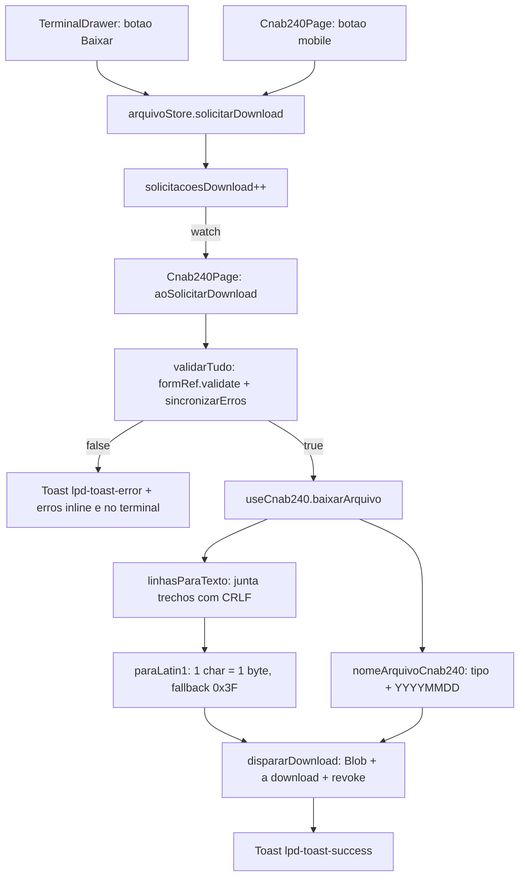

# PLAN — Baixar o arquivo gerado

## Dados do Plano

| Campo               | Valor                                |
| ------------------- | ------------------------------------ |
| Número da US        | US17                                 |
| Slug                | `us17-baixar-o-arquivo-gerado`       |
| Stack               | Quasar + Vue 3 + TypeScript + Vitest |
| Data de criação     | 2026-09-07                           |
| Data de modificação | —                                    |

---

## Resumo Técnico

Ativar o botão "Baixar arquivo" (hoje um stub `disable` no cabeçalho do `TerminalDrawer`) e gerar um arquivo CNAB240 em ISO-8859-1 com terminações CRLF, aplicando o gate de validação do Modo Seguro e bypassando-o no Modo Playground.

O nó arquitetural da US é que o botão vive no `TerminalDrawer` (dentro do `q-drawer` do `MainLayout`), enquanto o `q-form` e o `validarTudo()` vivem na `Cnab240Page`, do outro lado do `<router-view />` — não há relação pai/filho entre eles. A ligação é feita por **estado serializável na `useArquivoStore`**: um contador `solicitacoesDownload` que o drawer incrementa e a página observa com um `watch`, reaproveitando o mesmo eixo store ↔ página já estabelecido pelo espelho de erros da US16. **A página é quem executa o download** — valida, e só então chama `useCnab240().baixarArquivo()`.

As camadas seguem **view → composable → utils**: nenhum componente importa `src/utils/download.ts` diretamente. A lógica pura (junção em texto, conversão Latin-1, nome do arquivo) e o efeito colateral do navegador ficam em `src/utils/download.ts`; `useCnab240` os orquestra; as views apenas sinalizam intenção pela store.

Um botão de download adicional é montado ao final da `Cnab240Page`, visível **apenas** em viewports `< 600px` — onde o `MainLayout` não renderiza o drawer (RN10 da US15) e, portanto, o botão do terminal não existe. Ele passa pelo mesmo contador da store que o botão desktop.

> **Divergência resolvida:** a SPEC/card (extensões `.rem`/`.ret`, botão sempre habilitado com gate no clique) prevalece sobre o texto antigo do `docs/Backlog_Produto.md` (`.txt`, botão desabilitado com tooltip). O Backlog e seu espelho HTML devem ser atualizados no wrap-up da US.

---

## Componentes Afetados

| Componente                                           | Ação            | Notas                                                                                           |
| ---------------------------------------------------- | --------------- | ----------------------------------------------------------------------------------------------- |
| `src/utils/download.ts`                              | Criar           | `linhasParaTexto`, `paraLatin1`, `nomeArquivoCnab240` (puras) + `dispararDownload` (efeito)     |
| `src/stores/useArquivoStore.ts`                      | Modificar       | Adicionar `solicitacoesDownload` e a action `solicitarDownload()`                               |
| `src/composables/useCnab240.ts`                      | Modificar       | Adicionar `baixarArquivo()` ao retorno e à interface `UseCnab240Return`                         |
| `src/pages/Cnab240Page.vue`                          | Modificar       | `watch` sobre o contador → `validarTudo()` → download + toasts; botão mobile ao final da página |
| `src/components/TerminalDrawer.vue`                  | Modificar       | Remover `disable` do botão de download; `@click="arquivoStore.solicitarDownload()"`             |
| `src/css/app.scss`                                   | Modificar       | Adicionar `.lpd-toast-success` e `.lpd-toast-error`                                             |
| `test/vitest/unit/utils/download.spec.ts`            | Criar           | Testes das funções puras (texto, bytes Latin-1, nome do arquivo)                                |
| `test/vitest/unit/composables/useCnab240.spec.ts`    | Modificar/Criar | `baixarArquivo()` chama o disparo com bytes e nome esperados                                    |
| `test/vitest/unit/components/TerminalDrawer.spec.ts` | Modificar       | Botão habilitado; clique incrementa o contador                                                  |
| `test/vitest/unit/pages/Cnab240Page.spec.ts`         | Modificar       | Gate Seguro/Playground, toasts, presença do botão mobile por breakpoint                         |
| `test/playwright/e2e/us17-baixar-arquivo.spec.ts`    | Criar           | Nome do arquivo, bloqueio/liberação, ausência de rede                                           |

---

## Estrutura de Dados

```ts
// src/utils/download.ts

/** Tipo de arquivo CNAB240 — espelha `useConfigStore().tipoArquivo`. */
type TipoArquivo = 'remessa' | 'retorno';

/** Junta as linhas serializadas em uma única string, separadas por CRLF. */
function linhasParaTexto(linhas: LinhaArquivo[]): string;

/** Converte texto para bytes ISO-8859-1, com `?` (0x3F) para code points > 255. */
function paraLatin1(texto: string): Uint8Array;

/** Monta o nome sugerido ao navegador. */
function nomeArquivoCnab240(tipo: TipoArquivo, agora?: Date): string;

/** Efeito colateral isolado: Blob → objectURL → <a download> → click → revoke. */
function dispararDownload(bytes: Uint8Array, nomeArquivo: string): void;
```

```ts
// src/stores/useArquivoStore.ts (novos membros)

/** Contador monotônico de solicitações de download vindas das views (US17). */
const solicitacoesDownload: Ref<number>;

/** Incrementa o contador — única forma de uma view pedir o download. */
function solicitarDownload(): void;
```

```ts
// src/composables/useCnab240.ts (novo membro de UseCnab240Return)

/** Serializa, converte e dispara o download do arquivo atual (US17). */
baixarArquivo(): void;
```

`solicitacoesDownload` é um `number`, não uma função: mantém a store com estado serializável e inspecionável no devtools, ao contrário de um registro de callback.

---

## Lógica Principal

1. **Sinalização de intenção (view → store)** — `TerminalDrawer` (desktop) e o botão mobile da `Cnab240Page` chamam `arquivoStore.solicitarDownload()`, que faz `solicitacoesDownload.value++`. Nenhuma view conhece a lógica de validação ou de geração do arquivo.

2. **Gate de validação (página)** — a `Cnab240Page` mantém um `watch(() => arquivoStore.solicitacoesDownload, ...)` que ignora o valor inicial `0` e, a cada incremento:
   - Chama `await validarTudo()` — a função já existente, que faz `formRef.validate()`, aguarda `nextTick` e ressincroniza `camposComErro` (US16, RN03).
   - Em Modo Playground, `regrasCampo`/`regraObrigatorio` bypassam sozinhas (US10, RN02), então `validarTudo()` resolve `true` sem qualquer verificação adicional no handler — **RN03 é satisfeita sem um `if (getModoPlayground)` explícito**. Não introduzir esse `if`: duplicaria a regra que já vive em `src/utils/validation.ts`.
   - Se `false` (RN02): não baixa; os erros já aparecem inline no `q-form` (`greedy`) e no terminal via `camposComErro`; exibe o toast de erro (RN06).
   - Se `true`: chama `baixarArquivo()` e exibe o toast de sucesso (RN05).

3. **Guarda de reentrância** — uma flag local `baixando` (`ref(false)`, não exposta) protege contra cliques repetidos durante o `await validarTudo()`. Se já houver um download em curso, o incremento é ignorado. Evita dois `<a download>` disparados para a mesma solicitação.

4. **Geração do arquivo (composable)** — `baixarArquivo()` em `useCnab240`:
   - Lê `arquivoLinhas.value` — o `computed` da ADR-011, sempre disponível e independente do `TerminalDrawer` estar montado (`arquivoStore.linhas` **não** serve: só é populado pelo `watch` dentro do drawer, ausente em mobile).
   - `linhasParaTexto(...)` → `paraLatin1(...)` → `dispararDownload(bytes, nomeArquivoCnab240(useConfigStore().tipoArquivo))`.
   - `useConfigStore()` é chamado dentro da função (não no escopo do composable), seguindo o mesmo padrão já usado por `arquivoLinhas` e `adicionarSegmento`.

5. **Junção em texto (RN04)** — `linhasParaTexto` concatena os `trechos` de cada `LinhaArquivo` (`trechos.map((t) => t.texto).join('')`, já com padding aplicado e somando 240 chars) e une as linhas com `'\r\n'` via `join`. **Sem CRLF final:** `join` não adiciona separador após o último elemento — o arquivo termina no último caractere do Trailer de Arquivo.

6. **Conversão Latin-1 (RN04)** — `paraLatin1` percorre a string e escreve `codePoint <= 0xff ? codePoint : 0x3f` em um `Uint8Array` do mesmo comprimento. `TextEncoder` **não** serve: só produz UTF-8. Como cada caractere vira exatamente um byte, 240 caracteres = 240 bytes, preservando o alinhamento posicional (CA06). Acentos do Latin-1 (`Ç`, `ã`, `é`) são preservados — o `REGEX_ALFANUMERICO` da US07 já os aceita como válidos, então transliterar contradiria a validação. O fallback `?` só alcança o que o Modo Playground deixa passar (emoji, travessão, aspas curvas).

7. **Nome do arquivo (RN01)** — `nomeArquivoCnab240(tipo, agora = new Date())` monta `YYYYMMDD` a partir da data **local** do dispositivo (`getFullYear`/`getMonth() + 1`/`getDate`, com `padStart(2, '0')`), retornando `cnab240_remessa_YYYYMMDD.rem` ou `cnab240_retorno_YYYYMMDD.ret`. O parâmetro `agora` com default existe para injetar uma data fixa nos testes. O fallback `.txt` da RN01 é inalcançável na prática — `tipoArquivo` é sempre `'remessa'` ou `'retorno'` no `config-store` — e não será implementado como ramo morto.

8. **Disparo no navegador** — `dispararDownload` cria `new Blob([bytes], { type: 'text/plain;charset=iso-8859-1' })`, gera um `URL.createObjectURL`, cria um `<a>` com `href` e `download = nomeArquivo`, chama `.click()` e libera com `URL.revokeObjectURL` no `finally`. Fica isolada em sua própria função exatamente para ser mockada nos testes do composable, sem tocar no DOM.

9. **Botão mobile (b da entrevista)** — `q-btn` ao final da `Cnab240Page`, com `v-if="$q.screen.lt.sm"` (espelhando a condição `$q.screen.gt.xs` de `exibirDrawer` no `MainLayout`), rotulado "Baixar arquivo", `min-height: 44px` (WCAG 2.1 AA). Chama `arquivoStore.solicitarDownload()` — **não** o handler local — mantendo os dois botões no mesmo caminho, ao custo de um round-trip reativo a mais no caso mobile.

10. **Toasts (RN05/RN06)** — `$q.notify` com `position: 'bottom-right'` e `timeout: 4000`, seguindo o padrão da US11:
    - Sucesso: `'Arquivo gerado. Bom teste ☕'`, `classes: 'lpd-toast-success'`, `attrs: { role: 'status' }`.
    - Erro: `'Há campos inválidos. Corrija os erros antes de baixar.'`, `classes: 'lpd-toast-error'`, `attrs: { role: 'alert' }` — `alert` porque a mensagem é urgente e a ação do usuário foi bloqueada.
    - `app.scss` ganha `.lpd-toast-success { border-left: 4px solid var(--lpd-success); }` e `.lpd-toast-error { border-left: 4px solid var(--lpd-error); }`.

11. **Botão "Copiar" permanece stub** — fora de escopo desta US (Opção B da entrevista). Continua `disable` com `title` apontando para a US18, que reaproveitará `linhasParaTexto` para o clipboard.

---

## Composables / Serviços

- **`useCnab240()`** (existente) — ganha `baixarArquivo(): void`, declarado na interface `UseCnab240Return` com JSDoc. É o único consumidor de `src/utils/download.ts`, cumprindo a camada view → composable → utils.
- **`useArquivoStore()`** (existente, ADR-011/ADR-012) — ganha `solicitacoesDownload` e `solicitarDownload()`. Continua sendo o ponto de desacoplamento entre formulário e visualizador; como o contador é agnóstico de leiaute, RCB001 e CNAB400 o reaproveitam sem alteração.
- **`useConfigStore()`** (existente) — consultada por `baixarArquivo()` para o `tipoArquivo`. Sem alteração.
- Nenhum composable novo é criado. A ausência de um `useDownloadArquivo()` é deliberada: a orquestração cabe no composable do leiaute, que já é o dono de `arquivoLinhas`.

---

## Eventos e Props (componentes alterados)

`TerminalDrawer.vue` — botão de download:

- **Props:** nenhuma nova.
- **Emits:** nenhum. O componente **não** emite evento para cima; escreve na store.
- **Interação:** `@click="arquivoStore.solicitarDownload()"`. Remove `disable` e substitui o `title` do stub por `"Baixar arquivo"`; `aria-label="Baixar arquivo"` já existe.

`Cnab240Page.vue` — botão mobile:

- **Props:** nenhuma.
- **Emits:** nenhum.
- **Interação:** `@click="arquivoStore.solicitarDownload()"`, renderizado sob `v-if="$q.screen.lt.sm"`.

---

## Fluxo de Dados



---

## Diagramas Adicionais

O round-trip assíncrono entre o clique e a decisão é o ponto mais delicado da US — a sequência abaixo fixa a ordem esperada e o papel de cada camada.

```mermaid
sequenceDiagram
  actor Dev
  participant Drawer as TerminalDrawer
  participant Store as useArquivoStore
  participant Page as Cnab240Page
  participant Comp as useCnab240
  participant Utils as utils/download

  Dev->>Drawer: clica em Baixar arquivo
  Drawer->>Store: solicitarDownload()
  Store-->>Page: watch dispara (solicitacoesDownload++)
  Page->>Page: guarda de reentrancia (baixando)
  Page->>Page: await validarTudo()
  alt Modo Seguro com campos invalidos
    Page-->>Dev: Toast de erro; download bloqueado
  else Valido ou Modo Playground
    Page->>Comp: baixarArquivo()
    Comp->>Utils: linhasParaTexto(arquivoLinhas)
    Comp->>Utils: paraLatin1(texto)
    Comp->>Utils: nomeArquivoCnab240(tipoArquivo)
    Comp->>Utils: dispararDownload(bytes, nome)
    Utils-->>Dev: arquivo salvo pelo navegador
    Page-->>Dev: Toast "Arquivo gerado. Bom teste"
  end
```

---

## Dependências Externas

**npm:** nenhuma nova dependência. `Blob`, `URL.createObjectURL`, `Uint8Array` e `Date` são APIs nativas — coerente com a premissa browser-only e LGPD (nenhum dado sai do navegador).

**Inter-US:**

- **US07** (Done) — provê `regrasCampo`/`regraObrigatorio` em `src/utils/validation.ts`, base do gate.
- **US10** (Done) — provê o `q-form` único com `greedy`, o `validarTudo()` exposto pela página e o bypass automático das regras em Playground (RN02), que é o que satisfaz a RN03 desta US sem código extra.
- **US11** (Done) — estabeleceu o padrão de toast (`$q.notify` + classe `lpd-toast-*` + `attrs.role` + 4s + `bottom-right`), replicado aqui.
- **US15** (Done) — provê `TerminalDrawer`, o stub `disable` do botão de download, `useArquivoStore` e o `computed arquivoLinhas` (ADR-011).
- **US16** (Done) — provê o eixo página → store → terminal para `camposComErro`, cuja ressincronização dentro de `validarTudo()` é o que faz os erros aparecerem no terminal ao bloquear o download.
- **US18** (futura) — cópia para a área de transferência; reaproveitará `linhasParaTexto` (sem a conversão Latin-1: o clipboard recebe a string com LF simples, conforme RN07 da SPEC).

**ADRs:**

- **ADR-011** — a serialização reativa via `computed arquivoLinhas` é a fonte do conteúdo baixado; o download não recalcula nada por conta própria.
- **ADR-012** — o botão primário vive no cabeçalho do `q-drawer` lateral, e é a não-renderização do drawer em `< 600px` que motiva o botão mobile.
- **ADR-002** — o contador entra na store existente (`arquivo`), agnóstica de leiaute; nenhuma store nova é criada.

---

## Testes

### Unitários (Vitest)

`src/utils/download.ts`:

- `linhasParaTexto` une os trechos de cada linha e as linhas com `\r\n`; cada linha resultante tem 240 caracteres.
- `linhasParaTexto` **não** adiciona CRLF após a última linha — a string termina no último caractere do Trailer de Arquivo.
- `linhasParaTexto` com array vazio retorna `''`.
- `paraLatin1` produz os bytes corretos para acentos do Latin-1 (`Ç` → `0xC7`, `ã` → `0xE3`).
- `paraLatin1` substitui code points > 255 por `0x3F` (emoji, `—`, aspas curvas).
- `paraLatin1` preserva `0x0D 0x0A` para o CRLF e mantém `bytes.length === texto.length`.
- `nomeArquivoCnab240('remessa')` → `cnab240_remessa_YYYYMMDD.rem`; `('retorno')` → `...ret`, com `vi.setSystemTime` fixando a data.
- `nomeArquivoCnab240` aplica zero-padding em mês e dia (ex.: 3 de janeiro → `20260103`).

`src/composables/useCnab240.ts`:

- `baixarArquivo()` chama `dispararDownload` (mockado via `vi.mock` do módulo) com os bytes do conteúdo atual e o nome esperado, sem tocar no DOM.
- `baixarArquivo()` reflete a troca de `configStore.tipoArquivo` no nome do arquivo.

### Integração (Vue Test Utils)

`TerminalDrawer.vue`:

- O botão de download **não** está mais `disable`.
- Clique no botão incrementa `arquivoStore.solicitacoesDownload`.
- O botão "Copiar" permanece `disable` (regressão do escopo — a cópia é US18).

`Cnab240Page.vue`:

- O `watch` sobre o contador chama `validarTudo()` a cada incremento (e **não** no valor inicial `0`).
- Modo Seguro com campo obrigatório vazio: não dispara o download e exibe o toast de erro (CA03).
- Modo Seguro após preencher: dispara o download e exibe o toast de sucesso (CA04).
- Modo Playground com campos vazios: dispara o download sem exibir erros (CA05).
- Botão mobile presente com `$q.screen.lt.sm` verdadeiro e ausente acima do breakpoint; clique incrementa o mesmo contador.
- Guarda de reentrância: dois incrementos em sequência durante um `validarTudo()` pendente resultam em um único disparo de download.

### E2E (Playwright)

- `page.waitForEvent('download')` + `download.suggestedFilename()` para remessa (CA01) e para retorno após alternar o `TipoArquivoToggle` (CA02).
- Modo Seguro com o formulário vazio: clique em "Baixar arquivo" **não** produz evento de download, exibe o toast de erro e destaca os campos inline (CA03).
- Preencher os obrigatórios e repetir: o download ocorre e o toast de sucesso aparece (CA04).
- Modo Playground com campos vazios: o download ocorre sem erros (CA05).
- `page.on('request')` não registra nenhuma requisição de rede durante o fluxo de download (LGPD/privacidade).

> **Fora do E2E, por decisão da entrevista:** não há leitura do conteúdo binário do arquivo baixado. Os asserts de CRLF e de encoding Latin-1 (CA06) ficam exclusivamente nos testes unitários de `linhasParaTexto` e `paraLatin1`, onde são mais rápidos e precisos.

---

## Riscos e Decisões em Aberto

| Risco / Dúvida                                                                                                      | Impacto | Mitigação                                                                                                                              |
| ------------------------------------------------------------------------------------------------------------------- | ------- | -------------------------------------------------------------------------------------------------------------------------------------- |
| `camposComErro` vazio não prova validade (campos nunca tocados não têm `hasError`)                                  | Alto    | Por isso o gate **não** lê `camposComErro`: o contador força um `validate()` real antes de decidir. Não trocar o gate por `size === 0` |
| Cliques repetidos durante o `await validarTudo()` disparando downloads duplicados                                   | Médio   | Flag local `baixando` na página; coberta por teste de integração                                                                       |
| O `watch` do contador só existe enquanto a `Cnab240Page` está montada                                               | Baixo   | Ambos os botões só existem na rota `/cnab-240`, onde a página está montada; o contador acumula sem efeito se ninguém observar          |
| `solicitacoesDownload` nunca é resetado (cresce durante a sessão)                                                   | Baixo   | Inteiro monotônico sem persistência; o `watch` reage à mudança, não ao valor. Sem risco prático de overflow em uma sessão de navegador |
| Round-trip extra no botão mobile (view → store → watch → página, dentro da mesma página)                            | Baixo   | Aceito conscientemente em troca de um único caminho de download para as duas UIs                                                       |
| Modo Playground pode gerar arquivo com `?` no lugar de caracteres não-Latin-1                                       | Baixo   | Comportamento intencional (RN04 + decisão da entrevista); o banner de Playground já avisa que o arquivo pode ser inválido              |
| `docs/Backlog_Produto.md` ainda descreve `.txt` e botão desabilitado com tooltip                                    | Médio   | Atualizar o `.md` e regenerar `docs/Backlog_Produto.html` no wrap-up da US, conforme a regra do CLAUDE.md                              |
| Divergência entre o nome da branch (`feature/us17-baixar-arquivo-gerado`) e o slug (`us17-baixar-o-arquivo-gerado`) | Baixo   | Branch mantida como está; todos os artefatos de documentação e nomes de arquivo de teste usam o slug correto                           |

---

## Ordem sugerida de implementação

1. Criar `src/utils/download.ts` com as três funções puras (`linhasParaTexto`, `paraLatin1`, `nomeArquivoCnab240`) e cobri-las com testes unitários — inclusive o caso de ausência de CRLF final e o fallback `0x3F`.
2. Adicionar `dispararDownload` no mesmo arquivo, isolando o efeito colateral do navegador.
3. Adicionar `solicitacoesDownload` e `solicitarDownload()` em `src/stores/useArquivoStore.ts`, com JSDoc explicando por que o canal é um contador e não um callback.
4. Adicionar `baixarArquivo()` em `src/composables/useCnab240.ts` (interface `UseCnab240Return` + implementação + retorno) e cobrir com teste unitário mockando `dispararDownload`.
5. Adicionar `.lpd-toast-success` e `.lpd-toast-error` em `src/css/app.scss`.
6. Habilitar o botão de download no `TerminalDrawer.vue` (remover `disable`, ajustar `title`, ligar o `@click` à store) e atualizar seu spec.
7. Implementar na `Cnab240Page.vue` o `watch` sobre o contador, a guarda de reentrância, os dois toasts e a remoção do `TODO(US17)` do bloco de documentação.
8. Adicionar o botão mobile ao final da `Cnab240Page.vue` sob `v-if="$q.screen.lt.sm"`, com touch target ≥ 44px.
9. Testes de integração de `TerminalDrawer` e `Cnab240Page` (gate Seguro/Playground, toasts, breakpoint, reentrância).
10. Teste E2E `test/playwright/e2e/us17-baixar-arquivo.spec.ts` (nome do arquivo, bloqueio/liberação, ausência de rede).
11. Verificação manual: baixar em remessa e retorno, abrir o arquivo em editor hexadecimal e conferir `0D 0A` entre linhas e ausência de CRLF final; conferir acentos em Latin-1.
12. Wrap-up de documentação: atualizar `docs/Backlog_Produto.md` (extensões `.rem`/`.ret`, botão sempre habilitado com gate no clique) e regenerar `docs/Backlog_Produto.html`.

---

## Custo da IA

| Métrica              | Valor                       |
| -------------------- | --------------------------- |
| Modelo               | claude-opus-5               |
| Tokens de entrada    | ~120k                       |
| Tokens de saída      | ~12k                        |
| Custo estimado (USD) | ~$2,70                      |
| Taxa de câmbio       | 1 USD = R$5,65 (07/09/2026) |
| Custo estimado (BRL) | ~R$15,26                    |

> Estimativa de tokens: leitura do card do Trello, SPEC, ADRs e base de código (~110k tokens de entrada, acumulados ao longo dos turnos da entrevista), escrita do PLAN.md (~9k tokens de saída), entrevista de refinamento técnico (~10k entrada / ~3k saída).
> Preços claude-opus-5: $15/M tokens entrada, $75/M tokens saída.

## Custo Estimado do Refinamento (07/09/2026)

| Métrica              | Valor                       |
| -------------------- | --------------------------- |
| Modelo               | claude-opus-5               |
| Tokens de entrada    | ~120k                       |
| Tokens de saída      | ~12k                        |
| Custo estimado (USD) | ~$2,70                      |
| Taxa de câmbio       | 1 USD = R$5,65 (07/09/2026) |
| Custo estimado (BRL) | ~R$15,26                    |

> Estimativa de tokens: sessão única de planejamento técnico — resolução do card no Trello, leitura de `SPEC.md`, ADR-002/011/012, `serializer.ts`, `Cnab240Page.vue`, `TerminalDrawer.vue`, `useArquivoStore.ts`, `config-store.ts` e `validation.ts` (~110k entrada), entrevista de 8 perguntas (~10k entrada / ~3k saída) e escrita do PLAN.md (~9k saída).
> Preços claude-opus-5: $15/M tokens entrada, $75/M tokens saída.
