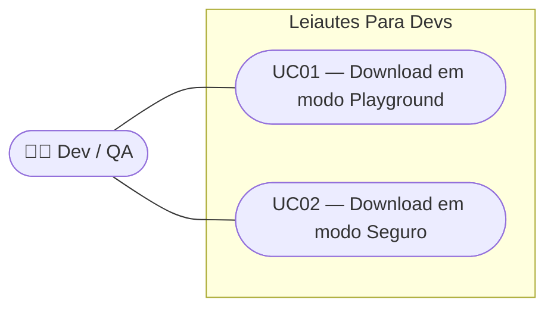

# SPEC — Baixar o arquivo gerado

## Dados da SPEC

| Campo           | Valor                                                               |
| --------------- | -------------------------------------------------------------------- |
| Número da US    | US17                                                                 |
| Slug            | `us17-baixar-o-arquivo-gerado`                                      |
| Prioridade      | P0                                                                   |
| Status          | On Ready                                                             |
| Data de criação | 2026-09-06                                                           |
| Card Trello     | https://trello.com/c/taTCOF9E/17-us17-baixar-o-arquivo-gerado       |

---

## Contexto

O visualizador de arquivo (US15) e o highlight (US16) dão ao usuário feedback visual em tempo real do arquivo sendo construído. US17 fecha esse ciclo: permite que o usuário leve o arquivo para fora do navegador, seja por download direto ou cópia para área de transferência.

O comportamento do botão de download é condicionado ao modo ativo (US10):

- Em **modo Seguro**, o arquivo só é liberado quando todos os campos do formulário são válidos — evitando que o usuário gere, por engano, um arquivo estruturalmente inválido.
- Em **modo Playground**, o download ocorre sem restrições, permitindo que QAs gerem intencionalmente arquivos com dados inválidos para testar o comportamento de sistemas receptores.

A convenção de nome/extensão segue o padrão de mercado do CNAB240: `.rem` para remessa e `.ret` para retorno. O manual FEBRABAN CNAB240 não impõe um formato de nome de arquivo — cada banco define sua convenção — mas `.rem`/`.ret` são os sufixos de facto consolidados na indústria bancária brasileira, mencionados explicitamente no PRD do projeto.

---

## Escopo

### Incluso

- Botão "Baixar arquivo" que gera download do conteúdo serializado
- Gate de validação em modo Seguro (`formRef.value.validate()` em `Cnab240Page.vue`)
- Bypass de validação em modo Playground (`getModoPlayground === true`)
- Nome sugerido ao navegador: `cnab240_remessa_YYYYMMDD.rem` / `cnab240_retorno_YYYYMMDD.ret` (fallback `.txt`)
- Encoding ISO-8859-1, terminações CRLF
- Botão "Copiar" com o mesmo gate de validação
- Toast de sucesso: *"Arquivo gerado. Bom teste ☕"*
- Toast de erro em modo Seguro com campos inválidos: *"Há campos inválidos. Corrija os erros antes de baixar."*

### Excluído

- Extensão configurável pelo usuário (`.rem`/`.ret`/`.txt` à escolha) — P1 no PRD
- Histórico de downloads ou arquivos gerados anteriormente
- Preview do arquivo antes do download (US15)
- Validação de regras bancárias específicas (dígito verificador, etc.) — US07/US08

---

## Regras de Negócio

### RN01 — Nome e extensão do arquivo

O nome sugerido ao navegador segue o padrão:

- Remessa: `cnab240_remessa_YYYYMMDD.rem`
- Retorno: `cnab240_retorno_YYYYMMDD.ret`
- Fallback (tipo indeterminado): `cnab240_YYYYMMDD.txt`

`YYYYMMDD` é a data local do dispositivo no momento do download (ex.: `20260906`). A extensão `.rem`/`.ret` é a convenção de mercado para arquivos CNAB240 no Brasil; o manual FEBRABAN não padroniza o nome de arquivo.

### RN02 — Gate de validação em modo Seguro

Quando `getModoPlayground === false`:

1. O clique em "Baixar arquivo" ou "Copiar" chama `formRef.value.validate()` em `Cnab240Page.vue`
2. Se o retorno for `false`: o download/cópia é **bloqueado**; o `q-form` exibe os erros inline nos campos; toast de aviso é exibido (RN06)
3. Se o retorno for `true`: o download/cópia prossegue normalmente

### RN03 — Bypass em modo Playground

Quando `getModoPlayground === true`, o clique em "Baixar arquivo" ou "Copiar" **não chama** `formRef.value.validate()` — o download ocorre imediatamente com o conteúdo serializado atual, independentemente do estado dos campos.

### RN04 — Encoding e terminação de linha

O arquivo gerado usa:

- **Encoding:** ISO-8859-1 (charset dos arquivos FEBRABAN)
- **Terminação de linha:** CRLF (`\r\n`) — padrão exigido pelos bancos brasileiros para CNAB240

A implementação usa `Blob` com `type: 'text/plain;charset=iso-8859-1'` e substitui `\n` por `\r\n` na string serializada antes de criar o Blob.

### RN05 — Toast de sucesso

Após download ou cópia bem-sucedidos (em qualquer modo): toast com a mensagem *"Arquivo gerado. Bom teste ☕"*, duração de 4s, canto inferior direito, borda esquerda na cor `--lpd-success`.

### RN06 — Toast de erro (modo Seguro)

Quando `validate()` retorna `false`: toast com a mensagem *"Há campos inválidos. Corrija os erros antes de baixar."*, duração de 4s, borda esquerda na cor `--lpd-error`.

### RN07 — Cópia simétrica

O botão "Copiar" aplica exatamente o mesmo gate de validação (RN02/RN03) que o download. Em caso de sucesso, usa `navigator.clipboard.writeText()` com o conteúdo bruto do arquivo (sem a conversão CRLF — o clipboard recebe LF simples) e exibe o mesmo toast de sucesso (RN05).

---

## Use Cases

### UC01 — Download em modo Playground

- **Ator:** QA
- **Precondição:** modo Playground ativo (`getModoPlayground === true`); formulário com campos obrigatórios em branco
- **Fluxo principal:**
  1. QA clica em "Baixar arquivo"
  2. Sistema verifica `getModoPlayground === true` → pula `validate()` (RN03)
  3. Sistema serializa o estado atual do formulário (`arquivoLinhas` de `useCnab240`)
  4. Sistema substitui `\n` por `\r\n` e cria `Blob` ISO-8859-1 (RN04)
  5. Sistema dispara o download com o nome `cnab240_remessa_YYYYMMDD.rem` (ou retorno) (RN01)
  6. Sistema exibe toast de sucesso *"Arquivo gerado. Bom teste ☕"* (RN05)
- **Pós-condição:** arquivo baixado; campos do formulário inalterados; nenhum erro exibido

### UC02 — Download em modo Seguro

- **Ator:** Dev
- **Precondição:** modo Seguro ativo (`getModoPlayground === false`); campo obrigatório "Número de Inscrição da Empresa" do Header de Arquivo vazio
- **Fluxo principal:**
  1. Dev clica em "Baixar arquivo"
  2. Sistema chama `formRef.value.validate()` (RN02)
  3. `validate()` retorna `false` → campo vazio é destacado com borda `--lpd-error`
  4. Sistema exibe toast de erro *"Há campos inválidos. Corrija os erros antes de baixar."* (RN06); download é bloqueado
  5. Dev preenche o campo vazio
  6. Dev clica novamente em "Baixar arquivo"
  7. Sistema chama `formRef.value.validate()` → retorna `true`
  8. Sistema serializa, cria Blob, dispara download com nome `cnab240_remessa_YYYYMMDD.rem` (RN01, RN04)
  9. Sistema exibe toast de sucesso *"Arquivo gerado. Bom teste ☕"* (RN05)
- **Pós-condição:** arquivo baixado com todos os campos válidos

---

## Critérios de Aceitação

### CA01 — Nome do arquivo (remessa)

**Dado que** o tipo de arquivo selecionado é remessa
**Quando** o download é iniciado com sucesso
**Então** o nome sugerido ao navegador é `cnab240_remessa_YYYYMMDD.rem`, onde `YYYYMMDD` é a data local do dispositivo

### CA02 — Nome do arquivo (retorno)

**Dado que** o tipo de arquivo selecionado é retorno
**Quando** o download é iniciado com sucesso
**Então** o nome sugerido ao navegador é `cnab240_retorno_YYYYMMDD.ret`

### CA03 — Bloqueio em modo Seguro com campos inválidos

**Dado que** o modo Seguro está ativo e há pelo menos um campo obrigatório vazio
**Quando** o usuário clica em "Baixar arquivo"
**Então** o download é bloqueado, os erros são exibidos inline no formulário e o toast *"Há campos inválidos. Corrija os erros antes de baixar."* é exibido

### CA04 — Liberação em modo Seguro após correção

**Dado que** o modo Seguro está ativo e todos os campos foram corrigidos
**Quando** o usuário clica em "Baixar arquivo"
**Então** o download ocorre normalmente e o toast *"Arquivo gerado. Bom teste ☕"* é exibido

### CA05 — Download sem gate em modo Playground

**Dado que** o modo Playground está ativo e há campos obrigatórios em branco
**Quando** o usuário clica em "Baixar arquivo"
**Então** o download ocorre imediatamente, sem exibir erros de validação, e o toast de sucesso é exibido

### CA06 — Encoding e CRLF

**Dado que** o download é iniciado com sucesso
**Quando** o arquivo é aberto em um editor hexadecimal
**Então** cada linha termina com os bytes `0x0D 0x0A` (CRLF) e o conteúdo está codificado em ISO-8859-1

### CA07 — Cópia com mesmo gate (modo Seguro)

**Dado que** o modo Seguro está ativo e há campos inválidos
**Quando** o usuário clica em "Copiar"
**Então** a cópia é bloqueada e o toast de erro é exibido (idêntico ao comportamento do download)

### CA08 — Toast de sucesso após cópia

**Dado que** o modo Playground está ativo (ou todos os campos são válidos em modo Seguro)
**Quando** o usuário clica em "Copiar"
**Então** o conteúdo é copiado para a área de transferência e o toast *"Arquivo gerado. Bom teste ☕"* é exibido

---

## Custo Estimado do Refinamento (06/09/2026)

> Refinado em: 06/09/2026

| Métrica                  | Valor                          |
| ------------------------- | ------------------------------- |
| Modelo                    | claude-sonnet-4-6               |
| Tokens de entrada         | ~45k                            |
| Tokens de saída           | ~4k                             |
| Custo estimado (USD)      | ~$0.20                          |
| Taxa de câmbio            | 1 USD = R$5,65 (06/09/2026)     |
| Custo estimado (BRL)      | ~R$1,13                         |
