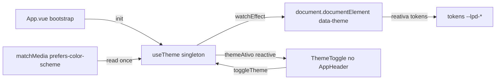

# PLAN — Alternar entre tema escuro e claro

## Resumo Técnico

A US19 entrega três peças: um composable `useTheme()` que centraliza o estado reativo do tema e a lógica de detecção/aplicação; um componente `ThemeToggle.vue` (`QBtn` ícone-only) que consome o composable e é instalado no `AppHeader` (US01); e uma regra CSS global de transição de cores no `:root` respeitando `prefers-reduced-motion`. A detecção inicial usa `window.matchMedia('(prefers-color-scheme: light)')` no bootstrap da app (`App.vue`), com fallback para dark. Não há store dedicada — o composable com `ref` em módulo compartilhado (singleton) é suficiente para o escopo de sessão sem persistência.

## Componentes Afetados

| Componente | Ação | Notas |
|---|---|---|
| `composables/useTheme.ts` | criar | Singleton reativo com `themeAtivo` e `toggleTheme()`. Aplica `data-theme` em `document.documentElement`. |
| `components/ThemeToggle.vue` | criar | `QBtn` flat round com ícone que alterna sol/lua + `q-tooltip` com easter egg contextual. |
| `components/AppHeader.vue` | modificar (US01) | Incluir `<ThemeToggle />` — já previsto na US01. |
| `App.vue` (ou boot file) | modificar | No mounted/setup, chamar `useTheme().init()` para aplicar o tema inicial baseado em `prefers-color-scheme`. |
| `css/global.css` (ou equivalente) | modificar | Adicionar regra de transição no `:root` envolvida em `@media (prefers-reduced-motion: no-preference)`. |
| `index.html` (Quasar template) | modificar | Adicionar `data-theme="dark"` como default estático no `<html>` para evitar flash antes do JS bootar. |

## Estrutura de Dados

Sem interface própria. O composable expõe apenas:

- `themeAtivo: Ref<'dark' | 'light'>` — reativo, singleton.
- `toggleTheme(): void`
- `init(): void` — chamado uma vez no bootstrap para aplicar detecção inicial.

Sem persistência, sem props no `ThemeToggle`.

## Lógica Principal

1. **Detecção inicial (RN01)** — Em `useTheme().init()`, ler `window.matchMedia('(prefers-color-scheme: light)').matches`. Se `true`, `themeAtivo.value = 'light'`; caso contrário, `'dark'`. Se `matchMedia` não existir (fallback defensivo), assumir `'dark'`.
2. **Aplicação do tema (RN02)** — Um `watchEffect` no composable observa `themeAtivo` e sincroniza `document.documentElement.setAttribute('data-theme', themeAtivo.value)`.
3. **Toggle (RN03)** — `toggleTheme()` inverte o valor: `themeAtivo.value = themeAtivo.value === 'dark' ? 'light' : 'dark'`. O `watchEffect` acima cuida do `data-theme`.
4. **Ícone dinâmico (RN03)** — No template do `ThemeToggle`, `icon` é uma `computed` que retorna `'mdi-weather-sunny'` no dark e `'mdi-weather-night'` no light.
5. **Tooltip contextual (RN04)** — Texto do `q-tooltip` também é `computed`:
   - `dark` → `"Erick diz que o dark mode é melhor. Clique aqui para discordar."`
   - `light` → `"Volte para o modo escuro, por insistência do Erick."`
6. **`aria-label` neutro dinâmico** — Também computed: `"Alternar para tema claro"` no dark, `"Alternar para tema escuro"` no light.
7. **Sem persistência (RN05)** — Nenhum acesso a `localStorage`/`sessionStorage`. O singleton do composable é recriado a cada refresh.
8. **Transição CSS (RN06)** — Regra em CSS global:
   - Alvo: `:root` e/ou `body`.
   - Propriedades: `background-color`, `color`, `border-color`.
   - Duração: `200ms`, easing `ease`.
   - Envolvida em `@media (prefers-reduced-motion: no-preference)`.
9. **Anti-flash inicial** — Default estático `data-theme="dark"` no `<html>` do `index.html`. Assim, antes do JS rodar, a página já renderiza no tema escuro (o mais provável). Se o SO estiver em light, o JS ajusta no `init()` — pode gerar um pequeno flash em usuários light, aceitável no MVP (não há SSR).

## Composables / Serviços

- `useTheme()` — Composable singleton (módulo com `ref` fora da função exportada) que expõe `themeAtivo`, `toggleTheme()` e `init()`. Fonte da verdade única do tema durante a sessão.

## Eventos e Props (componentes novos)

### `components/ThemeToggle.vue`
- Sem props.
- Sem emits.
- Sem slots.

## Fluxo de Dados

## Dependências Externas

- **Quasar** (`q-btn`, `q-tooltip`) — já parte do stack.
- **@quasar/extras** (Material Design Icons: `mdi-weather-sunny`, `mdi-weather-night`) — já incluído para outros ícones (`mdi-lock`, `mdi-github`).

## Testes

### Unitários
- `useTheme.init()`: com `matchMedia` retornando `matches: true` para light, define `themeAtivo = 'light'`.
- `useTheme.init()`: com `matchMedia` retornando `matches: false`, define `themeAtivo = 'dark'`.
- `useTheme.init()`: sem `matchMedia` (mockado como `undefined`), fallback para `dark`.
- `useTheme.toggleTheme()`: alterna entre `dark` e `light` em chamadas consecutivas.
- `useTheme` (watchEffect): mudanças em `themeAtivo` refletem em `document.documentElement.getAttribute('data-theme')`.
- `ThemeToggle`: renderiza `mdi-weather-sunny` no dark e `mdi-weather-night` no light.
- `ThemeToggle`: click chama `toggleTheme` do composable (mock).
- `ThemeToggle`: `q-tooltip` tem texto dinâmico coerente com o tema.
- `ThemeToggle`: `aria-label` do botão é dinâmico e neutro.

### Integração
- `AppHeader` renderiza `ThemeToggle` visível em todas as rotas.
- Alternar tema na landing (`/`) e navegar para `/cnab-240`: `data-theme` continua `light` após a navegação (preservação em sessão).
- Refresh (F5) após alternar: `data-theme` volta ao valor da RN01 (não persiste).
- Auditoria de contraste (axe/pa11y) em dark e light no header, formulário, badge, footer.

### E2E (se aplicável)
- Detecção via `prefers-color-scheme`: emular light no browser e abrir `/` → tema inicia em light.
- Fluxo do easter egg: hover no toggle em desktop → tooltip com texto do Erick correto para cada estado.
- `prefers-reduced-motion: reduce`: emular preferência e alternar tema → verificar ausência de transição visual (visualmente ou via `getComputedStyle`).

## Riscos e Decisões em Aberto

| Risco / Dúvida | Impacto | Mitigação |
|---|---|---|
| Flash de tema errado ao carregar em usuários com SO em light (default estático é dark). | Baixo | Aceito no MVP (sem SSR/pre-render). Alternativa: inline script no `<head>` que aplica `data-theme` antes do CSS carregar. Follow-up se relatado. |
| AC original da US19 dizia "tema padrão é escuro"; nova regra respeita SO. | Baixo | Nota adicionada na US19 e na SPEC apontando a evolução. |
| Toggle no `AppHeader` já apertado em mobile por conta do `PrivacyBadge` (US20). | Médio | Delegado ao ajuste responsivo do `AppHeader` (US01 + US20). O `ThemeToggle` é ícone-only, ocupa pouco espaço. |
| `q-tooltip` do Quasar pode não desabilitar animação automaticamente com `prefers-reduced-motion`. | Baixo | Verificar props do `q-tooltip` (`transition-show`/`transition-hide`); se necessário, sobrescrever via CSS. |
| Escuta em tempo real de mudança do `prefers-color-scheme` no SO durante a sessão. | Baixo | Fora do escopo (RN01). Se relatado como pain point, adicionar `matchMedia.addEventListener` como follow-up. |

## Ordem de Implementação Sugerida

1. **Composable `useTheme`** — Criar com detecção via `matchMedia`, singleton reativo e `watchEffect` aplicando `data-theme`; unit tests.
2. **Bootstrap** — Chamar `useTheme().init()` no `setup()` do `App.vue` (ou boot file do Quasar).
3. **Default estático no HTML** — Adicionar `data-theme="dark"` no `<html>` do template `index.html`.
4. **Regra CSS de transição** — Adicionar `@media (prefers-reduced-motion: no-preference)` com transição de cores no `:root`.
5. **ThemeToggle** — Criar `QBtn` com ícone dinâmico + `q-tooltip` contextual + `aria-label` dinâmico; unit tests.
6. **Integração no AppHeader** — Adicionar `<ThemeToggle />` no `AppHeader.vue` (US01).
7. **Testes de integração e E2E** — CA02, CA03, CA05, CA06, CA07, CA09; auditoria de contraste em ambos os temas.
