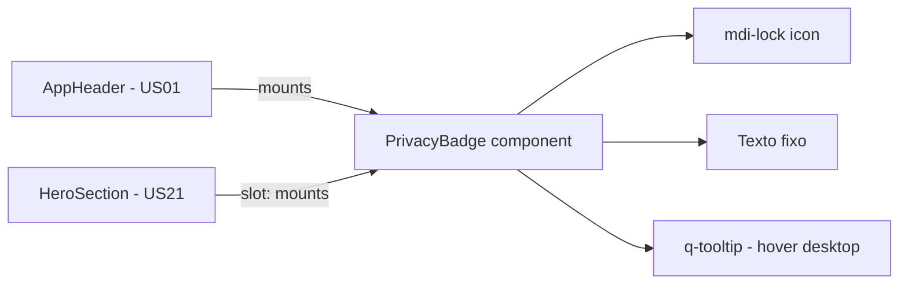

# PLAN — Confirmação visual de privacidade dos dados

## Resumo Técnico

Um único componente `PrivacyBadge.vue` implementa toda a US: ícone `mdi-lock` + texto fixo + `q-tooltip` de reforço no hover (desktop apenas). É montado em dois pontos previstos por US anteriores: dentro do `AppHeader` (US01) e dentro do slot do `HeroSection` (US21). Não há estado reativo, não há props próprias e não há dependências novas — qualquer ajuste de tamanho do tooltip usa o atributo `size` nativo do `QTooltip`. Uma nota no `README.md` documenta a garantia arquitetural de zero requisições com dados do usuário, sem implementar CSP ou testes E2E nesta US.

## Componentes Afetados

| Componente | Ação | Notas |
|---|---|---|
| `components/PrivacyBadge.vue` | criar | Componente único desta US: ícone + texto + tooltip. |
| `components/AppHeader.vue` | modificar (US01) | Incluir `<PrivacyBadge />` — já previsto no PLAN da US01. |
| `components/landing/HeroSection.vue` | modificar (US21) | Passar `<PrivacyBadge />` no slot default — já previsto no PLAN da US21. |
| `README.md` | modificar | Adicionar seção "Privacidade" explicando a garantia arquitetural e a disciplina de código (sem tracking com payload do usuário). |

## Estrutura de Dados

Sem estado interno, sem emits, sem props próprias. A diferença visual entre uso no header e no hero (tooltip maior ou menor) é obtida via o atributo `size` do próprio `QTooltip` no template, não via prop customizada do `PrivacyBadge`.

## Lógica Principal

1. **Renderização estática (RN01, RN02, RN05)** — O componente renderiza um `
` com o ícone `mdi-lock` (`aria-hidden="true"`) e o texto fixo `"Seus dados nunca saem do seu navegador"`. Não é `<button>` nem `<a>`; sem `tabindex`.
2. **Tooltip no hover (RN04)** — Envolve o conteúdo com `<q-tooltip>` do Quasar, com texto `"Nenhum dado sai do seu navegador; só cuidado com o acesso do estagiário."`. Delay de 300ms para abertura.
3. **Variante de tamanho do tooltip** — Sem prop customizada no `PrivacyBadge`. O atributo `size` nativo do `QTooltip` é usado diretamente no template do componente (ou ajustado por contexto, se necessário). Sem lógica JS.
4. **Tema** — Usa tokens `--lpd-*` no CSS scoped; sem lógica de detecção de tema (o mecanismo global da US19 já reaplica os tokens ao alternar `data-theme`).
5. **Prefers-reduced-motion** — Envolver a animação de fade-in do `q-tooltip` em `@media (prefers-reduced-motion: no-preference)` ou usar prop equivalente do `q-tooltip` se disponível.
6. **Integração no AppHeader** — Dentro do `AppHeader.vue` (US01), adicionar `<PrivacyBadge />` ao lado dos demais elementos (logo, `LeiauteSelector`, botão "Ver arquivo", toggle de tema). Posição sugerida: entre `LeiauteSelector` e as ações à direita.
7. **Integração no HeroSection** — Dentro do slot default do `HeroSection.vue` (US21), `LandingPage.vue` passa `<PrivacyBadge />` abaixo da tagline. Sem prop de tamanho — se o hero exigir peso visual maior, ajustar via CSS do contexto (parent scope) ou via o `size` do `QTooltip` interno.
8. **Responsividade do AppHeader (RN06)** — Em mobile, o `AppHeader` reorganiza seus filhos (chips + toggle + badge) em duas linhas ou distribui espaço com `flex-wrap`. Este ajuste é do `AppHeader`, não do `PrivacyBadge` em si.
9. **README (RN08)** — Adicionar seção "Privacidade" com 2–3 parágrafos: (a) o produto não tem backend; (b) nenhuma requisição de rede transporta dados dos formulários; (c) contribuidores devem revisar PRs para não introduzir libs de tracking com payload.

## Composables / Serviços

Nenhum. O componente é estático.

## Eventos e Props (componentes novos)

### `components/PrivacyBadge.vue`
- Sem props.
- Sem emits.
- Sem slots.

## Fluxo de Dados

Sem fluxo de dados dinâmico. O componente é folha, sem entradas ou saídas reativas.

## Dependências Externas

- **Quasar** (`q-icon`, `q-tooltip`) — já parte do stack; nenhuma nova.
- **@quasar/extras** — para `mdi-lock`. Já previsto na US21 (usado no ícone `mdi-github` do footer). Se ainda não configurado, incluir MDI no `quasar.config`.

## Testes

### Unitários
- `PrivacyBadge`: renderiza o texto exato `"Seus dados nunca saem do seu navegador"`.
- `PrivacyBadge`: renderiza o `q-icon` com `name="mdi-lock"` e `aria-hidden="true"`.
- `PrivacyBadge`: não é focável (sem `tabindex`) e não é `<button>`/`<a>`.
- `PrivacyBadge`: `q-tooltip` presente com o texto de reforço e o atributo `size` configurado.

### Integração
- `AppHeader` renderiza `PrivacyBadge` visível em `/`, `/cnab-240`, `/rcb-001`, `/cnab-400`.
- `HeroSection` renderiza `PrivacyBadge` no slot default quando montado dentro da `LandingPage`.
- Contraste do texto do badge validado por ferramenta automática (axe/pa11y) em ambos os temas.

### E2E (se aplicável)
- Fluxo: abrir `/` → badge visível no header e no hero → navegar para `/cnab-240` → badge continua visível no header → preencher formulário e rolar → badge persiste no topo.
- Hover no badge em desktop dispara tooltip com texto de reforço; sem tooltip em viewport mobile emulado (touch).

## Riscos e Decisões em Aberto

| Risco / Dúvida | Impacto | Mitigação |
|---|---|---|
| AC "Nenhuma requisição de rede com dados do usuário" não tem verificação automatizada nesta US. | Médio | Documentar no README; abrir issue de follow-up para adicionar teste E2E de auditoria de rede quando o produto tiver formulário funcional (pós US02+). |
| Netlify Analytics (previsto no PRD) pode ser confundido com "tracking" pelo usuário atento. | Baixo | O tooltip atual não aborda analytics explicitamente (usa tom bem-humorado); esclarecimento formal fica no README, explicando que Netlify Analytics é server-side, sem cookies e sem payload de formulários. |
| `AppHeader` já apertado em mobile pode ficar visualmente pesado ao acomodar texto completo do badge. | Médio | O ajuste responsivo é responsabilidade do `AppHeader` (US01). Se necessário, redistribuir chips ou permitir wrap em duas linhas. Iterar após ver na tela. |
| `q-tooltip` do Quasar tem animação default que pode conflitar com `prefers-reduced-motion`. | Baixo | Verificar props/config do `q-tooltip` para desabilitar animação; se necessário, cobrir com CSS media query. |
| Cores exatas do badge sobre `--lpd-surface-2` no tema claro podem não bater o contraste 4.5:1. | Baixo | Validar par no design system antes de fechar; se falhar, cair para `--lpd-text` (mais escuro) em vez de `--lpd-text-muted`. |

## Ordem de Implementação Sugerida

1. **PrivacyBadge base** — Criar `components/PrivacyBadge.vue` com ícone + texto + `q-tooltip` (com atributo `size`); sem props próprias; unit tests.
2. **Integração no AppHeader** — Adicionar `<PrivacyBadge />` no `AppHeader.vue` (US01); ajustar layout responsivo do header para acomodar em mobile.
3. **Integração no HeroSection** — Em `LandingPage.vue` (US21), passar `<PrivacyBadge />` no slot do `HeroSection`.
4. **Contraste em ambos os temas** — Rodar auditoria (axe/pa11y) em `/` e `/cnab-240`, dark e light; ajustar tokens se necessário.
5. **README** — Adicionar seção "Privacidade" documentando a garantia arquitetural e a diretriz de code review.
6. **Testes E2E** — CA01, CA02, CA04, CA05, CA07 (persistência, tooltip, mobile completo).
