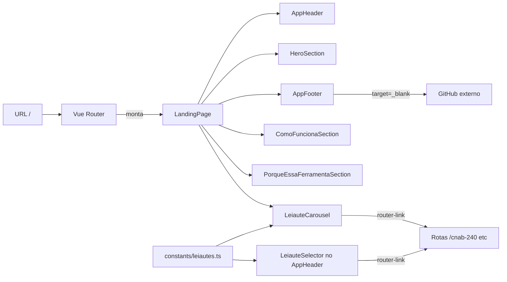

# PLAN — Landing page de entrada na ferramenta

## Resumo Técnico

A landing é uma nova página Vue (`LandingPage.vue`) montada na rota `/`, composta por seções verticais em container fluido. Reaproveita o `AppHeader` da US01 sem alterações — o mesmo componente é montado em landing e app. A visibilidade condicional do botão "Ver arquivo" (que só faz sentido nas rotas do App) é responsabilidade da US15, que implementa o botão. As três seções principais (hero, "Como funciona", "Por que essa ferramenta") são componentes próprios para permitir evolução independente. O carrossel de leiautes usa `q-carousel` do Quasar em mobile e degrada para grid estático em desktop, alimentado pela mesma lista estática de leiautes que o `LeiauteSelector` (US01) — extraída para um módulo compartilhado. O footer e o link do GitHub são componentes leves, sem dependências novas.

## Componentes Afetados

| Componente | Ação | Notas |
|---|---|---|
| `router/routes.ts` | modificar | Adicionar rota `/` → `LandingPage`. Mantém `/cnab-240`, `/rcb-001`, `/cnab-400` da US01. |
| `pages/LandingPage.vue` | criar | Página raiz; monta header + seções + footer em coluna única fluida. |
| `components/landing/HeroSection.vue` | criar | Hero com título (`<h1>`), tagline e badge de privacidade (US20). |
| `components/landing/LeiauteCarousel.vue` | criar | Carrossel/grid de cards de leiautes; consome `leiautes.ts`. |
| `components/landing/LeiauteCard.vue` | criar | Card individual: label, badge "em breve" (se aplicável), CTA "Abrir X". |
| `components/landing/ComoFuncionaSection.vue` | criar | 3 passos com ícone + título + descrição curta. |
| `components/landing/PorqueEssaFerramentaSection.vue` | criar | 3 diferenciais com ícone + título + descrição curta. |
| `components/AppFooter.vue` | criar | Footer com link do GitHub e crédito ao autor. |
| `components/AppHeader.vue` | reutilizar (sem alterações) | Componente da US01 é montado tal qual na landing. Ocultar o botão "Ver arquivo" fora das rotas do App é responsabilidade da US15. |
| `constants/leiautes.ts` | criar (ou extrair) | Lista estática compartilhada `LeiauteLink[]` usada por `LeiauteSelector` (US01) e `LeiauteCarousel`. |
| `MainLayout.vue` | modificar | Já usa `<router-view />`; sem mudanças estruturais além de garantir compatibilidade com landing. |

## Estrutura de Dados

```ts
// constants/leiautes.ts (extraído do LeiauteSelector da US01)
type LeiauteId = 'CNAB240' | 'RCB001' | 'CNAB400';

interface LeiauteLink {
  id: LeiauteId;
  label: string;         // "CNAB240", "RCB001", "CNAB400"
  path: string;           // "/cnab-240", "/rcb-001", "/cnab-400"
  disponivel: boolean;   // true apenas para CNAB240
  badge?: string;         // "em breve" quando disponivel === false
  descricao?: string;     // texto curto para o card do carrossel (não usado no chip do header)
}

```

As seções `ComoFuncionaSection` e `PorqueEssaFerramentaSection` têm 3 itens hard-coded cada (ícone + título + descrição), sem interfaces reutilizáveis.

## Lógica Principal

1. **Registro da rota (RN01)** — `router/routes.ts` adiciona `{ path: '/', component: LandingPage, name: 'landing' }` como primeira entrada da lista.
2. **Extração da lista de leiautes** — Mover a lista `LeiauteLink[]` que hoje vive dentro de `LeiauteSelector` (US01) para `constants/leiautes.ts`. `LeiauteSelector` e `LeiauteCarousel` consomem a mesma fonte, evitando divergência.
3. **AppHeader reutilizado sem alterações (RN02)** — O `AppHeader` da US01 é montado tal qual na landing. O `LeiauteSelector` funciona como navegação em ambos os contextos (RN03). O link do GitHub, se adicionado ao AppHeader, aparece nas duas rotas — decisão pode ser mantê-lo apenas no `AppFooter` para evitar mexer no AppHeader. A visibilidade do botão "Ver arquivo" fora das rotas do App é responsabilidade da US15 (que implementa o botão).
4. **LandingPage composição (RN05)** — Empilha os componentes na ordem: `AppHeader` → `HeroSection` → `LeiauteCarousel` → `ComoFuncionaSection` → `PorqueEssaFerramentaSection` → `AppFooter`.
5. **HeroSection** — `<h1>` com "Leiautes Para Devs" em Space Grotesk; tagline em Inter; slot para badge de privacidade (US20) sob a tagline.
6. **LeiauteCarousel (RN04)** — Em mobile (`$q.screen.lt.md`), usa `q-carousel` swipeable; em desktop, usa grid CSS (`display: grid; grid-template-columns: repeat(3, 1fr)`). Renderiza um `LeiauteCard` por leiaute.
7. **LeiauteCard** — Se `disponivel`, é um `<router-link :to="link.path">` com CTA "Abrir {label}"; se não, é um `<div>` com `aria-disabled="true"` e badge "em breve" em `--lpd-warning`.
8. **Acima da dobra em mobile (RN06)** — Usar `min-height: 100vh` no wrapper do hero+carrossel apenas em mobile, com `display: flex; flex-direction: column; justify-content: flex-start` para garantir que o topo do carrossel apareça. Testar em 360×640.
9. **AppFooter** — Layout flex com crédito à esquerda ("Feito por Pedro Ratto") e link GitHub à direita (ícone `mdi-github` + `aria-label`), com `target="_blank" rel="noopener noreferrer"`.
10. **Continuidade do tema (RN08)** — Já garantida pelo mecanismo global de tema da US19 (atributo `data-theme` em `:root`); nenhuma lógica adicional necessária na landing.
11. **Prefers-reduced-motion** — Nas transições do carrossel e nos hovers dos cards, envolver as regras CSS em `@media (prefers-reduced-motion: no-preference) { … }`.

## Composables / Serviços

Nenhum composable dedicado. Se surgir necessidade de detectar tamanho de viewport para o toggle carrossel/grid, usar `$q.screen` do Quasar (já disponível).

## Eventos e Props (componentes novos)

### `pages/LandingPage.vue`
- Sem props (é uma rota).
- Sem emits.

### `components/landing/HeroSection.vue`
- Sem props.
- Slot default para conteúdo adicional (opcional, ex: badge de privacidade).

### `components/landing/LeiauteCarousel.vue`
- Sem props (consome `constants/leiautes.ts` diretamente).
- Sem emits.

### `components/landing/LeiauteCard.vue`
- Props:
  - `link: LeiauteLink` — dados do leiaute.
- Sem emits (navegação via `router-link` interno).

### `components/landing/ComoFuncionaSection.vue`
- Sem props (passos hard-coded).

### `components/landing/PorqueEssaFerramentaSection.vue`
- Sem props (diferenciais hard-coded).

### `components/AppFooter.vue`
- Props opcionais:
  - `githubUrl?: string` — default a definir (URL do repo).
  - `autor?: string` — default `'Pedro Ratto'`.

## Fluxo de Dados



## Dependências Externas

- **Quasar** (`q-carousel`, `q-icon`, `q-btn`) — já parte do stack; nenhuma nova.
- **Ícones** — `@quasar/extras` (Material Design Icons ou similar) para `mdi-github` e ícones das seções "Como funciona"/"Por que essa ferramenta". Se ainda não configurado no Quasar setup, incluir.

## Testes

### Unitários
- `LeiauteCard`: com `disponivel: true` renderiza `router-link` para `link.path` e CTA "Abrir {label}"; com `disponivel: false` renderiza `<div aria-disabled="true">` com badge "em breve" e sem link navegável.
- `LeiauteCarousel`: renderiza 3 cards a partir de `leiautes.ts` (mock).
- `HeroSection`: renderiza `<h1>` único com o nome do produto e a tagline definida.
- `AppFooter`: link do GitHub tem `target="_blank"`, `rel="noopener noreferrer"` e `aria-label` descritivo.

### Integração
- Entrar em `/`: `LandingPage` monta com todas as 5 seções + header + footer na ordem correta.
- Click no CTA "Abrir CNAB240" (card): navega para `/cnab-240` e monta o `AppPage`.
- Click no chip `CNAB240` (header): navega para `/cnab-240`.
- Click em RCB001/CNAB400 (card ou chip): permanece em `/`.
- Alternar tema na landing e navegar para `/cnab-240`: tema permanece aplicado.
- Voltar de `/cnab-240` para `/` (via logo/nome do produto): landing carrega e o tema persiste.

### E2E (se aplicável)
- Fluxo completo: abrir `/` → verificar hero + carrossel acima da dobra em desktop e mobile (viewports 1280×800 e 360×640) → rolar até o footer → clicar no CTA → aterrissar em `/cnab-240` com CNAB240 ativo (integra US01 CA01).
- Navegação por teclado: Tab passa por chip CNAB240 (header) → toggle de tema → link GitHub (header) → CTA "Abrir CNAB240" (card) → link GitHub (footer). Elementos desabilitados são pulados.
- Verificar aba Network: nenhuma requisição com payload de dados durante interações.

## Riscos e Decisões em Aberto

| Risco / Dúvida | Impacto | Mitigação |
|---|---|---|
| URL do repositório GitHub ainda não existe (projeto em design phase). | Baixo | Deixar a URL como constante configurável em `AppFooter` (prop default `''`); ocultar o link se vazio. Preencher quando o repo for criado. |
| `q-carousel` do Quasar pode adicionar peso desnecessário para o caso simples de 3 cards. | Médio | Se peso do bundle for problema, substituir por grid CSS puro + swipe manual (`overflow-x: auto; scroll-snap-type: x mandatory`) em mobile. Decidir no PR. |
| A landing precisa ser SSR/pre-renderizada para SEO e para funcionar sem JS. | Médio | Quasar suporta SSG (`quasar build -m ssr` ou pre-render). Fora do escopo desta US; documentar como follow-up se SEO virar meta. |
| Ícones dos passos "Como funciona" e diferenciais ainda não escolhidos. | Baixo | Deixar placeholders com ícones genéricos (`mdi-format-list-checks`, `mdi-eye-outline`, `mdi-download`); design pode ajustar. |
| Layout do carrossel em desktop com apenas 1 leiaute funcional pode parecer vazio. | Baixo | Em desktop, os 3 cards ficam lado a lado (RCB001 e CNAB400 desabilitados) — comunica roadmap, não parece vazio. |
| Copy da tagline e dos passos ainda não validada com o autor. | Médio | Usar copy sugerida na SPEC como default; iterar após review visual da landing rodando. |

## Ordem de Implementação Sugerida

1. **Extrair `constants/leiautes.ts`** — Mover a lista de dentro do `LeiauteSelector` (US01) para o módulo compartilhado; ajustar import; garantir que testes da US01 continuam verdes.
2. **Router** — Adicionar rota `/` → `LandingPage` (stub vazio inicialmente); smoke test de navegação.
3. **AppFooter** — Componente com link GitHub e crédito; unit test dos atributos do link.
4. **HeroSection** — Título + tagline + slot; unit test.
5. **LeiauteCard** — Card ativo (router-link) e desabilitado (div); unit tests.
6. **LeiauteCarousel** — Grid em desktop + `q-carousel` em mobile; integração com `leiautes.ts`.
7. **ComoFuncionaSection** e **PorqueEssaFerramentaSection** — Layout com 3 itens hard-coded; snapshot tests.
8. **LandingPage** — Composição de todos os componentes na ordem; integração com router; badge de privacidade (US20) inserido no slot do hero.
9. **Testes de integração e E2E** — CA01–CA11.
10. **Ajustes de responsividade** — Verificar acima da dobra em 360×640 e 1280×800; ajustar paddings e alturas.
