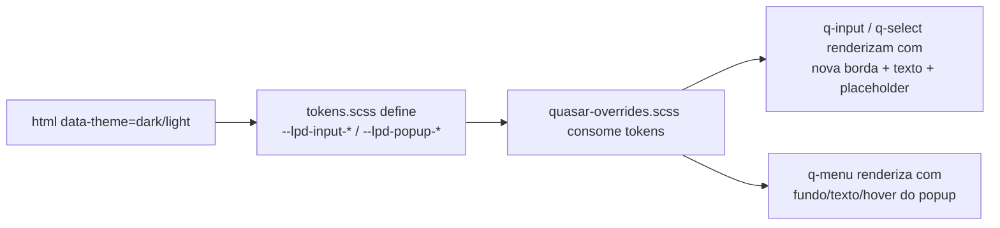

# PLAN — Corrigir contraste dos inputs e selects no tema escuro

## Resumo Técnico

A correção é puramente CSS: estende o arquivo de tokens (`src/css/tokens.scss`) com novos tokens semânticos `--lpd-input-*` e `--lpd-popup-*` mapeados nos dois temas, e adiciona um arquivo de override do Quasar (ou seção em `app.scss`) que aplica esses tokens sobre as classes internas do `q-field` e do `q-menu`. Nenhum componente `.vue` é alterado. A abordagem é global — todos os `q-input`/`q-select` do app herdam o novo visual sem tocar nos cards individuais.

## Componentes Afetados

| Componente                                     | Ação      | Notas                                                                                              |
| ---------------------------------------------- | --------- | -------------------------------------------------------------------------------------------------- |
| `src/css/tokens.scss`                          | modificar | Adicionar novos tokens `--lpd-input-*` e `--lpd-popup-*` nos blocos `[data-theme="dark"]` e `[data-theme="light"]` |
| `src/css/quasar-overrides.scss` **(novo)**     | criar     | CSS global de override para `q-field`, `q-input`, `q-select` e `q-menu` (popup de select)          |
| `src/css/app.scss` (ou arquivo raiz de estilos) | modificar | Importar `quasar-overrides.scss` para garantir carregamento global                                 |
| `HeaderArquivoCard.vue`                        | inalterado | Herda automaticamente via CSS global                                                              |
| `HeaderLoteCard.vue` (dentro de `LoteCard.vue`) | inalterado | Herda automaticamente                                                                             |
| `SegmentoACard.vue`                            | inalterado | Herda automaticamente                                                                             |
| `TrailerLoteCard.vue`                          | inalterado | Herda automaticamente                                                                             |
| `TrailerArquivoCard.vue`                       | inalterado | Herda automaticamente                                                                             |

## Estrutura de Dados

Nenhuma nova estrutura reativa. A US é 100% cosmética. Novos tokens CSS a serem introduzidos:

```scss
// Novos tokens (adicionados em src/css/tokens.scss)

:root[data-theme='dark'] {
  --lpd-input-border: #f5e9d6; // Crema — RN01
  --lpd-input-text: #f5e9d6; // Crema — RN02
  --lpd-input-placeholder: #b6a28c; // Leite Vaporizado — RN03
  --lpd-popup-bg: #b6a28c; // Leite Vaporizado — RN05
  --lpd-popup-text: #1f1813; // Espresso — RN05
  --lpd-popup-item-hover-bg: #a08d78; // Leite Vaporizado escurecido — RN05
}

:root[data-theme='light'] {
  --lpd-input-border: #e4d8c6; // = --lpd-border atual (preserva visual)
  --lpd-input-text: #2b1d14; // = --lpd-text atual
  --lpd-input-placeholder: #6e5b47; // = --lpd-text-muted atual
  --lpd-popup-bg: #ffffff; // = --lpd-surface atual
  --lpd-popup-text: #2b1d14; // = --lpd-text atual
  --lpd-popup-item-hover-bg: #f4ecdf; // = --lpd-surface-2 atual
}
```

## Lógica Principal

1. **Definir tokens novos** (RN06) — Estender `tokens.scss` sem remover ou renomear tokens existentes. Ambos os temas recebem os mesmos nomes de tokens, apontando para valores distintos.
2. **Override de borda idle** (RN01) — Aplicar `border-color: var(--lpd-input-border)` na classe interna do `q-field` que representa a borda em estado idle (Quasar usa `.q-field__control` com pseudo-elemento `::before`).
3. **Preservar overrides de estado** (RN04) — Garantir que os seletores para `focus` (`.q-field--focused`) e `error` (`.q-field--error`) tenham especificidade suficiente para sobrescrever a nova borda Crema. Não introduzir `!important` a menos que estritamente necessário.
4. **Override de cor de texto e placeholder** (RN02, RN03) — Aplicar `color: var(--lpd-input-text)` no elemento nativo `<input>` / `<textarea>` dentro do `q-field`. Para placeholder, usar `::placeholder` com `color: var(--lpd-input-placeholder)` e `opacity: 1` (Firefox aplica opacity padrão).
5. **Override do popup do q-select** (RN05) — Estilizar `.q-menu` (ou seletor mais específico como `.q-menu .q-item`) com `background-color: var(--lpd-popup-bg)` e `color: var(--lpd-popup-text)`. Escopar via seletor de atributo `[data-theme="dark"]` no elemento raiz **ou** confiar no cascade dos tokens (já que light aponta para valores atuais equivalentes, um único bloco de CSS funciona para os dois temas).
6. **Hover e selecionado nas opções** (RN05, RN06 questão 6) — `.q-item.q-hover--focused` ou `.q-item:hover` recebe `background-color: var(--lpd-popup-item-hover-bg)`. Item com `q-item--active` recebe o mesmo fundo escurecido + `border-left: 3px solid var(--lpd-accent)`. Ajustar `padding-left` do item para compensar a borda de 3px e evitar shift de layout.
7. **Validar contraste** (RN07) — Após implementação, rodar checagem com axe-core ou Chrome DevTools Lighthouse; se algum par falhar, ajustar o token específico (ex.: escurecer mais o `--lpd-popup-item-hover-bg` ou clarear o `--lpd-input-placeholder`).
8. **Tema claro intocado** (RN08 / CA10) — Como os tokens novos no tema claro apontam para os valores atuais, o visual do tema claro é matematicamente idêntico ao anterior. Nenhuma regra `[data-theme="light"]` extra é necessária.

## Composables / Serviços

Nenhum. A US é puramente estilística.

## Eventos e Props (se componente novo)

Não se aplica — nenhum componente novo.

## Fluxo de Dados

Não há mudança no fluxo de dados. O único fluxo é o cascade CSS:



## Dependências Externas

Nenhuma. Não é necessário instalar pacotes novos.

## Testes

### Unitários

Não aplicável — mudança 100% CSS, sem lógica testável em unidade.

### Integração

- **Snapshot visual** dos cards principais (`HeaderArquivoCard`, `SegmentoACard`, `TrailerArquivoCard`) em ambos os temas via Vitest + `@vue/test-utils` — opcional; snapshot só faz sentido se o projeto já usa snapshot testing.
- **Teste de token disponibilidade:** um teste que renderiza um `q-input` dentro de um wrapper com `data-theme="dark"` e verifica via `getComputedStyle` que `border-color` corresponde ao valor esperado (`#f5e9d6`). Idem para `data-theme="light"` mantendo o valor original.

### E2E (Playwright)

- **US22-E2E-01:** No dark mode, abrir a tela do App, focar em um `q-input` do `HeaderArquivoCard`, tirar screenshot. Verificar visualmente (ou via toMatchSnapshot) que a borda ficou âmbar (focus) e não Crema.
- **US22-E2E-02:** No dark mode, sem foco, tirar screenshot do card. Confirmar via snapshot que a borda está Crema e o texto/placeholder visíveis.
- **US22-E2E-03:** No dark mode, abrir o `q-select` de "Tipo de Serviço" (ou equivalente), tirar screenshot do popup aberto. Confirmar que o fundo é Leite Vaporizado e o texto Espresso.
- **US22-E2E-04:** No dark mode, hover sobre uma opção do popup, verificar que fundo escureceu.
- **US22-E2E-05:** No dark mode, com uma opção previamente selecionada, abrir o popup e confirmar borda esquerda âmbar de 3px no item selecionado.
- **US22-E2E-06:** Alternar para light mode e comparar snapshot do formulário e do popup com o baseline anterior à US22 (idealmente snapshot já existente da US19). Deve ser byte-idêntico.
- **US22-E2E-07 (a11y):** Rodar axe-core no dark mode e confirmar que não há novos violations de contraste após a mudança.

## Riscos e Decisões em Aberto

| Risco / Dúvida                                                                                              | Impacto | Mitigação                                                                                                    |
| ----------------------------------------------------------------------------------------------------------- | ------- | ------------------------------------------------------------------------------------------------------------ |
| Quasar usa pseudo-elementos e classes internas que podem mudar entre versões (`.q-field__control::before`)   | Médio   | Documentar a versão do Quasar usada e validar seletores manualmente após qualquer upgrade                    |
| Especificidade CSS: pode ser necessário `!important` para vencer estilos padrão do Quasar                    | Baixo   | Testar primeiro sem `!important`; adicionar apenas onde comprovadamente necessário, com comentário justificando |
| Contraste do placeholder Leite Vaporizado (#B6A28C) sobre card Espresso (#1F1813) pode ficar < 3:1           | Médio   | Validar com contrast checker antes do merge; se falhar, clarear o token para algo como `#C9B69A`             |
| `q-select` com `use-input` (autocomplete) pode ter comportamentos visuais adicionais não cobertos            | Baixo   | Se identificado no projeto, incluir no teste E2E; caso contrário, tratar em US futura                        |
| Componentes futuros que estendam `q-field` (custom) podem sobrescrever a borda                               | Baixo   | Confiar em cascata; se problema aparecer, criar mixin SCSS que a US futura possa importar                    |
| Cor Crema como borda pode competir visualmente com texto Crema (visualmente unido)                          | Baixo   | Validar visualmente; se necessário, dessaturar levemente a borda (ex.: `rgba(245, 233, 214, 0.75)`)          |
| `--lpd-popup-item-hover-bg` (#A08D78) escolhido sem validação de contraste ainda                            | Baixo   | Calibrar durante implementação; usar contrast checker com Espresso                                            |
| Toggle de tema animado (US19) pode causar flash momentâneo dos novos tokens                                  | Baixo   | Confiar na transição já aplicada em `tokens.scss` (linhas 68–75)                                             |

## Ordem de Implementação Sugerida

1. **Adicionar tokens novos em `tokens.scss`** — bloco `[data-theme="dark"]` e `[data-theme="light"]`. Commit isolado; nenhum efeito visual ainda (tokens não consumidos).
2. **Criar `src/css/quasar-overrides.scss`** com override de borda idle + texto + placeholder para `q-input` e `q-select`. Importar em `app.scss`. Validar visualmente no dark mode.
3. **Adicionar override do popup `.q-menu`** — fundo, texto, hover, item selecionado (borda esquerda âmbar + ajuste de padding). Validar visualmente com um `q-select` real.
4. **Validar contraste com axe-core / Lighthouse** — ajustar valores hexadecimais se necessário. Documentar valores finais no comentário do token.
5. **Escrever testes E2E** (US22-E2E-01 a 07). Rodar suíte inteira para garantir que nenhum teste anterior quebrou.
6. **Comparar visualmente o tema claro** com screenshots pré-US22 (US19 já tem baseline) — confirmar que está inalterado.
7. **Dev report + QA report** conforme workflow do projeto.
