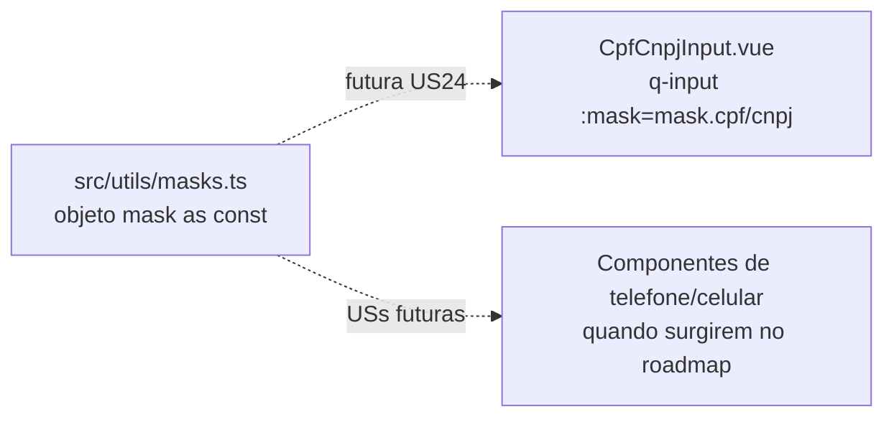

# PLAN — Aplicar máscaras de formatação nos inputs do formulário

## Resumo Técnico

Criar um novo módulo utilitário `src/utils/masks.ts` que exporta um único objeto `mask` (tipado `as const`) contendo os padrões de máscara para CPF, CNPJ (alfanumérico), telefone fixo e celular no formato de tokens do Quasar. O módulo é puramente declarativo — não há helpers, não há componentes envolvidos e nenhum arquivo `.vue` do formulário é tocado. A entrega inclui apenas o arquivo utilitário e sua suíte de testes unitários (Vitest). O consumo real das máscaras (aplicação em `q-input`) fica com a US24 e futuras USs correlatas.

## Componentes Afetados

| Componente                                | Ação    | Notas                                                                                                       |
| ----------------------------------------- | ------- | ----------------------------------------------------------------------------------------------------------- |
| `src/utils/masks.ts`                      | criar   | Módulo com `export const mask = {...} as const`. Somente este símbolo é exportado (RN01, RN06).             |
| `test/vitest/__tests__/masks.spec.ts`     | criar   | Suíte Vitest cobrindo valor exato de cada chave (CA03–CA06) e integridade estrutural dos padrões (RN03).    |

Nenhum outro arquivo do projeto é alterado nesta US (RN08, CA09).

## Estrutura de Dados

```ts
// src/utils/masks.ts

/**
 * Catálogo centralizado de máscaras para inputs do formulário CNAB240.
 * Cada valor segue o formato de tokens do Quasar (# = dígito, X = alfanumérico).
 */
export const mask = {
  cpf: '###.###.###-##',
  cnpj: 'XX.XXX.XXX/XXXX-##',
  telefone: '(##) ####-####',
  celular: '(##) # ####-####',
} as const;
```

Tipo inferido pelo TypeScript (não exportado explicitamente — RN01):

```ts
// Inferido automaticamente por `as const`; não precisa ser reexportado.
type InferredMask = {
  readonly cpf: '###.###.###-##';
  readonly cnpj: 'XX.XXX.XXX/XXXX-##';
  readonly telefone: '(##) ####-####';
  readonly celular: '(##) # ####-####';
};
```

## Lógica Principal

1. **Declaração do catálogo (RN01, RN02, RN03, RN04, RN05)** — Um único `export const mask = { ... } as const` declarado no topo do arquivo. Nenhuma outra exportação nomeada ou default. As chaves e os valores seguem literalmente a tabela da RN03.

2. **Documentação JSDoc no módulo (segue convenção de `src/utils/options.ts`)** — Bloco `/** @file ... */` no topo explicando:
   - Propósito do catálogo (centralizar padrões de máscara aceitos pelo `q-input` do Quasar).
   - Convenção de tokens do Quasar (`#` = dígito, `X` = alfanumérico, demais = separador literal).
   - Padrão de consumo (acesso direto por chave; sem helper de resolução).
   - Referência à decisão de manter a interface `CampoLeiaute` inalterada (ADR-008).

3. **Testes unitários (RN02, RN03, CA03–CA07, CA10)** — Suíte Vitest com os seguintes casos:
   - **Valor exato por chave**: um caso por chave (`cpf`, `cnpj`, `telefone`, `celular`) verificando igualdade estrita com a string esperada.
   - **Integridade estrutural do CPF**: contagem de `#` (`===` 11), contagem de `.` (`===` 2), presença de `-` na penúltima posição de separador.
   - **Integridade estrutural do CNPJ**: contagem de `X` (`===` 12), contagem de `#` (`===` 2), contagem de `.` (`===` 2), presença de `/` e `-`.
   - **Integridade estrutural do telefone**: contagem de `#` (`===` 10), presença de `(`, `)`, espaço e `-`.
   - **Integridade estrutural do celular**: contagem de `#` (`===` 11), presença de `(`, `)`, dois espaços e `-`.
   - **Chaves obrigatórias presentes**: `Object.keys(mask).sort()` inclui `['celular', 'cnpj', 'cpf', 'telefone']` (ordem alfabética após sort).
   - Opcional: teste que verifica que **nenhuma chave extra** foi adicionada sem intenção (compara o conjunto exato de chaves) — deixa o catálogo com contrato explícito.

## Composables / Serviços

Nenhum composable ou serviço é criado nesta US.

## Eventos e Props (se componente novo)

Não se aplica — não há componente novo.

## Fluxo de Dados



O fluxo de dados desta US é estático: o módulo apenas expõe constantes. As setas tracejadas representam consumo em USs futuras — fora do escopo desta entrega.

## Dependências Externas

Nenhuma dependência nova. O projeto já usa Vitest (para os testes) e TypeScript (para a tipagem `as const`). O Quasar não é importado por este módulo — o catálogo é apenas uma coleção de strings.

## Testes

### Unitários

- `mask.cpf === '###.###.###-##'`
- `mask.cnpj === 'XX.XXX.XXX/XXXX-##'`
- `mask.telefone === '(##) ####-####'`
- `mask.celular === '(##) # ####-####'`
- `mask.cpf` — contém exatamente 11 `#`, 2 `.` e 1 `-`
- `mask.cnpj` — contém exatamente 12 `X`, 2 `#`, 2 `.`, 1 `/` e 1 `-`
- `mask.telefone` — contém exatamente 10 `#`, 1 `(`, 1 `)`, 1 espaço e 1 `-`
- `mask.celular` — contém exatamente 11 `#`, 1 `(`, 1 `)`, 2 espaços e 1 `-`
- `Object.keys(mask)` — conjunto exato `{cpf, cnpj, telefone, celular}` (sem chaves extras)

### Integração

Não se aplica nesta US — o catálogo não é consumido por nenhum componente.

### E2E (se aplicável)

Não se aplica nesta US.

## Riscos e Decisões em Aberto

| Risco / Dúvida                                                                                            | Impacto | Mitigação                                                                                                                                        |
| --------------------------------------------------------------------------------------------------------- | ------- | ------------------------------------------------------------------------------------------------------------------------------------------------ |
| Formato exato do CNPJ alfanumérico ainda não foi publicado em spec FEBRABAN CNAB definitiva               | Médio   | Usar `'XX.XXX.XXX/XXXX-##'` conforme comunicado da RFB para o novo CNPJ (2026). Se a FEBRABAN publicar variação, ajustar em US futura. <!-- TODO: verify against FEBRABAN spec --> |
| Token `X` no Quasar aceita `[0-9A-Za-z]` — comportamento pode variar por versão                           | Baixo   | Confirmar no `quasar.dev/vue-components/input#mask` na versão do lockfile. Se necessário, adicionar teste de integração simples na US24.        |
| Catálogo pode crescer sem controle em USs futuras (ex.: CEP, RG, data)                                    | Baixo   | Manter a convenção de "um teste por chave nova" e "sem helpers" — cada US que estende o catálogo deve adicionar o teste correspondente.         |
| Alguns projetos preferem separar máscara por tipo (numérico vs alfanumérico) em subobjetos                | Baixo   | Manter estrutura plana ("um objeto único", conforme backlog e convenção de `rules` futura). Refatorar apenas se o catálogo passar de ~15 entradas. |

## Ordem de Implementação Sugerida

1. **`src/utils/masks.ts`** — Criar o módulo com o objeto `mask as const` e o bloco JSDoc no topo. Compilar (`tsc --noEmit`) para confirmar tipagem.
2. **`test/vitest/__tests__/masks.spec.ts`** — Criar a suíte de testes cobrindo valor exato e integridade estrutural de cada chave. Rodar `npm run test:unit` e confirmar 100% de aprovação.
3. **Verificação final** — `git diff` para confirmar que **apenas** `src/utils/masks.ts` e o arquivo de teste foram criados/alterados (RN08, CA09). Nenhum componente `.vue` ou spec `CampoLeiaute` deve aparecer no diff.
