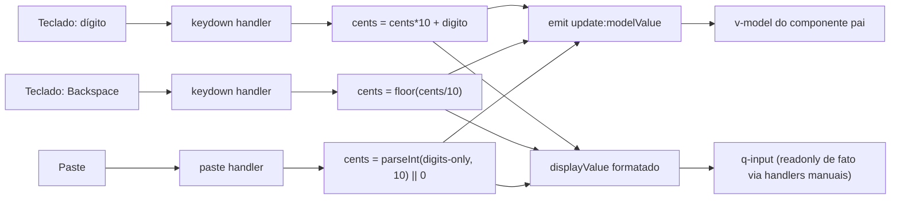

# PLAN — Componente de input para valores monetários em BRL (modelo inteiro)

## Resumo Técnico

Criar um Single-File Component Vue 3 (Composition API + `<script setup lang="ts">`) chamado `MoedaBrlInput.vue`, localizado em `src/components/inputs/`, que encapsula um `q-input` do Quasar controlado manualmente (sem depender da prop `mask` do Quasar, já que a formatação envolve lógica de deslocamento de dígitos incompatível com tokens de máscara estáticos). O componente mantém internamente um `number` inteiro em centavos como fonte da verdade, formata esse inteiro para exibição em `R$ X.XXX,XX` a cada mudança, e trata todos os eventos de teclado/paste manualmente para garantir o comportamento de "preenchimento da direita para a esquerda". Nenhuma integração em cards existentes é feita nesta US — o componente é criado isolado, pronto para ser consumido pelas USs de segmento (US04+).

## Componentes Afetados

| Componente                                     | Ação  | Notas                                                                                                          |
| ----------------------------------------------- | ----- | ---------------------------------------------------------------------------------------------------------------- |
| `src/components/inputs/MoedaBrlInput.vue`       | criar | Componente novo; encapsula `q-input`; formata BRL a partir de inteiro em centavos; trata teclado e paste manualmente. |
| `src/components/inputs/MoedaBrlInput.spec.ts`   | criar | Suíte Vitest cobrindo formatação, digitação, backspace, paste, sanitização, overflow e tipo inteiro (ver "Testes"). |

## Estrutura de Dados

### Props

```ts
interface MoedaBrlInputProps {
  modelValue: number;      // sempre inteiro, em centavos (ex.: 1073 = R$ 10,73)
  casasDecimais?: number;  // default: 2
  readonly?: boolean;
  disable?: boolean;
  hint?: string;
  error?: boolean;
  errorMessage?: string;
  dense?: boolean;
  label?: string;
}
```

### Emits

```ts
interface MoedaBrlInputEmits {
  (e: "update:modelValue", value: number): void;
  (e: "focus", event: FocusEvent): void;
  (e: "blur", event: FocusEvent): void;
}
```

### Estado interno

```ts
// valor cru em centavos, espelha modelValue durante a interação local
const cents = ref<number>(props.modelValue ?? 0);

// string formatada exibida no q-input (derivada de cents + casasDecimais)
const displayValue = computed<string>(() => formatBRL(cents.value, props.casasDecimais ?? 2));
```

## Lógica Principal

1. **Formatação BRL a partir do inteiro** — dado `cents` e `casasDecimais`, dividir por `10 ** casasDecimais` para obter a parte inteira e o resto para a parte decimal, formatar a parte inteira com separador de milhar `.` a cada 3 dígitos (da direita para a esquerda) e concatenar `R$ ` + parte inteira + `,` (ou nenhum separador se `casasDecimais = 0`) + parte decimal com padding de zeros à esquerda. Referencia RN01, RN08.

2. **Inserção de dígito (RN02)** — no handler de `keydown` (ou `beforeinput`), interceptar teclas que representam um dígito `0-9` (incluindo teclado numérico), prevenir o comportamento default do input nativo, e computar `cents.value = cents.value * 10 + digito`. Não há teto de magnitude — a operação é permitida indefinidamente (limitada apenas pela precisão seg ura de `Number` em runtime; ver "Riscos").

3. **Remoção via Backspace (RN03)** — no handler de `keydown`, interceptar `Backspace` (e `Delete`, tratado de forma equivalente por simplicidade — ambos removem a unidade de centavo), prevenir o default, e computar `cents.value = Math.floor(cents.value / 10)`.

4. **Bloqueio de navegação/digitação livre (RN06)** — todas as teclas que não sejam dígito, Backspace/Delete, ou teclas de controle não-destrutivas (Tab, Shift, Ctrl, teclas de atalho do SO) são prevenidas via `event.preventDefault()` no `keydown`, incluindo `←`, `→`, `Home`, `End` — nenhuma delas altera `cents` nem move um "cursor lógico", já que o componente não expõe um cursor navegável (o valor é sempre tratado como uma pilha).

5. **Sanitização de paste (RN04, RN05)** — no handler de `paste`, prevenir o comportamento default, ler `event.clipboardData.getData('text')`, extrair todos os caracteres `[0-9]` via regex (`replace(/\D/g, '')`), converter a string resultante para inteiro (`parseInt` ou `Number`, tratando string vazia como `0`), e **substituir** `cents.value` inteiramente pelo resultado (não somar/concatenar ao valor pré-existente).

6. **Emissão do modelValue (RN01, CA10)** — um `watch` (ou emissão direta a cada mutação de `cents`) dispara `emit('update:modelValue', cents.value)` sempre que `cents` muda, garantindo que o valor emitido seja sempre `Number.isInteger === true` (a aritmética usada — multiplicação/soma/divisão inteira via `Math.floor` — nunca produz fração).

7. **Sincronização com prop externa** — um `watch(() => props.modelValue, ...)` atualiza `cents.value` quando o valor é alterado de fora (ex.: reset de formulário), mantendo o componente `v-model`-friendly em ambas as direções.

8. **Overflow visual (RN07)** — via CSS: o `q-input` recebe um wrapper com o prefixo `R$ ` como elemento fixo (usando o slot `prepend` ou `prefix` nativo do `q-input`, que já não participa do scroll do campo de texto) e a porção numérica (sem o `R$ `) como o `value` real do input nativo, com o input configurado para manter o scroll ancorado à direita (comportamento nativo de `<input type="text">` quando o cursor lógico está sempre no fim do valor — não requer JS adicional além de garantir que a posição de seleção reportada ao DOM esteja sempre no fim da string após cada atualização).

## Composables / Serviços

- Nenhum composable novo é necessário — a lógica de formatação/parsing é local ao componente (funções puras `formatBRL(cents, casasDecimais): string` internas ao SFC, não exportadas, dado o escopo restrito a este componente único).

## Eventos e Props (componente novo)

Ver "Estrutura de Dados" acima — `MoedaBrlInputProps` e `MoedaBrlInputEmits`.

## Fluxo de Dados



## Dependências Externas

Nenhuma nova dependência de npm. Utiliza apenas Quasar (`q-input`, já presente no projeto) e Vue 3 Composition API. A formatação é feita manualmente (sem `Intl.NumberFormat`), conforme decidido no refinamento — mantém controle total sobre a cadência de dígitos.

## Testes

### Unitários

- Formatação inicial para `modelValue` em `0`, `1`, `73`, `1000`, `1073`, `125067` → displays esperados (`R$ 0,00` … `R$ 1.250,67`).
- Digitação sequencial dígito a dígito reproduzindo a progressão de CA02.
- Backspace repetido até `modelValue = 0` (CA03), incluindo backspace em `modelValue` já `0` (não-operação).
- Filtro de caracteres não numéricos na digitação (CA04) — letras, símbolos, `R$`, `.`, `,`, `-` não alteram `modelValue`.
- Colagem substituindo valor pré-existente (CA05), incluindo colagem com sinal negativo (CA06) e colagem sem dígitos válidos (retorna `0`).
- Cursor ancorado — simulação de clique/navegação seguida de digitação, validando que o novo dígito sempre resulta em inserção à direita (CA07).
- `casasDecimais` customizado (`0`, `2`, `3`) alterando apenas o display, não o tipo do `modelValue` (CA09).
- Emissão de `update:modelValue` sempre como inteiro (`Number.isInteger`) após qualquer sequência de interação (CA10).
- Sincronização reversa: alterar `modelValue` via prop externamente reflete no `displayValue`.

### Integração

- Não aplicável nesta US — o componente não é integrado a nenhum card existente (fora de escopo, conforme SPEC).

### E2E

- Não aplicável nesta US — sem integração em tela real, os cenários de e2e ficam para a US de segmento que consumir o componente.

## Riscos e Decisões em Aberto

| Risco / Dúvida                                                                                       | Impacto | Mitigação                                                                                                   |
| ------------------------------------------------------------------------------------------------------ | ------- | --------------------------------------------------------------------------------------------------------------- |
| Digitação ilimitada pode eventualmente exceder `Number.MAX_SAFE_INTEGER` (2^53-1) em uso extremo        | Baixo   | Fora de escopo explícito da US; nenhuma trava é implementada. Se necessário no futuro, avaliar `BigInt` em spike dedicado |
| Overflow visual via `prefix` do `q-input` + scroll nativo pode não garantir 100% que o `R$ ` nunca seja cortado em todos os navegadores/zoom levels | Médio   | Validar visualmente em Chrome/Firefox/Safari durante implementação; ajustar CSS (`flex-shrink: 0` no prefixo) se necessário |
| Tratar `Delete` de forma equivalente a `Backspace` (ambos removem a unidade de centavo) é uma decisão de implementação não coberta explicitamente pela SPEC | Baixo   | Comportamento razoável dado que o componente não expõe um cursor navegável real; revisitar se usuários reportarem confusão |

## Ordem de Implementação Sugerida

1. Criar o SFC `MoedaBrlInput.vue` com props, emits e a função pura `formatBRL`.
2. Implementar o estado interno `cents` e a sincronização bidirecional com `modelValue` via `watch`.
3. Implementar o handler de `keydown` para dígitos e Backspace/Delete, bloqueando as demais teclas de navegação.
4. Implementar o handler de `paste` com sanitização e substituição integral do valor.
5. Aplicar o prefixo `R$ ` fixo via slot `prefix`/`prepend` do `q-input` e validar o comportamento de overflow/scroll à direita.
6. Aplicar `--lpd-font-mono` e revisar `readonly`/`disable`/`error`/`hint`/`dense`/`label` repassados ao `q-input` interno.
7. Escrever a suíte Vitest cobrindo todos os cenários listados em "Testes".
