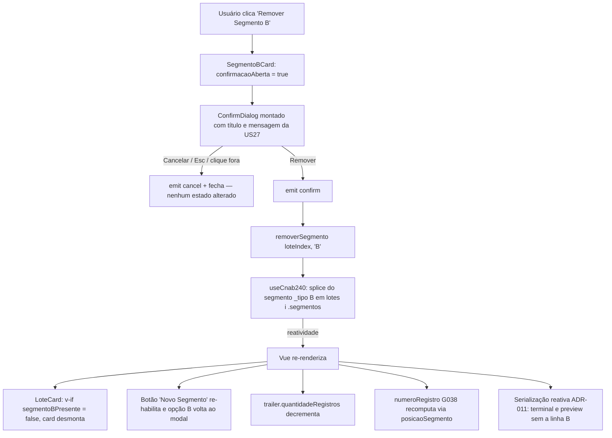
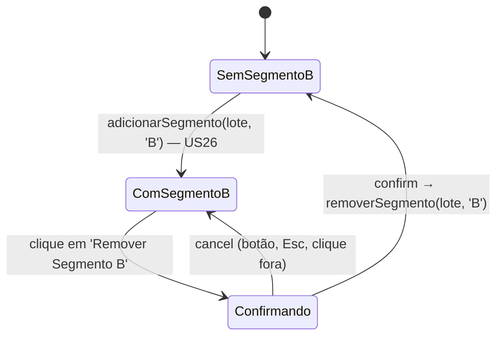

# PLAN — Remover Segmento B de um Registro de Detalhe

## Dados do Plano

| Campo               | Valor                                             |
| ------------------- | ------------------------------------------------- |
| Número da US        | US27                                              |
| Slug                | `us27-remover-segmento-b`                         |
| Stack               | Quasar + Vue 3 + TypeScript + Vitest + Playwright |
| Data de criação     | 2026-08-30                                        |
| Data de modificação | 2026-09-06                                        |

---

## Resumo Técnico

Este plano substitui integralmente o rascunho de 2026-08-30, escrito antes da ADR-010 e da
implementação real da US26. O estado atual do código muda o escopo da US:

- O commit `5941f48` (_"refactor(cnab240): adequar hierarquia de segmentos à ADR-010 — modelo flat
  `SegmentoState[]`"_) **removeu** o `RegistroDetalheCard.vue`. Não existe mais o conceito de
  "Registro de Detalhe" como container na UI: cada lote tem um array flat
  `lotes[i].segmentos: SegmentoState[]` com no máximo um Segmento A (obrigatório) e um Segmento B
  (opcional). A SPEC da US27 descreve a hierarquia revogada — este plano segue a **ADR-010**.
- `removerSegmento(loteIndex, 'B')` **já existe** em `useCnab240` (contrato público, ADR-010) e o
  `SegmentoBCard` **já tem** o botão "Remover Segmento B" no footer, chamando o composable
  **diretamente, sem confirmação**.
- `ConfirmDialog.vue` **não existe**. O commit `bee62a3` (_"feat(us13): implement remover lote..."_)
  entregou apenas documentação — `removerLote` e o botão "Excluir" de lote nunca foram
  implementados. O plugin `Dialog` do Quasar **não** está habilitado (`quasar.config.ts` →
  `plugins: ['Notify']`) e **não será** habilitado nesta US.

O delta real da US27 é, portanto: **criar `src/components/ConfirmDialog.vue`** — componente genérico,
declarativo (`v-model` + props, emits `confirm`/`cancel`), pensado para ser reaproveitado pela US13
e pelas futuras ações destrutivas — **interpor a confirmação** entre o clique no botão e a chamada de
`removerSegmento`, e **alinhar botão e `aria-label`** ao SPEC. O `ConfirmDialog` é montado **dentro
do `SegmentoBCard`**, preservando a auto-contenção do componente (ele já lê `useCnab240` direto e não
emite eventos ao `LoteCard`). Nenhuma linha de `useCnab240.ts` é alterada — toda a reatividade
cascata (opção do modal re-habilitada, `trailer.quantidadeRegistros` decrementado, `numeroRegistro`
G038 recomputado, serialização reativa ADR-011) já funciona hoje.

---

## Componentes Afetados

| Componente / arquivo                                              | Ação      | Notas                                                                                                                                                                  |
| ----------------------------------------------------------------- | --------- | ---------------------------------------------------------------------------------------------------------------------------------------------------------------------- |
| `src/components/ConfirmDialog.vue`                                | Criar     | `q-dialog` genérico declarativo: props `modelValue`, `title`, `message`, `confirmLabel`, `cancelLabel`, `confirmColor`; emits `update:modelValue`, `confirm`, `cancel` |
| `src/components/cnab240/SegmentoBCard.vue`                        | Modificar | Botão passa de `flat` para `outline`; novo `aria-label`; clique abre o `ConfirmDialog` local em vez de remover direto                                                  |
| `src/composables/useCnab240.ts`                                   | Não tocar | `removerSegmento(loteIndex, 'B')` já existe (linha ~618) e atende à RN04 sem alteração                                                                                 |
| `src/components/cnab240/SegmentoACard.vue`                        | Não tocar | RN02/CA02 — Segmento A é obrigatório e não recebe botão de remoção; apenas teste de regressão                                                                          |
| `src/components/cnab240/LoteCard.vue`                             | Não tocar | O diálogo é local ao `SegmentoBCard`; o modal "Novo Segmento" já re-habilita sozinho por reatividade (RN05)                                                            |
| `quasar.config.ts`                                                | Não tocar | Plugin `Dialog` **não** é habilitado — `ConfirmDialog` é declarativo                                                                                                   |
| `test/vitest/unit/components/ConfirmDialog.spec.ts`               | Criar     | Testes do componente genérico: render de título/mensagem/labels, emits `confirm`/`cancel`, defaults de props                                                           |
| `test/vitest/unit/components/cnab240/SegmentoBCard.spec.ts`       | Modificar | Atualizar seletor do `aria-label`; novos casos: clique **não** remove direto, confirmar remove, cancelar não                                                           |
| `test/vitest/unit/components/cnab240/SegmentoACard.spec.ts`       | Modificar | Caso de regressão (CA02): nenhum botão de remoção no Segmento A                                                                                                        |
| `test/playwright/e2e/us26-segmento-b-multiplos-registros.spec.ts` | Modificar | **Quebra garantida**: o cenário "usuário remove o Segmento B adicionado" hoje espera remoção imediata; passa a exigir a confirmação                                    |
| `test/playwright/e2e/us27-remover-segmento-b.spec.ts`             | Criar     | Happy path + cancelamento                                                                                                                                              |

---

## Estrutura de Dados

Nenhuma alteração no modelo de dados do CNAB240 — `LoteState`, `SegmentoState`, `UseCnab240Return` e
`SEGMENTO_B_CAMPOS` permanecem exatamente como estão. O único contrato novo é o do componente:

```ts
// src/components/ConfirmDialog.vue

/** Props do diálogo genérico de confirmação de ação destrutiva. */
interface Props {
  /** Controla a abertura via `v-model`. */
  modelValue: boolean;
  /** Título do diálogo (ex.: "Remover Segmento B?"). */
  title: string;
  /** Corpo do diálogo, explicando a consequência da ação. */
  message: string;
  /** Rótulo do botão de confirmação. Padrão: `'Remover'`. */
  confirmLabel?: string;
  /** Rótulo do botão de cancelamento. Padrão: `'Cancelar'`. */
  cancelLabel?: string;
  /** Cor Quasar do botão de confirmação. Padrão: `'negative'`. */
  confirmColor?: string;
}

/** Eventos emitidos pelo diálogo. */
interface Emits {
  /** Fecha/abre o diálogo (contrato de `v-model`). */
  (e: 'update:modelValue', value: boolean): void;
  /** Usuário confirmou a ação destrutiva. */
  (e: 'confirm'): void;
  /** Usuário cancelou — botão "Cancelar", `Esc` ou clique fora. */
  (e: 'cancel'): void;
}
```

Estado local novo em `SegmentoBCard.vue`:

```ts
/** Controla a abertura do ConfirmDialog de remoção (US27, RN03). */
const confirmacaoAberta = ref(false);
```

---

## Lógica Principal

1. **`ConfirmDialog.vue` (RN03)** — `q-dialog` com `:model-value="modelValue"` e
   `@update:model-value` repassando ao pai. Estrutura interna: `q-card` com `q-card-section` de
   título (`h3`), `q-card-section` de mensagem e `q-card-actions align="right"` com dois `q-btn`:
   - "Cancelar" — `flat`, emite `cancel` e fecha (`update:modelValue` `false`);
   - "Remover" — `color="negative"` (mapeado para `--lpd-error`), emite `confirm` e fecha.
     O fechamento por `Esc` / clique fora chega como `@update:model-value(false)` do `q-dialog`; esse
     caminho emite `cancel` também, para que "Esc" e "Cancelar" sejam indistinguíveis do ponto de
     vista do consumidor (CA04). A11y herdada do `q-dialog` (`role="dialog"`, foco automático,
     devolução de foco ao disparador); o `q-card` recebe `aria-labelledby` apontando para o `id` do
     título. Botões com `min-height: 44px` (WCAG 2.1 AA). Cores exclusivamente via tokens `--lpd-*`.

2. **Interposição da confirmação no `SegmentoBCard` (RN01, RN03, RN04)** — a função atual
   `removerEsteSegmento()` deixa de chamar o composable e passa a apenas abrir o diálogo:

   ```
   function solicitarRemocao():      // @click do botão do footer
     confirmacaoAberta.value = true

   function confirmarRemocao():      // @confirm do ConfirmDialog
     removerSegmento(props.loteIndex, 'B')
   ```

   O `@cancel` não precisa de handler (o próprio `v-model` fecha). Nenhum toast é exibido (RN08) e o
   foco não é gerenciado programaticamente — o disparador desmonta junto com o card, e o foco cai no
   parent focável mais próximo (comportamento aceito no SPEC).

3. **Ajustes no botão (RN01/CA01)** — `q-btn` passa de `flat` para `outline`, mantém
   `color="negative"`, `icon="delete"` e `label="Remover Segmento B"`, permanece dentro do
   `.segmento-b-card__footer` (layout `justify-between` já existente) e conserva
   `min-height: 44px`. O `aria-label` passa de `"Remover Segmento B deste lote"` para
   `` `Remover Segmento B do Lote ${loteIndex + 1}` `` — a formulação do SPEC ("do Registro N do Lote
   M") não é representável no modelo flat da ADR-010.

4. **Reatividade cascata (RN05, RN06, RN07, RN09)** — **nenhuma linha nova**:
   - `LoteCard` renderiza o `SegmentoBCard` sob `v-if="segmentoBPresente"` e desabilita "Novo
     Segmento" por `podeAdicionarSegmento`; ambos derivam de `lotes[i].segmentos` e reagem sozinhos;
   - `lotes[i].trailer.quantidadeRegistros` é `segmentos.length + 2` (computed da US05) — decrementa
     automaticamente;
   - `numeroRegistroComputado` usa `posicaoSegmento(loteIndex, 'B')` — recomputa sozinho;
   - o `TerminalDrawer`/`FilePreviewModal` consomem a serialização reativa (ADR-011) e passam a
     omitir a linha do Segmento B sem trigger manual, com todas as linhas restantes em 240 caracteres.

5. **`SegmentoACard` intocado (RN02/CA02)** — nenhuma alteração de código; apenas um teste de
   regressão explícito garantindo que nenhum botão destrutivo dirigido ao Segmento A foi adicionado.

---

## Composables / Serviços

Nenhum composable é criado ou alterado. `useCnab240()` já expõe `removerSegmento` como parte do
contrato definido pela ADR-010, e o `SegmentoBCard` já o consome (ADR-009 — composable único por
leiaute, sem store intermediária para o formulário). O `ConfirmDialog` é puramente apresentacional:
não conhece `useCnab240`, o que o mantém reutilizável pela US13 (Remover Lote) e por futuras ações
destrutivas.

---

## Eventos e Props

### `ConfirmDialog.vue` (novo)

**Props:**

| Nome           | Tipo      | Obrigatória | Padrão       | Descrição                          |
| -------------- | --------- | ----------- | ------------ | ---------------------------------- |
| `modelValue`   | `boolean` | sim         | —            | Abertura do diálogo (`v-model`)    |
| `title`        | `string`  | sim         | —            | Título                             |
| `message`      | `string`  | sim         | —            | Corpo explicando a consequência    |
| `confirmLabel` | `string`  | não         | `'Remover'`  | Rótulo do botão destrutivo         |
| `cancelLabel`  | `string`  | não         | `'Cancelar'` | Rótulo do botão secundário         |
| `confirmColor` | `string`  | não         | `'negative'` | Cor Quasar do botão de confirmação |

**Emits:**

| Nome                | Payload   | Descrição                                |
| ------------------- | --------- | ---------------------------------------- |
| `update:modelValue` | `boolean` | Contrato de `v-model`                    |
| `confirm`           | —         | Usuário confirmou                        |
| `cancel`            | —         | Cancelou via botão, `Esc` ou clique fora |

### `SegmentoBCard.vue` (modificado)

- **Props:** inalteradas — apenas `loteIndex: number`.
- **Emits:** nenhum (o diálogo é local; o componente segue auto-contido).

---

## Fluxo de Dados



---

## Diagramas Adicionais

Estados do `SegmentoBCard` do ponto de vista da ação destrutiva:



---

## Dependências Externas

**npm:** nenhuma nova dependência. `q-dialog`, `q-card`, `q-btn` e `q-card-actions` já vêm do Quasar;
nenhum plugin adicional é habilitado.

**Inter-US:**

- **US26** (Done, `125b2b8` + refactor ADR-010 `5941f48`) — provê `SegmentoBCard`, o modal "Novo
  Segmento" do `LoteCard`, `adicionarSegmento`/`removerSegmento`/`posicaoSegmento` e o array flat de
  segmentos. Base direta desta US.
- **US05 / US06** (Done) — `trailer.quantidadeRegistros` e `trailerArquivo` reativos, verificados
  como consequência da remoção.
- **US15 / ADR-011** (Done) — serialização reativa consumida pelo terminal e pelo preview (CA09).
- **US13 — Remover Lote** (não implementada em código, apesar do commit `bee62a3`): esta US **produz**
  o `ConfirmDialog.vue` que a US13 planejava criar. Quando a US13 for implementada, ela consome o
  componente pronto e adiciona apenas `removerLote` + botão "Excluir". Inverte-se a dependência
  originalmente descrita na SPEC da US27 — registrar isso no PLAN da US13 quando ela entrar em sprint.

---

## Testes

### Unitários (Vitest + Vue Test Utils, London style)

**`ConfirmDialog.spec.ts` (novo):**

- Com `modelValue: true`, renderiza o `title` e a `message` recebidos.
- Labels padrão: botões "Remover" e "Cancelar" quando `confirmLabel`/`cancelLabel` são omitidos.
- Labels customizados sobrescrevem os padrões.
- Clique em "Remover" emite `confirm` **e** `update:modelValue` com `false`.
- Clique em "Cancelar" emite `cancel` **e** `update:modelValue` com `false`, e **não** emite `confirm`.
- Fechamento externo (`update:model-value(false)` do `q-dialog`, equivalente a `Esc`) emite `cancel`.
- Botão de confirmação usa `color="negative"` por padrão; `aria-labelledby` do card aponta para o título.
- Montagem exige `installQuasarPlugin()` e `attach-to`/teletransporte do `q-dialog` — usar o padrão já
  aplicado nos testes de componentes com portal (consultar `TerminalDrawer.spec.ts` como referência).

**`SegmentoBCard.spec.ts` (modificado):**

- Atualizar o seletor existente `[aria-label="Remover Segmento B deste lote"]` para
  `[aria-label="Remover Segmento B do Lote 1"]`.
- Botão renderiza com `outline`, `color="negative"`, `icon="delete"` e classe
  `.segmento-b-card__btn-remover` (min-height 44px preservado).
- **Regressão de comportamento:** clicar no botão **não** chama `removerSegmento` (antes chamava).
- Clicar no botão abre o `ConfirmDialog` (stub/`findComponent`) com `title` "Remover Segmento B?" e
  `message` "Todos os dados preenchidos serão descartados. Esta ação não pode ser desfeita.".
- `@confirm` do diálogo chama `removerSegmento(0, 'B')` exatamente uma vez.
- `@cancel` do diálogo **não** chama `removerSegmento` e o card continua montado.
- Nenhum `Notify`/toast é disparado em nenhum dos caminhos (RN08).

**`SegmentoACard.spec.ts` (modificado):**

- CA02 — o card não renderiza nenhum botão com label contendo "Remover" nem `icon="delete"`.

**`useCnab240.test.ts`:** sem alterações. Os casos de `removerSegmento` (remoção, no-op quando
ausente, recomputação de `trailer` e `posicaoSegmento`) já existem desde a US26/ADR-010 e cobrem
CA05, CA07 e CA08 — apenas confirmar que seguem verdes.

### E2E (Playwright)

**`us27-remover-segmento-b.spec.ts` (novo)** — servidor dev em `http://localhost:9000`:

1. Adicionar Segmento B via "Novo Segmento" → modal → confirmar; preencher um campo editável.
2. Clicar em "Remover Segmento B" → assertar que o diálogo aparece com o título "Remover Segmento B?"
   **e que o `SegmentoBCard` ainda está na tela**.
3. Clicar em "Cancelar" → diálogo fecha, card permanece, valor preenchido intacto (CA04).
4. Clicar novamente em "Remover Segmento B" → confirmar em "Remover" → card some, botão "Novo
   Segmento" volta a ficar habilitado (CA05, CA06).
5. Verificar no `TrailerLoteCard` que `quantidadeRegistros` decrementou (CA07).
6. Abrir o visualizador/preview e assertar ausência da linha do Segmento B, com as linhas restantes
   em 240 caracteres (CA09).

**`us26-segmento-b-multiplos-registros.spec.ts` (modificado)** — o cenário existente "usuário remove o
Segmento B adicionado → card some e o Trailer decrementa" **vai falhar** com a confirmação
interposta; inserir o passo de confirmação no diálogo. Essa atualização é obrigatória e não opcional.

---

## Riscos e Decisões em Aberto

| Risco / Dúvida                                                                                                                                                       | Impacto | Mitigação                                                                                                                                                                                                                                                                                                  |
| -------------------------------------------------------------------------------------------------------------------------------------------------------------------- | ------- | ---------------------------------------------------------------------------------------------------------------------------------------------------------------------------------------------------------------------------------------------------------------------------------------------------------- |
| **A SPEC da US27 descreve uma hierarquia revogada** (`RegistroDetalheCard`, "Registro N", múltiplos registros por lote) — removida pelo refactor ADR-010 (`5941f48`) | Alto    | Este plano segue a **ADR-010**. CA01, CA03–CA07, CA09 e CA10 permanecem válidos com "Lote M" no lugar de "Registro N do Lote M"; CA08 (renumeração G038 entre 3 registros) e UC04 **não são reproduzíveis** hoje — G038 do B é sempre 2. Recomenda-se refinar a SPEC (skill `refine-us`) após esta entrega |
| Boa parte da US27 já estava implementada pelo refactor ADR-010 (botão + `removerSegmento`), sem confirmação                                                          | Médio   | O escopo entregue é a confirmação + o `ConfirmDialog` genérico; o relatório de dev deve deixar isso explícito para não inflar a percepção de entrega                                                                                                                                                       |
| **US13 nunca foi implementada** apesar do commit `bee62a3` sugerir o contrário — não há `removerLote` nem botão "Excluir" de lote                                    | Médio   | A US27 passa a ser a produtora do `ConfirmDialog.vue`; alertar o PO de que o status da US13 no backlog/Trello pode estar incorreto                                                                                                                                                                         |
| Testes E2E da US26 quebram com a confirmação interposta                                                                                                              | Médio   | Atualização do `us26-...spec.ts` está no escopo desta US (item explícito na ordem de implementação)                                                                                                                                                                                                        |
| Testar `q-dialog` com Vue Test Utils exige atenção ao portal (conteúdo renderizado fora do wrapper)                                                                  | Baixo   | Usar `installQuasarPlugin()` e o padrão já adotado em `TerminalDrawer.spec.ts`; se necessário, stub do `ConfirmDialog` nos testes do `SegmentoBCard` e testes reais de portal só no `ConfirmDialog.spec.ts`                                                                                                |
| API do `ConfirmDialog` pode não servir à US13 sem ajuste (ex.: título dinâmico "Remover Lote 2?")                                                                    | Baixo   | `title`/`message` são props livres de string — o consumidor monta o texto; nenhum acoplamento a segmento ou lote                                                                                                                                                                                           |
| Sem `undo` após a remoção (dados descartados)                                                                                                                        | Baixo   | Fora de escopo por decisão de produto; a confirmação obrigatória é a mitigação                                                                                                                                                                                                                             |
| Componente novo em `src/components/` (raiz) e não em `src/components/cnab240/`                                                                                       | Baixo   | Correto: `ConfirmDialog` é transversal, não específico de leiaute (ADR-001 — componentes independentes **por leiaute** apenas para o que é do leiaute)                                                                                                                                                     |

---

## Ordem sugerida de implementação

1. **Criar `src/components/ConfirmDialog.vue`** — `q-dialog` declarativo, props/emits do contrato
   acima, tokens `--lpd-*`, botões com 44px de altura mínima, `aria-labelledby`.
2. **Criar `test/vitest/unit/components/ConfirmDialog.spec.ts`** — cobrir render, defaults, `confirm`,
   `cancel` e fechamento externo.
3. **Modificar `SegmentoBCard.vue`** — `ref confirmacaoAberta`; `solicitarRemocao()` no `@click`;
   `<ConfirmDialog v-model="confirmacaoAberta" ... @confirm="confirmarRemocao" />`; botão para
   `outline` e novo `aria-label`; atualizar o JSDoc do componente citando US27 e ADR-010.
4. **Atualizar `SegmentoBCard.spec.ts`** — seletor de `aria-label`, regressão do clique direto, casos
   de confirmar/cancelar.
5. **Adicionar o caso de regressão CA02 em `SegmentoACard.spec.ts`.**
6. **Atualizar o E2E da US26** para incluir a confirmação no cenário de remoção.
7. **Criar `test/playwright/e2e/us27-remover-segmento-b.spec.ts`** (happy path + cancelamento +
   preview sem a linha B).
8. **Rodar a suíte completa** (`vitest` + `playwright`) e conferir que US05, US06, US15, US16 e US26
   seguem verdes.
9. **Verificação manual** com `quasar dev`: adicionar B, preencher, cancelar, remover, conferir
   terminal/preview, tema claro e escuro, e navegação por teclado no diálogo (`Tab`, `Esc`).

---

## Custo da IA

| Métrica              | Valor                       |
| -------------------- | --------------------------- |
| Modelo               | claude-opus-4-6             |
| Tokens de entrada    | ~62.000                     |
| Tokens de saída      | ~9.000                      |
| Custo estimado (USD) | ~$0,32                      |
| Taxa de câmbio       | 1 USD = R$5,80 (2026-09-06) |
| Custo estimado (BRL) | ~R$1,86                     |

> Estimativa de tokens: leitura do card do Trello, SPEC, PLAN anterior, ADRs, composable, `LoteCard`,
> `SegmentoBCard`, testes e histórico git (~52k entrada), entrevista de refinamento (~10k entrada /
> ~2k saída), escrita do plano (~7k saída).
> Preços claude-opus-4-6: $3/M tokens entrada, $15/M tokens saída.

## Custo Estimado do Refinamento (2026-09-06)

| Métrica              | Valor                       |
| -------------------- | --------------------------- |
| Modelo               | claude-opus-4-6             |
| Tokens de entrada    | ~62.000                     |
| Tokens de saída      | ~9.000                      |
| Custo estimado (USD) | ~$0,32                      |
| Taxa de câmbio       | 1 USD = R$5,80 (2026-09-06) |
| Custo estimado (BRL) | ~R$1,86                     |

> Sessão de planejamento técnico da US27 conduzida pelo agente `tech-lead`: investigação da
> divergência entre a SPEC (pré-ADR-010) e o código real, entrevista de 2 perguntas e reescrita
> integral do PLAN.md.
> Preços claude-opus-4-6: $3/M tokens entrada, $15/M tokens saída.
