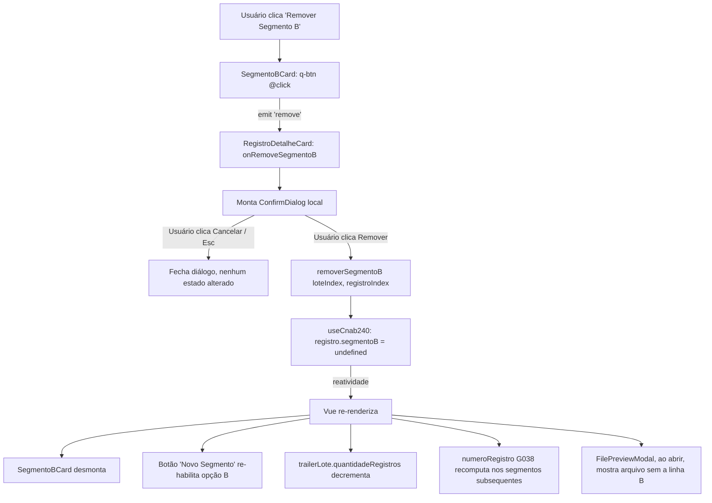

# PLAN — Remover Segmento B de um Registro de Detalhe

## Dados do Plano

| Campo               | Valor                                                 |
| ------------------- | ----------------------------------------------------- |
| Número da US        | US27                                                  |
| Slug                | `us27-remover-segmento-b`                             |
| Stack               | Quasar + Vue 3 + TypeScript + Vitest + Playwright     |
| Data de criação     | 2026-08-30                                            |
| Data de modificação | —                                                     |

---

## Resumo Técnico

Adicionar ao composable singleton `useCnab240` uma nova ação `removerSegmentoB(loteIndex, registroIndex)` que zera o slot `segmentoB` do registro alvo (`= undefined`). O `SegmentoBCard` (criado pela US26) ganha um `q-card-section` no rodapé com um `q-btn` outline/negative que **emite `remove` sem payload**. O `RegistroDetalheCard` (também da US26) — que já conhece `loteIndex` e `registroIndex` — escuta o evento, monta o `ConfirmDialog.vue` (componente reaproveitado da US13) e, ao confirmar, chama `removerSegmentoB`. Toda a reatividade cascata (opção do modal re-habilitada, `trailerLote.quantidadeRegistros` decrementado, `numeroRegistro` G038 recomputado) já é resolvida pelo grafo reativo existente de US26 — nenhum trigger manual é necessário.

---

## Componentes Afetados

| Componente / arquivo                                        | Ação      | Notas                                                                                                    |
| ----------------------------------------------------------- | --------- | -------------------------------------------------------------------------------------------------------- |
| `src/composables/useCnab240.ts`                             | Modificar | Adicionar `removerSegmentoB(loteIndex, registroIndex): void` (silencioso/idempotente) e expor em `UseCnab240Return` |
| `src/components/cnab240/SegmentoBCard.vue`                  | Modificar | Adicionar `q-card-section` no rodapé com `q-btn` "Remover Segmento B"; declarar emit `remove` (sem payload) |
| `src/components/cnab240/RegistroDetalheCard.vue`            | Modificar | Escutar `@remove` do `SegmentoBCard`; montar `ConfirmDialog` local com copy da US27; chamar `removerSegmentoB` ao confirmar |
| `src/components/cnab240/SegmentoACard.vue`                  | Não tocar | Explicitamente **não** recebe botão de remoção (RN02 do SPEC) — nenhuma alteração necessária             |
| `src/components/ConfirmDialog.vue`                          | Reusar    | Componente criado pela US13; se os props existentes cobrirem `title`, `message`, `confirmLabel`, `cancelLabel`, apenas passamos valores. Caso contrário, extensão mínima documentada em riscos |
| `test/vitest/unit/composables/useCnab240.test.ts`           | Modificar | Novos casos para `removerSegmentoB`: happy path, idempotência, reatividade de `trailerLote` e `numeroRegistro` |
| `test/vitest/unit/components/cnab240/SegmentoBCard.spec.ts` | Modificar | Novos casos: botão presente, aria-label, emit `remove` ao clicar                                     |
| `test/vitest/unit/components/cnab240/RegistroDetalheCard.spec.ts` | Modificar | Novos casos: `ConfirmDialog` monta ao receber `remove`; confirmar chama composable; cancelar não chama |
| `test/vitest/unit/components/cnab240/SegmentoACard.spec.ts` | Modificar | Novo caso (regressão): SegmentoACard **não** exibe botão de remoção equivalente     |
| `test/playwright/e2e/us27-remover-segmento-b.spec.ts`       | Criar     | 1 suíte E2E happy path: adicionar B → preencher 1 campo → clicar Remover → confirmar → verificar sumiço + arquivo sem a linha |

---

## Estrutura de Dados

Nenhuma nova interface ou tipo. As estruturas existentes (`LoteState`, `RegistroDetalhe`, `SegmentoB`, `UseCnab240Return`) são preservadas. Apenas a assinatura pública do composable ganha um novo método:

```ts
// src/composables/useCnab240.ts — extensão de UseCnab240Return

export interface UseCnab240Return {
  // ... membros existentes (US02–US06, US26) ...

  /**
   * Adiciona um Segmento B ao Registro de Detalhe indicado (US26).
   */
  adicionarSegmentoB: (loteIndex: number, registroIndex: number) => void;

  /**
   * Remove o Segmento B do Registro de Detalhe indicado (US27).
   *
   * Comportamento silencioso e idempotente: se `lotes[loteIndex]?.registros[registroIndex]?.segmentoB`
   * for `undefined` ou se os índices não corresponderem a nada existente, retorna sem efeito.
   *
   * @param loteIndex     Índice do lote em `lotes` (0-based)
   * @param registroIndex Índice do registro em `lotes[loteIndex].registros` (0-based)
   */
  removerSegmentoB: (loteIndex: number, registroIndex: number) => void;
}
```

---

## Lógica Principal

1. **Ação do composable (RN04)** — dentro do `useCnab240`, definir:
   ```
   function removerSegmentoB(loteIndex, registroIndex):
     const registro = lotes.value[loteIndex]?.registros?.[registroIndex]
     if (registro?.segmentoB === undefined) return   // idempotente
     registro.segmentoB = undefined                  // ← única mutação
   ```
   Retorno vazio. Nenhum throw. Padrão espelha `adicionarSegmento` da US04 (uso de optional chaining).

2. **Emit no `SegmentoBCard` (RN01)** — no rodapé do card, dentro de um `q-card-section`, renderizar:
   - `q-btn label="Remover Segmento B"`, `icon="delete"`, `outline`, `color="negative"`, `aria-label="Remover Segmento B do Registro N do Lote M"` (interpolando props `registroIndex + 1` e `loteIndex + 1`; se `loteIndex` não estiver disponível, apenas registrar do Registro N).
   - `@click="emit('remove')"` — sem payload (decisão do refinamento).
   - Declarar `defineEmits<{ remove: [] }>()`.

3. **Handler no `RegistroDetalheCard` (RN03)** — o parent recebe `<SegmentoBCard @remove="onRemoveSegmentoB">`:
   ```
   function onRemoveSegmentoB():
     confirmDialog.open({
       title: 'Remover Segmento B?',
       message: 'Todos os dados preenchidos serão descartados. Esta ação não pode ser desfeita.',
       confirmLabel: 'Remover',
       cancelLabel: 'Cancelar',
       confirmColor: 'negative'
     }).then(confirmed => {
       if (confirmed) removerSegmentoB(props.loteIndex, props.registroIndex)
     })
   ```
   A API exata do `ConfirmDialog` (imperativa com promise vs. declarativa com `v-model`) depende da implementação da US13. O contrato inicial assumido é declarativo (`v-model` + `@confirm`/`@cancel`) por consistência com `QDialog`. Se a US13 optar por API imperativa, o padrão acima muda para chamada de método; ambos são compatíveis com esta US.

4. **Reatividade cascata (RN05, RN06, RN07)** — nenhuma linha adicional de código:
   - Botão "Novo Segmento" do `RegistroDetalheCard`: já é desabilitado por `:disable="modelValue.segmentoB !== undefined"` (US26). Quando `segmentoB` volta a `undefined`, o Vue re-renderiza e re-habilita.
   - Getter `trailerLote(loteIndex)`: já lê `lotes[loteIndex].registros` reativamente (US05/US26). Recalcula `quantidadeRegistros` automaticamente.
   - `numeroRegistro` (G038): já é computado via getter/reduce sobre `registros` do lote (US26). Recomputa.

5. **`aria-live` para o desaparecimento (a11y)** — não requerido nesta US (SPEC RN08 espelha a US13, que não usa `aria-live`). O `q-dialog` do ConfirmDialog já anuncia sua própria abertura/fechamento por `role="dialog"`.

6. **`SegmentoACard` sem alteração (RN02)** — nenhum código do `SegmentoACard.vue` é tocado. Um teste de regressão explícito garante que nenhum botão de remoção equivalente foi acidentalmente adicionado.

---

## Composables / Serviços

- `useCnab240()` (existente) — ganha o método `removerSegmentoB`. Nenhum novo composable é criado. A responsabilidade cabe dentro de `useCnab240` para manter o singleton coeso (mesma justificativa da ADR-009).

Nenhum serviço externo (validation, masks etc.) é tocado.

---

## Eventos e Props (componentes modificados)

### `SegmentoBCard.vue`

- **Props (existentes, US26):**
  | Nome              | Tipo                      | Notas                                     |
  | ----------------- | ------------------------- | ----------------------------------------- |
  | `modelValue`      | `SegmentoB`               | v-model (US26)                            |
  | `registroIndex`   | `number`                  | Para `aria-label` e numeração (US26)      |
- **Props (novos, US27):** nenhuma. `loteIndex` **não** é adicionado como prop (o payload do emit é vazio; o parent conhece seu próprio `loteIndex`). O `aria-label` do botão de remoção pode incluir apenas o número do Registro, se `loteIndex` não for prop. Alternativa aceita: se `loteIndex` for necessário para `aria-label` mais rico, adicioná-lo como prop opcional (`loteIndex?: number`) sem quebrar callers da US26.
- **Emits (novos, US27):**
  | Nome     | Payload | Notas                                                 |
  | -------- | ------- | ----------------------------------------------------- |
  | `remove` | `[]`    | Emitido ao clicar no botão "Remover Segmento B"       |

### `RegistroDetalheCard.vue`

- **Props (existentes, US26):**
  | Nome              | Tipo             | Notas                              |
  | ----------------- | ---------------- | ---------------------------------- |
  | `loteIndex`       | `number`         | Índice do lote no array `lotes`    |
  | `registroIndex`   | `number`         | Índice do registro no lote         |
  | `modelValue`      | `RegistroDetalhe`| v-model do registro                |
- **Props (novos, US27):** nenhum.
- **Emits (novos, US27):** nenhum. O `ConfirmDialog` é local ao componente.

---

## Fluxo de Dados



---

## Dependências Externas

**npm:** nenhuma nova dependência. Toda a lógica usa APIs nativas do Vue 3, Quasar (`q-btn`, `q-card-section`, `q-dialog` via `ConfirmDialog`) e o composable existente.

**Inter-US:**

- **US26** (deve estar Done antes desta) — provê `SegmentoBCard`, `RegistroDetalheCard`, `adicionarSegmentoB` no composable, estrutura `lotes[i].registros[j].segmentoB?: SegmentoB`, e a lógica de recomputação de `numeroRegistro` (G038) e `trailerLote.quantidadeRegistros`. Sem US26, esta US não faz sentido.
- **US13** (deve estar Done antes desta) — provê `ConfirmDialog.vue`. Se US13 ainda não estiver implementada quando esta US chegar à sprint, priorizar US13 primeiro ou incluir a criação do `ConfirmDialog` como parte desta (com custo adicional bem sinalizado).
- **US02–US06** (Done) — provê o composable, `SegmentoACard` (referência de padrão de card), `TrailerLoteCard` (reativo).

Nenhuma US futura declarada depende formalmente desta.

---

## Testes

### Unitários (Vitest)

**`useCnab240.test.ts` (novos casos):**
- `removerSegmentoB(0, 0)` em um registro com Segmento B: `lotes[0].registros[0].segmentoB` passa a `undefined`.
- `removerSegmentoB(0, 0)` em um registro **sem** Segmento B (`segmentoB === undefined`): sem efeito, sem throw (idempotência).
- `removerSegmentoB(99, 0)` com `loteIndex` inexistente: sem efeito, sem throw.
- `removerSegmentoB(0, 99)` com `registroIndex` inexistente: sem efeito, sem throw.
- Após `removerSegmentoB` em um lote com N B → `trailerLote.quantidadeRegistros` reflete decremento correto.
- Após `removerSegmentoB` no meio de uma sequência A,B,A,B,A,B → `numeroRegistro` (G038) dos segmentos subsequentes recomputa.
- `removerSegmentoB` não afeta outros lotes nem outros registros do mesmo lote.

**`SegmentoBCard.spec.ts` (novos casos):**
- Card renderiza um `q-btn` com label "Remover Segmento B" em um `q-card-section` do rodapé.
- Botão tem `icon="delete"`, `outline`, `color="negative"`.
- Botão tem `aria-label` no padrão "Remover Segmento B do Registro N".
- Clicar no botão emite exatamente 1 vez `remove` sem payload.

**`RegistroDetalheCard.spec.ts` (novos casos):**
- Ao receber `remove` do `SegmentoBCard`, monta o `ConfirmDialog` com título/mensagem/labels corretos.
- Ao confirmar (`confirm` emit do dialog), chama `removerSegmentoB` com os `loteIndex`/`registroIndex` corretos.
- Ao cancelar (`cancel` emit ou fechamento por `Esc`), **não** chama `removerSegmentoB`.
- Após remoção, o botão "Novo Segmento" do `RegistroDetalheCard` sai do estado desabilitado (reflexo de `modelValue.segmentoB === undefined`).

**`SegmentoACard.spec.ts` (novo caso de regressão):**
- SegmentoACard **não** renderiza nenhum `q-btn` com label contendo "Remover" nem `icon="delete"`.

### Integração / Componente

Coberto acima nos `.spec.ts` (Vue Test Utils com montagem completa via `mount`).

### E2E (Playwright)

**`us27-remover-segmento-b.spec.ts` — happy path único:**
1. Navegar para `/cnab-240`.
2. Adicionar um pagamento (Registro de Detalhe) — reaproveita utilitário da US26.
3. Adicionar Segmento B via botão "Novo Segmento" → modal → selecionar Segmento B → confirmar.
4. Preencher pelo menos 1 campo editável do Segmento B (para tornar o cenário representativo).
5. Clicar no botão "Remover Segmento B" no rodapé do card.
6. Verificar que o `ConfirmDialog` aparece com título "Remover Segmento B?".
7. Clicar em "Remover".
8. Assertar que o `SegmentoBCard` sumiu (locator não encontra).
9. Assertar que o botão "Novo Segmento" está habilitado.
10. Abrir o `FilePreviewModal` e verificar que o arquivo tem exatamente as linhas esperadas (sem a linha do B removido; todas com 240 caracteres).

Testes de cancelamento, múltiplos registros e renumeração G038 ficam no nível unitário (Vitest) para reduzir manutenção E2E.

---

## Riscos e Decisões em Aberto

| Risco / Dúvida                                                                                    | Impacto | Mitigação                                                                                                    |
| ------------------------------------------------------------------------------------------------- | ------- | ------------------------------------------------------------------------------------------------------------ |
| API real do `ConfirmDialog.vue` (US13) pode divergir do contrato assumido (`open() → Promise` vs. `v-model` declarativo) | Médio   | O código de handler é trivial de reescrever para qualquer das duas APIs; ajustar quando US13 estiver mergeada |
| US13 e US26 podem não estar implementadas quando esta US chegar à sprint                          | Alto    | Bloqueadores explícitos — não iniciar US27 até US13 e US26 estarem Done; sinalizar ao PO se acontecer         |
| Ordem de re-render vs. destruição do `SegmentoBCard` pode causar warning de "in-flight click event" ao remover | Baixo   | Usar `$nextTick` no handler se o warning surgir; padrão comum em Vue com componentes que se auto-destroem     |
| Adicionar `loteIndex` como prop opcional ao `SegmentoBCard` para enriquecer `aria-label` pode ser desejado | Baixo   | Adicionar `loteIndex?: number` (opcional, não quebra US26); se ausente, `aria-label` menciona apenas o Registro |
| Padrão de rodapé com `q-card-section` pode conflitar visualmente com colapsáveis futuros (US14)   | Baixo   | US14 ainda não implementada; reavaliar consistência visual quando ela chegar                                 |
| Alteração no comportamento de `SegmentoACard.spec.ts` pode falsamente positivar se o SegmentoACard já não tinha botão "Remover" | Baixo   | O teste é de regressão explícita — se falhar, alguém adicionou o botão errado no A                            |

---

## Ordem sugerida de implementação

1. **Ação no composable** (`useCnab240.ts`): adicionar `removerSegmentoB(loteIndex, registroIndex)` + expor em `UseCnab240Return`. Escrever testes unitários primeiro (TDD): happy path, idempotência, reatividade de `trailerLote` e G038.
2. **`SegmentoBCard.vue`**: adicionar `q-card-section` no rodapé com `q-btn` + `defineEmits`. Escrever testes de renderização e emit.
3. **`RegistroDetalheCard.vue`**: adicionar handler `onRemoveSegmentoB`, montar `ConfirmDialog` local, chamar composable ao confirmar. Escrever testes de integração (dialog aparece, confirma chama, cancela não).
4. **`SegmentoACard.spec.ts`**: adicionar teste de regressão explícito (ausência de botão "Remover").
5. **Playwright**: escrever `us27-remover-segmento-b.spec.ts` (happy path).
6. **Verificação manual em navegador**: rodar `quasar dev`, adicionar pagamento, adicionar B, preencher, remover, confirmar, abrir FilePreviewModal.
7. **Regressão**: rodar suíte Vitest e Playwright completos; validar que testes de US26 continuam verdes.

---

## Custo da IA

| Métrica           | Valor           |
| ----------------- | --------------- |
| Tokens de entrada | ~18.000         |
| Tokens de saída   | ~3.500          |
| Custo (USD)       | ~$0,53          |
| Custo (BRL)       | ~R$2,92         |
| Modelo            | claude-opus-4-7 |

> Valores aproximados, apenas para a fase de geração do PLAN (leitura dos reports de dev/qa, do código atual do composable e cards, e escrita).
