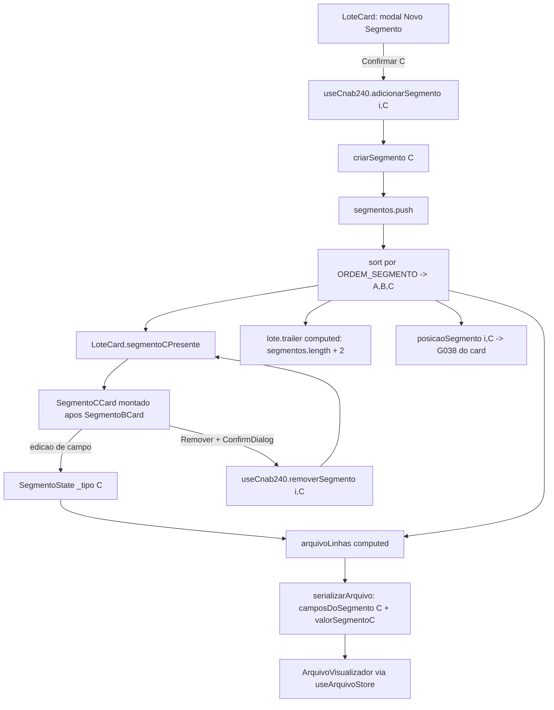
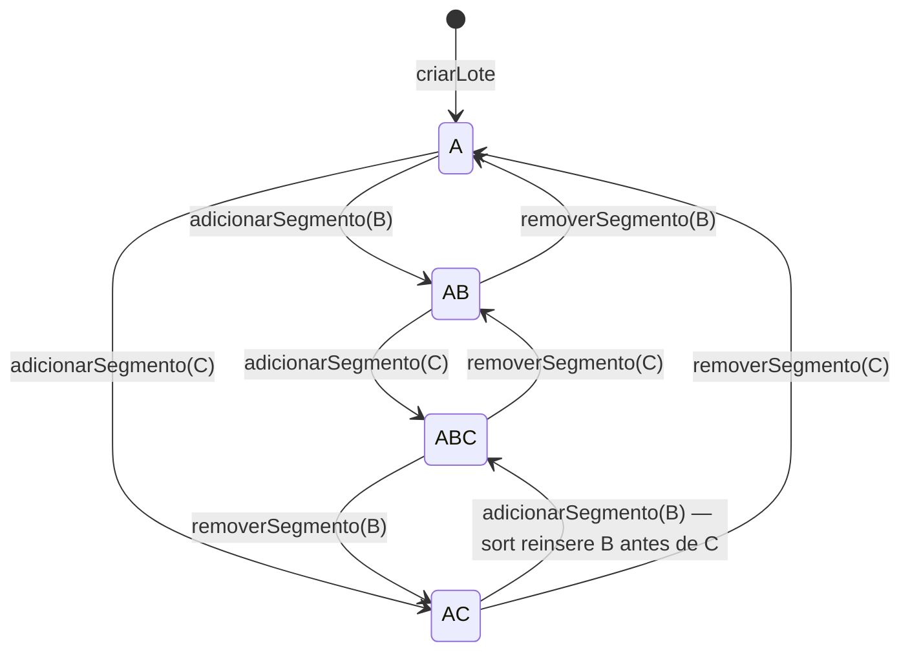

# PLAN — Segmento C do Registro de Detalhe (dados complementares)

## Dados do Plano

| Campo               | Valor                                |
| ------------------- | ------------------------------------ |
| Número da US        | US28                                 |
| Slug                | `us28-segmento-c-registro-detalhe`   |
| Stack               | Quasar + Vue 3 + TypeScript + Vitest |
| Data de criação     | 2026-08-30                           |
| Data de modificação | 2026-09-06                           |

---

## Resumo Técnico

> **Este PLAN foi reescrito em 2026-09-06.** A versão anterior (2026-08-30) foi redigida *antes* de a US26 ser implementada e assumia uma arquitetura que nunca existiu no código: uma interface `RegistroDetalhe` em `src/model/cnab240/registroDetalhe.ts`, um componente `RegistroDetalheCard.vue` e um array `registros[]` por lote. **Nada disso existe.** O que a US26 efetivamente entregou foi o modelo flat da ADR-010. Todas as seções abaixo estão calibradas contra o código real em `develop`.

A arquitetura real (ADR-010) mantém, em cada `LoteState`, um array flat `segmentos: SegmentoState[]` com **no máximo um segmento de cada tipo** (`_tipo: 'A' | 'B' | 'C'`), sempre ordenado A → B → C por um `sort` sobre a constante `ORDEM_SEGMENTO`. Isso torna a US28 substancialmente mais barata do que o plano anterior previa, porque quatro dos oito critérios de aceitação **já são satisfeitos genericamente pelo código existente** e exigem apenas cobertura de teste:

- **Ordem estrita A → B → C** — o `sort` por `ORDEM_SEGMENTO` em `adicionarSegmento` já resolve, inclusive no cenário "C adicionado antes de B" (a RN07 do SPEC, que o plano antigo tratava como um método `reordenarSegmentos` a ser criado, é comportamento já implementado).
- **G038 automático e não editável** — `posicaoSegmento(loteIndex, tipo)` já é genérico sobre `TipoSegmento` e retorna a posição 1-based no array flat.
- **Trailer de Lote contando o Segmento C** — o `computed` do trailer é `segmentos.length + 2`; um Segmento C entra na contagem sem uma linha de código nova.
- **Dispatch de spec na serialização** — `camposDoSegmento` em `serializer.ts` já foi escrito na US16 como ponto de extensão explícito para o Segmento C.

O trabalho real da US concentra-se, portanto, em: (1) criar a spec `src/model/cnab240/segmentoC.ts` com os 19 campos; (2) criar `SegmentoCCard.vue` espelhando `SegmentoBCard.vue`; (3) generalizar `adicionarSegmento` para deixar de ser no-op em `'C'`; (4) habilitar a opção C no modal do `LoteCard`; (5) ligar o Segmento C ao serializer; (6) cobertura de testes completa, incluindo E2E dedicado.

### Divergências deliberadas frente à US e ao SPEC.md

Duas decisões do humano na entrevista técnica de 2026-09-06 afastam esta implementação do texto da US28 e do `SPEC.md` da pasta. Ambas são **intencionais** e devem ser refletidas numa atualização futura da US/SPEC:

1. **A regra de obrigatoriedade condicional do Tipo de Serviço `'23'` NÃO é implementada.** A US (CA07) e o SPEC (RN02, RN08, RN09, RN10) descrevem: campo `numeroContaPagamentoCreditada` travado/marcado conforme `tipoServico === '23'`, toast informativo ao selecionar `'23'`, Segmento C forçado a existir com toggle de remoção desabilitado, e bloqueio de download. **Nada disso entra.** O campo é um campo editável comum, sem nenhum vínculo com o Header de Lote. Consequentemente, não existem `readonlyCondicional`, `hint` dinâmico, `getErrosValidacaoDownload` nem alteração alguma em `HeaderLoteCard.vue`.
2. **O botão "Remover Segmento C" ENTRA, apesar de a US listar remoção como fora de escopo.** O `removerSegmento(loteIndex, tipo)` do composable já aceita `'C'` genericamente e o `ConfirmDialog` da US27 já existe; sem isso o usuário adicionaria um Segmento C sem poder desfazê-lo — regressão de UX frente ao Segmento B.

> **Nota de decisão (2026-09-06).** O humano determinou que a implementação segue com este PLAN como está e que **o CA07 da US28 e as RN02/RN08/RN09/RN10 do `SPEC.md` NÃO devem ser ajustados agora** — permanecem no texto da US mesmo não sendo implementados nesta entrega. A interdependência entre o Tipo de Serviço `'23'` e a obrigatoriedade do Segmento C será tratada por uma **US futura dedicada**, que provavelmente cobrirá em conjunto: o marcador de obrigatoriedade condicional no campo `numeroContaPagamentoCreditada`, o bloqueio/aviso ao gerar o arquivo, e a interação com a validação em tempo real da US07/US08. Portanto, a ausência dessas regras aqui é **divergência intencional e conhecida**, não um esquecimento: o `qa-engineer` deve tratar o CA07 como fora do escopo desta entrega, e o `frontend-developer` não deve implementar nenhuma lógica acoplada a `tipoServico` neste ciclo.

---

## Componentes Afetados

| Componente / Arquivo                                        | Ação      | Notas                                                                                     |
| ----------------------------------------------------------- | --------- | ----------------------------------------------------------------------------------------- |
| `src/model/cnab240/segmentoC.ts`                            | Criar     | `SEGMENTO_C_CAMPOS: CampoLeiaute[]` — 19 campos, soma 240 (ADR-008)                        |
| `src/components/cnab240/SegmentoCCard.vue`                  | Criar     | Espelho fiel de `SegmentoBCard.vue`: grid plano data-driven + footer de remoção            |
| `src/composables/useCnab240.ts`                             | Modificar | `adicionarSegmento` deixa de ser no-op em `'C'`; `criarSegmento(tipo)` genérico            |
| `src/components/cnab240/LoteCard.vue`                       | Modificar | Habilitar C no modal, `segmentoCPresente`, tooltip, render do `SegmentoCCard`              |
| `src/utils/serializer.ts`                                   | Modificar | `camposDoSegmento` reconhece `'C'`; novo resolver `valorSegmentoC`                         |
| `test/vitest/unit/model/cnab240/segmentoC.test.ts`          | Criar     | Integridade posicional e estrutural da spec                                                |
| `test/vitest/unit/components/cnab240/SegmentoCCard.spec.ts` | Criar     | Renderização data-driven, campos readonly, remoção com confirmação                         |
| `test/vitest/unit/composables/useCnab240.test.ts`           | Modificar | `describe('US28')`: adicionar/remover C, ordenação, G038, trailer                          |
| `test/vitest/unit/utils/serializer.test.ts`                 | Modificar | Linha C com 240 chars, ordem A→B→C, `numeroRegistro`, `origem`                             |
| `test/vitest/unit/components/cnab240/LoteCard.spec.ts`      | Modificar | Modal com C habilitado, `podeAdicionarSegmento`, tooltip, render condicional               |
| `test/playwright/e2e/us28-segmento-c.spec.ts`               | Criar     | Fluxo end-to-end incluindo verificação no terminal                                         |

Arquivos **não** tocados, ao contrário do que o plano anterior previa: `HeaderLoteCard.vue`, `TrailerLoteCard.vue`, `src/utils/options.ts`, `src/model/cnab240/types.ts` (o `TipoSegmento` já inclui `'C'`).

---

## Estrutura de Dados

Nenhum tipo novo é introduzido. O Segmento C reaproveita `SegmentoState` (ADR-010) e `CampoLeiaute` (ADR-008) sem alterações:

```ts
// já existente em src/model/cnab240/types.ts — nenhuma mudança necessária
export type TipoSegmento = 'A' | 'B' | 'C';

// já existente em src/composables/useCnab240.ts
export interface SegmentoState extends Record<string, string> {
  _tipo: TipoSegmento;
}
// instância de Segmento C em runtime:
// { _tipo: 'C', valorIr: '', valorIss: '', ..., numeroContaPagamentoCreditada: '' }
```

A novidade é a constante de spec, seguindo o formato de `SEGMENTO_B_CAMPOS`:

```ts
// src/model/cnab240/segmentoC.ts
export const SEGMENTO_C_CAMPOS: CampoLeiaute[] = [ /* 19 entradas */ ];
```

### Tabela dos 19 campos (FEBRABAN v10.11 p.27)

| #  | `id`                            | Pos.    | Tam. | Tipo | `readonly` | `valorFixo` | Observação                                             |
| -- | ------------------------------- | ------- | ---- | ---- | ---------- | ----------- | ------------------------------------------------------ |
| 01 | `codigoBanco`                   | 1–3     | 3    | Num  | ✔          | —           | Card espelha `headerArquivo.codigoBanco`               |
| 02 | `loteServico`                   | 4–7     | 4    | Num  | ✔          | —           | Card espelha `String(loteIndex + 1).padStart(4, '0')`  |
| 03 | `tipoRegistro`                  | 8       | 1    | Num  | ✔          | `'3'`       |                                                        |
| 04 | `numeroRegistro`                | 9–13    | 5    | Num  | ✔          | —           | G038 — `posicaoSegmento(loteIndex, 'C')`               |
| 05 | `codigoSegmento`                | 14      | 1    | Alfa | ✔          | `'C'`       |                                                        |
| 06 | `usoFebraban1`                  | 15–17   | 3    | Alfa | ✔          | `'   '`     | Brancos; renderizado readonly+disable                  |
| 07 | `valorIr`                       | 18–32   | 15   | Num  |            |             | G050                                                   |
| 08 | `valorIss`                      | 33–47   | 15   | Num  |            |             | G051                                                   |
| 09 | `valorIof`                      | 48–62   | 15   | Num  |            |             | G052                                                   |
| 10 | `outrasDeducoes`                | 63–77   | 15   | Num  |            |             | G053                                                   |
| 11 | `outrosAcrescimos`              | 78–92   | 15   | Num  |            |             | G054                                                   |
| 12 | `agenciaSubstituta`             | 93–97   | 5    | Num  |            |             | G008 — `hint` de agência substituta                    |
| 13 | `dvAgenciaSubstituta`           | 98      | 1    | Alfa |            |             | G009 — `Alfa` (aceita `X`/`P`), como no Header         |
| 14 | `contaSubstituta`               | 99–110  | 12   | Num  |            |             | G010                                                   |
| 15 | `dvContaSubstituta`             | 111     | 1    | Alfa |            |             | G011                                                   |
| 16 | `dvAgenciaContaSubstituta`      | 112     | 1    | Alfa |            |             | G012                                                   |
| 17 | `valorInss`                     | 113–127 | 15   | Num  |            |             | G055                                                   |
| 18 | `numeroContaPagamentoCreditada` | 128–147 | 20   | Num  |            |             | P016 — campo comum, **sem** lógica condicional         |
| 19 | `usoFebraban2`                  | 148–240 | 93   | Alfa | ✔          | 93 brancos  | Brancos; renderizado readonly+disable                  |

Soma dos `tamanho` = **240** (verificada por teste unitário). Todos os campos recebem `visivel: true` e `obrigatorio: false` — a obrigatoriedade real pertence à US07/US08.

Os cinco campos do bloco "substituta" (#12–#16) recebem `hint` explicando o cenário de uso, já que a decisão de layout descartou o agrupamento visual com cabeçalho e tooltip:

> `'Preencha apenas quando a agência/conta original do favorecido foi fundida ou fechada.'`

O `valorFixo` do campo #19 deve ser literalmente `' '.repeat(93)`, seguindo o precedente do campo 30.0 do Segmento A (`valorFixo: '          '`) — não deixar `valorFixo` ausente, para que o serializer não dependa do padding para produzir brancos num campo `Alfa`.

<!-- TODO: verify against FEBRABAN spec — a tabela acima foi reconstruída a partir do layout padrão FEBRABAN v10.11 p.27 (Segmento C), no mesmo espírito do TODO já registrado em segmentoB.ts. Validar posições e tamanhos contra a spec oficial ou um arquivo real de banco, em especial o campo P016 (Número Conta Pagamento Creditada, 128–147). -->

---

## Lógica Principal

### 1. Spec (`src/model/cnab240/segmentoC.ts`)

Arquivo puramente declarativo, sem lógica, no molde de `segmentoB.ts` (ADR-003, ADR-008): JSDoc de topo referenciando SPEC/ADRs, a constante `SEGMENTO_C_CAMPOS` com comentários de seção separando fixos / editáveis de valor / bloco substituta.

### 2. Composable (`src/composables/useCnab240.ts`)

Hoje `adicionarSegmento` é assimétrico — só trata `'B'`, com o `sort` dentro do `if`:

```ts
if (tipo === 'B') {
  lote.segmentos.push(criarSegmentoB());
  lote.segmentos.sort(/* ORDEM_SEGMENTO */);
}
```

Substituir por uma versão genérica:

- Extrair `criarSegmentoB()` para `criarSegmento(tipo: 'B' | 'C'): SegmentoState`, que escolhe a spec (`SEGMENTO_B_CAMPOS` ou `SEGMENTO_C_CAMPOS`) e retorna `{ _tipo: tipo, ...camposEditaveisVazios }`.
- `adicionarSegmento` passa a fazer `push(criarSegmento(tipo))` seguido do `sort`, **sem `if` por tipo**. A guarda de idempotência (`jaExiste`) permanece inalterada.
- Importar `SEGMENTO_C_CAMPOS` no topo do módulo.
- Atualizar o JSDoc de `adicionarSegmento` e da `UseCnab240Return` removendo as frases "Segmento C está reservado para implementação futura" / "no-op por ora" e o comentário de módulo correspondente.

Como o `sort` é aplicado *após* toda inserção, o cenário A + C → adiciona B produz `[A, B, C]` automaticamente, e `posicaoSegmento(i, 'C')` passa de `2` para `3` sem nenhum recálculo explícito — o G038 exibido pelo card é um `computed` sobre essa função e reage sozinho. **Nenhum método `reordenarSegmentos` é necessário.**

`removerSegmento`, `posicaoSegmento`, `duplicarLote` e o `computed` do trailer já são genéricos sobre o array flat e **não sofrem alteração alguma**. Em particular, `duplicarLote` usa `structuredClone` sobre `segmentos`, de modo que a duplicação de lote com Segmento C funciona de graça.

### 3. `SegmentoCCard.vue`

Cópia estrutural de `SegmentoBCard.vue` com as substituições óbvias (`B` → `C`, `SEGMENTO_B_CAMPOS` → `SEGMENTO_C_CAMPOS`, prefixo BEM `segmento-b-card` → `segmento-c-card`). Mantém:

- Props: apenas `loteIndex: number`. Sem emits — o card consome `useCnab240()` diretamente e escreve no objeto reativo, como B.
- `origem = { secao: 'segmento', loteIndex, segTipo: 'C' }` para o highlight da US16, com `:name="chaveCampo(origem, campo.id)"` e `@focus`/`@blur` chamando `arquivoStore.focarCampo`/`desfocarCampo`.
- A mesma cascata de `v-if`/`v-else-if` de casos especiais: `codigoBanco` (espelha o header), `loteServico` (número do lote), `numeroRegistro` (`posicaoSegmento(loteIndex, 'C')` zero-padded a 5), `campo.readonly` genérico (cobre `tipoRegistro`, `codigoSegmento`, `usoFebraban1`, `usoFebraban2`) e o `q-input` editável default.
- `regrasCampo(campo)` da US07, `maskCampo(campo)` com a supressão de máscara em Modo Playground (US10 RN03), e `hintCapacidade(campo)` como fallback quando `campo.hint` está ausente.
- Footer `justify-between` com `q-btn` "Remover Segmento C" (`color="negative"`, `min-height: 44px`) abrindo o `ConfirmDialog` local — título `"Remover Segmento C?"`, mesma mensagem da US27 — cujo `@confirm` chama `removerSegmento(loteIndex, 'C')`.
- Estilos escopados idênticos aos de B, incluindo `--lpd-surface-2` de fundo, `--lpd-font-mono` forçado em `:deep(input)` e o `@media (prefers-reduced-motion: reduce)`.

Título do card: `'Segmento C'` (constante, como em B).

### 4. `LoteCard.vue`

1. `const segmentoCPresente = computed(() => lotes.value[props.index]?.segmentos.some(s => s._tipo === 'C') ?? false)`.
2. `podeAdicionarSegmento` passa de `!segmentoBPresente.value` para `!segmentoBPresente.value || !segmentoCPresente.value`.
3. `opcoesSegmento`: a entrada do Segmento C perde o sufixo `(em breve)` e o `disable: true` fixo → `{ label: 'Segmento C — Dados de valores complementares', value: 'C', disable: segmentoCPresente.value }`.
4. Tooltip do botão desabilitado: **"Todos os segmentos disponíveis já foram adicionados a este lote."**
5. `confirmarSelecao` deixa de testar `=== 'B'` e passa a repassar o tipo selecionado diretamente (`if (tipoSelecionado.value) adicionarSegmento(props.index, tipoSelecionado.value)`).
6. Nova `<q-card-section v-if="segmentoCPresente" class="lote-card__segmento"><SegmentoCCard :lote-index="index" /></q-card-section>`, posicionada **imediatamente após** a seção do Segmento B e **antes** da seção do botão "Novo Segmento". A ordem visual A → B → C decorre da posição fixa no template; a ordem no arquivo decorre do `sort` no composable.

### 5. `serializer.ts`

Por decisão da entrevista (evitar tocar em código estável já coberto por testes de US15/US16), **não** se generaliza `valorSegmentoB`:

- `camposDoSegmento`: adicionar `if (tipo === 'C') return SEGMENTO_C_CAMPOS;` antes do `if (tipo === 'B')`.
- Criar `valorSegmentoC(campo, segmento, loteIndex, segPosicao, headerArquivo)` — cópia de `valorSegmentoB` com JSDoc próprio. Resolve `codigoBanco`, `loteServico`, `numeroRegistro` (a partir de `segPosicao`), depois `campo.readonly → valorFixo ?? ''`, depois `segmento[campo.id] ?? ''`.
- No laço de segmentos de `serializarArquivo`, o dispatch de resolver ganha o ramo `'C'` → `valorSegmentoC`, e a `origem` da linha carrega `segTipo: 'C'`.
- Atualizar os comentários do cabeçalho do arquivo que dizem "Segmento B sempre usa `SEGMENTO_B_CAMPOS`" / "futuramente C".

Como as linhas de detalhe já são geradas iterando `lote.segmentos` na ordem do array, e o array é mantido ordenado pelo composable, a saída A → B → C consecutiva e o `numeroRegistro` correto saem sem lógica adicional.

---

## Composables / Serviços

- **`useCnab240()`** — único composable tocado. Ganha `criarSegmento(tipo)` (helper interno, não exportado) e perde o ramo `if (tipo === 'B')` de `adicionarSegmento`. A superfície pública de `UseCnab240Return` **não muda**: nenhuma assinatura nova, nenhum método novo exportado — apenas JSDoc corrigido. Isso é intencional: qualquer método novo aqui seria redundante com o que o modelo flat já oferece.
- **`useArquivoStore`** — não alterado. O highlight da US16 resolve o `linhaIndex` a partir de `origem.segTipo`, que já é tipado como `TipoSegmento` e portanto aceita `'C'`.
- **`useConfigStore`** — não alterado.

---

## Eventos e Props (componente novo)

`SegmentoCCard.vue`:

- **Props:** `loteIndex: number` — índice 0-based do lote em `useCnab240().lotes`. Determina o lote hospedeiro, o valor exibido em `loteServico` e o `aria-label` do card.
- **Emits:** nenhum. O card lê e escreve o estado do composable diretamente (padrão estabelecido por `SegmentoACard`/`SegmentoBCard`), e a remoção é auto-contida via `ConfirmDialog` local — o `LoteCard` não precisa reagir a evento algum, pois `v-if="segmentoCPresente"` já é reativo sobre o array.
- **Interação:** cada `q-input` editável escreve em `segmentos.find(s => s._tipo === 'C')[campo.id]` via `atualizarCampo`; `@focus`/`@blur` sincronizam o highlight do terminal.

---

## Fluxo de Dados



---

## Diagramas Adicionais

Transições possíveis do array `segmentos` de um lote. Evidencia que a ordem canônica é um invariante do `sort`, não um passo de reordenação separado:



O caminho `AC → ABC` é o cenário da RN07 do SPEC: já coberto pelo `sort` existente, e é o caso que o G038 do Segmento C precisa refletir (passa de `2` para `3`).

---

## Dependências Externas

**npm:** nenhuma nova dependência. Toda a US usa Quasar (`q-input`, `q-btn`, `q-dialog`, `q-tooltip`, `q-separator`) e Vue 3 já presentes.

**Inter-US:**

- **US26** (Done, em `develop`) — provê o modelo flat da ADR-010, o modal "Novo Segmento" do `LoteCard` e o `SegmentoBCard` que serve de molde. Pré-requisito absoluto.
- **US27** (Done, em `develop`) — provê `src/components/ConfirmDialog.vue` e o padrão de remoção com confirmação, reaproveitado no footer do `SegmentoCCard`.
- **US15/US16** (Done) — provêem `serializarArquivo`, o dispatch `camposDoSegmento` (escrito já prevendo o Segmento C) e o carimbo `OrigemLinha` com `segTipo`.
- **US05/US06** (Done) — os trailers já contam o Segmento C sem alteração.
- **US07/US08** — herdam a validação real dos campos do Segmento C via `regrasCampo`; a obrigatoriedade condicional do TS `'23'` fica pendente lá (ver riscos).
- **US17** — o bloqueio de download descrito na RN10 do SPEC **não** é preparado nesta US (sem `getErrosValidacaoDownload`), por decisão explícita.

---

## Testes

### Unitários (Vitest)

**`test/vitest/unit/model/cnab240/segmentoC.test.ts` (novo)** — no molde de `segmentoB.test.ts`:

- `SEGMENTO_C_CAMPOS` tem exatamente 19 entradas.
- A soma de `tamanho` é exatamente 240.
- Para todo campo, `tamanho === posicaoFinal - posicaoInicial + 1`.
- As posições são contíguas e não se sobrepõem: ordenadas por `posicaoInicial`, cada campo começa em `posicaoFinal` do anterior + 1, o primeiro em 1 e o último termina em 240.
- Os `id` são únicos.
- Os campos readonly são exatamente `codigoBanco`, `loteServico`, `tipoRegistro`, `numeroRegistro`, `codigoSegmento`, `usoFebraban1`, `usoFebraban2`.
- `tipoRegistro.valorFixo === '3'` e `codigoSegmento.valorFixo === 'C'`.
- `usoFebraban1.valorFixo` e `usoFebraban2.valorFixo` têm comprimento igual ao `tamanho` do campo e são só brancos.
- Todos os campos têm `visivel: true`.
- Os cinco campos do bloco substituta possuem `hint` definido.

**`test/vitest/unit/composables/useCnab240.test.ts` (novo `describe('US28 — Segmento C')`)**:

- `adicionarSegmento(0, 'C')` insere um segmento com `_tipo === 'C'`; `segmentos.length` vai de 1 para 2 (antes: no-op, `length` permanecia 1 — este é o teste que prova a regressão do stub).
- O `SegmentoState` criado tem uma chave `''` para cada campo **editável** de `SEGMENTO_C_CAMPOS` e nenhuma chave para os readonly.
- Chamar `adicionarSegmento(0, 'C')` duas vezes é idempotente (`length` continua 2).
- A partir de `[A]`: adicionar C e depois B produz `['A', 'B', 'C']` na ordem do array (cenário RN07).
- No mesmo cenário, `posicaoSegmento(0, 'C')` retorna `2` antes de B ser adicionado e `3` depois.
- Com A + B + C, `lotes.value[0].trailer.quantidadeRegistros === '000005'`.
- `removerSegmento(0, 'C')` remove só o C, preservando A e B; `posicaoSegmento(0, 'C')` volta a `0`.
- `duplicarLote(0)` num lote com A + B + C gera um lote com 3 segmentos, independentes por identidade (mutar o C do original não afeta o da cópia).

**`test/vitest/unit/utils/serializer.test.ts` (novos casos)**:

- Um lote com A + B + C gera 5 linhas (header de lote, A, B, C, trailer de lote), cada uma com exatamente 240 caracteres somando os `trechos`.
- As linhas de detalhe aparecem consecutivas na ordem A → B → C.
- A linha do Segmento C carrega `origem === { secao: 'segmento', loteIndex: 0, segTipo: 'C' }`.
- Posições 8 e 14 da linha do Segmento C são `'3'` e `'C'`.
- Posições 9–13 da linha C valem `'00003'` com A + B + C, e `'00002'` num lote A + C.
- Um campo `Num` preenchido do Segmento C (ex.: `valorIr = '12345'`) aparece zero-padded à esquerda em 18–32; um campo `Alfa` vazio aparece como brancos.

**`test/vitest/unit/components/cnab240/SegmentoCCard.spec.ts` (novo)** — no molde de `SegmentoBCard.spec.ts`:

- Monta e renderiza um `q-input` por campo visível (19).
- O título exibido é `'Segmento C'`.
- `codigoBanco` reflete `headerArquivo.codigoBanco` do composable.
- `loteServico` exibe o número do lote zero-padded a 4 a partir do `loteIndex`.
- `numeroRegistro` exibe `posicaoSegmento(loteIndex, 'C')` zero-padded a 5.
- Os sete campos readonly renderizam com `readonly`+`disable`; os dois "Uso Exclusivo FEBRABAN" exibem os brancos do `valorFixo`.
- Digitar num campo editável atualiza o `SegmentoState` correspondente no composable.
- O botão "Remover Segmento C" **não** remove diretamente: abre o `ConfirmDialog`; o segmento só some após o `@confirm`.
- Os `:name` dos inputs seguem `chaveCampo(origem, campo.id)` com `segC` no meio (integração US16).

**`test/vitest/unit/components/cnab240/LoteCard.spec.ts` (casos novos/atualizados)**:

- O modal lista a opção "Segmento C — Dados de valores complementares", habilitada, sem o texto "(em breve)".
- Após adicionar o Segmento C, a opção C aparece `disable` na abertura seguinte do modal, e a B continua habilitada.
- O botão "Novo Segmento" permanece habilitado com apenas A + C presentes e só desabilita com A + B + C.
- Com A + B + C, o tooltip exibe "Todos os segmentos disponíveis já foram adicionados a este lote."
- O `SegmentoCCard` é montado quando há um segmento `'C'` e aparece **depois** do `SegmentoBCard` na ordem do DOM.

### Integração (Vitest)

Coberta dentro dos arquivos acima, no nível composable → serializer: montar um lote com A + C, adicionar B, e verificar num único fluxo que a ordem do array, o G038 do card, a `quantidadeRegistros` do trailer e a ordem das linhas de `arquivoLinhas` ficam todos consistentes.

### E2E (Playwright)

**`test/playwright/e2e/us28-segmento-c.spec.ts` (novo)**, seguindo o padrão de `us26-segmento-b-multiplos-registros.spec.ts` e `us27-remover-segmento-b.spec.ts`:

1. Adicionar Segmento C via "Novo Segmento" → modal → opção C → Confirmar; o card "Segmento C" aparece.
2. Adicionar Segmento B depois do C; verificar que o card do Segmento B é renderizado **acima** do card do Segmento C, e que o campo "Nº Seqüencial do Registro no Lote" do C exibe `00003`.
3. Com A + B + C, verificar que o botão "Novo Segmento" está desabilitado.
4. Preencher `valorIr` e verificar no terminal (`ArquivoVisualizador`) que a linha do Segmento C existe, tem 240 caracteres e traz `3` na posição 8 e `C` na posição 14.
5. Focar um campo do Segmento C e verificar o highlight do trecho correspondente no terminal (regressão da US16 sobre o novo tipo).
6. Clicar em "Remover Segmento C", confirmar no diálogo, e verificar que o card some e que a `Qtde de Registros` do Trailer de Lote decresce em 1.

---

## Riscos e Decisões em Aberto

| Risco / Dúvida                                                                                                                                                | Impacto | Mitigação                                                                                                                                                                                                                 |
| ------------------------------------------------------------------------------------------------------------------------------------------------------------- | ------- | ------------------------------------------------------------------------------------------------------------------------------------------------------------------------------------------------------------------------- |
| **A regra do Tipo de Serviço `'23'` não é implementada**, contrariando CA07 da US e RN02/RN08/RN09/RN10 do SPEC                                                | Médio   | Divergência intencional e aceita pelo humano (2026-09-06): a US28 e o `SPEC.md` **permanecem inalterados de propósito**, e a interdependência TS `'23'` ↔ Segmento C obrigatório será tratada por uma US futura dedicada. O QA deve considerar o CA07 fora do escopo desta entrega — ver "Nota de decisão" no Resumo Técnico |
| **O botão "Remover Segmento C" entra apesar de a US listar remoção como fora de escopo**                                                                       | Baixo   | Decisão explícita do humano. Custo marginal (composable e `ConfirmDialog` já existem) e evita regressão de UX frente ao Segmento B. Registrar na atualização da US                                                          |
| Posições/tamanhos dos 19 campos reconstruídos a partir do layout FEBRABAN v10.11 p.27, sem arquivo real de banco para conferir (mesmo TODO já aberto em `segmentoB.ts`) | Médio   | `TODO: verify` no cabeçalho de `segmentoC.ts`; o teste de contiguidade + soma 240 pega qualquer inconsistência interna no momento da criação da spec                                                                        |
| Duplicação de `valorSegmentoB` em `valorSegmentoC` — as duas funções vão divergir na primeira mudança de regra comum                                           | Baixo   | Decisão explícita do humano (preservar o caminho estável do Segmento B). Deixar comentário cruzado nas duas funções apontando uma para a outra; candidata natural a consolidação pelo `garbage-collector`                    |
| O modelo flat comporta **um** Segmento C por lote, não um por Registro de Detalhe — a US fala em "cada Registro de Detalhe"                                     | Médio   | É a limitação já assumida pela US26/ADR-010 no MVP (um Registro de Detalhe por lote). Nenhuma ação nesta US; a US futura de múltiplos Registros de Detalhe por lote resolverá para A, B e C de uma vez                       |
| Nenhuma máscara BRL nos campos de valor (IR/ISS/IOF/INSS) — ficam como `q-input` `Num` com máscara de dígitos                                                  | Baixo   | Consistente com `valorPagamento` do Segmento A, que também não usa `MoedaBrlInput` hoje. A adoção de `MoedaBrlInput` nos cards CNAB é trabalho transversal da US25, não desta                                                |
| O `SegmentoCCard` é a quarta cópia estrutural do mesmo card data-driven (A, B, C + Header/Trailers)                                                            | Baixo   | Duplicação intencional conforme ADR-001 (componentes independentes por leiaute). Se um quinto segmento chegar, avaliar extração de um `SegmentoCardBase`                                                                     |

---

## Ordem sugerida de implementação

1. Criar `src/model/cnab240/segmentoC.ts` com os 19 campos e o `TODO: verify`; escrever e rodar `segmentoC.test.ts` **antes** de qualquer outro código — os testes de contiguidade e soma 240 são a rede de segurança da tabela.
2. Generalizar `adicionarSegmento`/`criarSegmento` em `useCnab240.ts` e atualizar os JSDoc que declaram o Segmento C como no-op; estender `useCnab240.test.ts` com o `describe('US28')`.
3. Ligar o serializer: `camposDoSegmento` + `valorSegmentoC` + ramo de dispatch e `origem`; estender `serializer.test.ts`. Neste ponto o Segmento C já aparece corretamente no terminal, mesmo sem UI para criá-lo.
4. Criar `src/components/cnab240/SegmentoCCard.vue` a partir de `SegmentoBCard.vue`, incluindo o footer com `ConfirmDialog`.
5. Modificar `LoteCard.vue` (os 6 itens da seção "Lógica Principal"), habilitando o fluxo completo pela UI.
6. Escrever `SegmentoCCard.spec.ts` e atualizar `LoteCard.spec.ts`.
7. Escrever o E2E `us28-segmento-c.spec.ts`.
8. Rodar a suíte completa (`lint` + Vitest + Playwright) e fazer verificação manual no browser: adicionar C antes de B, conferir a ordem dos cards, o G038, o trailer, a linha no terminal e o highlight ao focar um campo.
9. Sinalizar ao humano a necessidade de atualizar a US28 (card do Trello) e o `SPEC.md` quanto às duas divergências registradas.

> **Atualização 2026-09-06 — o item 9 foi cancelado.** O humano decidiu **não** ajustar o CA07 nem as RNs do `SPEC.md`/US28 neste ciclo; a interdependência TS `'23'` ↔ Segmento C obrigatório será endereçada por uma US futura dedicada. Ver a "Nota de decisão" no Resumo Técnico.

---

## Registro de execução (2026-09-06)

A implementação foi conduzida pelo `frontend-developer` na branch `feature/us28-segmento-c-registro-detalhe` (commit `feat(us28): adiciona o Segmento C ao Registro de Detalhe do CNAB240`), seguindo os passos 1–7. Resultado: **1043 testes Vitest verdes em 43 arquivos**; Prettier e ESLint limpos nos arquivos da US. O E2E foi escrito mas não executado (requer dev server na porta 9000).

Três desvios em relação a este plano, todos aceitos:

1. **`resolverDoSegmento(...)` extraído no `serializer.ts`.** O plano previa o ramo `'C'` inline no ternário do laço de segmentos; com três ramos isso viraria um ternário aninhado. Foi extraída uma função nomeada, contrapartida de `camposDoSegmento`. Comportamento idêntico ao especificado.
2. **`SEGMENTO_C_CAMPOS` não é mockada em `SegmentoCCard.spec.ts`.** O plano dizia "no molde de `SegmentoBCard.spec.ts`", que mocka a spec — mas isso inviabilizaria o teste de "19 inputs renderizados" que o próprio plano pede. Usou-se a spec real; a integridade posicional continua coberta por `segmentoC.test.ts`.
3. **Dois testes obsoletos foram atualizados**, não previstos na lista de arquivos afetados: `adicionarSegmento(0, "C") é no-op` e `botão "Novo Segmento" desabilitado quando segmento B já presente`. Ambos codificavam exatamente o comportamento que esta US remove.

Dois achados colaterais, fora do escopo da US:

- **`npm run lint` reformata o repositório inteiro** (`prettier --write "**/*"`), atingindo ~130 arquivos alheios à US. As reformatações não relacionadas foram revertidas antes do commit. Vale restringir o glob do script — candidato a tarefa de manutenção.
- **`vue-tsc --noEmit` acusa 17 erros pré-existentes** em `test/vitest/unit/pages/Cnab240Page.spec.ts` (mocks de lote sem `segmentos`). Contagem idêntica antes e depois da US — nada introduzido aqui, mas é dívida técnica aberta.

---

## Custo da IA

| Métrica              | Valor                              |
| -------------------- | ---------------------------------- |
| Modelo               | claude-opus-4-6                    |
| Tokens de entrada    | ~96.000                            |
| Tokens de saída      | ~9.500                             |
| Custo estimado (USD) | ~$0,43                             |
| Taxa de câmbio       | 1 USD = R$5,80 (2026-09-06)        |
| Custo estimado (BRL) | ~R$2,49                            |

> Estimativa de tokens: leitura de docs, card do Trello, ADRs e base de código existente (~90k tokens entrada), entrevista de refinamento (~6k entrada / ~3k saída), escrita dos artefatos (~6,5k tokens saída).
> Preços claude-opus-4-6: $3/M tokens entrada, $15/M tokens saída.

## Custo Estimado do Refinamento (2026-09-06)

| Métrica              | Valor                              |
| -------------------- | ---------------------------------- |
| Modelo               | claude-opus-4-6                    |
| Tokens de entrada    | ~96.000                            |
| Tokens de saída      | ~9.500                             |
| Custo estimado (USD) | ~$0,43                             |
| Taxa de câmbio       | 1 USD = R$5,80 (2026-09-06)        |
| Custo estimado (BRL) | ~R$2,49                            |

> Estimativa de tokens: reescrita integral do PLAN.md anterior (redigido contra uma arquitetura que não foi implementada) após leitura do código real em `develop` — `useCnab240.ts`, `serializer.ts`, `LoteCard.vue`, `SegmentoBCard.vue`, `segmentoB.ts`, `types.ts` e ADR-008/ADR-010 (~90k entrada), entrevista técnica de 7 perguntas (~6k entrada / ~3k saída) e geração do plano (~6,5k saída).
> Preços claude-opus-4-6: $3/M tokens entrada, $15/M tokens saída.
