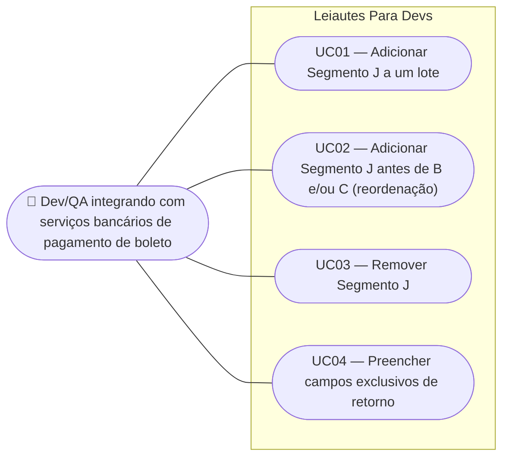

# SPEC — Segmento J do Registro de Detalhe (Pagamento de Boleto)

## Dados da SPEC

| Campo       | Valor                                                                                       |
| ----------- | -------------------------------------------------------------------------------------------- |
| US          | US29                                                                                          |
| Prioridade  | P2                                                                                            |
| Status      | Draft                                                                                         |
| Data        | 2026-09-12                                                                                    |
| Slug        | `us29-segmento-j-pagamento-boleto`                                                            |
| Card Trello | https://trello.com/c/69WkMazo/31-us29-segmento-j-do-registro-de-detalhe-pagamento-de-boleto |

## Contexto

Cada lote do CNAB240 já suporta Segmento A (obrigatório) + Segmento B (US26/US27) + Segmento C (US28), todos anexáveis via modal "Novo Segmento" do `LoteCard`, na ordem canônica A → B → C. Esta US estende o mesmo padrão para o **Segmento J**, que carrega os dados de pagamento de um boleto/título de cobrança: código de barras, nome do beneficiário, datas de vencimento e pagamento, valores (título, desconto, acréscimos, pagamento), referência do pagador e código da moeda (FEBRABAN v10.11, seção 5.3, `docs/cnab240_spec.md` linhas 256–284).

**Nota de divergência da FEBRABAN, deliberada e documentada:** pela especificação oficial, o Segmento J não convive com o Segmento A no mesmo lote — ele pertence a um Tipo de Serviço distinto ("Pagamento de Boleto/Título de Cobrança"), tipicamente acompanhado do Segmento J-52 (obrigatório, não documentado em `docs/cnab240_spec.md` e fora de escopo desta US). Por decisão de produto, esta US trata o J como mais um segmento opcional anexável ao lote (A + J, ou A + B + C + J), priorizando flexibilidade de teste sobre fidelidade estrita ao Serviço/Produto real. A divergência não recebe nenhum aviso visual na interface — fica documentada apenas nesta SPEC e no código.

Na arquitetura vigente (ADR-010, `src/composables/useCnab240.ts`), cada lote carrega um array flat `segmentos` com um discriminador `_tipo`, hoje tipado como `'A' | 'B' | 'C'` (`src/model/cnab240/types.ts`). Esta US estende esse tipo para incluir `'J'`, com no máximo um Segmento J por lote — mesma restrição de cardinalidade já aplicada a B e C.

## Escopo

### Incluso

- Spec TypeScript do Segmento J (`src/model/cnab240/segmentoJ.ts`) com os 21 campos da FEBRABAN v10.11 seção 5.3, em duas variantes — remessa e retorno — espelhando o padrão já usado pelo Segmento A (`SEGMENTO_A_REMESSA_CAMPOS`/`SEGMENTO_A_RETORNO_CAMPOS`).
- Extensão de `TipoSegmento` (`src/model/cnab240/types.ts`) para `'A' | 'B' | 'C' | 'J'` e de `ORDEM_SEGMENTO` (`src/composables/useCnab240.ts`) para a ordem canônica A → B → C → J.
- Habilitação da opção "Segmento J — Pagamento de Boleto/Título de Cobrança" no modal "Novo Segmento" do `LoteCard`, habilitada quando ainda não presente no lote.
- Card `SegmentoJCard.vue`, seguindo a mesma estrutura data-driven de `SegmentoBCard.vue`/`SegmentoCCard.vue`.
- Botão "Remover Segmento J" no rodapé do `SegmentoJCard`, com `ConfirmDialog` obrigatório antes da remoção — mesmo padrão do Segmento B (US27).
- Reordenação visual automática dos cards para A → B → C → J caso o usuário adicione J antes de B e/ou C.
- Cálculo automático do `Nº Seqüencial do Registro no Lote` (G038) para o Segmento J, via `posicaoSegmento(loteIndex, 'J')`.
- Atualização do `Qtde de Registros` no Trailer de Lote para incluir o Segmento J quando presente (+1 por Segmento J).
- Campos exclusivos de retorno (`Nosso Número`, `Ocorrências`): readonly/em branco em modo Remessa, editáveis em modo Retorno — padrão já usado no Segmento A.
- Integração com `FilePreviewModal`: Segmento J serializado em linha de 240 caracteres na posição correta, após A, B e/ou C.
- Desabilitação total do botão "Novo Segmento" quando A + B + C + J já estão presentes, com tooltip atualizado.

### Excluído

- Segmento J-52 (obrigatório junto ao J pela FEBRABAN real, mas não documentado em `docs/cnab240_spec.md`) — débito técnico registrado para US futura.
- Qualquer aviso visual na UI sobre a divergência do Segmento J não conviver com o Segmento A no Serviço/Produto real da FEBRABAN.
- Validação de tipo, tamanho e obrigatoriedade em nível de campo — US07 (validação em tempo real) e US08 (mensagens específicas).
- Adoção do componente `MoedaBrlInput` (US25) nos quatro campos de valor do Segmento J (Valor do Título, Desconto, Acréscimos, Valor Pagamento) — US futura, mesmo tratamento dado ao Segmento C na US28/US31.
- Duplicação de Segmento J ou do lote — trilho já apontado como US futura para A, B e C.
- Bloqueio condicional de download baseado em Tipo de Serviço — não se aplica ao Segmento J nesta US, diferente da regra estrutural do Segmento C sob TS `'23'` (US32).
- Comportamento específico do modo Retorno além da liberação dos dois campos já previstos (`Nosso Número`, `Ocorrências`) — o restante dos campos do Segmento J não distingue remessa de retorno.
- Rótulo alternativo para qualquer campo do Segmento J — mantém-se a nomenclatura FEBRABAN.

## Regras de Negócio

### RN01 — Segmento J é opcional e único por lote

O Segmento J só é serializado no arquivo se estiver presente no lote. Um lote é válido com ou sem Segmento J, independentemente de possuir A, B e/ou C. No máximo um Segmento J por lote — mesma cardinalidade já aplicada aos Segmentos B e C (ADR-010).

### RN02 — Convivência deliberada com o Segmento A (divergência FEBRABAN documentada)

O Segmento J pode ser adicionado a qualquer lote que já tenha Segmento A, independentemente do Tipo de Serviço do Header de Lote e independentemente da presença de Segmento J-52. Esta é uma divergência intencional da spec FEBRABAN real (onde o Segmento J pertence a um Serviço/Produto próprio, incompatível com o Segmento A) — decisão de produto documentada aqui e no código-fonte (`segmentoJ.ts`), sem qualquer aviso visual ao usuário.

### RN03 — Ordem canônica de segmentos no lote

A ordem dos segmentos dentro de um lote é sempre: Segmento A → Segmento B (se presente) → Segmento C (se presente) → Segmento J (se presente). Essa ordem é imposta tanto na serialização quanto na apresentação visual dos cards no formulário — extensão direta da RN03 da US28.

### RN04 — Reordenação visual ao adicionar J antes de B e/ou C

Se o usuário adicionar o Segmento J antes do Segmento B e/ou C (por exemplo, lote com A + J e depois o usuário decide adicionar C), o composable reorganiza o array `segmentos` do lote para a ordem canônica A → B → C → J — mesmo mecanismo da RN07 da US28, estendido para o novo tipo. Os números sequenciais G038 dos segmentos afetados são recalculados na reordenação.

### RN05 — Posição sequencial do Segmento J

O `Nº Seqüencial do Registro no Lote` (G038, posições 9–13) do Segmento J é calculado automaticamente por `posicaoSegmento(loteIndex, 'J')` e é sempre o maior número sequencial dos segmentos anteriores do mesmo lote + 1. O campo é somente-leitura para o usuário.

### RN06 — Contagem de registros no Trailer de Lote

O campo `Qtde de Registros` (G057) do Trailer de Lote soma todos os segmentos presentes no lote. Com Segmento J ativo, cada lote que o contém adiciona +1 à contagem já estabelecida pelas US26/US28.

### RN07 — Habilitação da opção no modal "Novo Segmento"

Ao abrir o modal "Novo Segmento" do `LoteCard`, a opção "Segmento J — Pagamento de Boleto/Título de Cobrança" reflete o estado atual do lote: habilitada se o Segmento J ainda não está presente, desabilitada caso já esteja.

Se A, B, C e J já estiverem todos presentes, o botão "Novo Segmento" no `LoteCard` fica desabilitado, com tooltip atualizado informando que todos os segmentos disponíveis já foram adicionados a este lote.

### RN08 — Botão "Remover Segmento J"

O `SegmentoJCard` exibe, no rodapé, um botão "Remover Segmento J" (estilo outline, cor `negative`, ícone `mdi-delete`), sempre visível e sempre habilitado — mesmo padrão estrutural do botão equivalente do Segmento B (US27, RN01).

Antes de remover, um `ConfirmDialog` é exibido sempre, independentemente de o Segmento J estar vazio ou preenchido:

- **Título:** _"Remover Segmento J?"_
- **Mensagem:** _"Todos os dados preenchidos serão descartados. Esta ação não pode ser desfeita."_
- **Botões:** "Cancelar" (flat) | "Remover" (`color="negative"`)

Ao confirmar, o Segmento J é removido do array `segmentos` do lote. Nenhum toast de sucesso é exibido — o desaparecimento do card é o feedback suficiente (mesma regra do Segmento B, US27 RN08).

### RN09 — Reatividade cascata da remoção

Ao remover o Segmento J: a opção "Segmento J" volta a ficar habilitada no modal "Novo Segmento"; `trailerLote.quantidadeRegistros` decrementa em 1; os números G038 dos segmentos subsequentes do mesmo lote são recomputados automaticamente pela reatividade do Vue, sem trigger manual.

### RN10 — Campos exclusivos de modo Retorno

Os campos `Nosso Número` (18.3J, posições 203–222) e `Ocorrências` (21.3J, posições 231–240) seguem o mesmo padrão já estabelecido pelo Segmento A (`SEGMENTO_A_REMESSA_CAMPOS`/`SEGMENTO_A_RETORNO_CAMPOS`):

- **Modo Remessa:** ambos os campos são `readonly`, preenchidos com `valorFixo` em branco.
- **Modo Retorno:** ambos os campos tornam-se editáveis, sem valor fixo.

Os demais 19 campos do Segmento J não distinguem remessa de retorno.

## Use Cases



### UC01 — Adicionar Segmento J a um lote

**Ator:** Dev/QA integrando com serviços bancários de pagamento de boleto
**Precondição:** Lote com Segmento A presente. Segmento J ainda não adicionado a este lote.

**Fluxo principal:**

1. Usuário clica em "Novo Segmento" no `LoteCard`
2. Sistema abre o modal "Selecionar tipo de segmento"
3. Modal exibe "Segmento J — Pagamento de Boleto/Título de Cobrança" habilitada; opções já usadas aparecem desabilitadas
4. Usuário seleciona "Segmento J" e confirma
5. Modal fecha; um novo `SegmentoJCard` é renderizado na ordem canônica A → B → C → J (RN03)
6. Todos os 21 campos editáveis do Segmento J são exibidos
7. O botão "Novo Segmento" continua visível até que A + B + C + J estejam todos presentes, caso em que fica desabilitado (RN07)

**Pós-condição:** O lote contém Segmento A (+ B/C se já existiam) + Segmento J. Ao gerar o arquivo, o Segmento J aparece na linha correspondente, ao final da sequência de segmentos do lote.

### UC02 — Adicionar Segmento J antes de B e/ou C (reordenação)

**Ator:** Dev/QA integrando com serviços bancários de pagamento de boleto
**Precondição:** Lote contém apenas Segmento A.

**Fluxo principal:**

1. Usuário adiciona Segmento J via modal — lote passa a ter A + J (nesta ordem visual)
2. Usuário clica novamente em "Novo Segmento" e adiciona Segmento C
3. Sistema insere o Segmento C entre A e J, reordenando a exibição para A → C → J (RN04)
4. Números G038 dos segmentos afetados são recalculados; o Segmento J ganha novo número

**Pós-condição:** Ordem final visual e no arquivo respeita sempre A → B → C → J, independentemente da ordem de adição.

### UC03 — Remover Segmento J

**Ator:** Dev/QA integrando com serviços bancários de pagamento de boleto
**Precondição:** Lote com Segmento J presente, vazio ou preenchido.

**Fluxo principal:**

1. Usuário clica em "Remover Segmento J" no rodapé do `SegmentoJCard`
2. Sistema exibe o `ConfirmDialog` com título "Remover Segmento J?" (RN08)
3. Usuário clica em "Remover"
4. Segmento J é removido do array `segmentos` do lote
5. `SegmentoJCard` desmonta; opção "Segmento J" re-habilita no modal; `trailerLote.quantidadeRegistros` decrementa; G038 dos segmentos subsequentes recomputa (RN09)

**Fluxo alternativo — cancelar:**

- No passo 3, o usuário clica em "Cancelar" ou pressiona `Esc`; o diálogo fecha e nenhuma alteração ocorre

**Pós-condição:** Lote sem Segmento J; arquivo serializado não contém mais a linha correspondente; dados anteriormente preenchidos não são recuperáveis (sem undo).

### UC04 — Preencher campos exclusivos de retorno

**Ator:** Dev/QA integrando com serviços bancários de pagamento de boleto
**Precondição:** Segmento J presente em um lote.

**Fluxo principal:**

1. Em modo Remessa, usuário observa que os campos "Nosso Número" e "Ocorrências" estão `readonly`, em branco
2. Usuário alterna o tipo de arquivo para Retorno (US01)
3. Os campos "Nosso Número" e "Ocorrências" tornam-se editáveis
4. Usuário preenche os valores

**Fluxo alternativo — voltar para Remessa:**

- No passo 2 revertido, os campos voltam a `readonly`/em branco, sem preservar o valor digitado — mesmo comportamento já adotado pelo Segmento A ao alternar remessa/retorno

**Pós-condição:** Campos de retorno preenchidos apenas quando o modo do arquivo é Retorno; arquivo serializado reflete o valor correto conforme o modo vigente.

## Critérios de Aceitação

**Cenário: Opção Segmento J habilitada no modal**

```gherkin
Dado que um lote tem Segmento A e não possui Segmento J
Quando o usuário abre o modal "Novo Segmento"
Então a opção "Segmento J — Pagamento de Boleto/Título de Cobrança" está habilitada
```

**Cenário: Opção Segmento J desabilitada quando já presente**

```gherkin
Dado que um lote já possui Segmento J
Quando o usuário abre o modal "Novo Segmento"
Então a opção "Segmento J — Pagamento de Boleto/Título de Cobrança" está desabilitada
```

**Cenário: Botão "Novo Segmento" desabilitado com A+B+C+J presentes**

```gherkin
Dado que um lote possui Segmento A, Segmento B, Segmento C e Segmento J
Quando o usuário visualiza o card do lote
Então o botão "Novo Segmento" está desabilitado
E exibe um tooltip informando que todos os segmentos disponíveis já foram adicionados
```

**Cenário: SegmentoJCard renderizado com todos os campos**

```gherkin
Dado que o usuário seleciona "Segmento J" no modal e confirma
Quando o SegmentoJCard é renderizado
Então todos os 21 campos do Segmento J (FEBRABAN v10.11, seção 5.3) são exibidos como editáveis ou readonly conforme o campo
```

**Cenário: Ordem canônica de exibição e serialização**

```gherkin
Dado que um lote possui Segmento A, Segmento B, Segmento C e Segmento J, adicionados em qualquer ordem
Quando o usuário visualiza os cards do lote ou abre o FilePreviewModal
Então os segmentos aparecem sempre na ordem A, B, C, J
```

**Cenário: Reordenação ao adicionar J antes de B e C**

```gherkin
Dado que um lote possui apenas Segmento A e Segmento J (nesta ordem)
Quando o usuário adiciona o Segmento C
Então a ordem de exibição passa a ser A, C, J
E o número sequencial (G038) do Segmento J é recalculado
```

**Cenário: Numeração sequencial do Segmento J (G038)**

```gherkin
Dado que um lote possui Segmento A (G038=1), Segmento B (G038=2) e Segmento C (G038=3)
Quando o usuário adiciona o Segmento J
Então o Segmento J recebe G038=4
E o campo é exibido como somente-leitura
```

**Cenário: Trailer de Lote soma o Segmento J**

```gherkin
Dado que um lote tem Qtde de Registros calculada sem Segmento J
Quando o usuário adiciona um Segmento J ao lote
Então Qtde de Registros do Trailer de Lote incrementa em 1
```

**Cenário: Remoção do Segmento J exige confirmação**

```gherkin
Dado que um lote possui Segmento J
Quando o usuário clica em "Remover Segmento J"
Então o ConfirmDialog é exibido com título "Remover Segmento J?" e mensagem "Todos os dados preenchidos serão descartados. Esta ação não pode ser desfeita."
```

**Cenário: Confirmação remove o Segmento J**

```gherkin
Dado que o ConfirmDialog de remoção do Segmento J está aberto
Quando o usuário clica em "Remover"
Então o Segmento J é removido do lote
E o SegmentoJCard desmonta
E nenhum toast de sucesso é exibido
E a opção "Segmento J" volta a ficar habilitada no modal "Novo Segmento"
E Qtde de Registros do Trailer de Lote decrementa em 1
```

**Cenário: Cancelamento da remoção não altera o estado**

```gherkin
Dado que o ConfirmDialog de remoção do Segmento J está aberto
Quando o usuário clica em "Cancelar" ou pressiona Esc
Então o diálogo fecha
E o SegmentoJCard permanece renderizado com os mesmos dados
```

**Cenário: Campos de retorno readonly em modo Remessa**

```gherkin
Dado que um lote possui Segmento J e o arquivo está em modo Remessa
Quando o usuário visualiza os campos "Nosso Número" e "Ocorrências"
Então ambos estão readonly, com valor em branco
```

**Cenário: Campos de retorno editáveis em modo Retorno**

```gherkin
Dado que um lote possui Segmento J e o arquivo está em modo Retorno
Quando o usuário visualiza os campos "Nosso Número" e "Ocorrências"
Então ambos estão editáveis
```

**Cenário: Serialização em 240 caracteres na posição correta**

```gherkin
Dado que um lote possui Segmento A, Segmento C e Segmento J (nesta ordem canônica)
Quando o usuário abre o FilePreviewModal
Então a linha do Segmento J aparece após a linha do Segmento C
E a linha tem exatamente 240 caracteres
```

**Cenário: Nenhum aviso visual sobre a divergência FEBRABAN**

```gherkin
Dado que um lote possui Segmento A e Segmento J
Quando o usuário visualiza o LoteCard ou qualquer card de segmento
Então nenhum aviso, ícone ou tooltip menciona a divergência do Segmento J com a spec FEBRABAN real
```

## Restrições Conhecidas

- O card do Trello referencia um componente `RegistroDetalheCard`, que não existe na base de código atual. Na arquitetura vigente (ADR-010), a montagem de segmentos ocorre no `LoteCard.vue`, e o "Registro de Detalhe" é um conceito representado pelo array flat `segmentos` do lote, não um componente próprio. Esta SPEC usa a nomenclatura real dos componentes (`LoteCard`, `SegmentoJCard`).
- `TipoSegmento` (`src/model/cnab240/types.ts`) e `ORDEM_SEGMENTO` (`src/composables/useCnab240.ts`) são pontos de extensão centrais desta US — qualquer lugar do código que faça pattern-matching exaustivo sobre `TipoSegmento` (ex.: `switch` sem `default`) precisa ser localizado e atualizado. Levantamento desses pontos cabe ao `PLAN.md`.
- O padrão de campos remessa/retorno do Segmento A usa dois arrays de campos distintos (`SEGMENTO_A_REMESSA_CAMPOS`/`SEGMENTO_A_RETORNO_CAMPOS`). A forma de replicar esse padrão para os dois campos do Segmento J (arrays completos duplicados vs. composição de um array base com os dois campos variáveis) é decisão técnica do `PLAN.md`.
- O campo `19.3J Código Moeda` tem `Default` vazio na tabela lida de `docs/cnab240_spec.md`, mas a descrição indica `09=Real`. <!-- TODO: verify against FEBRABAN spec — confirmar se o campo deve nascer com valorFixo '09' ou editável sem default -->

## Custo da IA

| Métrica           | Valor                       |
| ----------------- | --------------------------- |
| Modelo            | claude-sonnet-5              |
| Tokens de entrada | ~55.000 (maioria em cache)  |
| Tokens de saída   | ~7.000                      |
| Custo (USD)       | ~$0,45                      |
| Taxa de câmbio    | 1 USD = R$5,50 (2026-09-12) |
| Custo (BRL)       | ~R$2,48                     |

> Valores estimados. A leitura do card, do PRD/ADRs relevantes, da spec FEBRABAN do Segmento J e das SPECs de US26/27/28, seguida da escrita integral desta SPEC, sem entrevista adicional (nenhuma dúvida ou inconsistência de negócio identificada).

## Custo Estimado do Refinamento (12/09/2026)

> Refinado em: 12/09/2026

| Métrica              | Valor                       |
| --------------------- | --------------------------- |
| Modelo                | claude-sonnet-5              |
| Tokens de entrada     | ~55.000 (maioria em cache)  |
| Tokens de saída       | ~7.000                      |
| Custo estimado (USD)  | ~$0,45                      |
| Taxa de câmbio        | 1 USD = R$5,50 (12/09/2026) |
| Custo estimado (BRL)  | ~R$2,48                     |
