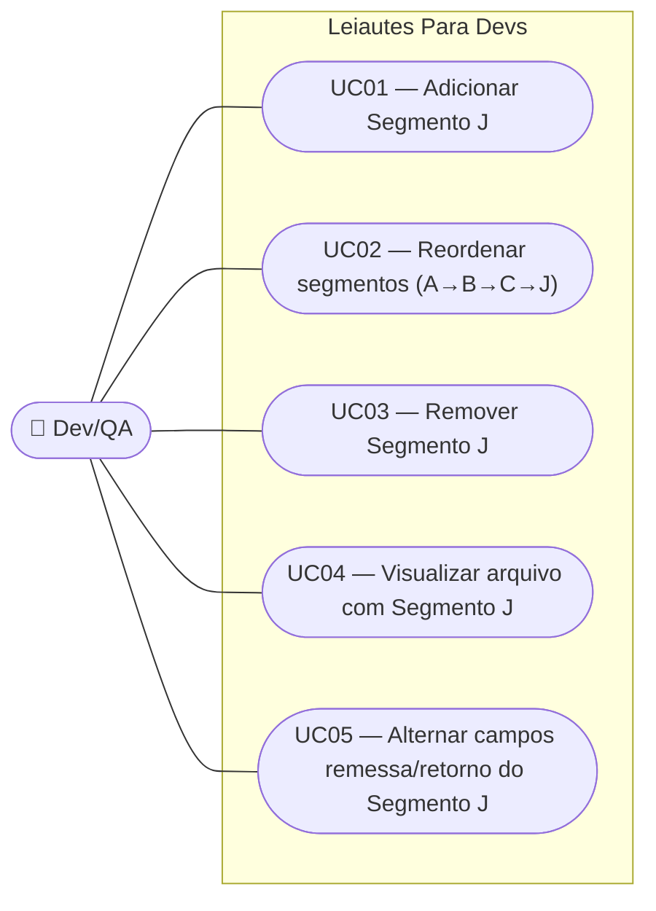

# SPEC — Segmento J do Registro de Detalhe (Pagamento de Boleto)

## Dados da SPEC

| Campo         | Valor                                                            |
| ------------- | ----------------------------------------------------------------- |
| US            | US29                                                               |
| Prioridade    | P2                                                                 |
| Status        | Draft                                                              |
| Data          | 2026-09-09                                                         |
| Slug          | `us29-segmento-j-pagamento-boleto`                                 |
| Card Trello   | https://trello.com/c/69WkMazo/31-us29-segmento-j-do-registro-de-detalhe-pagamento-de-boleto |

## Contexto

O Registro de Detalhe do CNAB240 (Serviço de Pagamentos) já suporta Segmento A (obrigatório, US04) + Segmento B (opcional, US26/US27) + Segmento C (opcional, US28), todos anexáveis via modal "Novo Segmento" e reordenados automaticamente em ordem canônica. Esta US estende o mesmo padrão de extensão consolidado para o **Segmento J**, que carrega os dados de um pagamento de boleto/título de cobrança: código de barras, nome do beneficiário, datas de vencimento e pagamento, valores (título, desconto, acréscimos, pagamento), referência do pagador e código da moeda.

**Nota de divergência da FEBRABAN (decisão de produto):** pela Tabela de Segmentos por Serviço da FEBRABAN v10.11 (`docs/cnab240_spec.md`, seção 7), o Segmento J é usado exclusivamente no Tipo de Serviço "Pagamento de Boleto/Título de Cobrança" e não convive com o Segmento A no mesmo Registro de Detalhe — nesse serviço, o registro de detalhe é composto apenas por J + J-52 (obrigatório). A ferramenta, no entanto, prioriza flexibilidade de teste sobre fidelidade estrita ao layout real: o Segmento J é tratado como mais um segmento opcional anexável ao Registro de Detalhe existente (A + J, ou A + B + C + J), reaproveitando o mesmo modal "Novo Segmento" de B e C. Essa divergência é documentada apenas em código/SPEC — sem aviso visual na interface (decisão confirmada na entrevista de negócio desta US).

O Segmento J-52 (obrigatório junto ao J pela FEBRABAN, contendo dados adicionais como CNPJ pagador/beneficiário) **não está documentado** em `docs/cnab240_spec.md` e fica fora do escopo desta US como débito técnico explícito.

## Escopo

### Incluso

- Spec TypeScript do Segmento J (`src/model/cnab240/segmentoJ.ts`) com os 21 campos da FEBRABAN v10.11 seção 5.3, seguindo o padrão remessa/retorno de `segmentoA.ts` (duas constantes exportadas: `SEGMENTO_J_REMESSA_CAMPOS` e `SEGMENTO_J_RETORNO_CAMPOS`)
- Habilitação da opção "Segmento J — Pagamento de Boleto/Título de Cobrança" no modal "Novo Segmento" (criado em US26, estendido em US28)
- Card `SegmentoJCard.vue` renderizando os campos editáveis do Segmento J, seguindo o mesmo padrão data-driven de `SegmentoACard`/`SegmentoBCard`/`SegmentoCCard`
- Cálculo automático do `Nº Seqüencial do Registro no Lote` (G038) para o Segmento J
- Atualização do `Qtde de Registros` no Trailer de Lote para incluir o Segmento J quando presente
- Reordenação visual automática dos cards para a ordem canônica A → B → C → J caso o usuário adicione J antes de B e/ou C
- Lógica de habilitação/desabilitação das opções no modal "Novo Segmento" para refletir os segmentos já presentes no Registro de Detalhe (agora considerando A, B, C e J)
- Desabilitação total do botão "Novo Segmento" quando A + B + C + J já estão presentes, com tooltip atualizado
- Botão "Remover Segmento J" no rodapé do `SegmentoJCard`, com `ConfirmDialog` obrigatório antes da remoção — espelha 100% o padrão já implementado para o Segmento B (US27)
- Comportamento remessa/retorno para os campos "Nosso Número" (posições 203–222) e "Ocorrências" (posições 231–240): `readonly` com valor em branco no modo Remessa, editáveis no modo Retorno — mesmo padrão do Segmento A (US04)
- Integração com `FilePreviewModal`: Segmento J serializado em linha de 240 caracteres, na posição correta da ordem canônica (após A, B e/ou C, conforme presentes)

### Excluído

- Segmento J-52 (obrigatório junto ao J pela FEBRABAN, mas não documentado em `docs/cnab240_spec.md`) — débito técnico para US futura <!-- TODO: verify against FEBRABAN spec — buscar layout oficial do Segmento J-52 antes de implementar -->
- Aviso visual na UI (tooltip/ícone de info) sobre a divergência do Segmento J não conviver com A na FEBRABAN real — decisão confirmada na entrevista de negócio: divergência fica documentada apenas em código/SPEC
- Validação de tipo, tamanho e obrigatoriedade em nível de campo — US07 (validação em tempo real) e US08 (mensagens específicas)
- Máscara de formatação nos campos de valor (BRL, com separador decimal) — US25 trata BRL para valores monetários; aplicação aos campos do Segmento J fica sob a US25
- Duplicação de Segmento J ou de Registro de Detalhe completo — US futura
- Bloqueio condicional de download baseado em Tipo de Serviço — diferente do Segmento C (RN08–RN10 da US28, ligado ao TS `'23'`), não há Tipo de Serviço que torne o Segmento J obrigatório nesta US (o serviço "Pagamento de Boleto" que exigiria J+J-52 pela FEBRABAN não é modelado por esta US)
- Tratamento de erros diretos ao usuário no `FilePreviewModal` — US15

## Regras de Negócio

### RN01 — Posição sequencial do Segmento J

O `Nº Seqüencial do Registro no Lote` (G038, posições 9–13) do Segmento J deve ser calculado automaticamente pelo composable e igual ao maior número sequencial dos segmentos anteriores do mesmo Registro de Detalhe + 1. Como o Segmento J sempre ocupa a última posição na ordem canônica (RN03), seu número é sempre `número do último segmento presente (A, B ou C) + 1`. O campo é somente-leitura para o usuário.

### RN02 — Segmento J é opcional e coexiste com A/B/C (divergência de produto documentada)

O Segmento J só é serializado no arquivo se estiver presente no Registro de Detalhe. Diferente da regra estrita da FEBRABAN (onde J substitui A para o Tipo de Serviço "Pagamento de Boleto"), esta ferramenta permite que o Segmento J coexista com A, B e C no mesmo Registro de Detalhe, por decisão de produto voltada à flexibilidade de cenários de teste. Nenhuma validação de Tipo de Serviço bloqueia ou exige a presença do Segmento J.

### RN03 — Ordem canônica de segmentos no Registro de Detalhe (A → B → C → J)

A ordem dos segmentos dentro de um Registro de Detalhe é sempre: Segmento A → Segmento B (se presente) → Segmento C (se presente) → Segmento J (se presente). Essa ordem é imposta tanto na serialização quanto na apresentação visual dos cards no formulário. O Segmento J ocupa sempre a última posição, independentemente da ordem em que o usuário o adicionou.

### RN04 — Contagem de registros no Trailer de Lote

O campo `Qtde de Registros` (G057, posições 18–23) do Trailer de Lote soma todos os registros de tipo 1, 3 e 5 do lote. Com Segmento J ativo, cada Registro de Detalhe que contém J adiciona +1 à contagem já estabelecida pelas US26/US28. <!-- TODO: verify counting rule against FEBRABAN spec — seção 2.1 -->

### RN05 — Habilitação de opções no modal "Novo Segmento"

Ao abrir o modal "Novo Segmento" num Registro de Detalhe, cada opção reflete o estado atual do RD:

- Segmento B: habilitado se ainda não presente; desabilitado caso já esteja presente
- Segmento C: habilitado se ainda não presente; desabilitado caso já esteja presente
- Segmento J: habilitado se ainda não presente; desabilitado caso já esteja presente

Se todos os segmentos opcionais (B, C, J) já estiverem presentes, o botão "Novo Segmento" no card fica desabilitado (não é possível abrir o modal), com tooltip _"Todos os segmentos disponíveis já foram adicionados a este Registro de Detalhe."_

### RN06 — Reordenação automática ao adicionar J antes de B e/ou C

Se o usuário adicionar o Segmento J antes do Segmento B e/ou C (por exemplo, o RD estava com A + J e depois o usuário decide adicionar C via modal), o composable deve reorganizar o array de segmentos do Registro de Detalhe para a ordem canônica A → B → C → J. O Segmento J permanece sempre na última posição — nenhuma inserção o move para o meio da lista.

A reordenação também recalcula os números sequenciais G038 dos segmentos afetados (o Segmento J ganha um novo número sempre que um segmento é inserido antes dele).

### RN07 — Botão "Remover Segmento J" no rodapé do SegmentoJCard

O `SegmentoJCard` exibe, ao final do card em um `q-card-section` dedicado, um botão com label _"Remover Segmento J"_, ícone `mdi-delete`, estilo `outline`, cor `negative` — mesmo padrão estrutural do botão "Remover Segmento B" (US27). É sempre visível e sempre habilitado.

### RN08 — Confirmação obrigatória antes de remover o Segmento J

Antes de executar a remoção, um `ConfirmDialog` é exibido, sempre (independentemente de o Segmento J estar vazio ou preenchido):

- **Título:** _"Remover Segmento J?"_
- **Mensagem:** _"Todos os dados preenchidos serão descartados. Esta ação não pode ser desfeita."_
- **Botões:** "Cancelar" (ação secundária, flat) | "Remover" (ação destrutiva, `color="negative"`)

Se o usuário cancelar (botão "Cancelar" ou tecla `Esc`), nenhuma alteração ocorre.

### RN09 — Remoção zera o slot segmentoJ e recomputa estado derivado

Ao confirmar, `removerSegmentoJ(loteIndex, registroIndex)` remove o Segmento J do array flat de segmentos do Registro de Detalhe alvo. Como consequência reativa:

- A opção "Segmento J" do modal "Novo Segmento" volta a ficar disponível
- O `Nº Seqüencial do Registro no Lote` (G038) dos segmentos subsequentes do lote é recomputado
- `trailerLote.quantidadeRegistros` decrementa em 1

Nenhum outro estado é tocado — os demais segmentos do mesmo registro, os demais registros do lote e os demais lotes permanecem inalterados.

### RN10 — Sem feedback redundante na remoção

Não há toast de sucesso após a remoção do Segmento J. O desaparecimento do `SegmentoJCard` da tela é o feedback suficiente (regra espelhada da US13/US27). O foco não é gerenciado programaticamente após o `ConfirmDialog` fechar.

### RN11 — Comportamento remessa/retorno dos campos "Nosso Número" e "Ocorrências"

Seguindo o padrão já estabelecido pelo Segmento A (US04), dois campos do Segmento J divergem entre os modos Remessa e Retorno:

- **Nosso Número** (posições 203–222): `readonly` com valor em branco no modo Remessa; editável (opcional) no modo Retorno, permitindo simular o número atribuído pelo banco
- **Ocorrências** (posições 231–240): `readonly` com valor em branco no modo Remessa; editável (opcional) no modo Retorno, permitindo simular os códigos de ocorrência retornados pelo banco

Os demais campos do Segmento J são idênticos entre remessa e retorno. O campo "CNAB" (posições 225–230, Uso Exclusivo FEBRABAN) é `readonly` com valor fixo em branco em ambos os modos.

### RN12 — Sem aviso visual de divergência da FEBRABAN

Nenhum ícone, tooltip ou mensagem é exibido ao usuário final informando que o Segmento J normalmente não convive com o Segmento A em um arquivo real. A divergência é documentada apenas nesta SPEC e nos comentários do código-fonte.

## Use Cases



### UC01 — Adicionar Segmento J a um Registro de Detalhe

**Ator:** Dev/QA
**Precondição:** O lote está aberto. O Segmento A do Registro de Detalhe está presente. O Segmento J ainda não foi adicionado a este RD.

**Fluxo principal:**

1. Usuário localiza o botão "Novo Segmento" abaixo do card do Registro de Detalhe
2. Usuário clica em "Novo Segmento"
3. Sistema abre o modal "Selecionar tipo de segmento"
4. Modal exibe as opções disponíveis, incluindo "Segmento J — Pagamento de Boleto/Título de Cobrança"; opções já usadas aparecem desabilitadas
5. Usuário seleciona "Segmento J" e confirma
6. Modal fecha; um novo card `SegmentoJCard` é renderizado ao final da lista de segmentos existentes (ordem canônica — RN03)
7. Todos os campos editáveis do Segmento J são exibidos
8. O botão "Novo Segmento" continua visível até que A + B + C + J estejam presentes, caso em que fica desabilitado

**Pós-condição:** O Registro de Detalhe contém Segmento A (+ B e/ou C se já existiam) + Segmento J. Ao gerar o arquivo, o Segmento J aparece na última linha do RD.

### UC02 — Adicionar Segmento J antes de B e/ou C (reordenação)

**Ator:** Dev/QA
**Precondição:** RD contém apenas Segmento A.

**Fluxo principal:**

1. Usuário clica em "Novo Segmento" e adiciona Segmento J via modal
2. RD passa a ter A + J (nesta ordem visual)
3. Usuário clica de novo em "Novo Segmento"
4. Modal exibe Segmento B e Segmento C habilitados; Segmento J desabilitado (já presente)
5. Usuário seleciona Segmento C e confirma
6. Sistema insere o Segmento C entre A e J, reordenando a exibição para A → C → J (RN06)
7. Números G038 dos segmentos afetados são recalculados; o Segmento J ganha novo número

**Pós-condição:** Ordem final visual e no arquivo respeita sempre A → B → C → J, com J na última posição.

### UC03 — Remover Segmento J

**Ator:** Dev/QA
**Precondição:** RD contém Segmento J (vazio ou preenchido).

**Fluxo principal:**

1. Usuário clica em "Remover Segmento J" no rodapé do `SegmentoJCard`
2. Sistema exibe o `ConfirmDialog` (RN08)
3. Usuário clica em "Remover"
4. Sistema executa `removerSegmentoJ(loteIndex, registroIndex)`; o Segmento J é removido do array flat de segmentos
5. `SegmentoJCard` desmonta; opção "Segmento J" do modal do `RegistroDetalheCard` re-habilita; `trailerLote.quantidadeRegistros` decrementa; números G038 dos segmentos subsequentes recomputam

**Fluxo alternativo — usuário cancela:**

- Usuário clica em "Cancelar" ou pressiona `Esc`; diálogo fecha; nenhuma alteração de estado ocorre

**Pós-condição:** Registro de Detalhe não contém mais Segmento J; arquivo serializado no `FilePreviewModal` não inclui a linha removida.

### UC04 — Visualizar arquivo com Segmento J no FilePreviewModal

**Ator:** Dev/QA
**Precondição:** Ao menos um lote tem RD com Segmento A + Segmento J (com ou sem B e/ou C).

**Fluxo principal:**

1. Usuário clica em "Ver arquivo" no header global
2. `FilePreviewModal` abre e serializa o estado
3. As linhas são exibidas na ordem: Header de Arquivo → Header de Lote → Segmento A → (Segmento B) → (Segmento C) → Segmento J → Trailer de Lote → Trailer de Arquivo
4. Cada linha tem exatamente 240 caracteres
5. O `Nº Seqüencial do Registro no Lote` (G038) em cada segmento respeita a sequência do lote

**Pós-condição:** Arquivo exibido é estruturalmente válido para RDs com A + J, A + B + J, A + C + J ou A + B + C + J.

### UC05 — Alternar campos remessa/retorno do Segmento J

**Ator:** Dev/QA
**Precondição:** Segmento J presente em um Registro de Detalhe.

**Fluxo principal:**

1. Usuário está em modo Remessa; campos "Nosso Número" e "Ocorrências" do Segmento J aparecem `readonly`, em branco
2. Usuário alterna o toggle Remessa/Retorno (global do app)
3. Sistema troca a constante de campos ativa para `SEGMENTO_J_RETORNO_CAMPOS`
4. Campos "Nosso Número" e "Ocorrências" tornam-se editáveis

**Pós-condição:** O `SegmentoJCard` reflete corretamente os campos habilitados conforme o modo selecionado, sem perda dos demais dados já preenchidos.

## Critérios de Aceitação

**Cenário: Adicionar Segmento J via modal**

```gherkin
Dado que um Registro de Detalhe contém apenas Segmento A
E o Segmento J ainda não foi adicionado
Quando o usuário clica em "Novo Segmento"
Então um modal é exibido com a opção "Segmento J — Pagamento de Boleto/Título de Cobrança" habilitada
Quando o usuário seleciona "Segmento J" e confirma
Então um novo card SegmentoJCard é renderizado ao final da lista de segmentos do RD
```

**Cenário: Reordenação automática A → C → J**

```gherkin
Dado que um RD contém A + J nesta ordem (J foi adicionado antes de C)
Quando o usuário adiciona Segmento C via modal
Então a ordem visual dos cards passa a ser: A → C → J
E o número G038 do Segmento J é recalculado (agora = número do C + 1)
```

**Cenário: Modal com todas as opções esgotadas**

```gherkin
Dado que um RD contém Segmento A + Segmento B + Segmento C + Segmento J
Quando o usuário paira sobre o botão "Novo Segmento"
Então o botão está desabilitado
E o tooltip exibe "Todos os segmentos disponíveis já foram adicionados a este Registro de Detalhe."
```

**Cenário: Remover Segmento J**

```gherkin
Dado que um Registro de Detalhe contém Segmento J
Quando o usuário clica em "Remover Segmento J"
Então o ConfirmDialog é exibido com título "Remover Segmento J?"
Quando o usuário clica em "Remover"
Então o SegmentoJCard desmonta
E a opção "Segmento J" volta a ficar disponível no modal "Novo Segmento"
E nenhum toast é exibido
```

**Cenário: Cancelar remoção do Segmento J**

```gherkin
Dado que o ConfirmDialog de remoção do Segmento J está aberto
Quando o usuário clica em "Cancelar" ou pressiona Esc
Então o diálogo fecha
E o SegmentoJCard permanece renderizado com os dados anteriores
```

**Cenário: Campos remessa/retorno do Segmento J**

```gherkin
Dado que o Segmento J está presente e o app está em modo Remessa
Então os campos "Nosso Número" e "Ocorrências" estão em estado readonly, com valor em branco
Quando o usuário alterna para o modo Retorno
Então os campos "Nosso Número" e "Ocorrências" tornam-se editáveis
```

**Cenário: Contagem no Trailer de Lote com A + J**

```gherkin
Dado que um lote tem 1 Registro de Detalhe com Segmento A + Segmento J
Então o campo "Qtde de Registros" do Trailer de Lote é 4
(Header de Lote + Segmento A + Segmento J + Trailer de Lote)
```

**Cenário: Serialização com A + B + C + J**

```gherkin
Dado que um RD tem Segmento A, B, C e J preenchidos
Quando o usuário abre o FilePreviewModal
Então a sequência de linhas do RD é: Segmento A, Segmento B, Segmento C, Segmento J
E cada linha tem exatamente 240 caracteres
```

**Cenário: Nenhum aviso visual de divergência**

```gherkin
Dado que um RD tem Segmento A + Segmento J
Quando o usuário visualiza o SegmentoJCard
Então nenhum ícone, tooltip ou mensagem menciona a divergência da FEBRABAN sobre J não conviver com A
```

## Custo da IA

| Métrica            | Valor              |
| ------------------ | ------------------ |
| Tokens de entrada  | ~95.000             |
| Tokens de saída    | ~7.500              |
| Custo estimado (USD) | ~$1,73            |
| Taxa de câmbio      | 1 USD = R$5,55 (2026-09-09) |
| Custo estimado (BRL) | ~R$9,60            |
| Modelo              | claude-sonnet-5     |

> Valores aproximados, apenas para a fase de geração do SPEC (leitura da spec CNAB240/SPECs relacionadas, entrevista de negócio/UX e escrita).
