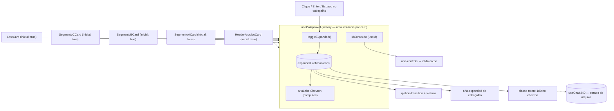
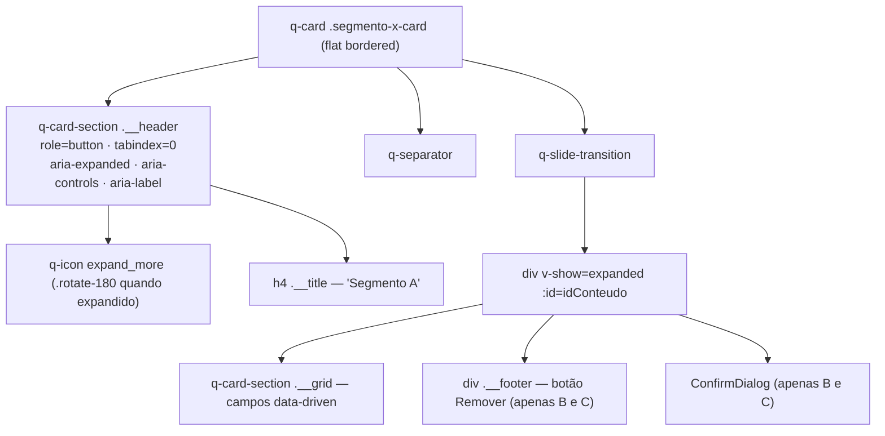

# PLAN — Recolher e expandir cards de Header de Arquivo e Segmentos

## Dados do Plano

| Campo               | Valor                                  |
| ------------------- | -------------------------------------- |
| Número da US        | US30                                   |
| Slug                | `us30-colapsar-cards-header-segmentos` |
| Stack               | Quasar + Vue 3 + TypeScript + Vitest   |
| Data de criação     | 2026-09-14                             |
| Data de modificação | —                                      |

---

## Resumo Técnico

Estender o padrão de colapso já validado na US14 (`LoteCard`: cabeçalho clicável com `role="button"`, chevron `expand_more` rotacionado 180°, corpo dentro de `<q-slide-transition>` com `v-show`) ao `HeaderArquivoCard` e aos três cards de Segmento.

Como a US toca quatro cards adicionais — totalizando cinco pontos com a mesma lógica — a duplicação de `ref` + função de toggle + `computed` de `aria-label` deixa de ser aceitável. Extrai-se um composable **factory** `useColapsavel()` em `src/composables/useColapsavel.ts`, que encapsula estado, toggle, `aria-label` dinâmico e geração do `id` de `aria-controls` (via `useId()` do Vue 3.5). O `LoteCard` é migrado para ele no mesmo esforço, eliminando a duplicação existente.

O estado de colapso permanece **local ao componente** (`ref` dentro da instância do composable), nunca em `useCnab240` nem em store Pinia. Isso satisfaz de graça a RN06 (independência total) e a RN08 (sem persistência entre desmontagem/remontagem), e é a única opção viável no modelo de dados atual: `SegmentoState extends Record<string, string>` (`src/composables/useCnab240.ts`), ou seja, um `_expanded: boolean` no estado do segmento quebraria a tipagem e vazaria para a serialização. Como consequência direta, a RN05 (Segmentos B e C nascem expandidos) é atendida pelo simples valor inicial `true` do `ref` — o card só é montado no instante em que o usuário o adiciona, então "montagem" e "adição" coincidem.

Os três cards de Segmento hoje são `<div>` + `<h4>` + `<q-separator>`; precisam ser reestruturados para `<q-card>` + `<q-card-section>` de cabeçalho, espelhando a anatomia do `LoteCard`.

---

## Componentes Afetados

| Componente                    | Ação      | Notas                                                                                                      |
| ----------------------------- | --------- | ---------------------------------------------------------------------------------------------------------- |
| `useColapsavel.ts`            | Criar     | Composable factory: `expanded`, `toggleExpanded`, `ariaLabelChevron`, `idConteudo`                         |
| `HeaderArquivoCard.vue`       | Modificar | Cabeçalho vira clicável; corpo em `q-slide-transition`; inicia expandido (RN02)                            |
| `SegmentoACard.vue`           | Modificar | Reestruturar `<div>` → `<q-card>` + header clicável; inicia **recolhido** (RN04)                           |
| `SegmentoBCard.vue`           | Modificar | Mesma reestruturação; inicia expandido (RN05); footer de remoção move para dentro do corpo colapsável      |
| `SegmentoCCard.vue`           | Modificar | Idem `SegmentoBCard`                                                                                       |
| `LoteCard.vue`                | Modificar | Migração para `useColapsavel` (refatoração sem mudança de comportamento observável)                        |
| `useColapsavel.spec.ts`       | Criar     | Testes unitários do composable                                                                             |
| `HeaderArquivoCard.spec.ts`   | Modificar | Novos casos de colapso/aria                                                                                |
| `SegmentoACard.spec.ts`       | Modificar | Novos casos de colapso/aria + estado inicial recolhido                                                     |
| `SegmentoBCard.spec.ts`       | Modificar | Idem, estado inicial expandido                                                                             |
| `SegmentoCCard.spec.ts`       | Modificar | Idem                                                                                                       |
| `LoteCard.spec.ts`            | Modificar | Escopar seletores `[aria-expanded]` ao cabeçalho do próprio lote (ver Riscos)                              |
| `us30-*.spec.ts` (Playwright) | Criar     | E2E dos cenários de aceitação                                                                              |
| E2E existentes de Segmento A  | Modificar | `us04`/`us07`/`us11`/`us12`/`us14` — expandir o Segmento A antes de interagir com seus campos (ver Riscos) |

---

## Estrutura de Dados

```ts
// src/composables/useColapsavel.ts

import { ref, computed, toValue, useId } from 'vue';
import type { Ref, ComputedRef, MaybeRefOrGetter } from 'vue';

/** Opções de configuração de uma instância de card colapsável. */
export interface UseColapsavelOptions {
  /**
   * Nome legível do card, usado no `aria-label` do cabeçalho
   * (ex.: `'Header de Arquivo'`, `'Segmento A do Lote 2'`).
   * Aceita getter/ref porque o nome depende de props reativas (`loteIndex`).
   */
  nomeCard: MaybeRefOrGetter<string>;

  /** Estado inicial do card. Padrão: `true` (expandido). */
  inicialmenteExpandido?: boolean;
}

/** API retornada por `useColapsavel()`. */
export interface UseColapsavelAPI {
  /** Estado corrente: `true` = expandido. */
  expanded: Ref<boolean>;
  /** Alterna o estado. Ligado a `@click`, `@keydown.enter` e `@keydown.space`. */
  toggleExpanded: () => void;
  /** `"Recolher <nomeCard>"` quando expandido, `"Expandir <nomeCard>"` quando recolhido. */
  ariaLabelChevron: ComputedRef<string>;
  /** Id único do bloco colapsável, para o par `aria-controls` / `id` (RN09). */
  idConteudo: string;
}

export function useColapsavel(options: UseColapsavelOptions): UseColapsavelAPI;
```

**Não há alteração no modelo de dados do arquivo.** `SegmentoState`, `LoteState` e `headerArquivo` em `src/composables/useCnab240.ts` permanecem intocados — o estado de colapso é puramente de apresentação e nunca chega ao serializador (`src/utils/serializer.ts`).

`useColapsavel` é uma **factory**, não um singleton: cada chamada em cada instância de componente cria seu próprio `ref`. É exatamente o que a RN06 exige. Fica fora do escopo das stores Pinia da ADR-002 (uma store por leiaute, para estado de domínio) — estado efêmero de UI local não se enquadra ali.

---

## Lógica Principal

1. **Composable `useColapsavel` (RN01, RN09)** — `expanded = ref(options.inicialmenteExpandido ?? true)`; `toggleExpanded()` inverte o valor; `ariaLabelChevron` = `` `${expanded.value ? 'Recolher' : 'Expandir'} ${toValue(options.nomeCard)}` ``; `idConteudo = useId()` (Vue 3.5, estável entre renders e único por instância, inclusive em SSR).

2. **Anatomia comum do cabeçalho colapsável** — replicada nos quatro cards, idêntica à do `LoteCard`:

   ```html
   <q-card-section
     class="<bloco>__header"
     role="button"
     tabindex="0"
     :aria-expanded="expanded ? 'true' : 'false'"
     :aria-controls="idConteudo"
     :aria-label="ariaLabelChevron"
     @click="toggleExpanded"
     @keydown.enter.prevent="toggleExpanded"
     @keydown.space.prevent="toggleExpanded"
   >
     <q-icon
       name="expand_more"
       class="<bloco>__chevron"
       :class="{ 'rotate-180': expanded }"
       aria-hidden="true"
     />
     <h2|h4 class="<bloco>__title">{{ titulo }}</h2|h4>
   </q-card-section>
   <q-separator />
   <q-slide-transition>
     <div v-show="expanded" :id="idConteudo"><!-- corpo --></div>
   </q-slide-transition>
   ```

3. **`v-show`, nunca `v-if` (decisão travada)** — o corpo colapsado precisa continuar no DOM. Os `q-input`/`q-select` dos cards são capturados por `provide/inject` pelo `q-form` único de `Cnab240Page.vue` (US10, RN04/RN05); trocar por `v-if` desregistraria os campos de um card recolhido e a validação na geração do arquivo passaria a ignorá-los silenciosamente. Além disso `<q-slide-transition>` anima altura sobre um nó presente — é o contrato do componente Quasar.

4. **`HeaderArquivoCard` (RN02)** — `useColapsavel({ nomeCard: 'Header de Arquivo', inicialmenteExpandido: true })`. O `<q-card-section>` de cabeçalho existente ganha os atributos ARIA e o `q-icon`; o `<q-card-section>` do grid de campos é envolvido pelo `q-slide-transition`. Comentário de template `RN05: não colapsável` deve ser removido.

5. **`SegmentoACard` (RN04)** — `useColapsavel({ nomeCard: () => 'Segmento A do Lote ' + (props.loteIndex + 1), inicialmenteExpandido: false })`. Reestruturação: raiz `<div class="segmento-a-card">` vira `<q-card class="segmento-a-card" flat bordered>`; o `<h4>` e o `<q-separator>` soltos passam a compor o cabeçalho; o `:aria-label` que hoje está na raiz sai (o nome do segmento passa a viver no `aria-label` do cabeçalho, evitando duplicação de anúncio).

6. **`SegmentoBCard` / `SegmentoCCard` (RN05)** — mesma reestruturação, com `inicialmenteExpandido: true`. O componente só é montado quando `segmentoBPresente`/`segmentoCPresente` vira `true` no `LoteCard`, ou seja, no exato momento da adição via modal — não é preciso nenhum sinal extra vindo de `adicionarSegmento()` em `useCnab240`. O footer com o botão "Remover Segmento X" e o `<ConfirmDialog>` ficam **dentro** do bloco colapsável, para que um segmento recolhido seja uma única linha de cabeçalho (ver Riscos: decisão a confirmar com o humano).

7. **Migração do `LoteCard`** — remover `const expanded = ref(true)`, `toggleExpanded()` e `ariaLabelChevron` locais em favor de `useColapsavel({ nomeCard: () => 'lote ' + (props.index + 1), inicialmenteExpandido: true })`. O `nomeCard` minúsculo preserva os labels atuais (`"Recolher lote 1"`), mantendo verdes os testes da US14. O `aria-controls` passa de `lote-card-conteudo-${index}` para `idConteudo` — nenhum teste existente depende desse valor literal. **Refatoração sem mudança de comportamento observável.**

8. **Sem badge, sem resumo, sem persistência (RN08)** — nada de `q-badge` ou linha de footer nos quatro cards desta US; nenhuma gravação em `localStorage`/`sessionStorage`, coerente com a premissa de zero persistência do produto.

9. **Animação sem guard (RN07)** — `transition: transform 0.2s ease` no chevron e `q-slide-transition` no corpo, sem bloco `@media (prefers-reduced-motion: reduce)`, por consistência explícita com a US14.

10. **Estilo** — reaproveitar exatamente o padrão do `LoteCard` (`display:flex`, `gap: var(--lpd-space-2)`, `cursor:pointer`, `user-select:none`, `:hover { background: var(--lpd-surface-2) }`, `:focus-visible { box-shadow: 0 0 0 3px var(--lpd-accent) }`). Nos cards de Segmento, aninhados dentro do `LoteCard`, usar `background: var(--lpd-surface-2)` no `q-card` para diferenciar hierarquia visual. Altura mínima de 44px no cabeçalho clicável (touch target WCAG 2.1 AA). Somente tokens `--lpd-*`.

---

## Composables / Serviços

- **`useColapsavel()` (novo, `src/composables/useColapsavel.ts`)** — factory de estado de colapso de um card. Sem efeitos colaterais, sem acesso a store, sem I/O; testável isoladamente sem montar componente.
- **`useCnab240()` (existente)** — **não sofre alteração**. A tentação de gravar o estado inicial de colapso em `adicionarSegmento()` foi descartada: acopla apresentação ao modelo de dados, quebra `SegmentoState extends Record<string, string>` e não traz nenhum ganho observável sobre o valor inicial do `ref` local.
- **`useArquivoStore` / `useConfigStore`** — sem alteração. O highlight de foco campo↔terminal (US16) continua funcionando: campos de um card recolhido simplesmente não recebem foco, e `desfocarCampo()` já é disparado no `blur` antes do colapso.

---

## Eventos e Props (componentes afetados)

Nenhuma prop nova e nenhum `emit` novo em qualquer dos quatro cards. `HeaderArquivoCard` continua sem props; `SegmentoACard`/`SegmentoBCard`/`SegmentoCCard` mantêm apenas `loteIndex: number`; `LoteCard` mantém `index`/`isLast` e os emits `add-lote`/`duplicate-lote`.

Decisão: **não** expor o estado de colapso como prop controlada (`v-model:expanded`) vinda do `LoteCard`. Nenhuma regra desta US pede controle externo, e uma prop controlada criaria o acoplamento que a RN06 quer evitar. Se uma US futura pedir "expandir/recolher todos", a prop pode ser adicionada então, sem retrabalho do composable.

---

## Fluxo de Dados



---

## Diagramas Adicionais

Anatomia do template resultante de um card de Segmento após a reestruturação (hoje um `<div>` plano):



---

## Dependências Externas

**npm:** nenhuma nova dependência. `q-slide-transition`, `q-card`, `q-icon` já são usados; `useId()` vem do `vue@3.5.22` já instalado.

**Inter-US:**

- **US14** (Done) — origem do padrão de colapso replicado aqui; é migrada ao novo composable nesta US.
- **US02** (Done) — provê o `HeaderArquivoCard`.
- **US04 / US26 / US28** (Done) — provêm `SegmentoACard`, `SegmentoBCard` e `SegmentoCCard`.
- **US27** (Done) — botão de remoção + `ConfirmDialog` do Segmento B, que passam a viver dentro do bloco colapsável.
- **US10** (Done) — o `q-form` único da página é o motivo de `v-show` ser obrigatório.
- **US29 (Segmento J)** — explicitamente fora de escopo; cabe àquela US adotar o composable.

**ADRs:** ADR-010 (hierarquia de registros e presença dos segmentos), ADR-009 (composable por seção — `useColapsavel` é ortogonal a ele: compõe UI, não seção de leiaute), ADR-002 (por que o estado de colapso não vira store Pinia), ADR-001 (componentes independentes por leiaute — o composable nasce genérico, em `src/composables/`, sem acoplamento a CNAB240).

---

## Testes

### Unitários (Vitest)

**`useColapsavel`:**

- `inicialmenteExpandido` omitido → `expanded.value === true`.
- `inicialmenteExpandido: false` → `expanded.value === false`.
- `toggleExpanded()` alterna o valor em ambas as direções.
- `ariaLabelChevron` = `"Recolher X"` quando expandido e `"Expandir X"` quando recolhido.
- `nomeCard` como getter reativo: mudar a fonte do getter atualiza o `ariaLabelChevron`.
- Duas instâncias independentes: alterar uma não afeta a outra (RN06 na origem).
- `idConteudo` difere entre instâncias.

**Componentes (`@vue/test-utils`), para cada um dos quatro cards:**

- O cabeçalho existe com `role="button"`, `tabindex="0"` e `aria-expanded`.
- `aria-expanded` inicial: `"true"` no `HeaderArquivoCard`/`SegmentoBCard`/`SegmentoCCard`; `"false"` no `SegmentoACard` (RN02, RN04, RN05).
- Clique alterna `aria-expanded`; `keydown.enter` e `keydown.space` idem (RN01).
- `aria-controls` do cabeçalho é igual ao `id` do bloco colapsável, e ambos não são vazios (RN09).
- `aria-label` dinâmico com o nome correto — incluindo o número do lote em segmentos (`loteIndex: 1` → `"Recolher Segmento A do Lote 2"`).
- Chevron ganha/perde a classe `rotate-180` conforme o estado.
- **Ausência de `q-badge` e de linha de resumo** no card (RN08) — teste negativo explícito.
- O bloco colapsável usa `v-show` (permanece no DOM quando recolhido) — asserção de que os `input` continuam presentes com o card fechado.

**`LoteCard` (regressão da migração):** a suíte existente deve permanecer verde sem alteração de expectativas; apenas os seletores precisam ser escopados (ver Riscos).

### Integração (Vue Test Utils)

- Montar `LoteCard` e verificar que o `SegmentoACard` filho nasce com `aria-expanded="false"` enquanto o `LoteCard` nasce com `"true"`.
- Adicionar Segmento B via modal e verificar que o `SegmentoBCard` renderizado tem `aria-expanded="true"` (RN05).
- Recolher o `SegmentoBCard` e conferir que `HeaderArquivoCard`, `SegmentoACard`, `SegmentoCCard` e o próprio `LoteCard` mantêm seu estado (RN06).
- Dois lotes montados: recolher o `SegmentoACard` do Lote 1 não afeta o do Lote 2 (RN03).

### E2E (Playwright — `test/playwright/e2e/us30-colapsar-cards-header-segmentos.spec.ts`)

- Header de Arquivo visível e expandido ao carregar; clicar no chevron esconde os campos; clicar de novo os traz de volta com os valores preenchidos preservados.
- Navegação por `Tab` até o cabeçalho + `Enter`/`Espaço` alterna o estado.
- Segmento A do lote inicial aparece recolhido; expandir revela os campos.
- Adicionar Segmento B pelo modal "Novo Segmento" e verificar que ele aparece já expandido e imediatamente preenchível.
- Recolher dois cards distintos e verificar `aria-expanded` de todos os demais (RN06).
- Com `prefers-reduced-motion: reduce` (`test.use({ reducedMotion: 'reduce' })`), a transição continua ocorrendo e o card conclui o colapso (RN07).
- Sanidade de geração: preencher o Segmento A, recolhê-lo e gerar o arquivo — o conteúdo do registro continua presente no visualizador (prova prática da decisão `v-show`).

---

## Riscos e Decisões em Aberto

| Risco / Dúvida                                                                                                                                           | Impacto  | Mitigação                                                                                                                                                                                         |
| -------------------------------------------------------------------------------------------------------------------------------------------------------- | -------- | ------------------------------------------------------------------------------------------------------------------------------------------------------------------------------------------------- |
| **Segmento A nascer recolhido quebra E2E existentes** que preenchem seus campos direto (Playwright falha em elemento com `display:none`)                 | **Alto** | Antes de implementar, varrer `test/playwright/e2e/` por interações com campos do Segmento A e inserir um passo de expansão do card; rodar a suíte E2E completa como critério de saída             |
| `wrapper.find('[aria-expanded]')` em `LoteCard.spec.ts` passa a encontrar também os cabeçalhos dos segmentos aninhados                                   | Médio    | Escopar os seletores da suíte do `LoteCard` para `.lote-card__header` em vez do atributo cru; `find` retorna o primeiro em ordem de DOM (ainda o do lote), mas a fragilidade deve sair            |
| **Decisão a confirmar:** botão "Remover Segmento B/C" dentro do bloco colapsável (some quando recolhido) vs. sempre visível como no footer do `LoteCard` | Médio    | Plano adota "dentro" (card recolhido = uma linha só, alinhado ao objetivo da US). Nenhum teste atual quebra, pois B/C nascem expandidos. Reverter é trivial (mover o bloco para fora do `v-show`) |
| **Decisão a confirmar:** migrar o `LoteCard` para o composable dentro desta US em vez de deixá-lo como está                                              | Baixo    | Plano adota a migração, com `nomeCard` minúsculo preservando os `aria-label` atuais. Se a suíte da US14 acusar regressão, reverter só o `LoteCard` não bloqueia a US30                            |
| Entrevista técnica não pôde ser conduzida (sessão de agente não-interativa, sem `AskUserQuestion`)                                                       | Médio    | As três decisões acima estão marcadas como "a confirmar"; validar com o humano antes de o `frontend-developer` iniciar                                                                            |
| Cabeçalho de segmento clicável dentro do cabeçalho clicável do lote — risco de propagação de clique                                                      | Baixo    | Não há aninhamento de cabeçalhos: o `SegmentoACard` fica no **corpo** do `LoteCard`, não no seu header. Ainda assim, cobrir com teste de integração que expandir o segmento não recolhe o lote    |
| `useId()` gera ids diferentes a cada montagem, poluindo snapshots                                                                                        | Baixo    | O projeto não usa snapshot testing nestes componentes; asserções comparam `aria-controls` com o `id` renderizado, não com literais                                                                |
| Nome do composable genérico (`useColapsavel`) versus escopo CNAB240                                                                                      | Baixo    | Mantido genérico em `src/composables/` — é UI transversal (ADR-001 preserva a independência por leiaute porque o composable não conhece nenhum leiaute)                                           |

---

## Ordem sugerida de implementação

1. Criar `src/composables/useColapsavel.ts` com JSDoc completo e a API definida acima.
2. Escrever `test/vitest/unit/composables/useColapsavel.spec.ts` e fechar o composable (verde antes de tocar em qualquer componente).
3. Migrar `LoteCard.vue` para o composable e rodar `LoteCard.spec.ts` + `us14-recolher-expandir-lotes.spec.ts` — nenhuma regressão permitida antes de seguir.
4. Aplicar o padrão ao `HeaderArquivoCard.vue` (RN02) e atualizar `HeaderArquivoCard.spec.ts`.
5. Reestruturar `SegmentoBCard.vue` (`<div>` → `<q-card>` + cabeçalho clicável, `inicialmenteExpandido: true`) — é o caso mais simples entre os segmentos, serve de molde.
6. Replicar em `SegmentoCCard.vue`.
7. Aplicar em `SegmentoACard.vue` com `inicialmenteExpandido: false` (RN04).
8. Varrer e ajustar os E2E existentes que interagem com campos do Segmento A, inserindo o passo de expansão.
9. Atualizar os `.spec.ts` unitários dos quatro cards (colapso, ARIA, ausência de badge/resumo, permanência no DOM).
10. Escrever `test/playwright/e2e/us30-colapsar-cards-header-segmentos.spec.ts`.
11. Rodar `npm run lint`, `npm run test:unit` e a suíte Playwright completa.
12. Verificação manual no navegador: dois lotes, todos os cards, conferir independência de estado, foco visível no cabeçalho por teclado e touch target ≥ 44px no mobile.

---

## Custo da IA

| Métrica              | Valor                       |
| -------------------- | --------------------------- |
| Modelo               | claude-opus-5               |
| Tokens de entrada    | ~65.000                     |
| Tokens de saída      | ~9.000                      |
| Custo estimado (USD) | ~$1,65                      |
| Taxa de câmbio       | 1 USD = R$5,80 (2026-09-14) |
| Custo estimado (BRL) | ~R$9,57                     |

> Estimativa de tokens: leitura do card no Trello, da SPEC da US30, do `LoteCard`, `HeaderArquivoCard` e dos três cards de Segmento, do `useCnab240` e da suíte de testes existente (~65k tokens de entrada); escrita integral deste PLAN.md (~9k tokens de saída).
> Preços claude-opus-5: $15/M tokens entrada, $75/M tokens saída.

## Custo Estimado do Refinamento (14/09/2026)

| Métrica              | Valor                       |
| -------------------- | --------------------------- |
| Modelo               | claude-opus-5               |
| Tokens de entrada    | ~65.000                     |
| Tokens de saída      | ~9.000                      |
| Custo estimado (USD) | ~$1,65                      |
| Taxa de câmbio       | 1 USD = R$5,80 (2026-09-14) |
| Custo estimado (BRL) | ~R$9,57                     |

> Sessão de planejamento técnico da US30 pelo `tech-lead`, sem entrevista interativa (sessão não-interativa). Decisões técnicas tomadas com base no código real e nas ADRs, com os pontos discutíveis registrados na seção de Riscos para validação humana.
