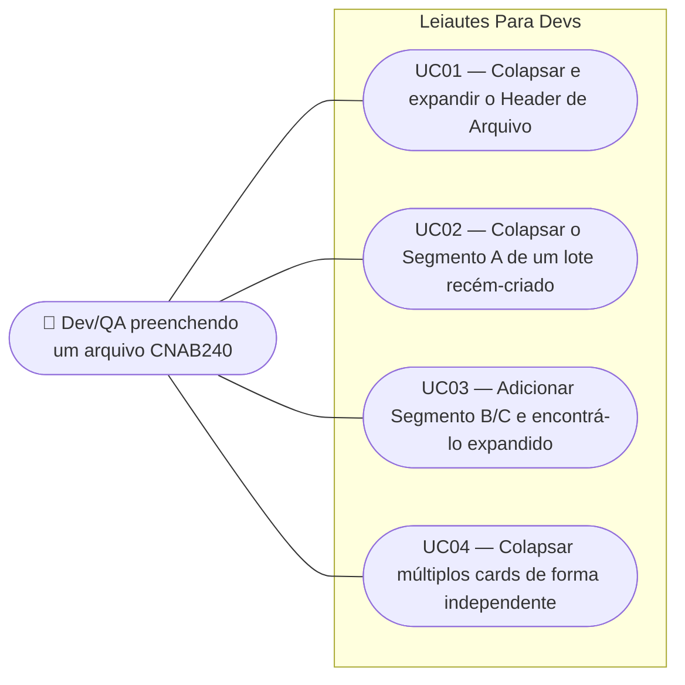

# SPEC — Recolher e expandir cards de Header de Arquivo e Segmentos

## Dados da SPEC

| Campo       | Valor                                                                                |
| ----------- | -------------------------------------------------------------------------------------- |
| US          | US30                                                                                    |
| Prioridade  | P2                                                                                      |
| Status      | Draft                                                                                   |
| Data        | 2026-09-12                                                                              |
| Slug        | `us30-colapsar-cards-header-segmentos`                                                 |
| Card Trello | https://trello.com/c/OIKe51nJ/32-us30-recolher-e-expandir-cards-de-header-de-arquivo-e-segmentos |

## Contexto

A US14 deu ao `LoteCard` o comportamento de colapso/expansão via chevron no cabeçalho e `q-slide-transition` no corpo, combinado com um badge de status e um resumo no footer. O `HeaderArquivoCard`, porém, permanece explicitamente estático — o próprio comentário no template registra "sem chevron/collapse" — e os cards de Segmento (`SegmentoACard`, `SegmentoBCard`, `SegmentoCCard`) dentro de um lote ficam sempre visíveis enquanto o `LoteCard` estiver expandido, sem nenhum controle de visualização próprio.

Conforme o usuário vai adicionando lotes e segmentos (US11, US26, US28), a tela cresce rapidamente: um único lote com Header de Lote + Segmento A + Segmento B + Segmento C já ocupa um espaço vertical considerável. Esta US estende o mesmo padrão de interação já validado pela US14 — chevron, `q-slide-transition`, independência de estado por card — ao `HeaderArquivoCard` e aos três cards de Segmento, **sem** replicar a lógica de badge de status ou resumo no footer da US14, que fica restrita ao `LoteCard`.

O estado inicial de colapso é decidido por tipo de card, não uniformemente: o Header de Arquivo nasce expandido (é tipicamente o primeiro card preenchido); o Segmento A nasce recolhido (é obrigatório e sempre presente, então recolhê-lo de saída evita poluir a tela assim que um lote é criado); os Segmentos B e C nascem expandidos no momento em que são adicionados (o usuário acabou de pedir para incluí-los e provavelmente quer preenchê-los imediatamente).

## Escopo

### Incluso

- Chevron de colapso/expansão no cabeçalho do `HeaderArquivoCard`, com `q-slide-transition` no corpo — mesmo padrão visual e de acessibilidade já usado pelo `LoteCard` (US14).
- O mesmo comportamento de chevron/colapso nos cards `SegmentoACard`, `SegmentoBCard` e `SegmentoCCard`.
- Estados iniciais diferenciados por tipo de card: `HeaderArquivoCard` expandido; `SegmentoACard` recolhido; `SegmentoBCard`/`SegmentoCCard` expandidos no momento da adição.
- Independência total de estado entre todos os cards colapsáveis da tela (Header de Arquivo, cada Segmento de cada lote, e os `LoteCard`s da US14) — sem efeito sanfona.
- Animação sempre ativa, sem guard de `prefers-reduced-motion` — decisão já estabelecida pela US14 e mantida aqui por consistência.
- `aria-label` dinâmico no botão do chevron ("Recolher [nome do card]" / "Expandir [nome do card]") e `aria-expanded` no cabeçalho — mesmo padrão de acessibilidade da US14.

### Excluído

- Badge de status ("Preenchido"/"Incompleto") nos cards de Header de Arquivo e Segmentos — exclusivo do `LoteCard` (US14).
- Resumo no footer quando colapsado — idem, exclusivo do `LoteCard`.
- Colapso dos Trailers (`TrailerLoteCard`, `TrailerArquivoCard`) — permanecem somente-leitura e sempre visíveis, sem alteração nesta US.
- Persistência do estado de colapso entre sessões ou entre reloads da página.
- Guard de `prefers-reduced-motion` na animação — mesma decisão de design já tomada na US14, não revisitada aqui.
- Extensão do comportamento a qualquer novo tipo de segmento introduzido em USs futuras (ex.: Segmento J da US29) — cabe a essas USs adotar o padrão, não a esta.

## Regras de Negócio

### RN01 — Chevron e colapso no Header de Arquivo

O cabeçalho do `HeaderArquivoCard` ganha um botão com ícone de chevron que alterna o card entre expandido e colapsado, e o corpo do card passa a colapsar via `<q-slide-transition>`. O comportamento estrutural, visual e de acessibilidade replica exatamente o já implementado no `LoteCard` (RN01, RN08 e RN09 da SPEC da US14): rotação do chevron em 180°, `role="button"` e `tabindex="0"` no cabeçalho clicável, ativação por clique, `Enter` e `Espaço`.

### RN02 — Header de Arquivo nasce expandido

O `HeaderArquivoCard` inicia com `expanded = true` ao carregar a página. Fundamento: é tipicamente o primeiro card que o usuário preenche, e escondê-lo de saída atrapalharia o fluxo natural de preenchimento.

### RN03 — Chevron e colapso nos Segmentos

Os cards `SegmentoACard`, `SegmentoBCard` e `SegmentoCCard` ganham o mesmo comportamento de chevron/colapso da RN01, cada um com seu próprio estado de colapso independente, escopado ao segmento e ao lote a que pertence (um `SegmentoACard` do Lote 1 não afeta o `SegmentoACard` do Lote 2).

### RN04 — Segmento A nasce recolhido

O `SegmentoACard` inicia com `expanded = false` assim que o lote é criado (seja na criação do primeiro lote, seja em um novo lote adicionado via "Adicionar Lote", US11). Fundamento: o Segmento A é obrigatório e sempre presente em todo lote (ADR-010) — recolhê-lo de saída evita que a tela nasça poluída com um card que o usuário talvez ainda não precise editar.

### RN05 — Segmentos B e C nascem expandidos ao serem adicionados

Quando o usuário adiciona um `SegmentoBCard` ou `SegmentoCCard` via modal "Novo Segmento" do `LoteCard` (US26/US28), o card nasce com `expanded = true`. Fundamento: o usuário acabou de solicitar explicitamente a adição do segmento e presumivelmente quer preenchê-lo imediatamente.

Este estado inicial é fixado apenas no momento da criação/montagem do card — reabrir a página, duplicar o lote (US12) ou qualquer outra ação que remonte o componente não preserva um estado de colapso "lembrado" (ver RN08).

### RN06 — Independência de estado entre todos os cards colapsáveis

O estado de colapso de cada card — `HeaderArquivoCard`, cada `SegmentoACard`/`SegmentoBCard`/`SegmentoCCard` de cada lote, e cada `LoteCard` (US14) — é independente dos demais. Colapsar ou expandir um card não afeta nenhum outro card da tela, em nenhuma combinação. Extensão direta da RN09 da SPEC da US14.

### RN07 — Animação sempre presente, sem guard de acessibilidade

A transição de altura do corpo de todos os cards afetados por esta US usa `<q-slide-transition>`, e a rotação do chevron usa a mesma transição CSS já aplicada no `LoteCard` (`transition: transform 0.2s ease`). As animações permanecem sempre ativas, sem guard de `prefers-reduced-motion` — mesma decisão de design já registrada na RN08 da SPEC da US14, mantida por consistência entre todos os cards colapsáveis do app.

### RN08 — Sem badge, sem resumo, sem persistência

Nenhum dos cards afetados por esta US (`HeaderArquivoCard`, `SegmentoACard`, `SegmentoBCard`, `SegmentoCCard`) recebe badge de status ou linha de resumo no footer — essas duas responsabilidades permanecem exclusivas do `LoteCard` (US14, RN02–RN07). O estado de colapso de nenhum card desta US, nem do `LoteCard`, é persistido entre sessões, reloads da página, ou entre desmontagem/remontagem do componente (ex.: remoção e re-adição de um Segmento B).

### RN09 — Acessibilidade do botão de chevron

O botão do chevron de cada card afetado por esta US tem `aria-label` dinâmico, no formato "Recolher [nome do card]" quando expandido e "Expandir [nome do card]" quando colapsado — onde `[nome do card]` identifica o card de forma inequívoca (ex.: "Header de Arquivo", "Segmento A do Lote 2", "Segmento B do Lote 1"). O cabeçalho clicável carrega `aria-expanded` refletindo o estado atual, e `aria-controls` apontando para o `id` do bloco de conteúdo colapsável — mesmo padrão já usado pelo `LoteCard` (US14).

## Use Cases



### UC01 — Colapsar e expandir o Header de Arquivo

**Ator:** Dev/QA preenchendo um arquivo CNAB240
**Precondição:** Página carregada, `HeaderArquivoCard` visível e expandido (RN02).

**Fluxo principal:**

1. Usuário preenche os campos do Header de Arquivo
2. Usuário clica no chevron do cabeçalho do `HeaderArquivoCard`
3. O corpo do card colapsa com animação de altura; o chevron rotaciona 180°
4. Usuário clica novamente no chevron
5. O corpo do card expande de volta, exibindo os valores já preenchidos

**Fluxo alternativo — teclado:**

- Nos passos 2/4, o usuário navega por `Tab` até o cabeçalho e aciona `Enter` ou `Espaço` em vez de clicar

**Pós-condição:** Estado de colapso do `HeaderArquivoCard` reflete a última interação; valores preenchidos são preservados em ambos os estados.

### UC02 — Colapsar o Segmento A de um lote recém-criado

**Ator:** Dev/QA preenchendo um arquivo CNAB240
**Precondição:** Usuário acabou de criar um novo lote (US11) ou a página carregou com o lote inicial.

**Fluxo principal:**

1. Sistema renderiza o `LoteCard` com o `SegmentoACard` já recolhido (RN04)
2. Usuário expande o lote (se ainda colapsado) e vê o cabeçalho do Segmento A recolhido, com chevron indicando estado fechado
3. Usuário clica no chevron do `SegmentoACard` para expandi-lo
4. Usuário preenche os campos do Segmento A

**Pós-condição:** Segmento A expandido e preenchido; o estado inicial recolhido não se repete a menos que o card seja desmontado e remontado (ex.: duplicar o lote cria um novo `SegmentoACard`, que nasce recolhido novamente).

### UC03 — Adicionar Segmento B/C e encontrá-lo expandido

**Ator:** Dev/QA preenchendo um arquivo CNAB240
**Precondição:** Lote sem Segmento B ainda adicionado.

**Fluxo principal:**

1. Usuário clica em "Novo Segmento" no `LoteCard` e seleciona "Segmento B"
2. Modal fecha; o `SegmentoBCard` é renderizado já expandido (RN05)
3. Usuário preenche os campos imediatamente, sem precisar expandir o card manualmente

**Fluxo alternativo — Segmento C:**

- Mesmo fluxo, com "Segmento C" selecionado no passo 1 e `SegmentoCCard` nascendo expandido no passo 2

**Pós-condição:** O segmento recém-adicionado está pronto para preenchimento imediato, sem passo extra de expansão.

### UC04 — Colapsar múltiplos cards de forma independente

**Ator:** Dev/QA preenchendo um arquivo CNAB240
**Precondição:** Um lote com Header de Arquivo, Segmento A, Segmento B e Segmento C, todos expandidos.

**Fluxo principal:**

1. Usuário colapsa o `HeaderArquivoCard`
2. Usuário colapsa o `SegmentoBCard`
3. Usuário verifica que o Segmento A e o Segmento C permanecem expandidos, e que o `LoteCard` em si permanece expandido

**Pós-condição:** Cada card mantém seu próprio estado de colapso, sem qualquer efeito cascata entre eles.

## Critérios de Aceitação

**Cenário: Chevron adicionado ao Header de Arquivo**

```gherkin
Dado que a página carregou
Quando o usuário visualiza o cabeçalho do HeaderArquivoCard
Então um botão de chevron está presente, permitindo alternar entre expandido e recolhido
```

**Cenário: Header de Arquivo nasce expandido**

```gherkin
Dado que a página acabou de carregar
Quando o usuário visualiza o HeaderArquivoCard
Então o card está expandido, com todos os seus campos visíveis
```

**Cenário: Colapso do Header de Arquivo com animação**

```gherkin
Dado que o HeaderArquivoCard está expandido
Quando o usuário clica no chevron do cabeçalho
Então o corpo do card recolhe com animação de altura (q-slide-transition)
E o chevron rotaciona 180°
```

**Cenário: Chevron adicionado aos cards de Segmento**

```gherkin
Dado que um lote possui Segmento A, Segmento B e Segmento C
Quando o usuário visualiza os cabeçalhos de cada card de segmento
Então cada um exibe um botão de chevron para alternar entre expandido e recolhido
```

**Cenário: Segmento A nasce recolhido**

```gherkin
Dado que um novo lote é criado
Quando o usuário visualiza o SegmentoACard desse lote
Então o card está recolhido, sem seus campos visíveis
```

**Cenário: Segmento B nasce expandido ao ser adicionado**

```gherkin
Dado que um lote não possui Segmento B
Quando o usuário adiciona o Segmento B via modal "Novo Segmento"
Então o SegmentoBCard é renderizado expandido, com todos os campos visíveis
```

**Cenário: Segmento C nasce expandido ao ser adicionado**

```gherkin
Dado que um lote não possui Segmento C
Quando o usuário adiciona o Segmento C via modal "Novo Segmento"
Então o SegmentoCCard é renderizado expandido, com todos os campos visíveis
```

**Cenário: Independência de estado entre cards**

```gherkin
Dado que um lote possui Header de Arquivo, Segmento A, Segmento B e Segmento C, todos expandidos
Quando o usuário recolhe o Segmento B
Então o Header de Arquivo, o Segmento A e o Segmento C permanecem expandidos
```

**Cenário: Animação sempre ativa, sem guard de acessibilidade**

```gherkin
Dado que o sistema operacional do usuário tem "prefers-reduced-motion: reduce" ativado
Quando o usuário colapsa ou expande qualquer card afetado por esta US
Então a animação de altura e a rotação do chevron ocorrem normalmente, sem serem suprimidas
```

**Cenário: aria-label dinâmico do chevron**

```gherkin
Dado que o SegmentoACard do Lote 2 está expandido
Quando um leitor de tela alcança o botão do chevron
Então o aria-label anuncia "Recolher Segmento A do Lote 2"
```

```gherkin
Dado que o mesmo card está recolhido
Quando um leitor de tela alcança o botão do chevron
Então o aria-label anuncia "Expandir Segmento A do Lote 2"
```

**Cenário: aria-expanded reflete o estado**

```gherkin
Dado que qualquer card afetado por esta US está expandido
Quando o atributo aria-expanded do cabeçalho é inspecionado
Então seu valor é "true"
```

```gherkin
Dado que o mesmo card está recolhido
Quando o atributo aria-expanded do cabeçalho é inspecionado
Então seu valor é "false"
```

**Cenário: Ausência de badge e resumo nos cards afetados**

```gherkin
Dado que o HeaderArquivoCard, o SegmentoACard, o SegmentoBCard ou o SegmentoCCard estão preenchidos
Quando o usuário visualiza o cabeçalho ou o rodapé de qualquer um desses cards
Então nenhum badge de status e nenhuma linha de resumo são exibidos
```

**Cenário: Estado de colapso não persiste entre sessões**

```gherkin
Dado que o usuário colapsou o HeaderArquivoCard
Quando a página é recarregada
Então o HeaderArquivoCard volta a nascer expandido (RN02)
```

## Restrições Conhecidas

- `SegmentoACard`, `SegmentoBCard` e `SegmentoCCard` hoje são renderizados como `<div>` simples, com um `<h4>` de título seguido de `<q-separator>` — sem a estrutura `<q-card>` + `<q-card-section>` de cabeçalho que `LoteCard` e `HeaderArquivoCard` já possuem. A extensão do chevron a esses três cards exigirá uma restruturação de template (envolver o conteúdo em `<q-card>`, criar a seção de cabeçalho clicável) antes de replicar a lógica de `expanded`/`toggleExpanded` do `LoteCard`. O detalhamento dessa restruturação cabe ao `PLAN.md`.
- Não existe hoje nenhum composable compartilhado para o comportamento de colapso — cada card que já o implementa (`LoteCard`) faz isso com um `ref` e uma função de toggle locais, duplicando a lógica. Esta US toca quatro tipos de card adicionais (Header de Arquivo + 3 Segmentos); avaliar se compensa extrair um composable (`useColapsavel` ou similar) é decisão técnica do `PLAN.md`, não uma regra de negócio desta SPEC.
- A RN05 (Segmento B/C nascem expandidos "no momento em que são adicionados") depende de o estado inicial ser fixado na criação do objeto de segmento no composable (`useCnab240`) ou na montagem do componente (`onMounted` do `SegmentoBCard`/`SegmentoCCard`) — a escolha entre as duas abordagens é técnica e cabe ao `PLAN.md`; ambas satisfazem o comportamento observável descrito nesta SPEC.
- <!-- TODO: verify against FEBRABAN spec --> não se aplica a esta US — é uma feature de UX/gestão de estado local, sem qualquer relação com regras de layout FEBRABAN.

## Custo da IA

| Métrica           | Valor                       |
| ----------------- | --------------------------- |
| Modelo            | claude-sonnet-5              |
| Tokens de entrada | ~50.000 (maioria em cache)  |
| Tokens de saída   | ~6.500                      |
| Custo (USD)       | ~$0,40                      |
| Taxa de câmbio    | 1 USD = R$5,50 (2026-09-12) |
| Custo (BRL)       | ~R$2,20                     |

> Valores estimados. Leitura do card, da SPEC da US14 e dos componentes reais (`LoteCard`, `HeaderArquivoCard`, `SegmentoACard`) seguida da escrita integral desta SPEC, sem entrevista adicional (nenhuma dúvida ou inconsistência de negócio identificada).

## Custo Estimado do Refinamento (12/09/2026)

> Refinado em: 12/09/2026

| Métrica              | Valor                       |
| --------------------- | --------------------------- |
| Modelo                | claude-sonnet-5              |
| Tokens de entrada     | ~50.000 (maioria em cache)  |
| Tokens de saída       | ~6.500                      |
| Custo estimado (USD)  | ~$0,40                      |
| Taxa de câmbio        | 1 USD = R$5,50 (12/09/2026) |
| Custo estimado (BRL)  | ~R$2,20                     |
