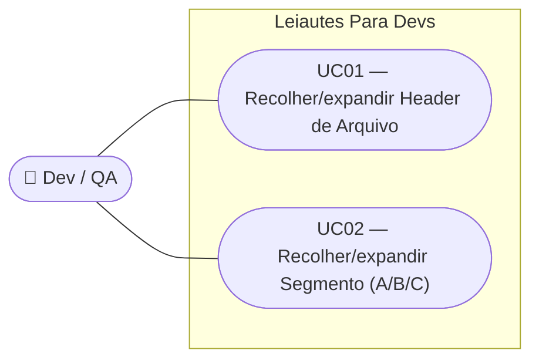

# SPEC — Recolher e expandir cards de Header de Arquivo e Segmentos

## Dados da SPEC

| Campo         | Valor                                                                                                                  |
| ------------- | ----------------------------------------------------------------------------------------------------------------------- |
| US            | US30                                                                                                                    |
| Prioridade    | P2                                                                                                                      |
| Status        | draft                                                                                                                   |
| Data          | 2026-09-09                                                                                                              |
| Slug          | `us30-colapsar-cards-header-segmentos`                                                                                 |
| Card Trello   | https://trello.com/c/OIKe51nJ/32-us30-recolher-e-expandir-cards-de-header-de-arquivo-e-segmentos                       |

## Contexto

US14 introduziu o comportamento de colapso/expansão para o `LoteCard`, combinando chevron, animação de altura, badge de status e resumo no footer. Esse padrão resolveu o problema de poluição visual quando há múltiplos lotes na tela — mas hoje ele só existe nesse nível.

O `HeaderArquivoCard` é explicitamente marcado no código como estático ("RN05: não colapsável"), e os cards de Segmento (`SegmentoACard`, `SegmentoBCard`, `SegmentoCCard`) ficam sempre visíveis enquanto o `LoteCard` pai está expandido — US14 excluiu deliberadamente o colapso por segmento individual do seu escopo. À medida que o formulário cresce (Header de Arquivo + Header de Lote + Segmento A obrigatório + Segmentos B/C opcionais, por lote), a tela volta a ficar longa e difícil de navegar, mesmo com o `LoteCard` colapsável.

Esta US estende o mesmo padrão de interação (chevron + `q-slide-transition`) para o `HeaderArquivoCard` e para os três cards de Segmento, sem replicar a lógica de badge de status ou resumo — que fica fora de escopo aqui para manter a US pequena e testável.

## Escopo

### Incluso

- Chevron de colapso/expansão no cabeçalho do `HeaderArquivoCard`
- Chevron de colapso/expansão no cabeçalho de `SegmentoACard`, `SegmentoBCard` e `SegmentoCCard`
- Animação de abertura/fechamento do corpo via `<q-slide-transition>`, mesma implementação de US14
- Estado inicial diferenciado por tipo de card (ver RN02–RN04)
- Estado de colapso independente por card (sem efeito sanfona) — mesma convenção de US14 (RN09)
- Acessibilidade: `aria-label` dinâmico e `aria-expanded` no chevron, mesma convenção de US14

### Excluído

- Badge de status ("Preenchido"/"Incompleto") nos cards de Header de Arquivo e Segmentos
- Resumo no footer quando colapsado
- Colapso dos Trailers (`TrailerLoteCard`, `TrailerArquivoCard`) — permanecem somente-leitura e sempre visíveis, sem chevron
- Persistência do estado de colapso entre sessões
- Guard de `prefers-reduced-motion` — animação sempre presente, mesma decisão de US14 (RN08)

## Regras de Negócio

### RN01 — Chevron de colapso/expansão

O cabeçalho de `HeaderArquivoCard`, `SegmentoACard`, `SegmentoBCard` e `SegmentoCCard` passa a ter um botão com ícone de chevron que alterna o estado do card entre expandido e colapsado, seguindo a mesma implementação visual (`expand_more` + `transition: transform 0.2s ease`) usada em `LoteCard` (US14, RN01/RN08).

### RN02 — Estado inicial do Header de Arquivo: expandido

O `HeaderArquivoCard` nasce **expandido** (`expanded = true`) ao carregar a página, pois costuma ser o primeiro card preenchido pelo usuário no fluxo do formulário.

### RN03 — Estado inicial do Segmento A: recolhido

O `SegmentoACard` nasce **recolhido** (`expanded = false`) assim que o lote é criado. Por ser obrigatório e sempre presente (ADR-010), abri-lo por padrão em todo lote novo poluiria a tela sem necessidade — o usuário expande manualmente quando quiser preenchê-lo.

### RN04 — Estado inicial dos Segmentos B e C: expandido na criação

`SegmentoBCard` e `SegmentoCCard` nascem **expandidos** (`expanded = true`) no momento em que são adicionados pelo usuário via ação explícita ("Adicionar Segmento B"/"Adicionar Segmento C" — US26/US28). O usuário acabou de pedir para adicionar o segmento e presumivelmente quer preenchê-lo imediatamente.

### RN05 — Independência de estado entre cards

O estado de colapso/expansão de cada card (`HeaderArquivoCard`, cada `SegmentoACard`/`SegmentoBCard`/`SegmentoCCard` de cada lote) é independente dos demais. Recolher um card não afeta o estado de nenhum outro — mesma convenção de US14 (RN09), inclusive entre lotes diferentes.

### RN06 — Animação sempre presente

A transição de altura do corpo usa `<q-slide-transition>`. A rotação do chevron usa `transition: transform 0.2s ease`. As animações são sempre ativas, sem guard de `prefers-reduced-motion` — mesma decisão de design já tomada em US14 (RN08), mantida aqui por consistência visual entre todos os cards colapsáveis do formulário.

### RN07 — Sem badge de status nem resumo

Ao contrário do `LoteCard`, os cards desta US não recebem badge de status nem linha de resumo no footer quando colapsados. Ao colapsar, o único conteúdo visível do card é o cabeçalho com o título (ex.: "Header de Arquivo", "Segmento A") e o chevron.

### RN08 — Trailers permanecem sem colapso

`TrailerLoteCard` e `TrailerArquivoCard` não são afetados por esta US — continuam sempre visíveis, sem chevron, por serem somente-leitura e derivados automaticamente (RN05 do modelo de dados, ver HLD).

## Use Cases

### UC01 — Recolher/expandir Header de Arquivo

- **Ator:** Dev / QA
- **Pré-condição:** A página do formulário CNAB240 está carregada; o `HeaderArquivoCard` está visível.
- **Fluxo principal:**
  1. O usuário visualiza o `HeaderArquivoCard` expandido (estado inicial, RN02).
  2. O usuário clica no chevron do cabeçalho.
  3. O corpo do card se recolhe com animação de altura; o chevron rotaciona 180°.
- **Fluxo alternativo (expandir):**
  1. Com o card colapsado, o usuário clica novamente no chevron.
  2. O corpo se expande com animação; o chevron rotaciona de volta.
- **Pós-condição:** O estado de expansão do `HeaderArquivoCard` reflete a última interação do usuário; nenhum outro card é afetado.

### UC02 — Recolher/expandir Segmento (A/B/C)

- **Ator:** Dev / QA
- **Pré-condição:** Um lote existe com ao menos um segmento (A obrigatório, B/C opcionais conforme US26/US28).
- **Fluxo principal:**
  1. O usuário visualiza o card do segmento no estado inicial correspondente (Segmento A: recolhido, RN03; Segmento B/C recém-adicionado: expandido, RN04).
  2. O usuário clica no chevron do cabeçalho do segmento.
  3. O corpo do card se recolhe ou expande com animação de altura, conforme o estado anterior.
- **Fluxo alternativo (múltiplos segmentos no mesmo lote):**
  1. O usuário recolhe o Segmento A.
  2. O Segmento B (se presente) mantém seu próprio estado de expansão, inalterado (RN05).
- **Pós-condição:** O estado de expansão de cada card de segmento é independente e reflete a última interação do usuário sobre aquele card específico.

## Critérios de Aceitação

### CA01 — Chevron no Header de Arquivo

**Dado que** o `HeaderArquivoCard` está na tela
**Quando** o cabeçalho é observado
**Então** um botão de chevron está presente e clicável

### CA02 — Estado inicial do Header de Arquivo

**Dado que** a página do formulário acabou de carregar
**Quando** o `HeaderArquivoCard` é renderizado pela primeira vez
**Então** ele está expandido (corpo visível)

### CA03 — Estado inicial do Segmento A

**Dado que** um novo lote é criado (US11)
**Quando** o `SegmentoACard` correspondente é renderizado
**Então** ele nasce recolhido (corpo oculto, apenas cabeçalho visível)

### CA04 — Estado inicial de Segmento B/C recém-adicionado

**Dado que** o usuário clica em "Adicionar Segmento B" (ou C) em um lote existente
**Quando** o novo `SegmentoBCard`/`SegmentoCCard` é renderizado
**Então** ele nasce expandido (corpo visível)

### CA05 — Colapso com animação

**Dado que** um card colapsável (Header de Arquivo ou Segmento) está expandido
**Quando** o usuário clica no chevron
**Então** o corpo se recolhe com animação de altura (`q-slide-transition`) e o chevron rotaciona 180°

### CA06 — Expansão com animação

**Dado que** um card colapsável está colapsado
**Quando** o usuário clica no chevron
**Então** o corpo se expande com animação de altura e o chevron rotaciona de volta

### CA07 — Independência entre Header de Arquivo e Segmentos

**Dado que** o `HeaderArquivoCard` está expandido e o `SegmentoACard` de um lote está recolhido
**Quando** o usuário expande o `SegmentoACard`
**Então** o `HeaderArquivoCard` permanece no seu estado atual, inalterado

### CA08 — Independência entre segmentos do mesmo lote

**Dado que** um lote tem Segmento A e Segmento B, ambos expandidos
**Quando** o usuário recolhe o Segmento A
**Então** o Segmento B permanece expandido

### CA09 — Independência entre lotes

**Dado que** há dois lotes na tela, cada um com seu Segmento A
**Quando** o usuário recolhe o Segmento A do Lote #1
**Então** o Segmento A do Lote #2 mantém seu estado de expansão inalterado

### CA10 — Sem badge nem resumo

**Dado que** o `HeaderArquivoCard` ou um card de Segmento está colapsado
**Quando** o cabeçalho é observado
**Então** nenhum badge de status ou linha de resumo é exibido — apenas título e chevron

### CA11 — Acessibilidade do chevron

**Dado que** um card colapsável está expandido
**Quando** o botão do chevron é inspecionado
**Então** ele possui `aria-label` no formato `"Recolher [nome do card]"` e o cabeçalho reflete `aria-expanded="true"`; ao colapsar, o `aria-label` muda para `"Expandir [nome do card]"` e `aria-expanded="false"`

## Acessibilidade

- O botão do chevron deve ter `aria-label` dinâmico: `"Recolher Header de Arquivo"` / `"Expandir Header de Arquivo"`, e analogamente `"Recolher Segmento A"` / `"Expandir Segmento A"` (idem B e C)
- O cabeçalho deve ter `aria-expanded` refletindo o estado atual
- O foco ao clicar no chevron permanece no botão do chevron (não salta para dentro do card) — mesma convenção de US14
- Fonte JetBrains Mono mantida em todos os inputs (inalterado por esta US)

## Notas de Design

- Reaproveitar a implementação de chevron/`q-slide-transition` já validada em `LoteCard.vue` (US14) — mesma classe de transição, mesmo ícone `expand_more`, mesma rotação de 180°
- Layout do cabeçalho de cada card: `display: flex; align-items: center` — chevron à esquerda, título com `flex: 1`
- Sem badge, sem `margin-left: auto` reservado para badge — cabeçalho mais simples que o de `LoteCard`
- `HeaderArquivoCard`, `SegmentoACard`, `SegmentoBCard`, `SegmentoCCard` cada um gerencia seu próprio `ref<boolean>` de estado de expansão, sem estado compartilhado entre eles

## Custo da IA

| Métrica               | Valor                              |
| ---------------------- | ----------------------------------- |
| Modelo                 | claude-sonnet-5                     |
| Tokens de entrada      | ~55k                                |
| Tokens de saída        | ~9k                                 |
| Custo estimado (USD)   | ~US$0,30                            |
| Taxa de câmbio         | 1 USD = R$5,80 (2026-08-30)         |
| Custo estimado (BRL)   | ~R$1,74                             |

_Valores estimados com base no pricing público da Anthropic para Claude Sonnet 5; não refletem billing exato da sessão._
