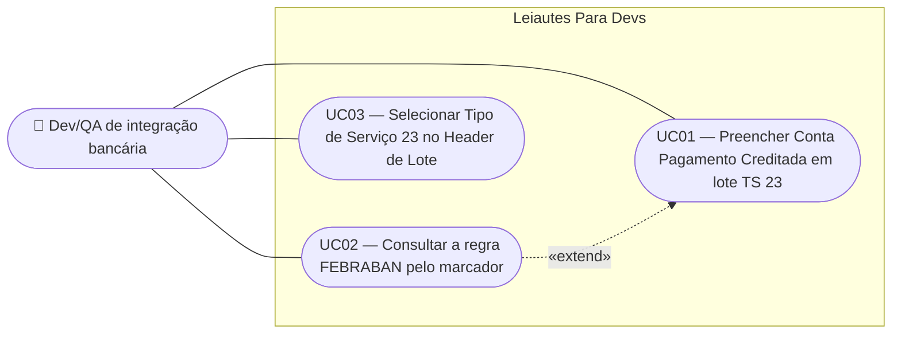

# SPEC — Obrigatoriedade condicional da Conta Pagamento Creditada (Tipo de Serviço 23)

## Dados da SPEC

| Campo       | Valor                         |
| ----------- | ----------------------------- |
| US          | US31                          |
| Prioridade  | P1                            |
| Status      | Draft                         |
| Data        | 2026-09-12                    |
| Slug        | `us31-tipo-servico-23`        |
| Card Trello | https://trello.com/c/rNqHfOkS |

## Contexto

Uma auditoria do Segmento C contra o arquivo `docs/Layout padrao CNAB240 V 10 11 - 21_08_2023.md` confirmou que a spec posicional em `src/model/cnab240/segmentoC.ts` está correta: os 19 campos, suas posições, tamanhos, tipos (`Num`/`Alfa`) e defaults (`'3'`, `'C'`, brancos) conferem integralmente com a seção 3.1.2 do layout padrão FEBRABAN v10.11, e a soma dos tamanhos fecha em 240. A serialização em `src/utils/serializer.ts` e as regras RN01 (G038), RN03/RN07 (ordem canônica A → B → C) e RN04 (contagem do Trailer de Lote) da US28 também estão corretas.

O que não foi entregue é a única regra **condicional** do segmento. A Nota da tabela G025 do layout determina que, quando o Tipo de Serviço do lote é `'23'` (Interoperabilidade entre Contas de Instituições de Pagamentos), o preenchimento do campo 18.3C — *Número Conta Pagamento Creditada* — torna-se obrigatório. A SPEC da US28 formalizou esse comportamento nas RN02, RN08, RN09 e RN10 e nos UC03/UC04, mas o relatório de desenvolvimento registra que todas foram deliberadamente deixadas fora de escopo. Uma busca por `'23'` em `src/` retorna hoje apenas um comentário em `segmentoC.ts`. Ainda assim, a US28 consta como `Done` em `docs/Backlog_Produto.md`, cuja descrição afirma que o comportamento foi entregue.

A auditoria encontrou também `OPCOES_TIPO_SERVICO` (`src/utils/options.ts`) divergente da tabela G025: quatro rótulos incorretos — entre eles o do próprio código `'23'` — e cinco códigos ausentes. Como a regra desta US depende de o usuário localizar o código `'23'` pelo nome correto, as duas frentes são corrigidas juntas.

## Escopo

### Incluso

- Obrigatoriedade condicional do campo *Número Conta Pagamento Creditada* (18.3C, posições 128–147) quando o Tipo de Serviço do Header de Lote do lote hospedeiro é `'23'`.
- Campo sempre editável, em qualquer Tipo de Serviço, com preservação do valor digitado ao alternar o Tipo de Serviço — retificando a RN08 da US28.
- Marcador visual de obrigatoriedade exibido ao lado do rótulo do campo apenas quando o Tipo de Serviço é `'23'`.
- Tooltip curto no marcador (hover e foco de teclado) e popup explicativo da regra FEBRABAN no clique.
- Notificação informativa (`$q.notify`) na transição do Tipo de Serviço do lote para `'23'`.
- Correção de `OPCOES_TIPO_SERVICO` para espelhar integralmente a tabela G025: quatro rótulos corrigidos e cinco códigos adicionados.
- Remoção do comentário `TODO: verify against FEBRABAN spec` no topo de `src/model/cnab240/segmentoC.ts`, cuja verificação foi concluída por esta auditoria.

### Excluído

- Obrigatoriedade do **próprio Segmento C** quando o Tipo de Serviço é `'23'` (RN02 da US28): forçar sua existência em cada lote, bloquear o download quando ele falta (RN10 da US28) e o toast correspondente (RN09 da US28) ficam para US futura. Esta US trata apenas do nível do campo.
- Adoção do componente `MoedaBrlInput` (US25) nos seis campos de valor do Segmento C (IR, ISS, IOF, Outras Deduções, Outros Acréscimos, INSS), hoje preenchidos como inteiros de 15 dígitos sem indicação dos 2 decimais implícitos declarados na coluna `Nº Dec` da spec. O componente existe e não tem nenhum consumidor em `src/` — US futura.
- Alteração do comportamento de obrigatoriedade em Modo Playground (US10, RN02) — herdado como está. Ver RN08.
- Variante do Segmento C para Débito em Conta Corrente (seção 3.4.2 do layout), que não possui o campo 18.3C — o app implementa apenas a variante de Pagamentos (seção 3.1.2).
- Formato definitivo das mensagens de erro por campo (US08).
- Reposicionamento das notificações do projeto para o topo da tela — o padrão `bottom-right` estabelecido nas US11 e US17 é mantido. Ver RN07.
- Correção do rótulo dos códigos que divergem apenas por capitalização (`14`, `32`), onde a implementação normaliza em title case de forma consistente.

## Regras de Negócio

### RN01 — Obrigatoriedade condicional do campo

O campo *Número Conta Pagamento Creditada* (18.3C, posições 128–147, referência P016) é de preenchimento obrigatório quando, **e somente quando**, o Tipo de Serviço (G025, campo 05.1 do Header de Lote) do lote que hospeda o Segmento C é `'23'`.

Fundamento: Nota da tabela G025 do layout padrão FEBRABAN v10.11 — _"Quando adotado o código '23' (Interoperabilidade entre Contas de Instituições de Pagamentos), é obrigatório o preenchimento do campo 18.3C – Número Conta Pagamento Creditada, do Segmento C."_

A obrigatoriedade acompanha o Tipo de Serviço em tempo real: alterar o Tipo de Serviço do lote passa a valer imediatamente para todos os Segmentos C daquele lote, sem recarregar a página nem recriar o segmento.

### RN02 — Campo sempre editável

O campo nunca é `disabled` nem `readonly`, independentemente do Tipo de Serviço. O layout FEBRABAN não proíbe o preenchimento do campo fora do cenário `'23'` — apenas o exige nele.

O valor digitado é preservado em qualquer transição de Tipo de Serviço, nas duas direções: sair de `'23'` não descarta o que foi preenchido, e entrar em `'23'` não limpa o campo.

**Esta regra retifica a RN08 da SPEC da US28**, que previa o campo em estado `disabled` com tooltip quando o Tipo de Serviço fosse diferente de `'23'`. Aquela restrição não tem fundamento no layout e foi revogada na entrevista de refinamento desta US.

### RN03 — Momento da exibição do erro de obrigatoriedade

O erro de obrigatoriedade é exibido apenas quando a validação programática do formulário é acionada — o `q-form` único de `Cnab240Page.vue`, que usa `greedy` para exibir todos os erros de uma vez. O campo não exibe erro de forma antecipada: um campo vazio e não tocado permanece sem mensagem de erro até que a validação seja disparada, exatamente como todos os demais campos do formulário.

Ao alterar o Tipo de Serviço de `'23'` para qualquer outro valor, o campo perde a obrigatoriedade e uma mensagem de erro que estivesse visível deixa de ser exibida.

A mensagem segue o formato já produzido por `regraObrigatorio` em `src/utils/validation.ts`: _"Campo Nº Conta Pagamento Creditada é obrigatório."_ O formato definitivo das mensagens por campo é escopo da US08.

### RN04 — Marcador de obrigatoriedade

Quando o Tipo de Serviço do lote é `'23'`, um marcador `*` é exibido ao lado do rótulo do campo, em `--lpd-error`. Fora desse cenário, o marcador não é renderizado.

O marcador é um elemento **interativo**, porque carrega as duas camadas de informação das RN05 e RN06 — um elemento não focável (`q-icon`, `span`, `abbr`) não atenderia o requisito de acesso por teclado nem anunciaria propósito a leitores de tela.

Implementação: `<q-btn flat round dense padding="none">`, sem a prop `size`. O tamanho é controlado por CSS com `min-width: 44px` e `min-height: 44px`, atendendo o alvo de toque de 44×44px exigido pelo `CLAUDE.md` (WCAG 2.1 AA) enquanto o glifo `*` permanece visualmente pequeno, dentro de um `<span aria-hidden="true">`. O botão recebe `aria-label` descritivo (o glifo `*` sozinho não é um nome acessível), `aria-haspopup="dialog"` e `aria-expanded` vinculado ao estado do popup da RN06.

`q-btn` é preferido a um `<button>` nativo para herdar o anel de foco âmbar padronizado na US22, em vez de reimplementá-lo.

### RN05 — Tooltip do marcador

Ao pairar o mouse sobre o marcador, ou ao recebê-lo por foco de teclado, um `q-tooltip` exibe a mensagem curta:

> _"Obrigatório para Interoperabilidade entre Contas."_

### RN06 — Popup explicativo da regra FEBRABAN

Ao clicar (ou acionar por teclado) o marcador, abre-se um popup com a explicação da regra, em um parágrafo:

> _"O Tipo de Serviço '23' identifica a Interoperabilidade entre Contas de Instituições de Pagamentos — a transferência de uma conta corrente para uma conta de pagamento. O campo Número Conta Pagamento Creditada (18.3C, posições 128–147, referência P016) carrega o número adotado para identificar a conta na Instituição de Pagamento destinatária. A Nota da tabela G025 do layout padrão FEBRABAN v10.11 torna o preenchimento desse campo obrigatório sempre que o Tipo de Serviço do lote for '23'."_

O popup é dispensável por `Esc` e por clique fora, e devolve o foco ao marcador ao fechar.

### RN07 — Notificação na transição para o Tipo de Serviço `'23'`

Ao alterar o Tipo de Serviço de um Header de Lote para `'23'`, uma notificação informativa é exibida:

> _"Tipo de Serviço 23: o Segmento C deste lote precisa da Conta Pagamento Creditada preenchida."_

A notificação segue exatamente o padrão dos três `$q.notify` já existentes em `src/pages/Cnab240Page.vue` (US11 RN05, US17 RN05/RN06): `position: 'bottom-right'`, `timeout: 4000`, `classes: 'lpd-toast-info'` e `attrs: { role: 'status' }` — live region informativa não urgente, conforme WCAG 2.1 AA.

A notificação dispara **uma única vez por transição** para `'23'`: não se repete enquanto o lote permanecer em `'23'`, nem ao alterar outros campos. Sair de `'23'` e voltar dispara novamente.

### RN08 — Comportamento herdado em Modo Playground

Em Modo Playground, `regraObrigatorio` retorna `true` de saída (US10, RN02), de modo que a obrigatoriedade da RN01 não bloqueia a geração do arquivo. Esse comportamento é **herdado sem alteração**: o Modo Playground existe justamente para permitir gerar arquivos fora das regras do leiaute.

O marcador da RN04 e a notificação da RN07 continuam sendo exibidos em Modo Playground — eles informam sobre o leiaute, não impõem bloqueio.

### RN09 — Tabela G025 espelhada integralmente

`OPCOES_TIPO_SERVICO` passa a conter os 33 códigos da tabela G025 do layout, contra os 28 atuais.

Rótulos corrigidos:

| Código | Rótulo atual                            | Rótulo correto (G025)                                         |
| ------ | --------------------------------------- | ------------------------------------------------------------- |
| `13`   | Glosa da Consignação (Lote)             | Glosa da Consignação (INSS)                                   |
| `23`   | …entre Contas de Instituições Distintas | Interoperabilidade entre Contas de Instituições de Pagamentos |
| `25`   | Compra/Venda de Moeda Estrangeira       | Compror                                                       |
| `41`   | Vendor a Prazo                          | Vendor a Termo                                                |

Códigos adicionados: `26` (Compror Rotativo), `29` (Alegação do Pagador), `33` (Pagamento de bolsa auxílio), `34` (Pagamento de prebenda — remuneração a padres e sacerdotes), `60` (Pagamento Despesas Viajante em Trânsito).

O código `25` é o caso sensível: "Compra/Venda de Moeda Estrangeira" não existe na tabela G025, então o item muda de significado para quem já o utilizava.

### RN10 — Remoção do TODO de verificação em `segmentoC.ts`

O comentário `TODO: verify against FEBRABAN spec` no topo de `src/model/cnab240/segmentoC.ts`, que pedia validação das posições dos 19 campos e em especial do P016 (128–147), é removido: a auditoria desta US conferiu os 19 campos contra a seção 3.1.2 do layout e todos conferem.

## Use Cases



### UC01 — Preencher a Conta Pagamento Creditada em lote com Tipo de Serviço `'23'`

**Ator:** Dev/QA de integração bancária
**Precondição:** Lote com Tipo de Serviço `'23'` e um Segmento C presente. Modo Seguro ativo.

**Fluxo principal:**

1. Usuário localiza o campo *Nº Conta Pagamento Creditada* no `SegmentoCCard`, exibindo o marcador `*` ao lado do rótulo
2. Usuário digita o número da conta de pagamento
3. Usuário aciona "Baixar", disparando a validação do formulário
4. A validação passa no campo e o arquivo é gerado

**Fluxo alternativo — campo vazio:**

- No passo 3, com o campo vazio, a validação acusa _"Campo Nº Conta Pagamento Creditada é obrigatório."_ e o download é bloqueado pela regra já existente da US17 (RN06)

**Fluxo alternativo — Modo Playground:**

- No passo 3, em Modo Playground, a obrigatoriedade não é aplicada (RN08) e o arquivo é gerado com o campo preenchido com zeros pelo serializador

**Pós-condição:** Arquivo gerado com as posições 128–147 do Segmento C preenchidas, ou download bloqueado com o erro visível no campo.

### UC02 — Consultar a regra FEBRABAN pelo marcador

**Ator:** Dev/QA de integração bancária
**Precondição:** Lote com Tipo de Serviço `'23'` e um Segmento C presente, com o marcador `*` visível.

**Fluxo principal:**

1. Usuário paira sobre o marcador e lê o tooltip _"Obrigatório para Interoperabilidade entre Contas."_ (RN05)
2. Usuário clica no marcador
3. Sistema abre o popup com o parágrafo explicativo da regra (RN06)
4. Usuário fecha o popup por `Esc`, clique fora, ou novo clique no marcador

**Fluxo alternativo — teclado:**

- Usuário navega por `Tab` até o marcador; o tooltip aparece no foco (RN05); `Enter`/`Espaço` abre o popup; `Esc` fecha e devolve o foco ao marcador

**Pós-condição:** Usuário compreende por que o campo é obrigatório; nenhum dado é alterado.

### UC03 — Selecionar o Tipo de Serviço `'23'` no Header de Lote

**Ator:** Dev/QA de integração bancária
**Precondição:** Lote com Tipo de Serviço diferente de `'23'`.

**Fluxo principal:**

1. Usuário abre o `HeaderLoteCard` e altera o Tipo de Serviço para `'23'` — localizando-o pelo rótulo correto "Interoperabilidade entre Contas de Instituições de Pagamentos" (RN09)
2. Sistema exibe a notificação informativa no canto inferior direito (RN07)
3. Em todos os Segmentos C do lote, o campo *Nº Conta Pagamento Creditada* passa a exibir o marcador `*` (RN04) e a carregar a regra de obrigatoriedade (RN01)

**Fluxo alternativo — lote sem Segmento C:**

- No passo 3, se o lote não tem nenhum Segmento C, a notificação ainda é exibida, mas nada mais muda na interface. Nesta US o download **não** é bloqueado por ausência do Segmento C (fora de escopo)

**Fluxo alternativo — sair de `'23'`:**

- Usuário altera o Tipo de Serviço para outro valor: o marcador desaparece, a obrigatoriedade deixa de valer, um erro visível deixa de ser exibido (RN03) e o valor digitado no campo é preservado (RN02). Nenhuma notificação é exibida na saída

**Pós-condição:** Todos os Segmentos C do lote refletem a obrigatoriedade correspondente ao Tipo de Serviço vigente.

## Critérios de Aceitação

**Cenário: Marcador visível com Tipo de Serviço `'23'`**

```gherkin
Dado que um lote tem Tipo de Serviço '23' e um Segmento C presente
Quando o usuário visualiza o campo "Nº Conta Pagamento Creditada"
Então o marcador '*' é exibido ao lado do rótulo do campo
```

**Cenário: Marcador ausente fora do Tipo de Serviço `'23'`**

```gherkin
Dado que um lote tem Tipo de Serviço '20' e um Segmento C presente
Quando o usuário visualiza o campo "Nº Conta Pagamento Creditada"
Então nenhum marcador de obrigatoriedade é exibido
```

**Cenário: Validação acusa campo obrigatório vazio**

```gherkin
Dado que um lote tem Tipo de Serviço '23' e um Segmento C com o campo "Nº Conta Pagamento Creditada" vazio
E que o Modo Seguro está ativo
Quando a validação do formulário é acionada
Então o campo exibe "Campo Nº Conta Pagamento Creditada é obrigatório."
```

**Cenário: Validação passa fora do Tipo de Serviço `'23'`**

```gherkin
Dado que um lote tem Tipo de Serviço '20' e um Segmento C com o campo "Nº Conta Pagamento Creditada" vazio
E que o Modo Seguro está ativo
Quando a validação do formulário é acionada
Então o campo não exibe erro de obrigatoriedade
```

**Cenário: Erro não aparece antes da validação**

```gherkin
Dado que um lote tem Tipo de Serviço '23' e um Segmento C com o campo "Nº Conta Pagamento Creditada" vazio
Quando o usuário apenas visualiza o formulário, sem acionar a validação
Então nenhuma mensagem de erro é exibida no campo
```

**Cenário: Campo editável fora do Tipo de Serviço `'23'`**

```gherkin
Dado que um lote tem Tipo de Serviço '20' e um Segmento C presente
Quando o usuário digita "12345678901234567890" no campo "Nº Conta Pagamento Creditada"
Então o valor é aceito e o campo não está disabled nem readonly
```

**Cenário: Valor preservado na troca de Tipo de Serviço**

```gherkin
Dado que um lote tem Tipo de Serviço '23' e um Segmento C com "Nº Conta Pagamento Creditada" preenchido com "99988877766655544433"
Quando o usuário altera o Tipo de Serviço do lote para '20'
Então o campo continua exibindo "99988877766655544433"
E o marcador de obrigatoriedade deixa de ser exibido
```

**Cenário: Erro deixa de ser exibido ao sair de `'23'`**

```gherkin
Dado que um lote tem Tipo de Serviço '23' e a validação já acusou o campo "Nº Conta Pagamento Creditada" como obrigatório
Quando o usuário altera o Tipo de Serviço do lote para '20'
Então a mensagem de erro de obrigatoriedade deixa de ser exibida no campo
```

**Cenário: Tooltip do marcador**

```gherkin
Dado que o marcador de obrigatoriedade está visível
Quando o usuário paira sobre o marcador ou o alcança por foco de teclado
Então um tooltip exibe "Obrigatório para Interoperabilidade entre Contas."
```

**Cenário: Popup explicativo do marcador**

```gherkin
Dado que o marcador de obrigatoriedade está visível
Quando o usuário clica no marcador
Então um popup é aberto com o parágrafo explicativo da regra FEBRABAN
E o popup é fechado por 'Esc', devolvendo o foco ao marcador
```

**Cenário: Alvo de toque do marcador**

```gherkin
Dado que o marcador de obrigatoriedade está visível
Quando sua área clicável é medida
Então largura e altura são de no mínimo 44px
```

**Cenário: Nome acessível do marcador**

```gherkin
Dado que o marcador de obrigatoriedade está visível
Quando um leitor de tela o alcança
Então o marcador anuncia seu propósito por aria-label
E o glifo '*' não é anunciado, por estar em elemento aria-hidden
```

**Cenário: Notificação na transição para `'23'`**

```gherkin
Dado que um lote tem Tipo de Serviço diferente de '23'
Quando o usuário altera o Tipo de Serviço para '23'
Então uma notificação 'lpd-toast-info' é exibida em 'bottom-right' com timeout de 4000ms
E a mensagem é "Tipo de Serviço 23: o Segmento C deste lote precisa da Conta Pagamento Creditada preenchida."
```

**Cenário: Notificação dispara uma única vez por transição**

```gherkin
Dado que o usuário já alterou o Tipo de Serviço do lote para '23' e a notificação foi exibida
Quando o usuário altera outros campos do Header de Lote, mantendo o Tipo de Serviço em '23'
Então nenhuma nova notificação é exibida
```

**Cenário: Obrigatoriedade não bloqueia em Modo Playground**

```gherkin
Dado que um lote tem Tipo de Serviço '23' e um Segmento C com o campo "Nº Conta Pagamento Creditada" vazio
E que o Modo Playground está ativo
Quando a validação do formulário é acionada
Então o campo não exibe erro de obrigatoriedade
E o arquivo pode ser gerado
```

**Cenário: Tabela G025 completa e corrigida**

```gherkin
Dado que o usuário abre o select de Tipo de Serviço do Header de Lote
Quando as opções são listadas
Então são exibidos os 33 códigos da tabela G025
E o código '23' exibe "Interoperabilidade entre Contas de Instituições de Pagamentos"
E o código '13' exibe "Glosa da Consignação (INSS)"
E o código '25' exibe "Compror"
E o código '41' exibe "Vendor a Termo"
E os códigos '26', '29', '33', '34' e '60' estão presentes
```

## Restrições Conhecidas

- `CampoLeiaute.obrigatorio` é hoje um booleano **estático** na spec de campos, e `regraObrigatorio` (`src/utils/validation.ts`) o lê diretamente. A RN01 exige que a obrigatoriedade deste campo seja reativa ao Tipo de Serviço do lote, o que não é expressável no contrato atual. O mecanismo (override reativo no componente, extensão da interface `CampoLeiaute`, ou regra dedicada) é decisão do tech-lead no `PLAN.md`.
- O `SegmentoCCard` não recebe hoje nenhuma informação do Header de Lote do seu lote. O acesso ao Tipo de Serviço vigente é pré-requisito das RN01 e RN04 e também cabe ao `PLAN.md`.
- A RN02 desta SPEC **revoga** a RN08 da SPEC da US28. A SPEC da US28 não é editada (specs e relatórios entregues são registros históricos); esta seção é o registro da retificação.

## Custo da IA

| Métrica           | Valor                       |
| ----------------- | --------------------------- |
| Tokens de entrada | ~320.000 (maioria em cache) |
| Tokens de saída   | ~16.000                     |
| Custo (USD)       | ~$2.60                      |
| Taxa de câmbio    | 1 USD = R$5,50 (2026-09-12) |
| Custo (BRL)       | ~R$14,30                    |
| Modelo            | claude-opus-5               |

> Valores estimados. A taxa de câmbio reproduz a referência usada nas SPECs anteriores do projeto; o custo em USD assume aproveitamento de cache de prompt ao longo da auditoria e da entrevista.
