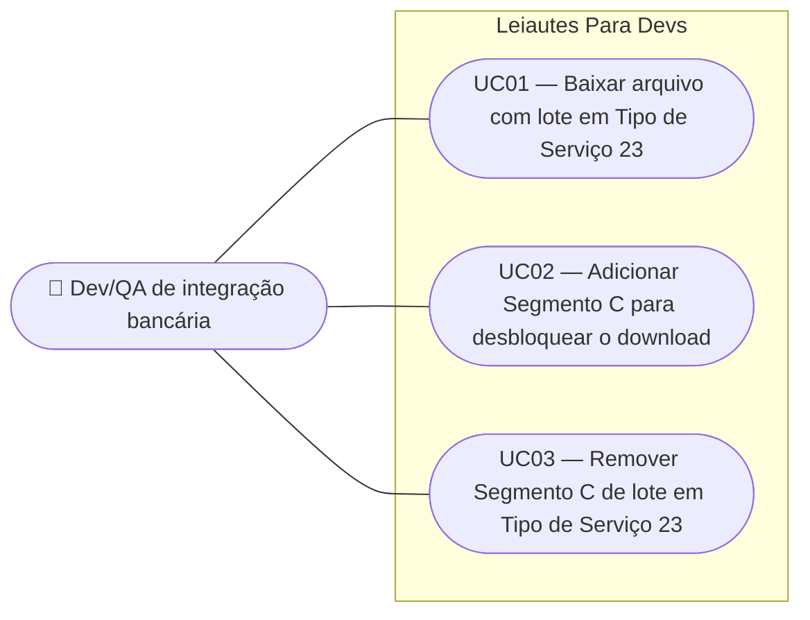

# SPEC — Obrigatoriedade do Segmento C quando Tipo de Serviço é 23

## Dados da SPEC

| Campo       | Valor                         |
| ----------- | ----------------------------- |
| US          | US32                          |
| Prioridade  | P1                            |
| Status      | Draft                         |
| Data        | 2026-09-12                    |
| Slug        | `us32-segmento-c-obrigatorio` |
| Card Trello | https://trello.com/c/e9rigeRF |

## Contexto

A Nota da tabela G025 do layout padrão FEBRABAN v10.11 determina que, quando o Tipo de Serviço do lote é `'23'` (Interoperabilidade entre Contas de Instituições de Pagamentos), o preenchimento do campo 18.3C — _Número Conta Pagamento Creditada_ — é obrigatório. Esse campo existe **apenas dentro do Segmento C**. A consequência estrutural é imediata: um lote em TS `'23'` sem Segmento C não tem onde carregar o dado exigido pela Nota, e o arquivo gerado é inválido perante o layout.

A US28, que entregou o Segmento C, formalizou a regra em três frentes — RN02 (o segmento torna-se obrigatório no cenário `'23'`), RN09 (toast informativo na transição) e RN10 (bloqueio do download) — e deixou as três deliberadamente fora de escopo, conforme registrado no relatório de desenvolvimento. A US31 recuperou metade do problema: a obrigatoriedade **no nível do campo**, quando o Segmento C já existe, mais o marcador visual, o popup explicativo da regra, a notificação de transição e a correção integral da tabela `OPCOES_TIPO_SERVICO`.

Esta US fecha a metade restante: a obrigatoriedade **do próprio Segmento C**. Sem ela, o usuário pode manter um lote em TS `'23'` sem nenhum Segmento C e baixar o arquivo sem qualquer resistência — a regra da US31 simplesmente não tem onde se aplicar, porque o campo não existe na tela.

Na arquitetura vigente (ADR-010, `src/composables/useCnab240.ts`), cada lote carrega um array flat `segmentos` com no máximo um segmento de cada tipo (A obrigatório, B e C opcionais). Não existe hoje o conceito de múltiplos Registros de Detalhe por lote. Por isso, a RN02/RN10 da US28 — escritas como "cada Registro de Detalhe do lote" — se traduzem nesta US como **"o lote precisa conter um Segmento C"**.

## Escopo

### Incluso

- Verificação estrutural, no clique de "Baixar", de que todo lote com Tipo de Serviço `'23'` possui um Segmento C.
- Bloqueio do download quando a verificação falha, com toast de erro nomeando o primeiro lote culpado.
- Precedência da verificação estrutural sobre a validação de campos do `q-form`.
- Alerta adicional no diálogo de confirmação de remoção do Segmento C quando o lote está em TS `'23'` e o Modo Seguro está ativo.
- Bypass integral da regra em Modo Playground e em modo Retorno.

### Excluído

- Obrigatoriedade do campo _Número Conta Pagamento Creditada_ (18.3C), marcador `*`, tooltip, popup explicativo da regra FEBRABAN e correção da tabela `OPCOES_TIPO_SERVICO` — escopo integral da US31, herdado sem alteração.
- Notificação exibida na transição do Tipo de Serviço para `'23'` (RN07 da US31) — herdada como está; esta US não a altera, não a duplica e não a condiciona à presença do Segmento C.
- Adição automática de um Segmento C ao lote em qualquer circunstância.
- Indicador visual persistente de "falta Segmento C" no `LoteCard`, exibido antes do clique em "Baixar".
- Rolagem automática ou destaque temporário do lote culpado ao bloquear o download.
- Listagem de todos os lotes culpados em um único toast — apenas o primeiro é nomeado.
- Bloqueio ou desabilitação do botão "Remover Segmento C".
- Formato definitivo das mensagens de erro por campo (US08).
- Regras análogas para outros Tipos de Serviço, ou para outros segmentos (J — US29, Z, W).
- Variante do Segmento C para Débito em Conta Corrente (seção 3.4.2 do layout), que não possui o campo 18.3C.

## Regras de Negócio

### RN01 — Obrigatoriedade estrutural do Segmento C

Um lote cujo Tipo de Serviço (G025, campo 05.1 do Header de Lote) é `'23'` deve conter um Segmento C. Um lote em TS `'23'` sem Segmento C constitui arquivo estruturalmente inválido.

Fundamento: Nota da tabela G025 do layout padrão FEBRABAN v10.11 — o campo 18.3C, cujo preenchimento a Nota torna obrigatório, existe exclusivamente dentro do Segmento C.

Esta regra **recupera a RN02 da SPEC da US28**, que declarou a obrigatoriedade condicional do segmento mas foi entregue fora de escopo.

### RN02 — A verificação ocorre apenas no clique de "Baixar"

A regra da RN01 é verificada **exclusivamente** no gate de download (US17), disparado por `arquivoStore.solicitarDownload()`. Nenhuma edição intermediária a dispara: trocar o Tipo de Serviço, remover o Segmento C ou alterar qualquer campo não produz erro, alerta persistente ou mudança visual no lote.

O app **não** adiciona Segmento C automaticamente ao lote em nenhuma circunstância, nem ao selecionar TS `'23'` no Header de Lote. A montagem do arquivo permanece integralmente manual.

### RN03 — Precedência sobre a validação de campos

No gate de download, a verificação estrutural da RN01 roda **antes** de `formRef.value.validate()`.

Quando a verificação estrutural falha, o download é bloqueado ali, a validação de campos não é executada no mesmo clique e o toast genérico _"Há campos inválidos. Corrija os erros antes de baixar."_ (RN06 da US17) **não** é exibido — apenas o toast da RN04.

Quando a verificação estrutural passa, o fluxo da US17 segue inalterado: validação de campos, toast de bloqueio genérico em caso de reprovação, ou download seguido do toast de sucesso.

Fundamento da ordem: a ausência de um segmento inteiro é um defeito mais grave e mais barato de corrigir do que um campo inválido — o usuário é levado a resolver primeiro a estrutura do arquivo, e só depois o conteúdo.

### RN04 — Toast de bloqueio

Quando o download é bloqueado pela RN01, é exibida a notificação:

> _"Lote N: Tipo de Serviço '23' exige Segmento C."_

Onde `N` é a posição 1-based do **primeiro** lote culpado na ordem do arquivo.

A notificação segue o padrão já estabelecido por `exibirToastDownloadBloqueado` em `src/pages/Cnab240Page.vue` (US17, RN06): `position: 'bottom-right'`, `timeout: 4000`, `classes: 'lpd-toast-error'` e `attrs: { role: 'alert' }` — live region urgente, porque a ação do usuário foi bloqueada e exige correção.

**Um único toast é exibido por clique**, ainda que mais de um lote esteja culpado. Corrigido o primeiro lote, um novo clique em "Baixar" nomeia o próximo.

### RN05 — Bypass em Modo Playground

Em Modo Playground (US10), a regra da RN01 **não é aplicada**: o download não é bloqueado e nenhum toast relacionado é exibido — nem o de bloqueio da RN04, nem qualquer aviso alternativo.

Fundamento: o Modo Playground existe para permitir gerar arquivos fora das regras do leiaute. Bloquear ali quebraria a promessa do modo; avisar ali seria ruído sobre uma escolha deliberada do usuário.

Este comportamento é mais permissivo que o da US31: lá, o marcador visual e a notificação continuam sendo exibidos em Playground, porque informam sem bloquear. Aqui não há nada a informar que o usuário já não tenha decidido.

### RN06 — Bypass em modo Retorno

A regra da RN01 é aplicada apenas quando `useConfigStore().tipoArquivo` é `'remessa'`. Em modo Retorno, o download nunca é bloqueado por esta regra, em nenhum modo de validação.

Fundamento: o arquivo de retorno representa a resposta do banco ao que foi enviado, não um arquivo que o usuário monta para envio. A Nota da tabela G025 nasce no contexto da remessa, e exigir a estrutura no retorno impediria a simulação de respostas reais — inclusive de respostas malformadas, que são caso de teste legítimo.

### RN07 — Remoção do Segmento C permanece permitida

O botão "Remover Segmento C" do `SegmentoCCard` permanece habilitado em todos os cenários, inclusive com o lote em TS `'23'`. Não há `disabled`, tooltip de impedimento nem qualquer restrição nova sobre a remoção.

Fundamento: a única porta de bloqueio desta US é o download (RN02). Impedir a remoção criaria uma segunda porta, com o efeito colateral de prender o usuário em um estado que ele pode legitimamente querer desfazer — inclusive para depois trocar o Tipo de Serviço do lote.

### RN08 — Alerta no diálogo de confirmação de remoção

Quando o usuário aciona "Remover Segmento C" em um lote cujo Tipo de Serviço é `'23'`, **e o Modo Seguro está ativo**, o diálogo de confirmação (`ConfirmDialog`, já existente) exibe um texto de alerta adicional, além do conteúdo padrão:

> _"Este lote está em Tipo de Serviço 23 — sem o Segmento C o download será bloqueado."_

O alerta **não** é exibido quando:

- o Tipo de Serviço do lote é diferente de `'23'`; ou
- o Modo Playground está ativo — ali a afirmação seria falsa, porque a RN05 garante que o download não será bloqueado; ou
- o modo do arquivo é Retorno — ali a afirmação seria falsa pela RN06.

O alerta é informativo e não altera as ações do diálogo: confirmar remove o segmento normalmente.

## Use Cases



### UC01 — Baixar arquivo com lote em Tipo de Serviço `'23'`

**Ator:** Dev/QA de integração bancária
**Precondição:** Arquivo em modo remessa, Modo Seguro ativo, com ao menos um lote cujo Tipo de Serviço é `'23'`.

**Fluxo principal:**

1. Usuário aciona "Baixar"
2. Sistema verifica que todo lote em TS `'23'` possui Segmento C (RN01)
3. Verificação passa; sistema executa a validação de campos do formulário (RN03)
4. Validação passa; arquivo é baixado e o toast de sucesso da US17 é exibido

**Fluxo alternativo — lote em TS `'23'` sem Segmento C:**

- No passo 2, a verificação falha. O download é bloqueado, a validação de campos não roda, e o toast _"Lote N: Tipo de Serviço '23' exige Segmento C."_ é exibido nomeando o primeiro lote culpado (RN04)

**Fluxo alternativo — múltiplos lotes culpados:**

- No passo 2, dois ou mais lotes falham. Apenas o primeiro é nomeado, em um único toast (RN04). O usuário corrige e clica novamente; o toast nomeia o próximo

**Fluxo alternativo — Modo Playground:**

- No passo 2, a verificação é ignorada (RN05). O fluxo segue direto para o download, sem toast relacionado a esta regra

**Fluxo alternativo — modo Retorno:**

- No passo 2, a verificação é ignorada (RN06), independentemente do modo de validação

**Fluxo alternativo — estrutura válida, campos inválidos:**

- No passo 3, a validação de campos reprova. O download é bloqueado com o toast genérico da US17, sem nenhuma menção ao Segmento C

**Pós-condição:** Arquivo baixado, ou download bloqueado com exatamente um toast explicando o motivo.

### UC02 — Adicionar Segmento C para desbloquear o download

**Ator:** Dev/QA de integração bancária
**Precondição:** Download recém-bloqueado pela RN01; lote `N` em TS `'23'` sem Segmento C.

**Fluxo principal:**

1. Usuário localiza o lote `N` nomeado pelo toast
2. Usuário aciona "Novo Segmento" no Registro de Detalhe do lote e seleciona "Segmento C"
3. Sistema insere o Segmento C na ordem canônica A → B → C (RN03/RN07 da US28)
4. Usuário aciona "Baixar" novamente
5. A verificação estrutural passa para esse lote

**Fluxo alternativo — trocar o Tipo de Serviço em vez de adicionar o segmento:**

- No passo 2, o usuário altera o Tipo de Serviço do lote para um valor diferente de `'23'`. A obrigatoriedade deixa de valer e o lote deixa de ser culpado, sem adicionar segmento algum

**Pós-condição:** O lote deixa de bloquear o download, seja por ganhar o Segmento C, seja por deixar o TS `'23'`.

### UC03 — Remover Segmento C de lote em Tipo de Serviço `'23'`

**Ator:** Dev/QA de integração bancária
**Precondição:** Lote em TS `'23'` com Segmento C presente. Modo remessa, Modo Seguro ativo.

**Fluxo principal:**

1. Usuário aciona "Remover Segmento C" no `SegmentoCCard` — o botão está habilitado (RN07)
2. Sistema abre o diálogo de confirmação com o alerta adicional _"Este lote está em Tipo de Serviço 23 — sem o Segmento C o download será bloqueado."_ (RN08)
3. Usuário confirma
4. Segmento C é removido do lote
5. Nenhum erro, alerta persistente ou toast é exibido após a remoção (RN02)

**Fluxo alternativo — cancelar:**

- No passo 3, o usuário cancela; o Segmento C permanece no lote

**Fluxo alternativo — Modo Playground ou modo Retorno:**

- No passo 2, o diálogo é exibido sem o alerta adicional, porque nesses contextos a afirmação sobre bloqueio seria falsa (RN08)

**Pós-condição:** Segmento C removido, com o usuário ciente da consequência; o lote passa a bloquear o download no próximo clique em "Baixar" (em Modo Seguro e remessa).

## Critérios de Aceitação

**Cenário: Download bloqueado por lote em TS 23 sem Segmento C**

```gherkin
Dado que o arquivo está em modo remessa e o Modo Seguro está ativo
E que o Lote 2 tem Tipo de Serviço '23' e não possui Segmento C
Quando o usuário aciona "Baixar"
Então o download é bloqueado
E uma notificação 'lpd-toast-error' é exibida em 'bottom-right' com timeout de 4000ms e role="alert"
E a mensagem é "Lote 2: Tipo de Serviço '23' exige Segmento C."
```

**Cenário: Download liberado com Segmento C presente**

```gherkin
Dado que o arquivo está em modo remessa e o Modo Seguro está ativo
E que o Lote 1 tem Tipo de Serviço '23' e possui Segmento C
E que todos os campos do formulário são válidos
Quando o usuário aciona "Baixar"
Então o arquivo é baixado
E nenhuma notificação sobre obrigatoriedade do Segmento C é exibida
```

**Cenário: Lote fora do TS 23 não é verificado**

```gherkin
Dado que o arquivo está em modo remessa e o Modo Seguro está ativo
E que o Lote 1 tem Tipo de Serviço '20' e não possui Segmento C
E que todos os campos do formulário são válidos
Quando o usuário aciona "Baixar"
Então o arquivo é baixado
```

**Cenário: Verificação estrutural precede a validação de campos**

```gherkin
Dado que o arquivo está em modo remessa e o Modo Seguro está ativo
E que o Lote 2 tem Tipo de Serviço '23' e não possui Segmento C
E que existem também campos obrigatórios vazios no formulário
Quando o usuário aciona "Baixar"
Então apenas a notificação "Lote 2: Tipo de Serviço '23' exige Segmento C." é exibida
E a notificação "Há campos inválidos. Corrija os erros antes de baixar." não é exibida
```

**Cenário: Validação de campos roda quando a estrutura está válida**

```gherkin
Dado que o arquivo está em modo remessa e o Modo Seguro está ativo
E que todo lote em Tipo de Serviço '23' possui Segmento C
E que existe ao menos um campo obrigatório vazio no formulário
Quando o usuário aciona "Baixar"
Então o download é bloqueado
E a notificação exibida é "Há campos inválidos. Corrija os erros antes de baixar."
```

**Cenário: Um único toast com múltiplos lotes culpados**

```gherkin
Dado que o arquivo está em modo remessa e o Modo Seguro está ativo
E que o Lote 2 e o Lote 4 têm Tipo de Serviço '23' e nenhum possui Segmento C
Quando o usuário aciona "Baixar"
Então exatamente uma notificação é exibida
E a mensagem nomeia o Lote 2
```

**Cenário: Próximo lote culpado é nomeado após a correção do primeiro**

```gherkin
Dado que o Lote 2 e o Lote 4 têm Tipo de Serviço '23' sem Segmento C
E que o usuário adicionou um Segmento C ao Lote 2
Quando o usuário aciona "Baixar" novamente
Então a mensagem exibida nomeia o Lote 4
```

**Cenário: Regra bypassa em Modo Playground**

```gherkin
Dado que o arquivo está em modo remessa
E que o Modo Playground está ativo
E que o Lote 2 tem Tipo de Serviço '23' e não possui Segmento C
Quando o usuário aciona "Baixar"
Então o arquivo é baixado
E nenhuma notificação sobre obrigatoriedade do Segmento C é exibida
```

**Cenário: Regra bypassa em modo Retorno**

```gherkin
Dado que o arquivo está em modo retorno e o Modo Seguro está ativo
E que o Lote 2 tem Tipo de Serviço '23' e não possui Segmento C
E que todos os campos do formulário são válidos
Quando o usuário aciona "Baixar"
Então o arquivo é baixado
E nenhuma notificação sobre obrigatoriedade do Segmento C é exibida
```

**Cenário: Nenhum Segmento C é adicionado automaticamente**

```gherkin
Dado que o Lote 1 tem Tipo de Serviço '20' e não possui Segmento C
Quando o usuário altera o Tipo de Serviço do Lote 1 para '23'
Então o lote continua sem Segmento C
```

**Cenário: Nenhum bloqueio antes do clique em "Baixar"**

```gherkin
Dado que o Lote 1 tem Tipo de Serviço '23' e não possui Segmento C
Quando o usuário edita campos do formulário sem acionar "Baixar"
Então nenhuma notificação sobre obrigatoriedade do Segmento C é exibida
E nenhum alerta persistente é exibido no card do lote
```

**Cenário: Botão de remoção permanece habilitado em TS 23**

```gherkin
Dado que o Lote 1 tem Tipo de Serviço '23' e possui Segmento C
Quando o usuário visualiza o card do Segmento C
Então o botão "Remover Segmento C" está habilitado
```

**Cenário: Alerta no diálogo de remoção com TS 23 em Modo Seguro**

```gherkin
Dado que o arquivo está em modo remessa e o Modo Seguro está ativo
E que o Lote 1 tem Tipo de Serviço '23' e possui Segmento C
Quando o usuário aciona "Remover Segmento C"
Então o diálogo de confirmação exibe "Este lote está em Tipo de Serviço 23 — sem o Segmento C o download será bloqueado."
E confirmar remove o Segmento C do lote
```

**Cenário: Alerta ausente fora do TS 23**

```gherkin
Dado que o arquivo está em modo remessa e o Modo Seguro está ativo
E que o Lote 1 tem Tipo de Serviço '20' e possui Segmento C
Quando o usuário aciona "Remover Segmento C"
Então o diálogo de confirmação não exibe o alerta sobre Tipo de Serviço 23
```

**Cenário: Alerta ausente em Modo Playground**

```gherkin
Dado que o Modo Playground está ativo
E que o Lote 1 tem Tipo de Serviço '23' e possui Segmento C
Quando o usuário aciona "Remover Segmento C"
Então o diálogo de confirmação não exibe o alerta sobre Tipo de Serviço 23
```

**Cenário: Alerta ausente em modo Retorno**

```gherkin
Dado que o arquivo está em modo retorno e o Modo Seguro está ativo
E que o Lote 1 tem Tipo de Serviço '23' e possui Segmento C
Quando o usuário aciona "Remover Segmento C"
Então o diálogo de confirmação não exibe o alerta sobre Tipo de Serviço 23
```

## Restrições Conhecidas

- A verificação da RN01 é **estrutural e entre registros** — depende do Header de Lote e do array `segmentos` do mesmo lote — e por isso não é expressável como regra de campo do `q-form`, que é o único mecanismo de validação usado hoje em `Cnab240Page.vue`. Onde a verificação vive (gate de download na página, função no composable, utilitário em `src/utils/validation.ts`) é decisão do tech-lead no `PLAN.md`.
- A RN03 exige inserir um passo **antes** de `validarTudo()` em `aoSolicitarDownload`. O fluxo da US17 e seu toast genérico não podem ser alterados no caminho em que a verificação estrutural passa — é requisito de não-regressão.
- O `ConfirmDialog` usado pelo `SegmentoCCard` precisa acomodar um trecho de texto condicional além do corpo padrão. Se o componente hoje só aceita uma string de mensagem, a forma de estender (nova prop, slot, ou composição da mensagem no card) cabe ao `PLAN.md`.
- Na arquitetura vigente (ADR-010), cada lote tem no máximo um Segmento C. Caso o modelo evolua para múltiplos Registros de Detalhe por lote, a RN01 precisará ser reescrita no nível do Registro de Detalhe, como previa a RN02 da US28. Esta SPEC descreve o modelo atual.
- Esta US **não** depende da US31 e não a altera. As duas tocam o mesmo cenário `'23'` por ângulos distintos (segmento vs. campo) e podem ser implementadas em qualquer ordem ou em paralelo. Se ambas entrarem na mesma Sprint, a única área de contato é o `SegmentoCCard`.

## Custo da IA

| Métrica           | Valor                       |
| ----------------- | --------------------------- |
| Modelo            | claude-opus-5               |
| Tokens de entrada | ~95.000 (maioria em cache)  |
| Tokens de saída   | ~14.000                     |
| Custo (USD)       | ~$1,25                      |
| Taxa de câmbio    | 1 USD = R$5,50 (2026-09-12) |
| Custo (BRL)       | ~R$6,90                     |

> Valores estimados. A taxa de câmbio reproduz a referência usada nas SPECs anteriores do projeto; o custo em USD assume aproveitamento de cache de prompt ao longo da leitura de contexto e da entrevista.
