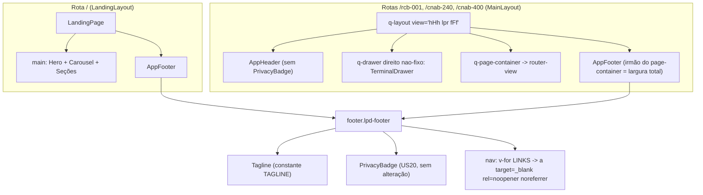
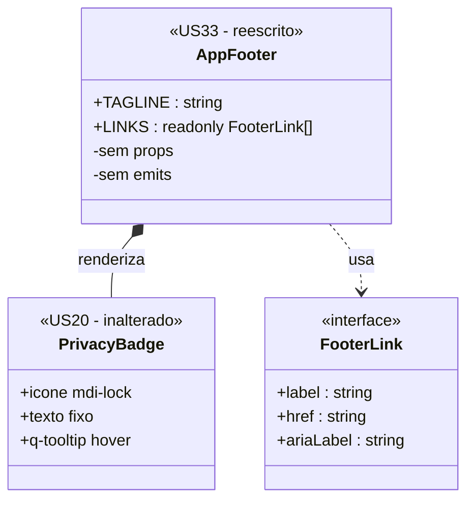

# PLAN — Footer global com badge de privacidade

## Dados do Plano

| Campo               | Valor                                |
| ------------------- | ------------------------------------ |
| Número da US        | US33                                 |
| Slug                | `us33-footer-global`                 |
| Stack               | Quasar + Vue 3 + TypeScript + Vitest |
| Data de criação     | 2026-09-14                           |
| Data de modificação | —                                    |

---

## Resumo Técnico

Reescrever o `AppFooter.vue` já existente (criado pela US21 como rodapé simples da landing: crédito + link do GitHub) para o footer institucional definido pelo protótipo `docs/design system/CNAB240page.html`: tagline com café, `PrivacyBadge` (US20, reaproveitado sem alteração) e três links externos (GitHub, LinkedIn, Apoiar ☕). O componente deixa de ter props e passa a ler os links de uma constante interna — é conteúdo institucional fixo, igual em toda rota (RN01).

A montagem passa a ter **dois pontos**, um por layout raiz:

- **Landing (`/`)** — `AppFooter` já é montado ao final de `LandingPage.vue`; nada muda na montagem, apenas o conteúdo renderizado.
- **Rotas de formato (`/rcb-001`, `/cnab-240`, `/cnab-400`)** — `AppFooter` é montado no `MainLayout.vue` como **elemento irmão do `q-page-container`**, dentro do `q-layout` (decisão da entrevista, Opção A). Por ficar fora do `q-page-container`, o footer não herda o `padding-right` que o `q-drawer` direito aplica ao empurrar o conteúdo, satisfazendo o CA07 ("largura total da tela, abaixo de ambas as colunas"). Montagem única cobre as 3 rotas de formato.

Junto com isso, a `view` do `q-layout` passa a ser **`"hHh lpr fFf"`** — com `r` **minúsculo** — em **ambos** os layouts (`MainLayout.vue` e `LandingLayout.vue`), por decisão do humano. O `r` minúsculo tira o `position: fixed` do `q-drawer` direito: o painel do visualizador passa a existir no fluxo do layout e a rolar junto com a página, em vez de ficar grudado na viewport. Isso **reforça** a RN05/CA06 e o CA07 — com o drawer em fluxo, o footer irmão do `q-page-container` fica naturalmente abaixo das duas colunas, sem depender de altura de viewport. O comportamento de _empurrar_ o conteúdo (em vez de sobrepor), que é o requisito da US15/ADR-012, continua válido: quem sobrepõe é o modo `overlay`, não o `r` maiúsculo.

O `AppHeader` perde o `PrivacyBadge` e, com ele, todo o CSS de contorção mobile que existia apenas para não cortar o texto do badge (`white-space: nowrap` de 40 caracteres em um toolbar `nowrap`). Isso é a RN07 na prática: não é "redistribuir espaço vazio", é **remover workaround**.

Nenhuma dependência nova, nenhum composable novo, nenhuma store. É uma US de composição e layout.

---

## Componentes Afetados

| Componente                                              | Ação      | Notas                                                                                                                   |
| ------------------------------------------------------- | --------- | ----------------------------------------------------------------------------------------------------------------------- |
| `src/components/AppFooter.vue`                          | Modificar | Reescrita completa: props-less, tagline + `PrivacyBadge` + 3 links; layout flex desktop / stack mobile                  |
| `src/components/AppHeader.vue`                          | Modificar | Remover `<PrivacyBadge />` + import + CSS morto (`.lpd-header__privacy*`, `.lpd-header__btn-tema`) e simplificar mobile |
| `src/layouts/MainLayout.vue`                            | Modificar | Montar `<AppFooter />` como irmão do `q-page-container`; `view` de `"hHh lpR fFf"` → `"hHh lpr fFf"`                    |
| `src/layouts/LandingLayout.vue`                         | Modificar | `view` de `"hHh lpR fFf"` → `"hHh lpr fFf"` + atualizar docblock (menciona `PrivacyBadge` no header)                    |
| `docs/adr/ADR-012-q-drawer-lateral.md`                  | Modificar | Corrigir a citação da `view` (`lpR` → `lpr`) e o rationale associado — ver "Riscos e Decisões em Aberto"                |
| `src/pages/LandingPage.vue`                             | Modificar | Somente comentários (item "5. AppFooter (crédito + link GitHub)" vira "footer global"); a tag `<AppFooter />` não muda  |
| `src/components/PrivacyBadge.vue`                       | Nenhuma   | Reaproveitado como está — RN01–RN08 da US20 continuam valendo (SPEC, Excluído)                                          |
| `test/vitest/unit/components/AppFooter.spec.ts`         | Modificar | Reescrita: testes de props `githubUrl`/`autor` deixam de existir                                                        |
| `test/vitest/unit/components/AppHeader.spec.ts`         | Modificar | Bloco "PrivacyBadge (US20)" inverte a asserção (badge **ausente**)                                                      |
| `test/vitest/unit/layouts/MainLayout.spec.ts`           | Modificar | `AppFooter` presente e fora do `q-page-container`; asserção da `view` passa a `"hHh lpr fFf"`                           |
| `test/vitest/unit/layouts/LandingLayout.spec.ts`        | Modificar | Asserção/comentário da `view` (linha ~60) passa a `"hHh lpr fFf"`                                                       |
| `test/playwright/e2e/us15-visualizador-arquivo.spec.ts` | Verificar | Drawer deixa de ser `position: fixed`; revalidar asserções de visibilidade/scroll do painel                             |
| `test/playwright/e2e/us20-badge-privacidade.spec.ts`    | Modificar | Caso "badge permanece visível após scroll (header fixo)" não vale mais — ver seção Testes                               |
| `test/playwright/e2e/us21-landing-page.spec.ts`         | Modificar | Asserção `toContainText('Pedro Ratto')` sobre `.lpd-footer` não vale mais                                               |
| `test/playwright/e2e/us33-footer-global.spec.ts`        | Criar     | E2E da US33 (presença por rota, links, layouts desktop/mobile, não-fixo)                                                |

---

## Estrutura de Dados

Nenhum estado reativo é introduzido. O único "dado" é a lista estática de links externos, declarada como constante no `<script setup>` do `AppFooter.vue`:

```ts
// src/components/AppFooter.vue

/** Um link externo exibido no rodapé. */
interface FooterLink {
  /** Rótulo visível (pode conter emoji, ex.: "Apoiar ☕"). */
  label: string;
  /** URL absoluta de destino. */
  href: string;
  /** Texto do `aria-label` — descreve o destino para leitores de tela. */
  ariaLabel: string;
}

/** Tagline institucional (RN02, item 1). */
const TAGLINE = '☕ Leiautes Para Devs — feito por dev, para dev, com café extra-forte.';

/** Links externos do rodapé, na ordem do protótipo (RN02, item 3). */
const LINKS: readonly FooterLink[] = [
  {
    label: 'GitHub',
    href: 'https://github.com/ratto/leiautes-para-devs',
    ariaLabel: 'Ver o repositório do projeto no GitHub (abre em nova aba)',
  },
  {
    label: 'LinkedIn',
    href: 'https://www.linkedin.com/in/pedro-tosta-paixao/',
    ariaLabel: 'Ver o perfil do autor no LinkedIn (abre em nova aba)',
  },
  {
    label: 'Apoiar ☕',
    href: 'https://www.paypal.com/donate/?hosted_button_id=8RE442ASFC2PS',
    ariaLabel: 'Apoiar o projeto com uma doação via PayPal (abre em nova aba)',
  },
] as const;
```

**Decisão — o componente deixa de ter props.** O `AppFooter` da US21 recebia `githubUrl` (com render condicional, mitigação de "o repo ainda não existe") e `autor`. Ambas saem:

- A URL do repositório agora está confirmada e é a mesma do protótipo — o render condicional vira código morto.
- O crédito "Feito por **Pedro Ratto**" não consta da composição da RN02, e o CA03 é explícito: a landing passa a ver "tagline + badge + 3 links", **não mais** "link do GitHub + crédito". A autoria fica coberta pelo link do LinkedIn.

Consequência: `LandingPage.vue` já monta `<AppFooter />` sem props, então nada muda no call site.

---

## Lógica Principal

Não há lógica de runtime — o componente é declarativo. O que existe são regras de composição e estilo:

1. **Composição (RN02)** — o `<footer class="lpd-footer">` contém um wrapper interno `.lpd-footer__inner` com `max-width: 1400px; margin: 0 auto` (mesmo do protótipo), e dentro dele dois grupos:
   - `.lpd-footer__brand` — `<span class="lpd-footer__tagline">` com `TAGLINE` + `<PrivacyBadge />`
   - `.lpd-footer__links` — `v-for` sobre `LINKS` renderizando `<a>`
2. **Semântica** — `<footer>` nativo (`role="contentinfo"` implícito, não declarar). O grupo de links vai dentro de `<nav aria-label="Links do projeto">` para dar um landmark navegável ao leitor de tela.
3. **Links externos (RN06)** — todo `<a>` recebe `target="_blank"` e `rel="noopener noreferrer"`. A SPEC exige `noopener`; mantemos `noreferrer` junto, padrão já adotado pelo `AppFooter` da US21 e mais estrito (não vaza o `Referer` para PayPal/LinkedIn).
4. **Layout desktop (RN04, CA04)** — `.lpd-footer__inner`: `display: flex; justify-content: space-between; align-items: center; gap: var(--lpd-space-4); flex-wrap: wrap`. `.lpd-footer__brand` e `.lpd-footer__links` são ambos `flex` com `gap` e `flex-wrap: wrap` — tagline+badge à esquerda, links à direita, com wrap natural.
5. **Layout mobile (RN04, CA05)** — em `@media (max-width: 767px)`: `.lpd-footer__inner { flex-direction: column; align-items: center; text-align: center }` e `.lpd-footer__links { justify-content: center }`. Empilha tagline → badge → links, cada grupo centralizado. O breakpoint 767px espelha o já usado no `AppHeader` (ver "Riscos e Decisões em Aberto" sobre a divergência com o `md` do Quasar).
6. **Fluxo normal (RN05, CA06)** — nenhum `position: fixed`/`sticky` no CSS do footer, e nenhum uso de `<q-footer>` do Quasar (que é fixo por padrão com o `F` maiúsculo do grupo `fFf`). Usar `<footer>` HTML nativo é o que garante a RN05 por construção.
7. **`view` do `q-layout` (`"hHh lpr fFf"`)** — trocar `lpR` por `lpr` em `MainLayout.vue` **e** `LandingLayout.vue`, mantendo os grupos `hHh` (header fixo) e `fFf` (inalterado, já que não usamos `q-footer`). O `r` minúsculo tira o `position: fixed` do `q-drawer` direito, que passa a rolar junto com o conteúdo. Consequência prática para esta US: o footer irmão do `q-page-container` aparece logo após o fim real do conteúdo, sem ter de rolar uma viewport inteira de drawer fixo. O `LandingLayout` não tem drawer algum, então a troca ali é puramente de consistência entre os dois layouts.
8. **Largura total nas telas de App (CA07)** — o `AppFooter` é irmão do `q-page-container` dentro do `q-layout` do `MainLayout`. O `q-drawer` direito aplica `padding-right` ao `q-page-container`, não ao `q-layout`; portanto o footer ocupa 100% da largura da tela mesmo com o drawer aberto, aparecendo abaixo tanto do formulário quanto do visualizador.
9. **Header sem o badge (RN07, CA02)** — remover do `AppHeader.vue`:
   - a tag `<PrivacyBadge />` e seu import;
   - as regras CSS órfãs `.lpd-header__privacy`, `.lpd-header__privacy-text` e `.lpd-header__btn-tema` (nenhuma classe correspondente existe no template — já eram código morto);
   - do bloco `@media (max-width: 767px)`: o `.lpd-header__name { display: none }` e a ocultação do rótulo do botão "Ver arquivo" (`:deep(.q-btn__content span)`), workarounds criados só para caber o texto de 40 caracteres do badge no toolbar.
   - **Manter** `flex-wrap: wrap` no toolbar e o `.lpd-header__selector { order: 3; flex-basis: 100% }` em mobile: os 3 chips do `LeiauteSelector` continuam precisando de uma linha própria abaixo de 768px, independentemente do badge. O resultado é um header mobile de duas linhas limpas (marca + ações / chips), em vez de três linhas irregulares.
   - Atualizar o docblock do componente (hoje lista o `PrivacyBadge` entre os filhos).

---

## Composables / Serviços

Nenhum. O `AppFooter` não lê store nem composable — não depende de rota, de tema (o tema é resolvido pelos tokens `--lpd-*` via `data-theme` no `:root`, US19) nem de estado de aplicação. É um componente folha de conteúdo estático, exatamente como o `PrivacyBadge` que ele hospeda.

Isso é deliberado: torna o componente montável em teste unitário sem `createTestingPinia`, sem router e sem mocks.

---

## Eventos e Props (componente novo)

`AppFooter.vue` (reescrito):

- **Props:** nenhuma. `githubUrl` e `autor` são **removidas** (ver "Estrutura de Dados").
- **Emits:** nenhum.
- **Slots:** nenhum.
- **Interação:** apenas os 3 links `<a>`, que são navegação externa nativa em nova aba. Nenhum handler JS.

`AppHeader.vue`: sem alteração de API pública (não tem props nem emits); muda só a composição interna.

---

## Fluxo de Dados



---

## Diagramas Adicionais

Hierarquia do footer e origem de cada pedaço de conteúdo, para deixar explícito o que é novo (US33) e o que é reaproveitado (US20):



---

## Dependências Externas

**npm:** nenhuma dependência nova. `q-icon`/`q-tooltip` do Quasar já estão em uso pelo `PrivacyBadge`; o footer em si é HTML + CSS.

**Inter-US:**

- **US01** (Done) — provê o `AppHeader` e o `LeiauteSelector`; esta US remove o badge desse header e reorganiza o mobile.
- **US20** (Done) — provê o `PrivacyBadge`, reaproveitado sem alteração. Os testes E2E da US20 assumem o badge no header fixo e **precisam ser atualizados** por esta US.
- **US21** (Done) — provê o `AppFooter` simples da landing, que esta US substitui; o E2E da US21 asserta "Pedro Ratto" no footer e **precisa ser atualizado**.
- **US15 / ADR-012** — o `q-drawer` direito do `MainLayout` é o motivo de o footer ser montado fora do `q-page-container`.
- **US19** (Done) — o tema é aplicado por tokens no `:root`; o footer herda sem lógica própria.

---

## Testes

### Unitários (Vitest)

`test/vitest/unit/components/AppFooter.spec.ts` — **reescrito** (os testes de `githubUrl`/`autor` deixam de existir junto com as props):

- Renderiza um `<footer class="lpd-footer">` (estrutura semântica).
- Exibe a tagline exata `☕ Leiautes Para Devs — feito por dev, para dev, com café extra-forte.` (RN02).
- Renderiza o `PrivacyBadge` (stub ou real) dentro do footer (RN03).
- Renderiza exatamente 3 links, com `href` igual às URLs da RN02, na ordem GitHub → LinkedIn → Apoiar.
- Todo link tem `target="_blank"` e `rel` contendo `noopener` (RN06, CA08).
- Todo link tem `aria-label` não vazio.
- Não renderiza mais o crédito "Feito por" (guarda de regressão do CA03).

`test/vitest/unit/components/AppHeader.spec.ts` — **modificado**:

- O bloco `describe('PrivacyBadge (US20)')` vira uma asserção de **ausência**: `expect(wrapper.find('[data-testid="stub-privacy-badge"]').exists()).toBe(false)` (CA02). O stub pode ser mantido no `global.stubs` justamente para provar que, mesmo registrado, nada o renderiza.
- Os demais casos (brand, `LeiauteSelector`, botão "Ver arquivo", `ThemeToggle`) devem continuar verdes sem alteração — se algum quebrar, a remoção foi além do escopo.

`test/vitest/unit/layouts/MainLayout.spec.ts` — **modificado**:

- `AppFooter` é renderizado pelo layout.
- O `AppFooter` **não** está dentro do `q-page-container` (asserção estrutural que protege o CA07 contra uma "simplificação" futura que o mova para dentro).
- A string `view` do `q-layout` é `"hHh lpr fFf"` — atualizar a asserção e o comentário existentes (hoje fixam `"hHh lpR fFf"`).

`test/vitest/unit/layouts/LandingLayout.spec.ts` — **modificado**:

- A asserção/comentário da `view` (linha ~60) passa a `"hHh lpr fFf"`.

### Integração (Vue Test Utils)

- Montagem de `LandingPage` com o `AppFooter` real: a landing contém **duas** instâncias de `.lpd-privacy-badge` (a do hero, intocada pelo CA09, e a do footer) — asserção que protege o CA09 contra remoção acidental do badge do hero.

### E2E (Playwright)

`test/playwright/e2e/us33-footer-global.spec.ts` — **novo**:

- **CA01** — para cada rota (`/`, `/rcb-001`, `/cnab-240`, `/cnab-400`): rolar até o fim e verificar `.lpd-footer` visível, contendo a tagline, `.lpd-privacy-badge` e os 3 links.
- **CA02** — em cada rota, `header .lpd-privacy-badge` não existe.
- **CA03** — em `/`, o footer não contém o texto "Feito por".
- **CA06** — capturar `boundingBox().y` do footer antes e depois de `window.scrollTo(0, 0)` / scroll ao fim: o valor muda (footer acompanha o conteúdo); e `getComputedStyle(footer).position` é `static`/`relative`, nunca `fixed`/`sticky`.
- **CA07** — em `/cnab-240` com o drawer aberto (viewport ≥ 600px): a largura do `.lpd-footer` é igual à largura do viewport, e seu `y` é maior que o `y` do fim do formulário.
- **CA04** — viewport 1440×900: `.lpd-footer__brand` e `.lpd-footer__links` têm o mesmo `y` (mesma linha) e o `x` de `__links` é maior que o de `__brand`.
- **CA05** — viewport 360×640: os `y` de tagline, badge e links são estritamente crescentes (empilhados); os centros horizontais dos três coincidem com o centro do footer (±2px).
- **CA08** — cada link tem `target="_blank"` e `rel` com `noopener` (verificação de atributo; não abrir de fato as abas externas em CI).
- **CA09** — em `/`, hero e seção de privacidade seguem presentes com o mesmo texto.

`test/playwright/e2e/us20-badge-privacidade.spec.ts` — **modificado**:

- O caso "badge permanece visível após scroll (header é position:fixed)" **deixa de ser verdadeiro**: o badge não está mais no header fixo. Substituir pela asserção equivalente do novo contrato — o badge está presente em toda rota (no footer, alcançável por scroll) e continua sem interatividade. Os casos de tooltip e de clique-sem-efeito continuam válidos, apenas passando a mirar o badge do footer (o `.first()` usado hoje passa a resolver para o badge do hero na landing — revisar os seletores rota a rota).

`test/playwright/e2e/us21-landing-page.spec.ts` — **modificado**:

- `await expect(page.locator('.lpd-footer')).toContainText('Pedro Ratto')` passa a asserir o novo conteúdo do footer (tagline/LinkedIn), conforme CA03.

`test/playwright/e2e/us15-visualizador-arquivo.spec.ts` — **verificar (possível ajuste)**:

- Com `lpr`, o `q-drawer` do visualizador deixa de ser `position: fixed` e rola junto com a página. Qualquer asserção que dependa de o painel continuar visível após scroll, ou de coordenadas fixas do painel, precisa ser revalidada. As asserções de abrir/fechar via toggle e de conteúdo do terminal não são afetadas.

### Verificação manual

- Alternar dark/light (US19) e conferir contraste do footer em ambos os temas (RN08, CA10) — tagline e links em `--lpd-text-muted` sobre `--lpd-base` já são pares validados no design system; confirmar com as DevTools que nenhuma cor hardcoded entrou.
- Abrir `/cnab-240` em 1440px, abrir e fechar o drawer, rolar até o fim: o footer não deve "pular" nem ficar coberto pelo drawer.

---

## Riscos e Decisões em Aberto

| Risco / Dúvida                                                                                                                                                                      | Impacto | Mitigação                                                                                                                                                                                                                               |
| ----------------------------------------------------------------------------------------------------------------------------------------------------------------------------------- | ------- | --------------------------------------------------------------------------------------------------------------------------------------------------------------------------------------------------------------------------------------- |
| `AppFooter` como filho não-canônico do `q-layout` (irmão do `q-page-container`) pode conflitar com atualizações do Quasar                                                           | Médio   | O `q-layout` renderiza filhos arbitrários no seu slot default; o teste de `MainLayout` fixa a estrutura. Alternativa de escape, se quebrar: `<q-footer>` com `view` `FfF`                                                               |
| Troca de `lpR` → `lpr` altera o comportamento do `q-drawer` do visualizador (deixa de ser `position: fixed`, rola com a página) — efeito colateral fora do escopo declarado da US33 | Alto    | Decisão explícita do humano. Validar em `/cnab-240` com o drawer aberto que ele continua **empurrando** (não sobrepondo) o formulário e que o conteúdo do terminal segue legível ao rolar; revalidar o E2E da US15 antes de fechar a US |
| A `view` `"hHh lpR fFf"` está citada textualmente no ADR-012 e nos docblocks de `MainLayout`/`LandingLayout`                                                                        | Médio   | Atualizar a citação no ADR-012 e nos docblocks junto com o código. Se a mudança de comportamento do drawer for considerada relevante, abrir um ADR de emenda em vez de editar o ADR-012 em silêncio — decidir com o humano              |
| Com o drawer aberto e viewport alta, o footer só aparece após rolar até o fim do conteúdo                                                                                           | Baixo   | Comportamento esperado do CA06 (footer em fluxo, não fixo). Com `lpr` o drawer também rola, então o footer fica logo abaixo do conteúdo real, sem "buraco" de uma viewport                                                              |
| Breakpoint mobile do footer: a SPEC diz "breakpoint md", que no Quasar é 1024px; o código usa 767px                                                                                 | Médio   | Adotado **767px**, consistente com o `AppHeader`, e o `flex-wrap` cobre a faixa 768–1023px sem quebra visual. Registrado aqui para validação do humano                                                                                  |
| Testes E2E das US20 e US21 quebram por asserções que a US33 invalida por design                                                                                                     | Alto    | Já mapeados nominalmente na seção Testes; a atualização deles faz parte do escopo de implementação, não é "conserto de teste quebrado"                                                                                                  |
| Remoção das props `githubUrl`/`autor` é breaking change do `AppFooter`                                                                                                              | Baixo   | Único call site é `LandingPage.vue`, que já monta sem props. `AppFooter.spec.ts` é reescrito junto                                                                                                                                      |
| Duas instâncias de `PrivacyBadge` na landing (hero + footer) podem parecer redundância                                                                                              | Baixo   | Explicitamente fora de escopo por decisão da SPEC (CA09) e do card. Coberto por teste para não ser "limpo" por engano                                                                                                                   |
| Emoji ☕ na tagline e no link "Apoiar" pode ser lido em voz alta por leitores de tela                                                                                               | Baixo   | O `aria-label` do link "Apoiar ☕" descreve a ação em texto puro; a tagline é conteúdo decorativo cujo emoji não altera o sentido                                                                                                       |

---

## Ordem sugerida de implementação

1. Reescrever `src/components/AppFooter.vue`: template (footer → inner → brand[tagline + PrivacyBadge] + nav[links]), `<script setup>` com `FooterLink`/`TAGLINE`/`LINKS` (sem props), `<style scoped>` com tokens `--lpd-*` e o `@media (max-width: 767px)` de empilhamento.
2. Reescrever `test/vitest/unit/components/AppFooter.spec.ts` conforme a seção Testes e rodar até verde.
3. Remover `<PrivacyBadge />`, seu import, o CSS morto (`.lpd-header__privacy*`, `.lpd-header__btn-tema`) e os workarounds mobile de `src/components/AppHeader.vue`; atualizar o docblock.
4. Inverter a asserção do bloco `PrivacyBadge (US20)` em `test/vitest/unit/components/AppHeader.spec.ts`.
5. Montar `<AppFooter />` em `src/layouts/MainLayout.vue` como irmão do `q-page-container` (após ele), com comentário explicando por que fica fora do container (CA07); trocar a `view` para `"hHh lpr fFf"`; atualizar o docblock.
6. Trocar a `view` de `src/layouts/LandingLayout.vue` para `"hHh lpr fFf"` e atualizar seu docblock (que ainda menciona o `PrivacyBadge` no header).
7. Atualizar `test/vitest/unit/layouts/MainLayout.spec.ts` (footer presente, fora do page-container, `view` = `"hHh lpr fFf"`) e `test/vitest/unit/layouts/LandingLayout.spec.ts` (`view`).
8. Atualizar os comentários/docblocks de `src/pages/LandingPage.vue` (nenhuma mudança funcional).
9. Verificar manualmente `/cnab-240` com o drawer aberto: confirmar que com `lpr` ele continua empurrando o formulário (não sobrepõe) e rola junto com a página; revalidar `test/playwright/e2e/us15-visualizador-arquivo.spec.ts` e ajustar o que depender de drawer fixo.
10. Atualizar `test/playwright/e2e/us20-badge-privacidade.spec.ts` e `test/playwright/e2e/us21-landing-page.spec.ts`.
11. Criar `test/playwright/e2e/us33-footer-global.spec.ts` com os casos CA01–CA09.
12. Atualizar a citação da `view` no `docs/adr/ADR-012-q-drawer-lateral.md` (ou abrir ADR de emenda, conforme decisão do humano).
13. Rodar a suíte completa (Vitest + Playwright) e o lint; verificação manual de contraste nos dois temas e do comportamento do footer com o drawer aberto/fechado.

---

## Custo da IA

| Métrica              | Valor                       |
| -------------------- | --------------------------- |
| Modelo               | claude-opus-5               |
| Tokens de entrada    | ~48k                        |
| Tokens de saída      | ~9k                         |
| Custo estimado (USD) | ~$0,82                      |
| Taxa de câmbio       | 1 USD = R$5,80 (2026-09-14) |
| Custo estimado (BRL) | ~R$4,76                     |

> Estimativa de tokens: leitura de SPEC, card do Trello, ADR-001/ADR-012, `AppHeader`/`AppFooter`/`PrivacyBadge`/layouts/rotas e testes existentes (~40k tokens entrada), entrevista técnica (~8k entrada), escrita do PLAN (~9k saída).
> Preços claude-opus-5: $5/M tokens entrada, $25/M tokens saída.

## Custo Estimado do Refinamento (2026-09-14)

| Métrica              | Valor                       |
| -------------------- | --------------------------- |
| Modelo               | claude-opus-5               |
| Tokens de entrada    | ~48k                        |
| Tokens de saída      | ~9k                         |
| Custo estimado (USD) | ~$0,82                      |
| Taxa de câmbio       | 1 USD = R$5,80 (2026-09-14) |
| Custo estimado (BRL) | ~R$4,76                     |

> Estimativa de tokens: sessão única de planejamento técnico — leitura de contexto (~40k entrada), entrevista de 1 pergunta decisiva (~8k entrada) e geração do PLAN.md (~9k saída).
> Preços claude-opus-5: $5/M tokens entrada, $25/M tokens saída.
