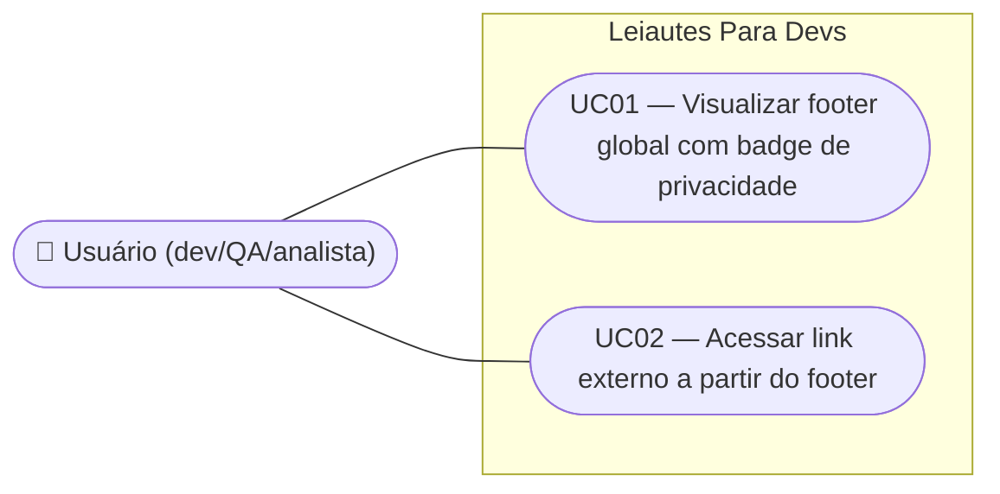

# SPEC — Footer global com badge de privacidade

## Dados da SPEC

| Campo             | Valor                                                                          |
| ------------------ | ------------------------------------------------------------------------------ |
| Número da US      | US33                                                                            |
| Slug               | `us33-footer-global`                                                          |
| Prioridade         | P1                                                                              |
| Status             | Draft                                                                           |
| Data de criação    | 2026-09-13                                                                      |
| Card Trello        | https://trello.com/c/N3s8l3YC/35-us33-footer-global-com-badge-de-privacidade   |

---

## Contexto

O badge de privacidade ("Seus dados nunca saem do seu navegador", US20) hoje vive dentro do `AppHeader` (US01), ao lado do seletor de leiaute (chips RCB001/CNAB240/CNAB400) e do toggle de tema (US19). Isso deixa a barra superior congestionada — em mobile, os elementos quebram em múltiplas linhas para acomodar o texto completo do badge, competindo por espaço com a navegação principal.

O protótipo `docs/design system/CNAB240page.html` já estabeleceu visualmente um padrão de footer institucional: tagline ("☕ Leiautes Para Devs — feito por dev, para dev, com café extra-forte."), links para GitHub/LinkedIn/Apoiar (doação via PayPal) e, nesse protótipo específico, o próprio badge de privacidade já reposicionado para dentro do footer. Esta US formaliza esse padrão como um componente `AppFooter.vue` reutilizável, movendo o badge do header para o footer e unificando o footer em **todas as telas da aplicação** — landing (substituindo o footer mais simples definido pela US21, que só tinha link do GitHub e crédito) e as 3 telas de formato (RCB001/CNAB240/CNAB400).

O escopo é deliberadamente estreito: apenas a instância do badge que vive no header é movida. As demais menções de privacidade já existentes na landing (hero e seção dedicada "Seus dados nunca saem do seu navegador") permanecem como estão e ficam fora desta US — qualquer ajuste nelas é tratado por uma US futura.

---

## Escopo

### Incluso

- Componente `AppFooter.vue` reutilizável, contendo: tagline institucional, `PrivacyBadge` (componente já existente da US20), e links externos (GitHub, LinkedIn, Apoiar/doação).
- Uso do `AppFooter` na landing page, substituindo o footer simples definido pela US21.
- Uso do `AppFooter` nas 3 telas de formato (`/rcb-001`, `/cnab-240`, `/cnab-400`).
- Remoção do `PrivacyBadge` do `AppHeader` em todas as rotas.
- Reorganização do `AppHeader` para acomodar o espaço liberado pela remoção do badge (seletor de leiaute + toggle de tema).
- Layout responsivo do footer: flex-wrap em desktop (tagline+badge à esquerda, links à direita), empilhado e centralizado em mobile.
- Footer em fluxo normal de página (full-width, abaixo do conteúdo), nunca fixo/sticky — inclusive nas telas de App com layout de duas colunas (footer abaixo de ambas as colunas, não preso a nenhuma delas).

### Excluído

- Alterações no hero da landing (`HeroSection`) ou na seção dedicada "Seus dados nunca saem do seu navegador" — ambos permanecem inalterados nesta US.
- Novo conteúdo, copy ou links além dos já existentes no protótipo `CNAB240page.html`.
- CSP restritivo ou verificação automatizada de requisições de rede (já fora de escopo na US20).
- Footer fixo/sticky (`position: fixed`/`sticky`).
- Alterações nas regras de composição, contraste, tooltip ou comportamento do `PrivacyBadge` em si (RN01–RN08 da US20 continuam valendo — só muda o componente-pai que o hospeda).

---

## Regras de Negócio

### RN01 — Componente único reutilizado em toda a aplicação

`AppFooter.vue` é o único componente de footer da aplicação. É renderizado na landing (`/`) e nas 3 rotas de formato (`/rcb-001`, `/cnab-240`, `/cnab-400`), sem variações de conteúdo entre rotas.

### RN02 — Composição do footer

O footer contém, sempre nesta ordem lógica (a ordem visual pode se adaptar por breakpoint):

1. Tagline: `"☕ Leiautes Para Devs — feito por dev, para dev, com café extra-forte."`
2. `PrivacyBadge` (mesmo componente da US20, sem alterações de conteúdo/comportamento).
3. Links externos: **GitHub** (`https://github.com/ratto/leiautes-para-devs`), **LinkedIn** (`https://www.linkedin.com/in/pedro-tosta-paixao/`), **Apoiar** (`https://www.paypal.com/donate/?hosted_button_id=8RE442ASFC2PS`).

### RN03 — Badge sai do header, entra no footer

O `AppHeader` deixa de renderizar o `PrivacyBadge` em qualquer rota. O `PrivacyBadge` passa a ser renderizado exclusivamente dentro do `AppFooter` (mais as instâncias já existentes no hero e na seção de privacidade da landing, que são componentes/textos distintos e não são afetados por esta US).

### RN04 — Layout responsivo

- **Desktop (≥ breakpoint md):** conteúdo do footer em `flex` com `wrap`, tagline+badge agrupados à esquerda, links agrupados à direita — mesmo padrão visual do protótipo `CNAB240page.html`.
- **Mobile (< breakpoint md):** conteúdo do footer empilhado verticalmente (tagline, depois badge, depois links), cada grupo centralizado horizontalmente.

### RN05 — Posicionamento em fluxo normal

O footer nunca é `fixed` ou `sticky`. Ocupa a largura total da tela e aparece no fluxo normal do documento, após o conteúdo principal. Nas telas de App (layout de duas colunas: formulário + visualizador), o footer aparece abaixo de ambas as colunas, não é preso a nenhuma delas individualmente.

### RN06 — Links externos

Todos os links do footer abrem em nova aba (`target="_blank" rel="noopener"`), preservando o comportamento já usado no protótipo.

### RN07 — Header se reorganiza sem o badge

Com a remoção do badge, o `AppHeader` redistribui o espaço entre o seletor de leiaute (chips) e o toggle de tema — sem introduzir espaço vazio artificial nem quebras de linha desnecessárias que existiam apenas para acomodar o texto do badge.

### RN08 — Contraste e tokens

Todo o texto do footer (tagline, links, badge) respeita contraste ≥ 4.5:1 em ambos os temas (WCAG 2.1 AA), usando exclusivamente tokens `--lpd-*` — nunca cores hardcoded.

<!-- TODO: verify against FEBRABAN spec — não aplicável a esta US (feature de UX/layout, não de leiaute bancário) -->

---

## Use Cases

### UC01 — Usuário visualiza o footer global com badge de privacidade

- **Ator:** usuário (dev, QA ou analista de integração)
- **Precondição:** usuário está em qualquer rota da aplicação (`/`, `/rcb-001`, `/cnab-240`, `/cnab-400`)
- **Fluxo principal:**
  1. Usuário navega até o fim do conteúdo da página (ou visualiza o footer diretamente, se a viewport for alta o suficiente)
  2. Sistema renderiza o `AppFooter`, contendo tagline, `PrivacyBadge` e links externos
  3. Usuário observa o badge de privacidade, agora no rodapé, confirmando que os dados não saem do navegador
- **Fluxo alternativo (mobile):** o conteúdo do footer é exibido empilhado e centralizado em vez de em linha
- **Postcondição:** footer visível com todas as informações institucionais e o badge de privacidade

### UC02 — Usuário acessa um link externo a partir do footer

- **Ator:** usuário
- **Precondição:** `AppFooter` está renderizado na tela
- **Fluxo principal:**
  1. Usuário clica em um dos links do footer (GitHub, LinkedIn ou Apoiar)
  2. Sistema abre o link em nova aba (`target="_blank"`), preservando a aba atual da aplicação
- **Postcondição:** nova aba aberta com o destino externo; aplicação permanece intacta na aba original

---

## Critérios de Aceitação

### CA01 — AppFooter presente em toda rota

**Dado que** o usuário está em qualquer rota da aplicação (`/`, `/rcb-001`, `/cnab-240`, `/cnab-400`)
**Quando** rola até o fim do conteúdo
**Então** vê o `AppFooter` com tagline, `PrivacyBadge` e os 3 links externos (GitHub, LinkedIn, Apoiar)

### CA02 — Badge removido do header

**Dado que** o usuário está em qualquer rota da aplicação
**Quando** observa o `AppHeader`
**Então** o `PrivacyBadge` não aparece mais ali (apenas logo, seletor de leiaute e toggle de tema, conforme aplicável à rota)

### CA03 — Footer substitui o footer simples da landing

**Dado que** o usuário está na rota raiz (`/`)
**Quando** observa o footer
**Então** vê o `AppFooter` completo (tagline + badge + 3 links), não mais o footer simples definido pela US21 (apenas link do GitHub + crédito)

### CA04 — Layout desktop

**Dado que** o usuário está em viewport desktop (≥ breakpoint md)
**Quando** observa o footer
**Então** tagline e badge aparecem agrupados à esquerda e os links agrupados à direita, em uma única linha com wrap se necessário

### CA05 — Layout mobile

**Dado que** o usuário está em viewport mobile (360×640)
**Quando** observa o footer
**Então** tagline, badge e links aparecem empilhados verticalmente, cada grupo centralizado horizontalmente

### CA06 — Footer não é fixo

**Dado que** o usuário rola a página (landing ou telas de App)
**Quando** o scroll acontece
**Então** o footer se move junto com o conteúdo (não permanece fixo na viewport)

### CA07 — Footer abaixo das duas colunas nas telas de App

**Dado que** o usuário está em uma tela de formato (`/cnab-240`, por exemplo), com layout de duas colunas (formulário + visualizador)
**Quando** rola até o fim da página
**Então** o footer aparece abaixo de ambas as colunas, ocupando a largura total da tela

### CA08 — Links abrem em nova aba

**Dado que** o usuário clica em qualquer link do footer (GitHub, LinkedIn, Apoiar)
**Quando** o clique é registrado
**Então** o destino abre em uma nova aba (`target="_blank" rel="noopener"`), sem navegar para fora da aplicação na aba atual

### CA09 — Hero e seção de privacidade da landing intocados

**Dado que** o usuário está na landing page
**Quando** observa o hero e a seção "Seus dados nunca saem do seu navegador"
**Então** ambos permanecem exatamente como antes desta US — nenhuma alteração de conteúdo, posição ou estilo

### CA10 — Contraste em ambos os temas

**Dado que** o usuário alterna entre tema escuro e claro (US19)
**Quando** observa o footer em cada tema
**Então** todo o texto (tagline, links, badge) tem contraste ≥ 4.5:1 contra o fundo

---

## Custo da IA

| Métrica            | Valor            |
| -------------------- | ----------------- |
| Tokens de entrada    | ~55k              |
| Tokens de saída      | ~9k                |
| Custo estimado (USD) | ~$0,35             |
| Taxa de câmbio       | 1 USD = R$5,80 (2026-08-30) |
| Custo estimado (BRL) | ~R$2,03            |
| Modelo               | claude-sonnet-5    |

> Valores aproximados, apenas para a fase de geração do SPEC (leitura do design system/protótipos, pesquisa de contexto via subagente e entrevista de negócio/UX).
