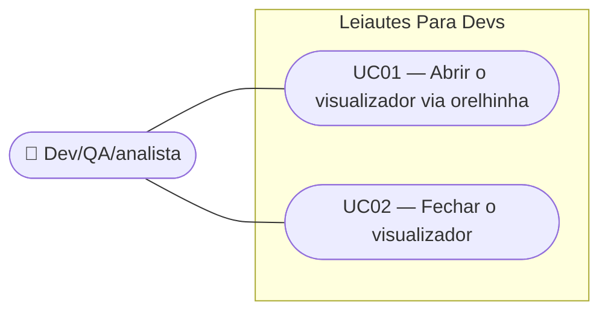

# SPEC — Orelhinha: toggle sticky do drawer do visualizador

## Dados da SPEC

| Campo            | Valor                                                                                  |
| ----------------- | --------------------------------------------------------------------------------------- |
| Número da US     | US34                                                                                     |
| Slug              | `us34-orelhinha-drawer-visualizador`                                                   |
| Prioridade        | P2                                                                                       |
| Status            | Draft                                                                                    |
| Data de criação   | 2026-09-13                                                                               |
| Card Trello       | https://trello.com/c/P2XGe2YU/36-us34-orelhinha-toggle-sticky-do-drawer-do-visualizador |

---

## Contexto

A US15 (`Done`) implementou o painel lateral (`q-drawer` do Quasar) que exibe o arquivo CNAB240 gerado em tempo real, com toggle de abrir/fechar controlado por um botão no `AppHeader`, condicionado à rota `/cnab-240` (ver ADR-012 e o dev report `dev-us15-visualizador-arquivo-2026-08-31.md`). Esse botão fica distante do painel que ele controla, quebrando a proximidade visual entre controle e conteúdo.

O protótipo de referência `docs/design system/CNAB240page.html` já estabeleceu um padrão diferente para esse controle: a "orelhinha" — uma aba fina grudada na borda do próprio drawer, com posição `sticky`, que acompanha o scroll vertical da página e permanece sempre visível e ao alcance, mesmo quando o usuário rolou o formulário para baixo. O fechamento é duplicado no protótipo: a mesma orelhinha fecha o painel quando ele está aberto, e há também um botão de fechar dentro do cabeçalho do drawer (ao lado de Copiar/Baixar).

Esta US realinha a implementação já existente da US15 a esse padrão visual/estrutural estabelecido pelo protótipo. É um refinamento de UX puramente estrutural sobre uma feature já `Done` — não introduz nenhuma capacidade nova de negócio, não toca a lógica de serialização do arquivo (US15) nem o comportamento de highlight de campo em foco (US16).

---

## Escopo

### Incluso

- Substituição do botão de toggle do `AppHeader` (condicionado a `route.name === 'cnab-240'`, ADR-012) pela orelhinha grudada na borda do `q-drawer`.
- Posição `sticky` da orelhinha e do drawer, acompanhando o scroll vertical da página, permanecendo visíveis dentro da viewport (respeitando o header global sticky).
- Ícones dinâmicos (Material Icons do Quasar, ex. `keyboard_arrow_left`/`keyboard_arrow_right`) que trocam conforme o estado aberto/fechado do drawer.
- Tooltip e `aria-label` dinâmicos ("Ver arquivo" quando fechado / "Ocultar arquivo" quando aberto), com `aria-expanded` refletindo o estado real.
- Botão de fechar dentro do cabeçalho do drawer (ao lado de Copiar/Baixar), como segundo ponto de fechamento, chamando a mesma ação da orelhinha.
- Transição animada (~0.2s ease) de largura/padding do drawer ao abrir/fechar, desabilitada (instantânea) quando `prefers-reduced-motion: reduce` está ativo.
- Retenção de foco de teclado na orelhinha após o fechamento do drawer (por qualquer um dos dois pontos de fechamento), permitindo reabertura imediata via teclado.

### Excluído

- Qualquer alteração no comportamento de highlight de campo em foco/erro (US16) — permanece idêntico.
- Qualquer alteração na lógica de serialização, régua de posições ou numeração de linhas do terminal (US15).
- Redimensionamento manual do drawer pelo usuário (fora de escopo, herdado da US15).
- Extensão do padrão orelhinha para as rotas `/rcb-001` e `/cnab-400` — ainda placeholders desabilitados; a orelhinha se aplica apenas onde o drawer hoje existe (`/cnab-240`).
- Mudança na largura do drawer (permanece ~40% do viewport, definida pela US15).
- Comportamento em mobile (< 600px) — segue exatamente a decisão já tomada pela US15 (nem drawer nem controle de toggle são renderizados).

---

## Regras de Negócio

### RN01 — Orelhinha é o único ponto de abertura

A orelhinha, grudada na borda do drawer, substitui completamente o botão de toggle do `AppHeader`. O header deixa de exibir qualquer controle de abrir/fechar o visualizador.

### RN02 — Dois pontos de fechamento

O drawer aberto pode ser fechado por dois controles: a própria orelhinha (fora do drawer) e um botão dedicado no cabeçalho do drawer (dentro, ao lado de Copiar/Baixar). Ambos disparam a mesma ação de fechamento e levam ao mesmo estado.

### RN03 — Posicionamento sticky

A orelhinha e o drawer usam `position: sticky`, acompanhando o scroll vertical da página. Ambos permanecem visíveis dentro da viewport enquanto o header global (também sticky) permanece fixo no topo.

### RN04 — Ícone dinâmico por estado

O ícone da orelhinha muda conforme o estado do drawer: um ícone indicando "abrir" quando fechado, outro indicando "fechar" quando aberto. Os ícones usados são do conjunto Material Icons do Quasar (não caracteres de texto simples como `‹`/`›`, ao contrário do protótipo original).

### RN05 — Tooltip e atributos ARIA dinâmicos

O tooltip e o `aria-label` da orelhinha trocam de texto conforme o estado: "Ver arquivo" quando o drawer está fechado, "Ocultar arquivo" quando está aberto. O atributo `aria-expanded` reflete o estado real (`true`/`false`) a cada render.

### RN06 — Transição animada respeitando `prefers-reduced-motion`

Abrir e fechar o drawer anima largura e padding em aproximadamente 0.2s (`ease`). Quando o usuário tem `prefers-reduced-motion: reduce` ativo no sistema, a transição é suprimida e a mudança de estado é instantânea.

### RN07 — Retenção de foco na orelhinha

Ao fechar o drawer — seja pela orelhinha, seja pelo botão interno do cabeçalho — o foco de teclado permanece (ou retorna) para a orelhinha, permitindo reabertura imediata via Enter/Espaço sem navegação adicional.

### RN08 — Sem alteração de comportamento em mobile

Em viewport < 600px, nem o drawer nem a orelhinha são renderizados — comportamento idêntico ao já definido pela US15. O arquivo permanece acessível apenas via download (US17) ou cópia (US18) nesse breakpoint.

### RN09 — Sem impacto no highlight de campo em foco

O comportamento de destaque do campo focado/erro no terminal (US16, `--lpd-accent`) permanece idêntico. Apenas o mecanismo de abertura/fechamento do drawer (o "invólucro") é alterado por esta US.

### RN10 — Contraste e tokens

Todo o texto e os elementos visuais da orelhinha (ícone, tooltip) respeitam contraste ≥ 4.5:1 em ambos os temas (WCAG 2.1 AA), usando exclusivamente tokens `--lpd-*` — nunca cores hardcoded.

<!-- TODO: verify against FEBRABAN spec — não aplicável a esta US (feature de UX/interação, não de leiaute bancário) -->

---

## Use Cases

### UC01 — Usuário abre o visualizador via orelhinha

- **Ator:** usuário (dev, QA ou analista de integração)
- **Precondição:** página `/cnab-240` carregada em viewport ≥ 600px; drawer fechado
- **Fluxo principal:**
  1. Usuário localiza a orelhinha grudada na borda direita da tela (visível mesmo após rolar a página, por ser sticky)
  2. Usuário clica (ou ativa via teclado) na orelhinha
  3. Sistema abre o drawer com transição animada (~0.2s), o formulário encolhe lateralmente
  4. Ícone, tooltip e `aria-expanded` da orelhinha atualizam para o estado "aberto"
- **Fluxo alternativo (reduced motion):** a transição é instantânea, sem animação
- **Postcondição:** drawer visível com o arquivo, orelhinha refletindo estado aberto

### UC02 — Usuário fecha o visualizador

- **Ator:** usuário
- **Precondição:** drawer aberto
- **Fluxo principal:**
  1. Usuário clica na orelhinha (agora no estado "fechar") **ou** no botão de fechar dentro do cabeçalho do drawer
  2. Sistema fecha o drawer com transição animada (~0.2s), o formulário expande para 100%
  3. Ícone, tooltip e `aria-expanded` da orelhinha atualizam para o estado "fechado"
  4. Foco de teclado permanece/retorna para a orelhinha
- **Fluxo alternativo (reduced motion):** a transição é instantânea, sem animação
- **Postcondição:** drawer oculto, formulário em largura total, foco na orelhinha para reabertura imediata

---

## Critérios de Aceitação

### CA01 — Orelhinha substitui o botão do header

**Dado que** o usuário está na rota `/cnab-240` em viewport ≥ 600px
**Quando** observa a interface
**Então** não há mais botão de toggle do visualizador no `AppHeader`; a orelhinha grudada na borda do drawer é o único controle de abertura

### CA02 — Orelhinha é sticky durante o scroll

**Dado que** o drawer está fechado ou aberto
**Quando** o usuário rola a página verticalmente
**Então** a orelhinha permanece visível dentro da viewport, acompanhando o scroll (sem desaparecer atrás do topo nem ficar fora da tela)

### CA03 — Ícone dinâmico por estado

**Dado que** o drawer está fechado
**Quando** o usuário observa a orelhinha
**Então** o ícone indica ação de "abrir" (ex. seta para a esquerda); ao abrir o drawer, o ícone muda para indicar "fechar" (ex. seta para a direita)

### CA04 — Tooltip e aria-label dinâmicos

**Dado que** o estado do drawer muda (aberto ↔ fechado)
**Quando** o usuário passa o foco ou o mouse sobre a orelhinha
**Então** o tooltip exibe "Ver arquivo" (fechado) ou "Ocultar arquivo" (aberto), e o `aria-label`/`aria-expanded` refletem o mesmo estado

### CA05 — Botão de fechar interno continua funcional

**Dado que** o drawer está aberto
**Quando** o usuário clica no botão de fechar dentro do cabeçalho do drawer (ao lado de Copiar/Baixar)
**Então** o drawer fecha da mesma forma que ao clicar na orelhinha

### CA06 — Transição animada

**Dado que** o usuário abre ou fecha o drawer, sem `prefers-reduced-motion` ativo
**Quando** a ação ocorre
**Então** a largura e o padding do drawer transicionam suavemente (~0.2s ease), não instantaneamente

### CA07 — Transição suprimida com reduced motion

**Dado que** o usuário tem `prefers-reduced-motion: reduce` ativo no sistema
**Quando** abre ou fecha o drawer
**Então** a mudança de estado ocorre instantaneamente, sem animação de largura/padding

### CA08 — Foco retorna à orelhinha ao fechar

**Dado que** o usuário fecha o drawer (por qualquer um dos dois pontos de fechamento)
**Quando** o fechamento é concluído
**Então** o foco de teclado está na orelhinha, permitindo reabertura via Enter/Espaço sem navegação adicional

### CA09 — Comportamento mobile inalterado

**Dado que** o usuário está em viewport < 600px
**Quando** observa a interface
**Então** nem o drawer nem a orelhinha são renderizados — comportamento idêntico ao já definido pela US15

### CA10 — Highlight de campo em foco intacto

**Dado que** o usuário foca um campo editável do formulário com o drawer aberto
**Quando** observa o terminal
**Então** o destaque do campo (`--lpd-accent`, US16) continua funcionando exatamente como antes desta US

### CA11 — Contraste em ambos os temas

**Dado que** o usuário alterna entre tema escuro e claro (US19)
**Quando** observa a orelhinha (ícone, tooltip) em cada tema
**Então** todos os elementos têm contraste ≥ 4.5:1 contra o fundo

---

## Custo da IA

| Métrica              | Valor                        |
| ---------------------- | ------------------------------ |
| Tokens de entrada    | ~70k                          |
| Tokens de saída      | ~11k                           |
| Custo estimado (USD) | ~$0,45                        |
| Taxa de câmbio       | 1 USD = R$5,80 (2026-08-30)    |
| Custo estimado (BRL) | ~R$2,61                       |
| Modelo               | claude-sonnet-5                |

> Valores aproximados, apenas para a fase de geração do SPEC (leitura do protótipo `CNAB240page.html`, do design system, da US15/US16/US17/US18 relacionadas, e entrevista de negócio/UX).
