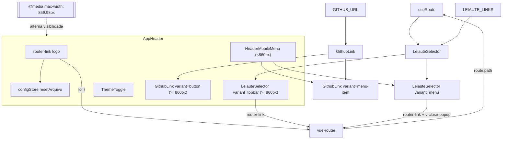
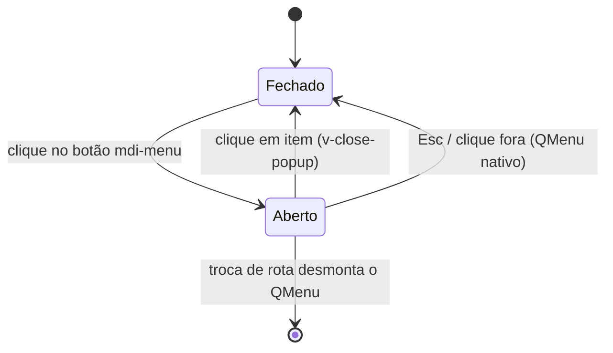

# PLAN — Reorganizar topbar global (logo, navegação, tema e GitHub)

## Dados do Plano

| Campo               | Valor                                |
| ------------------- | ------------------------------------ |
| Número da US        | US35                                 |
| Slug                | `us35-topbar-global`                 |
| Stack               | Quasar + Vue 3 + TypeScript + Vitest |
| Data de criação     | 2026-09-15                           |
| Data de modificação | 2026-09-15                           |

> **Revisão de 15/09/2026** — incorpora as três decisões do humano sobre os pontos em aberto: (1) US33 mergeada em `develop` (PR #58, commit `b7cee97`) e esta branch rebaseada — a base já está no estado pós-US33; (2) o desaninhamento dos layouts em `routes.ts` **entra no escopo desta US**; (3) o botão "Ver arquivo" (US15) permanece no header até a US34.

---

## Resumo Técnico

O `AppHeader.vue` já existe (US01/US15/US19/US20) e é montado pelos dois layouts raiz (`LandingLayout` e `MainLayout`) via slot do `q-layout`. Esta US **não cria um header novo**: reorganiza o existente para a composição definitiva do protótipo (`docs/design system/CNAB240page.html`) — logo com chaves em `--lpd-accent`, navegação entre leiautes, `ThemeToggle` e botão GitHub — e fecha a lacuna mobile do protótipo introduzindo um menu hambúrguer.

Três mudanças estruturais:

1. **Extração de dois componentes-folha** — `GithubLink.vue` (link externo, duas variantes visuais) e `HeaderMobileMenu.vue` (botão `mdi-menu` + `q-menu`), para que o markup de navegação e de GitHub exista uma única vez e seja reaproveitado dentro e fora do menu mobile.
2. **`LeiauteSelector` ganha uma prop `variant`** (`'topbar' | 'menu'`), mantendo-se a fonte única de verdade dos estados ativo/"em breve" (RN03), agora com o visual de links sublinhados do protótipo no topbar e empilhado vertical dentro do menu.
3. **Desaninhamento dos layouts em `routes.ts`** — hoje `LandingLayout` é pai de `MainLayout`, e como os dois montam `<AppHeader />`, a rota `/cnab-240` renderiza **dois headers empilhados** (defeito já contornado com `.first()` nos E2E das US15 e US21). Com o header ganhando fundo translúcido e `backdrop-filter`, o defeito deixa de ser invisível. Por diretriz do humano, os layouts passam a ser **irmãos**: `LandingLayout` hospeda as páginas institucionais do site (home e, futuramente, about/contato) e `MainLayout` hospeda as páginas de geração de arquivo.
4. **Responsividade 100% CSS no breakpoint de 860px** — conforme o "Excluído" da SPEC, nenhuma lógica JS de detecção de tamanho é adicionada. Os dois blocos de navegação (topbar e menu) existem sempre no DOM; apenas um é exibido por vez via `@media`. Consequência direta na estratégia de testes: o corte por largura é verificável em E2E (Playwright, com viewport real), não em Vitest/jsdom.

A US mantém o `PrivacyBadge` fora do header (RN09) — a remoção já foi feita pela US33, mergeada em `develop` (PR #58, commit `b7cee97`) e presente nesta branch após o rebase. Aqui basta **não reintroduzi-lo** e limpar os resíduos de CSS.

---

## Componentes Afetados

| Componente                   | Ação      | Notas                                                                                                                                                           |
| ---------------------------- | --------- | --------------------------------------------------------------------------------------------------------------------------------------------------------------- |
| `AppHeader.vue`              | Modificar | Nova composição (RN01), logo como `router-link` com `{ ☕ }` (RN02), sticky + blur (RN08), gate CSS 860px, limpeza dos resíduos de CSS do `PrivacyBadge` (RN09) |
| `src/router/routes.ts`       | Modificar | Desaninhar os layouts: `LandingLayout` e `MainLayout` viram rotas irmãs — elimina o header duplicado em `/cnab-240`                                             |
| `LeiauteSelector.vue`        | Modificar | Prop `variant`; restyle do topbar para links com `--lpd-accent` + sublinhado (RN03); variante vertical para o menu (RN07)                                       |
| `GithubLink.vue`             | Criar     | Link externo `<a>` com `target="_blank"`/`rel="noopener noreferrer"`; variantes `button` (topbar) e `menu-item` (RN05)                                          |
| `HeaderMobileMenu.vue`       | Criar     | `QBtn` `mdi-menu` + `QMenu` contendo `LeiauteSelector variant="menu"` e `GithubLink variant="menu-item"` (RN06, RN07)                                           |
| `src/constants/links.ts`     | Criar     | `GITHUB_URL` — constante única do repositório, hoje duplicada como prop do `AppFooter`                                                                          |
| `AppHeader.spec.ts`          | Modificar | Remover caso do `PrivacyBadge`; cobrir logo/GitHub/hambúrguer                                                                                                   |
| `LeiauteSelector.spec.ts`    | Modificar | Cobrir as duas variantes                                                                                                                                        |
| `GithubLink.spec.ts`         | Criar     | Atributos de segurança, `aria-label`, variantes                                                                                                                 |
| `HeaderMobileMenu.spec.ts`   | Criar     | `aria-expanded`, abertura/fechamento, conteúdo do menu                                                                                                          |
| `us35-topbar-global.spec.ts` | Criar     | E2E com viewports ≥860px e <860px                                                                                                                               |
| E2E US15 / US21              | Modificar | Remover os contornos `.first()` que existiam por causa do header duplicado — passa a haver exatamente um `<header>` por rota                                    |

> Nenhuma alteração em `PrivacyBadge.vue`, `AppFooter.vue` ou `ThemeToggle.vue` (fora de escopo — RN04 e SPEC/Excluído).

---

## Estrutura de Dados

```ts
// src/constants/links.ts
/** URL canônica do repositório do projeto (RN05). */
export const GITHUB_URL = 'https://github.com/ratto/leiautes-para-devs' as const;
```

```ts
// src/components/LeiauteSelector.vue
type LeiauteSelectorVariant = 'topbar' | 'menu';

interface Props {
  /** 'topbar' = linha horizontal de links (desktop); 'menu' = lista vertical (mobile). @default 'topbar' */
  variant?: LeiauteSelectorVariant;
}
```

```ts
// src/components/GithubLink.vue
type GithubLinkVariant = 'button' | 'menu-item';

interface Props {
  /** 'button' = botão com borda e --lpd-radius-md; 'menu-item' = item de lista do menu mobile. @default 'button' */
  variant?: GithubLinkVariant;
}
```

`HeaderMobileMenu.vue` não tem props nem emits. Seu único estado é um `ref<boolean>` local (`menuAberto`) usado como `v-model` do `QMenu` — deliberadamente **não** vai para store nem composable: a SPEC exige que o menu sempre inicie fechado (RN07), e um estado local morre com o componente a cada navegação, sem código extra. Isso é consistente com o ADR-002 (Pinia é para estado de leiaute, não para UI efêmera).

Nenhum tipo novo entra em `src/model/` — não há dado de leiaute envolvido nesta US.

---

## Lógica Principal

1. **Composição do header (RN01)** — `AppHeader` passa a renderizar, nesta ordem: `brand` (logo) → `LeiauteSelector variant="topbar"` (desktop) / `HeaderMobileMenu` (mobile) → `ThemeToggle` → `GithubLink variant="button"` (desktop). Nenhuma instância de `PrivacyBadge` permanece (RN09): remover o import, o markup e os estilos `.lpd-header__privacy*`.

2. **Logo como link (RN02)** — o `QBtn` atual vira um `<router-link to="/">` com as classes do brand. O conteúdo passa a ser `{ ☕ }` — `<span aria-hidden="true">` com `{` e `}` em `--lpd-accent`, `--lpd-font-mono`, e o emoji entre eles — seguido do nome em `--lpd-font-display`. O handler `handleReturnHome` deixa de fazer `router.push` (o `router-link` já navega) e passa a apenas `configStore.resetArquivo()` no `@click`, preservando o comportamento de limpeza estabelecido na US01. O `<a>` gerado recebe `aria-label="Leiautes Para Devs — ir para a página inicial"`.

3. **Navegação por variante (RN03, RN07)** — `LeiauteSelector` continua iterando `LEIAUTE_LINKS` (`src/constants/leiautes.ts`) e derivando o estado ativo de `useRoute()`; nada muda na lógica, só no estilo:
   - `variant="topbar"`: links em linha, sem pílula; ativo com `color: var(--lpd-accent)` + `border-bottom: 2px solid var(--lpd-accent)`; desabilitados em `--lpd-text-muted`, `cursor: not-allowed`, `aria-disabled="true"`, `tabindex="-1"` e badge "em breve" (comportamento herdado da US01, preservado).
   - `variant="menu"`: `flex-direction: column`, itens ocupando 100% da largura do menu, `min-height: 44px`.
   - Os itens do `router-link` recebem `v-close-popup` **apenas** quando `variant === 'menu'`, para que o clique feche o `QMenu` (UC02, passo 4).

4. **Menu mobile (RN06, RN07)** — `HeaderMobileMenu` renderiza um `QBtn flat round icon="mdi-menu"` com `aria-haspopup="menu"`, `aria-expanded` ligado a `menuAberto` e `aria-label="Abrir menu de navegação"` / `"Fechar menu de navegação"`. Dentro dele, um `<q-menu v-model="menuAberto" anchor="bottom right" self="top right">` com `LeiauteSelector variant="menu"` seguido de um separador e `GithubLink variant="menu-item" v-close-popup`. Fechamento por `Esc` e clique fora são nativos do `QMenu`.

5. **Corte responsivo em 860px (RN06)** — sem JS. No `AppHeader`:

   ```css
   .lpd-header__nav-desktop,
   .lpd-header__github {
     display: inline-flex;
   }
   .lpd-header__menu-mobile {
     display: none;
   }

   @media (max-width: 859.98px) {
     .lpd-header__nav-desktop,
     .lpd-header__github {
       display: none;
     }
     .lpd-header__menu-mobile {
       display: inline-flex;
     }
   }
   ```

   O valor 860px é literal (não pode vir de `--lpd-*`: custom properties não são válidas em `@media`) e deve aparecer comentado nos dois blocos, citando a RN06. Os breakpoints globais do Quasar (`$q.screen`) **não** são reconfigurados — 860px é local a este componente.

6. **Header sticky com desfoque (RN08)** — o `AppHeader` continua sendo um `q-header` dentro do `q-layout` (`view="hHh …"`), que já o mantém fixo no topo; a US apenas troca a pintura: `background: color-mix(in srgb, var(--lpd-base) 88%, transparent)`, `backdrop-filter: blur(8px)`, `-webkit-backdrop-filter: blur(8px)`, `border-bottom: 1px solid var(--lpd-border)`, `box-shadow: none`, `min-height: 64px` (protótipo). Nenhuma regra `position` própria é escrita — quem posiciona é o `q-layout` (ADR-012/ADR-013); escrever `position: sticky` no `.lpd-header` brigaria com o Quasar e é o erro a evitar.

7. **Botão "Ver arquivo" (US15)** — permanece no header, no grupo de ações, inalterado em comportamento (só na rota `cnab-240` e `$q.screen.gt.xs`). Ele não é citado na RN01 porque o protótipo é anterior à US15, e removê-lo agora deixaria o drawer do visualizador sem gatilho até a US34 ("orelhinha") ser implementada. **Decidido pelo humano em 15/09/2026: manter.**

8. **Desaninhamento dos layouts (`src/router/routes.ts`)** — hoje existe um único registro raiz `'/'` com `LandingLayout`, que tem como filhos a `LandingPage` **e** um registro de caminho vazio com `MainLayout`; o resultado é que `/cnab-240` renderiza `LandingLayout > MainLayout`, com dois `<AppHeader />`. A estrutura passa a ser de dois registros irmãos:

   ```ts
   const routes: RouteRecordRaw[] = [
     // Páginas institucionais do site — LandingLayout.
     {
       path: '/',
       component: () => import('@/layouts/LandingLayout.vue'),
       children: [{ path: '', name: 'home', component: () => import('@/pages/LandingPage.vue') }],
     },

     // Páginas de geração de arquivo — MainLayout.
     {
       path: '/',
       component: () => import('@/layouts/MainLayout.vue'),
       children: [
         { path: 'cnab-240', name: 'cnab-240', component: … , meta: { leiauteId: 'CNAB240', label: 'CNAB240', disponivel: true } },
         { path: 'rcb-001',  name: 'rcb-001',  component: … , meta: { leiauteId: 'RCB001',  label: 'RCB001',  disponivel: false } },
         { path: 'cnab-400', name: 'cnab-400', component: … , meta: { leiauteId: 'CNAB400', label: 'CNAB400', disponivel: false } },
       ],
     },

     { path: '/:catchAll(.*)*', component: () => import('@/pages/ErrorNotFound.vue') },
   ];
   ```

   Invariantes a preservar, sem exceção: **paths, `name`s e `meta` de cada rota permanecem idênticos** — nenhuma URL muda, nenhum `router.push({ name: … })` existente quebra, e a `meta.leiauteId` que outras US consomem continua no mesmo lugar. Os dois registros compartilham `path: '/'`, o que é válido no vue-router: o primeiro só casa com a URL exata `/` (via filho de caminho vazio) e o segundo só com os três caminhos nomeados; o `catchAll` continua por último. Os arquivos dos layouts em si **não mudam**: `LandingLayout` continua com `AppHeader` + `q-page-container`, e `MainLayout` continua com `AppHeader`, faixa de tipo/modo, banner de Playground, `q-drawer`, `q-page-container` e `AppFooter` (US33/ADR-013). Após a mudança, `/cnab-240` passa a ter exatamente um `<header>` e um `<footer>`.

---

## Composables / Serviços

- Nenhum composable novo. `useTerminalDrawer()` continua sendo consumido pelo `AppHeader` exatamente como hoje (US15).
- `useConfigStore()` continua sendo usado apenas para `resetArquivo()` no clique da logo e, indiretamente, pelo `ThemeToggle`.
- `LEIAUTE_LINKS` (`src/constants/leiautes.ts`) segue como fonte única da navegação; `GITHUB_URL` (`src/constants/links.ts`) passa a ser a fonte única da URL do repositório.

---

## Eventos e Props (componentes novos)

`GithubLink.vue`

- **Props:** `variant?: 'button' | 'menu-item'` (default `'button'`).
- **Emits:** nenhum.
- **Interação:** `<a :href="GITHUB_URL" target="_blank" rel="noopener noreferrer" aria-label="Ver repositório no GitHub">` com `q-icon mdi-github` (`aria-hidden`) + rótulo "GitHub". Na variante `button`: `border: 1px solid var(--lpd-border)`, `background: var(--lpd-surface)`, `border-radius: var(--lpd-radius-md)`, hover → `var(--lpd-surface-2)` (RN05). Na variante `menu-item`: sem borda, largura total, `min-height: 44px`.

`HeaderMobileMenu.vue`

- **Props:** nenhuma.
- **Emits:** nenhum.
- **Estado:** `menuAberto = ref(false)`, `v-model` do `QMenu`; sempre inicia fechado (RN07).

`LeiauteSelector.vue` (existente, agora com prop)

- **Props:** `variant?: 'topbar' | 'menu'` (default `'topbar'` — mantém o uso atual sem alteração no call site do desktop).
- **Emits:** nenhum.

---

## Fluxo de Dados



---

## Diagramas Adicionais

Estado do menu mobile — deliberadamente trivial e local (RN07: nunca persiste):



---

## Dependências Externas

**npm:** nenhuma nova dependência. `QMenu`, `QBtn`, `QSeparator` e os ícones `mdi-menu`/`mdi-github` já vêm do Quasar + `@quasar/extras` em uso no projeto.

**Inter-US:**

- **US01** (Done) — provê `LEIAUTE_LINKS`, as rotas e o `LeiauteSelector` com os estados ativo/"em breve" reaproveitados pela RN03.
- **US19** (Done) — provê o `ThemeToggle`, integrado sem nenhuma alteração (RN04).
- **US33** (Done — PR #58, commit `b7cee97`, já em `develop` e nesta branch após rebase) — removeu o `PrivacyBadge` do header, criou o `AppFooter` global montado pelo `MainLayout` e alterou a `view` dos dois layouts para `hHh lpr fFf` (ADR-013). A base desta US já está nesse estado; o header não tem mais o badge.
- **US34** (On Ready, não implementada) — vai mover o gatilho do drawer do header para uma "orelhinha" sticky. Enquanto não for implementada, o botão "Ver arquivo" permanece no header (item 7 da Lógica Principal).
- **ADR-012 / ADR-013** — quem posiciona o header é o `q-layout`; esta US não escreve `position` no `.lpd-header`.

---

## Testes

### Unitários / de componente (Vitest + Vue Test Utils)

`GithubLink.spec.ts` (novo)

- `href` é exatamente `GITHUB_URL`, com `target="_blank"` e `rel` contendo `noopener` (CA03).
- `aria-label` descritivo presente; ícone com `aria-hidden="true"`.
- `variant="button"` aplica a classe da variante botão; `variant="menu-item"`, a do item de menu.

`HeaderMobileMenu.spec.ts` (novo)

- Monta fechado: `aria-expanded="false"` (RN07).
- Clique no botão abre o `QMenu` → `aria-expanded="true"`.
- Com o menu aberto, o conteúdo contém `LeiauteSelector` (stub) e `GithubLink` (stub), nessa ordem (CA06).
- `aria-haspopup="menu"` e `aria-label` presentes (CA09).

`LeiauteSelector.spec.ts` (atualizar)

- Sem prop, renderiza a variante `topbar` (não quebra o uso atual).
- `variant="menu"` aplica a classe vertical e adiciona `v-close-popup` aos links navegáveis.
- Em ambas as variantes: CNAB240 é `router-link`; RCB001/CNAB400 têm `aria-disabled="true"`, `tabindex="-1"` e badge "em breve" (RN03).

`AppHeader.spec.ts` (atualizar)

- A US33 já removeu o bloco `describe('PrivacyBadge (US20)')`; manter uma asserção negativa explícita de que nenhum `PrivacyBadge` é renderizado em nenhum estado (CA04/RN09) — é justamente o que esta US precisa travar.
- Brand: é um `router-link` com `to="/"`; o texto do símbolo passa a conter `☕`; clique dispara `resetArquivo()` (CA07).
- `GithubLink` e `HeaderMobileMenu` estão presentes no DOM (a visibilidade por largura é assunto do E2E).
- `ThemeToggle` presente, sem props (RN04/CA02).
- Casos existentes do botão "Ver arquivo" (US15) continuam verdes sem alteração.

`routes.spec.ts` (novo ou incorporado ao teste de router existente, se houver)

- `/` resolve para `LandingLayout` com a `LandingPage` como filha, `name: 'home'`.
- `/cnab-240`, `/rcb-001` e `/cnab-400` resolvem para `MainLayout`, com os mesmos `name` e `meta` (`leiauteId`, `label`, `disponivel`) de antes — asserção explícita contra regressão.
- Nenhuma rota resolvida tem `LandingLayout` e `MainLayout` simultaneamente em `matched` (é essa a garantia de header único).
- URL desconhecida cai no `ErrorNotFound`.

> **Limite conhecido:** jsdom não avalia `@media`. Nenhum teste unitário deve tentar afirmar "a navegação desktop está oculta em 800px" — isso é falso-negativo garantido. Esses casos vivem só no E2E.

### E2E (Playwright) — `test/playwright/e2e/us35-topbar-global.spec.ts`

- **Desktop (1280×800), em `/cnab-240`:** logo, navegação com CNAB240 ativo, `ThemeToggle` e botão GitHub visíveis, nessa ordem no DOM; hambúrguer não visível (CA01).
- Nenhum `PrivacyBadge` visível dentro do `header` em nenhuma das duas larguras (CA04).
- Clique na logo a partir de `/cnab-240` leva a `/` (CA07).
- Botão GitHub: `href`, `target="_blank"` e `rel` verificados por atributo (sem abrir aba real) — CA03.
- **Mobile (390×844):** navegação e botão GitHub não visíveis; hambúrguer, logo e `ThemeToggle` visíveis (CA05). Abrir o menu exibe os 3 leiautes com os mesmos estados + link do GitHub (CA06); clicar em CNAB240 navega e fecha o menu; recarregar a rota reabre com o menu fechado (RN07).
- **Sticky (CA08):** rolar a página em `/cnab-240` e verificar que o `header` continua no viewport (`boundingBox().y` próximo de 0) com conteúdo passando por trás.
- **A11y (CA09):** `Tab` até cada elemento interativo do header e verificação de `:focus-visible` com `outline` âmbar; em mobile, `boundingBox()` de hambúrguer, logo e `ThemeToggle` com altura e largura ≥44px.

- **Header único (desaninhamento):** em `/` e em `/cnab-240`, `page.locator('header')` tem contagem exatamente `1`; em `/cnab-240`, `page.locator('footer')` também tem contagem `1`. Este é o caso que trava o defeito corrigido.

> Como o desaninhamento entra nesta US, os seletores dos novos testes usam `page.locator('header')` direto, **sem** `.first()`. Os E2E das US15 e US21, que hoje comentam e contornam o header duplicado, devem ter esses contornos removidos e os comentários atualizados.

---

## Riscos e Decisões em Aberto

| Risco / Dúvida                                                                                                              | Impacto | Mitigação                                                                                                                                                                                                                 |
| --------------------------------------------------------------------------------------------------------------------------- | ------- | ------------------------------------------------------------------------------------------------------------------------------------------------------------------------------------------------------------------------- |
| ~~US33 não está em `develop`~~ — **resolvido em 15/09/2026**                                                                | —       | US33 mergeada (PR #58, `b7cee97`) e esta branch rebaseada. A base já está sem `PrivacyBadge` no header e com a `view` `lpr`                                                                                               |
| **Desaninhamento dos layouts** — mexer em `routes.ts` toca toda a navegação do app                                          | Médio   | Decisão tomada pelo humano; escopo aceito nesta US. Mitigação: manter paths/`name`s/`meta` idênticos, cobrir com testes de resolução de rota e rodar a suíte E2E completa (todo E2E navega por URL)                       |
| Alguma US futura pode assumir `LandingLayout` como ancestral comum de todas as rotas (ex.: um elemento global montado nele) | Baixo   | Depois da mudança, o ancestral comum deixa de existir: qualquer elemento verdadeiramente global deve viver no `AppHeader`/`AppFooter`, montados por ambos os layouts. Registrar isso no comentário de topo do `routes.ts` |
| **Botão "Ver arquivo" no header** — a RN01 não o lista, mas a US34 (que o substitui) ainda não foi implementada             | Baixo   | **Decidido: manter** até a US34. Removê-lo agora deixaria o drawer do visualizador sem gatilho em desktop                                                                                                                 |
| `resetArquivo()` no clique da logo descarta o preenchimento sem confirmação                                                 | Médio   | Comportamento herdado da US01, preservado deliberadamente. Um `ConfirmDialog` aqui seria mudança de comportamento não pedida — registrar como candidato a US futura                                                       |
| `backdrop-filter` sem suporte (navegadores antigos / `prefers-reduced-transparency`)                                        | Baixo   | O `color-mix` a 88% já garante legibilidade sem o blur; a degradação é puramente estética                                                                                                                                 |
| Breakpoint 860px é literal e não derivável de `--lpd-*`                                                                     | Baixo   | Comentar o valor citando a RN06 nos dois blocos `@media`; se surgir um terceiro uso, extrair para um mixin SCSS                                                                                                           |
| `LeiauteSelector` restilizado (chips → links sublinhados) pode quebrar asserções de classe em E2E antigos (US01)            | Médio   | Rodar a suíte E2E completa após o restyle; preferir seletores por texto/`aria-current` a seletores de classe nos testes tocados                                                                                           |

---

## Ordem sugerida de implementação

1. Conferir a base (já sincronizada: US33 em `develop`, branch rebaseada) rodando `vitest run` e a suíte E2E, para partir do verde.
2. Desaninhar os layouts em `src/router/routes.ts` (item 8 da Lógica Principal), atualizar os testes de resolução de rota e remover os contornos `.first()` dos E2E das US15 e US21. Fazer isso **antes** do resto: é a mudança que altera quantos headers existem na página e, portanto, a que todos os testes seguintes assumem.
3. Criar `src/constants/links.ts` com `GITHUB_URL`.
4. Criar `src/components/GithubLink.vue` (duas variantes) + `GithubLink.spec.ts`.
5. Adicionar a prop `variant` ao `LeiauteSelector.vue`, restilizando o topbar para links com `--lpd-accent` + sublinhado e criando a variante vertical; atualizar `LeiauteSelector.spec.ts`.
6. Criar `src/components/HeaderMobileMenu.vue` (`QBtn mdi-menu` + `QMenu` com os dois componentes acima) + `HeaderMobileMenu.spec.ts`.
7. Reescrever o template do `AppHeader.vue`: logo como `router-link` com `{ ☕ }`, nova ordem dos elementos, montagem de `GithubLink` e `HeaderMobileMenu`.
8. Ajustar os estilos do `AppHeader`: sticky/blur (RN08), gate `@media` de 860px (RN06), limpeza dos resíduos de CSS do `PrivacyBadge` e do wrap mobile antigo.
9. Atualizar `AppHeader.spec.ts` (asserção negativa do badge, logo/GitHub/hambúrguer).
10. Escrever `test/playwright/e2e/us35-topbar-global.spec.ts` (desktop + mobile + header único + sticky + a11y).
11. Rodar `vitest run`, `playwright test` e `quasar build` (type-check) e revalidar os E2E das US01, US15, US19, US20, US21 e US33, que tocam o header, o footer ou a navegação.
12. Verificação manual em navegador: `/`, `/cnab-240` e `/rcb-001`, nas larguras 1280px, 900px, 859px e 390px, em tema dark e light — conferindo um único header e um único footer por rota.

---

## Custo da IA

| Métrica              | Valor                       |
| -------------------- | --------------------------- |
| Modelo               | claude-opus-5               |
| Tokens de entrada    | ~110.000                    |
| Tokens de saída      | ~14.000                     |
| Custo estimado (USD) | ~$2,70                      |
| Taxa de câmbio       | 1 USD = R$5,80 (2026-09-15) |
| Custo estimado (BRL) | ~R$15,66                    |

> Estimativa de tokens: leitura da SPEC, do card do Trello, das ADRs 002/012/013, do protótipo e do código do header/layouts/rotas/testes (~110k tokens de entrada), escrita do plano e da revisão de 15/09 com as decisões do humano (~14k de saída).
> Preços claude-opus-5 considerados: $15/M tokens de entrada, $75/M tokens de saída.

## Custo Estimado do Refinamento (15/09/2026)

| Métrica              | Valor                       |
| -------------------- | --------------------------- |
| Modelo               | claude-opus-5               |
| Tokens de entrada    | ~110.000                    |
| Tokens de saída      | ~14.000                     |
| Custo estimado (USD) | ~$2,70                      |
| Taxa de câmbio       | 1 USD = R$5,80 (2026-09-15) |
| Custo estimado (BRL) | ~R$15,66                    |

> Sessão única de planejamento técnico: levantamento de contexto (Trello + SPEC + ADRs + base de código), análise das decisões em aberto, escrita do `PLAN.md` e revisão incorporando as três decisões do humano (merge da US33, desaninhamento dos layouts, manutenção do botão "Ver arquivo").
