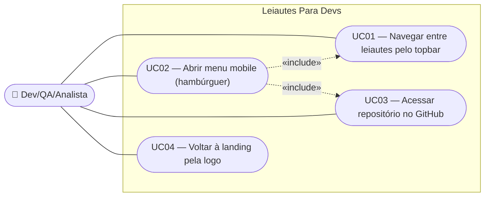

# SPEC — Reorganizar topbar global (logo, navegação, tema e GitHub)

## Dados da SPEC

| Campo           | Valor                                                                                                    |
| ---------------- | --------------------------------------------------------------------------------------------------------- |
| Número da US    | US35                                                                                                      |
| Slug             | `us35-topbar-global`                                                                                    |
| Prioridade       | P1                                                                                                        |
| Status           | Draft                                                                                                     |
| Data de criação | 2026-09-13                                                                                                |
| Card Trello      | https://trello.com/c/Ntt6Yq86/37-us35-reorganizar-topbar-global-logo-navega%C3%A7%C3%A3o-tema-e-github |

---

## Contexto

O protótipo `docs/design system/CNAB240page.html` já define visualmente o topbar definitivo do produto: logo (`{ ☕ } Leiautes Para Devs`, com as chaves em `--lpd-accent`), navegação entre leiautes (CNAB240 ativo, RCB001/CNAB400 desabilitados com badge "em breve"), o `ThemeToggle` (US19 — botão `flat round`, com o easter egg do "Erick" no tooltip) e um botão de link para o GitHub com cantos arredondados (`border-radius: var(--radius)`, não circular). Esta US formaliza esse padrão como o componente `AppHeader.vue` definitivo do produto.

A US33 já removeu o `PrivacyBadge` do header (movendo-o para o `AppFooter`) justamente para liberar espaço na barra superior, mas deixou a reorganização do espaço restante como trabalho futuro. Esta US assume essa reorganização: o header não volta a ter nenhuma instância do `PrivacyBadge`, e o espaço liberado é ocupado apenas pelos elementos já existentes no protótipo (logo, navegação, tema, GitHub).

O protótipo também expõe uma lacuna: abaixo de 860px, a navegação entre leiautes simplesmente desaparece (`display:none`), sem alternativa visível para o usuário mobile trocar de leiaute ou acessar o GitHub. Esta US fecha essa lacuna introduzindo um menu mobile (hambúrguer) que agrupa esses dois itens, mantendo logo e `ThemeToggle` sempre visíveis, em qualquer largura de tela.

---

## Escopo

### Incluso

- Componente `AppHeader.vue` como topbar definitivo da aplicação, usado em todas as rotas (landing e as 3 telas de formato).
- Logo (`{ ☕ } Leiautes Para Devs`) com as chaves (`{` `}`) em `--lpd-accent`, funcionando como link de navegação para a landing (`/`) a partir de qualquer rota.
- Navegação entre leiautes em desktop (≥860px): CNAB240 ativo/clicável (`router-link`), RCB001 e CNAB400 desabilitados com badge "em breve" (`aria-disabled="true"`), conforme já definido pela US01.
- `ThemeToggle` (US19) integrado ao header, sem nenhuma alteração de comportamento, ícones ou copy.
- Botão de link para o GitHub (`https://github.com/ratto/leiautes-para-devs`), com `border-radius: var(--radius)` (cantos arredondados, não circular), abrindo em nova aba.
- Menu mobile (hambúrguer) visível abaixo de 860px, agrupando a navegação entre leiautes e o link do GitHub. Logo e `ThemeToggle` permanecem visíveis fora do menu, mesmo em mobile.
- Comportamento `sticky` do header no topo da página, com efeito de desfoque (`backdrop-filter: blur`) sobre o conteúdo rolado, como no protótipo.

### Excluído

- Qualquer alteração no `PrivacyBadge` ou no `AppFooter` — isso é escopo da US33.
- Novos links ou itens de menu além dos já existentes no protótipo (navegação entre leiautes + GitHub). Nenhum link de LinkedIn, doação ou outro item entra no header (esses vivem no footer, US33).
- Alteração no layout de duas colunas do formulário/visualizador (US15).
- Mudança de comportamento, ícones, tooltip ou copy do `ThemeToggle` — permanece exatamente como a US19 especificou.
- Persistência de estado do menu hambúrguer entre navegações — o menu sempre inicia fechado ao carregar/trocar de rota.
- Sincronização em tempo real de media query (ex.: redimensionar a janela ao vivo cruzando o breakpoint) além do recálculo padrão de CSS/Vue — o comportamento responsivo é resolvido via CSS/breakpoint, sem lógica JS adicional de detecção de tamanho.

---

## Regras de Negócio

### RN01 — Composição do header em desktop (≥860px)

Da esquerda para a direita: logo, navegação entre leiautes, `ThemeToggle`, botão GitHub. Nenhum `PrivacyBadge` é renderizado no header, em nenhuma largura de tela.

### RN02 — Logo como link para a landing

A logo (`{ ☕ } Leiautes Para Devs`) é um link (`router-link` para `/`) em qualquer rota, incluindo quando o usuário já está na landing. As chaves (`{` e `}`) usam `--lpd-accent`; o restante do texto usa `--lpd-text`, em `--lpd-font-display` (Space Grotesk).

### RN03 — Navegação entre leiautes (desktop)

Reutiliza a definição da US01: `CNAB240` é `router-link` ativo (destacado com `--lpd-accent` e sublinhado); `RCB001` e `CNAB400` são não-navegáveis, com badge textual "em breve" e `aria-disabled="true"`.

### RN04 — `ThemeToggle` inalterado

O `ThemeToggle` integrado ao header é o componente já especificado pela US19 (`QBtn` `flat round`, ícone sol/lua, tooltip com easter egg do "Erick"). Esta US apenas o posiciona dentro do `AppHeader`; nenhuma regra de negócio da US19 é revisitada ou alterada.

### RN05 — Botão GitHub

Link externo para `https://github.com/ratto/leiautes-para-devs`, `target="_blank"` e `rel="noopener"`. Visualmente: borda `--lpd-border`, fundo `--lpd-surface`, `border-radius: var(--radius)` (arredondado, não circular — distinto do `ThemeToggle`, que é `round`). Hover troca o fundo para `--lpd-surface-2`.

### RN06 — Breakpoint de mobile e menu hambúrguer

Abaixo de **860px**, a navegação entre leiautes e o botão GitHub saem do fluxo visível do topbar e passam a ficar dentro de um menu acionado por um botão hambúrguer (ícone `mdi-menu`), posicionado no lugar onde a navegação ficava. Logo e `ThemeToggle` continuam sempre visíveis, dentro ou fora do breakpoint.

### RN07 — Conteúdo do menu mobile

Ao abrir o menu hambúrguer, o usuário vê, nesta ordem: os mesmos 3 itens de navegação entre leiautes (com os mesmos estados ativo/desabilitado da RN03) e, abaixo, o link do GitHub. O menu sempre inicia fechado — ao trocar de rota ou recarregar a página, nenhum estado de "aberto" é preservado.

### RN08 — Header fixo com desfoque

O header usa `position: sticky; top: 0` com `backdrop-filter: blur(8px)` e fundo semitransparente (`color-mix` sobre `--lpd-base`), permanecendo visível durante toda a rolagem da página, em qualquer largura de tela.

### RN09 — Sem `PrivacyBadge` no header

Nenhuma instância do `PrivacyBadge` (US20) é renderizada dentro do `AppHeader`, em nenhum breakpoint. Essa decisão já foi tomada pela US33; esta US apenas garante que a reorganização do espaço não reintroduz o badge no header.

---

## Use Cases

### UC01 — Navegar entre leiautes pelo topbar (desktop)

- **Ator:** dev/QA/analista, em tela ≥860px
- **Precondição:** usuário está em qualquer rota da aplicação; largura de tela ≥860px
- **Fluxo principal:**
  1. Usuário observa os itens de navegação no topbar (CNAB240 ativo, RCB001/CNAB400 com badge "em breve")
  2. Usuário clica em "CNAB240"
  3. Sistema navega para `/cnab-240` via `router-link`
- **Fluxo alternativo:** usuário clica em "RCB001" ou "CNAB400" (desabilitados) → nenhuma navegação ocorre (`aria-disabled="true"`)
- **Postcondição:** rota ativa reflete o leiaute selecionado; item correspondente destacado no topbar

### UC02 — Abrir menu mobile (hambúrguer)

- **Ator:** dev/QA/analista, em tela <860px
- **Precondição:** usuário está em qualquer rota; largura de tela <860px; menu fechado
- **Fluxo principal:**
  1. Usuário toca no botão hambúrguer no topbar
  2. Sistema abre o menu, exibindo navegação entre leiautes (UC01, incluído) e link do GitHub (UC03, incluído)
  3. Usuário toca em um item do menu
  4. Sistema executa a ação correspondente (navega para o leiaute ou abre o GitHub em nova aba) e fecha o menu
- **Postcondição:** ação executada; menu fechado
- **Nota:** logo e `ThemeToggle` continuam visíveis fora do menu durante todo o fluxo

### UC03 — Acessar repositório no GitHub

- **Ator:** dev/QA/analista
- **Precondição:** usuário está em qualquer rota, desktop ou mobile
- **Fluxo principal:**
  1. Usuário clica/toca no botão/link "GitHub" (no topbar em desktop, ou dentro do menu hambúrguer em mobile — UC02)
  2. Sistema abre `https://github.com/ratto/leiautes-para-devs` em nova aba
- **Postcondição:** nova aba do navegador aberta no repositório; aba atual da aplicação permanece inalterada

### UC04 — Voltar à landing pela logo

- **Ator:** dev/QA/analista
- **Precondição:** usuário está em qualquer rota (`/`, `/cnab-240`, `/rcb-001`, `/cnab-400`)
- **Fluxo principal:**
  1. Usuário clica na logo (`{ ☕ } Leiautes Para Devs`) no topbar
  2. Sistema navega para `/`
- **Postcondição:** landing page exibida

---

## Critérios de Aceitação

### CA01 — Composição do topbar em desktop

**Dado que** o usuário está em qualquer rota com largura de tela ≥860px
**Quando** o `AppHeader` é renderizado
**Então** exibe, nesta ordem: logo (chaves em `--lpd-accent`), navegação entre leiautes, `ThemeToggle` e botão GitHub com bordas arredondadas — sem nenhum `PrivacyBadge`

### CA02 — `ThemeToggle` sem alterações

**Dado que** o `ThemeToggle` está integrado ao `AppHeader`
**Quando** o usuário interage com ele (clique, hover, foco)
**Então** o comportamento é idêntico ao especificado pela US19 (ícone sol/lua, tooltip com easter egg do "Erick", `aria-label` dinâmico) — nenhuma regra da US19 é modificada

### CA03 — Link do GitHub

**Dado que** o usuário clica no botão GitHub (desktop) ou no item GitHub do menu mobile
**Quando** a ação é executada
**Então** `https://github.com/ratto/leiautes-para-devs` abre em uma nova aba (`target="_blank"`, `rel="noopener"`), sem navegar a aba atual

### CA04 — Header sem `PrivacyBadge`

**Dado que** o usuário observa o `AppHeader` em qualquer breakpoint
**Quando** verifica os elementos renderizados
**Então** não encontra nenhuma instância do `PrivacyBadge` — ele permanece exclusivamente no `AppFooter` (US33)

### CA05 — Menu hambúrguer em mobile

**Dado que** a largura de tela é <860px
**Quando** o `AppHeader` é renderizado
**Então** a navegação entre leiautes e o botão GitHub não aparecem diretamente no topbar; em seu lugar, um botão hambúrguer é exibido, com logo e `ThemeToggle` permanecendo visíveis

### CA06 — Conteúdo do menu mobile

**Dado que** o usuário toca no botão hambúrguer em uma tela <860px
**Quando** o menu abre
**Então** exibe os 3 itens de navegação entre leiautes (com os mesmos estados ativo/"em breve" do desktop) seguidos do link do GitHub

### CA07 — Logo navega para a landing

**Dado que** o usuário está em `/cnab-240` (ou qualquer outra rota)
**Quando** clica na logo no topbar
**Então** é redirecionado para `/`

### CA08 — Header sticky com desfoque

**Dado que** o usuário rola a página para baixo em qualquer rota
**Quando** observa o topo da tela
**Então** o `AppHeader` permanece fixo no topo, com efeito de desfoque sobre o conteúdo que passa por trás dele

### CA09 — Acessibilidade dos elementos interativos

**Dado que** o usuário navega pelo topbar via teclado ou leitor de tela
**Quando** foca em qualquer elemento interativo (toggle de tema, botão GitHub, botão hambúrguer, itens de navegação)
**Então** vê um anel de foco âmbar visível, e em mobile cada alvo de toque mede ≥44×44px

---

## Custo da IA

| Métrica           | Valor           |
| ----------------- | --------------- |
| Tokens de entrada | ~85.000         |
| Tokens de saída   | ~9.500          |
| Custo (USD)       | ~$0,53          |
| Custo (BRL)       | ~R$2,90         |
| Modelo            | claude-sonnet-5 |

> Valores aproximados (taxa de câmbio: 1 USD ≈ R$5,47 em 2026-09-13), cobrindo a leitura do protótipo, das SPECs relacionadas (US01, US19, US33) e a entrevista de negócio/UX para geração desta SPEC.

## Custo Estimado do Refinamento (14/09/2026)

> Refinado em: 14/09/2026

| Métrica | Valor |
|---|---|
| Modelo | claude-sonnet-5 |
| Tokens de entrada | ~12k |
| Tokens de saída | ~1k |
| Custo estimado (USD) | ~$0,05 |
| Taxa de câmbio | 1 USD = R$5,80 (2026-08-30) |
| Custo estimado (BRL) | ~R$0,29 |
