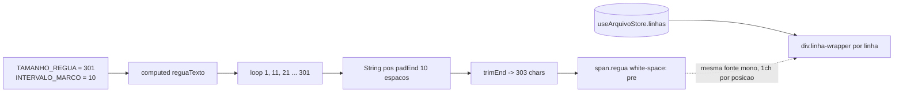

# PLAN — Régua de posições em marcos de 10 no visualizador

## Dados do Plano

| Campo               | Valor                                |
| ------------------- | ------------------------------------ |
| Número da US        | US36                                 |
| Slug                | `us36-regua-numerica-visualizador`   |
| Stack               | Quasar + Vue 3 + TypeScript + Vitest |
| Data de criação     | 2026-09-15                           |
| Data de modificação | —                                    |

---

## Resumo Técnico

Alterar apenas o `computed reguaTexto` de `src/components/ArquivoVisualizador.vue` (US15/US16), trocando o padrão de dígitos cíclicos (`123456789012…`) por marcos numéricos absolutos a cada 10 posições (`1`, `11`, `21`, … `291`, `301`), preenchidos com espaços em branco entre si.

Duas decisões tomadas na entrevista:

1. **Lógica permanece inline** no componente — nenhuma extração para `src/utils/`. A regra tem ~6 linhas, é exclusiva do visualizador e não é reaproveitada por serializer/validação; extrair criaria uma superfície de API sem consumidor (a mesma lógica de decisão da ADR-011, que mantém a responsabilidade de apresentação dentro do componente que a consome).
2. **A régua se estende até o marco `301`** — o último marco da série `10k + 1` passa a ser exibido por inteiro, em vez de a régua terminar em 300 tendo `291` como último marco. Isso muda **somente a régua visual**: o limite de conteúdo do arquivo e a largura útil de inspeção continuam os mesmos (a RN06 da US15 fixa 300 posições de cobertura de conteúdo; os 3 caracteres extras de `301` são apenas o rótulo do marco que fecha a régua).

O componente é compartilhado por todos os leiautes (hoje só CNAB240 implementado) — a mudança vale automaticamente para RCB001 e CNAB400 (ADR-001, ADR-011).

---

## Componentes Afetados

| Componente                                                   | Ação      | Notas                                                                                                                       |
| ------------------------------------------------------------ | --------- | --------------------------------------------------------------------------------------------------------------------------- |
| `src/components/ArquivoVisualizador.vue`                     | Modificar | Novo `reguaTexto`; `TAMANHO_REGUA` 300 → 301; nova constante `INTERVALO_MARCO`; atualizar JSDoc do bloco "Régua" e comentário do template |
| `test/vitest/unit/components/ArquivoVisualizador.spec.ts`    | Modificar | Substituir os casos de "300 caracteres" e "ciclo de dígitos" pelos casos de marcos (ver seção Testes)                        |
| `test/playwright/e2e/us36-regua-numerica-visualizador.spec.ts` | Criar     | E2E mínimo de alinhamento visual da régua com o conteúdo                                                                    |

Nenhum outro arquivo é tocado: sem mudanças em store, serializer, composables, CSS ou tokens `--lpd-*`.

---

## Estrutura de Dados

Nenhuma estrutura nova. Apenas constantes locais ao `<script setup>`:

```ts
// src/components/ArquivoVisualizador.vue

/**
 * Posição do último marco exibido na régua (RN02/US36).
 * A régua cobre as 300 posições de conteúdo (RN06/US15) e exibe ainda o marco
 * de fechamento "301" — por isso a string final tem 303 caracteres.
 */
const TAMANHO_REGUA = 301;

/** Intervalo entre marcos numéricos da régua (RN02). */
const INTERVALO_MARCO = 10;
```

O `computed` continua tipado como `computed<string>` e alimentando o mesmo `<span class="regua">`.

---

## Lógica Principal

1. **Geração dos marcos (RN01, RN02)** — iterar de `1` até `TAMANHO_REGUA` em passos de `INTERVALO_MARCO`, produzindo as posições `1, 11, 21, …, 291, 301`. O valor do marco é a própria posição absoluta 1-based.
2. **Preenchimento entre marcos (RN03, RN04)** — cada marco é convertido em string e aplicado `padEnd(INTERVALO_MARCO, ' ')`, garantindo que o dígito mais à esquerda do marco seguinte caia exatamente na coluna da sua posição. Marcos têm 1–3 caracteres, sempre menores que o intervalo de 10 (RN05), então nunca há invasão da coluna seguinte.
3. **Fechamento da régua** — o último marco (`301`) não deve arrastar 7 espaços inúteis ao fim da string; `trimEnd()` no retorno deixa a régua com 303 caracteres (300 posições de conteúdo + os 3 caracteres do rótulo `301`).

```ts
const reguaTexto = computed<string>(() => {
  let texto = '';
  for (let posicao = 1; posicao <= TAMANHO_REGUA; posicao += INTERVALO_MARCO) {
    texto += String(posicao).padEnd(INTERVALO_MARCO, ' ');
  }
  return texto.trimEnd();
});
```

4. **Preservação de espaços (RN04)** — `.regua` e `.regua-wrapper` já usam `white-space: pre`; nenhum ajuste de CSS é necessário para que os espaços de preenchimento sejam renderizados com largura de 1ch cada.
5. **Sticky e fonte (RN06)** — `.regua-wrapper { position: sticky; top: 0 }` e `font-family: var(--lpd-font-mono)` herdado de `.arquivo-container` permanecem intocados; a US não altera CSS.
6. **Acessibilidade** — a régua continua `aria-hidden="true"` (informação puramente visual, redundante com o `aria-label` do container). Não introduzir texto lido por leitor de tela: "1 11 21 31…" seria ruído.

---

## Composables / Serviços

Nenhum composable, store ou util é criado ou alterado. Decisão explícita da entrevista (pergunta 1): a lógica fica inline no `computed` do componente, não em `src/utils/`.

O componente segue lendo exclusivamente de `useArquivoStore` (ADR-011, ADR-012) — a régua é estática e independe do conteúdo da store.

---

## Eventos e Props (componente novo)

Nenhum componente novo. `ArquivoVisualizador.vue` continua sem props e sem emits.

---

## Fluxo de Dados



---

## Dependências Externas

**npm:** nenhuma dependência nova. `String.prototype.padEnd` e `trimEnd` são ES2017/ES2019, já suportados pelo target do Vite e pelos navegadores-alvo.

**Inter-US:**

- **US15** (Done) — provê `ArquivoVisualizador.vue`, a régua sticky, os números de linha e a RN06 das 300 posições. Esta US redefine somente o conteúdo textual da régua.
- **US16** (Done) — highlight de foco/erro por trecho; não é tocado, mas os testes de regressão existentes do arquivo devem continuar verdes.
- Nenhuma US futura depende formalmente desta; uma eventual US de "intervalo de marcos configurável" partiria de `INTERVALO_MARCO`.

---

## Testes

### Unitários / Componente (Vitest + Vue Test Utils)

Arquivo: `test/vitest/unit/components/ArquivoVisualizador.spec.ts`, bloco `describe('régua de posições')`.

- **Substituir** `it('tem exatamente 300 caracteres')` por `it('tem exatamente 303 caracteres (300 posições + marco de fechamento "301")')`.
- **Substituir** `it('começa com "123456789" e o décimo caractere é "0"')` por `it('começa com o marco "1" seguido de espaços')` — `texto.slice(0, 10) === '1         '`.
- **Novo:** alinhamento dos marcos — para cada `pos` em `[1, 11, 21, 101, 291, 301]`, `texto.slice(pos - 1, pos - 1 + String(pos).length) === String(pos)`.
- **Novo (CA03):** entre marcos só há espaço — `texto.slice(3, 10)` (e `texto.slice(13, 20)`) é composto apenas de `' '`; regex `/^[0-9 ]+$/` e ausência de qualquer dígito em posição não-marco: para cada índice `i`, `texto[i] !== ' '` implica que `i` pertence ao intervalo de algum marco.
- **Novo (RN05):** nenhum marco invade a coluna do seguinte — `String(marco).length <= INTERVALO_MARCO` verificado sobre todos os marcos gerados.
- **Manter** `it('permanece dentro de um wrapper com position sticky')` (CA05) e todos os testes de US15/US16 do arquivo como regressão.

### Integração

Coberto pelos próprios testes de componente acima (mount real com Pinia real, como já é o padrão do arquivo). Não há caso de integração adicional.

### E2E (Playwright)

Arquivo novo: `test/playwright/e2e/us36-regua-numerica-visualizador.spec.ts`.

- Abrir `/cnab-240`, abrir o painel visualizador com conteúdo gerado e assertar que o `textContent` de `.regua` começa com `1` e contém `291` na posição esperada (CA02).
- **Alinhamento visual (CA04):** comparar `boundingBox().x` do `.regua` com o `x` do primeiro `.trecho` da primeira linha — devem coincidir (mesmo offset do `line-num`), confirmando que o marco "1" está sobre a coluna 1 do conteúdo.
- Rolar o conteúdo verticalmente e confirmar que a régua permanece visível (CA05).

---

## Riscos e Decisões em Aberto

| Risco / Dúvida                                                                                     | Impacto | Mitigação                                                                                                                              |
| -------------------------------------------------------------------------------------------------- | ------- | -------------------------------------------------------------------------------------------------------------------------------------- |
| Semântica de `TAMANHO_REGUA = 301` vs. o limite de 300 da RN06/US15                                | Médio   | Decisão registrada: **só a régua visual** cresce (303 caracteres, fechando no marco `301`); o limite de conteúdo permanece 300. Confirmar com o humano antes de atualizar a SPEC da US36 (escopo "Excluído" ainda diz "permanece 300") |
| Régua 3 caracteres mais larga que o conteúdo amplia a largura de scroll horizontal do container    | Baixo   | `width: max-content` no `.arquivo-container` já acomoda; efeito é de 3ch (~21px em 12px mono), imperceptível                            |
| Densidade visual menor pode dificultar contagem fina entre marcos (ex.: posição 73)                | Baixo   | Comportamento pretendido pela US (SPEC UC01 descreve exatamente esse fluxo de contar poucas casas a partir do marco)                    |
| Testes existentes de US15 acoplados ao valor 300 quebram                                           | Baixo   | Atualização dos dois casos está no escopo desta US; demais casos de US15/US16 não tocam a régua                                         |
| Marcos de 4 dígitos caso um futuro Modo Playground passe de 999 posições                           | Baixo   | Fora de escopo; `INTERVALO_MARCO = 10` ainda comporta 4 dígitos sem overflow (RN05 continua válida até 9999)                            |

---

## Ordem sugerida de implementação

1. Atualizar constantes em `src/components/ArquivoVisualizador.vue`: `TAMANHO_REGUA = 301` e novo `INTERVALO_MARCO = 10`, com JSDoc explicando a semântica (300 posições de conteúdo + marco de fechamento).
2. Reescrever o `computed reguaTexto` com o loop de marcos + `padEnd` + `trimEnd`, atualizando o `@example` do JSDoc.
3. Atualizar o comentário do template (`<!-- Régua de posições 1–300 ... -->`) e o bloco "## Régua de 300 posições (RN06)" do JSDoc do componente, citando US36.
4. Atualizar os dois casos de teste de régua em `test/vitest/unit/components/ArquivoVisualizador.spec.ts` e adicionar os novos casos de alinhamento/preenchimento; rodar a suíte para garantir que US15/US16 seguem verdes.
5. Criar o E2E `test/playwright/e2e/us36-regua-numerica-visualizador.spec.ts` com os três cenários (marcos, alinhamento por bounding box, sticky).
6. Verificação manual no navegador em `/cnab-240`: conferir que o caractere na posição 21 de uma linha está sob o marco `21`, e que nenhuma regressão de highlight (US16) ocorreu.

---

## Custo da IA

| Métrica              | Valor                       |
| -------------------- | --------------------------- |
| Modelo               | claude-opus-5               |
| Tokens de entrada    | ~40k                        |
| Tokens de saída      | ~7k                         |
| Custo estimado (USD) | ~$1,13                      |
| Taxa de câmbio       | 1 USD = R$5,40 (2026-09-15) |
| Custo estimado (BRL) | ~R$6,10                     |

> Estimativa de tokens: leitura de SPEC, ADRs, componente e testes existentes (~40k tokens entrada), entrevista técnica e escrita do PLAN.md (~7k tokens saída).
> Preços claude-opus-5: $15/M tokens entrada, $75/M tokens saída.

## Custo Estimado do Refinamento (15/09/2026)

| Métrica              | Valor                       |
| -------------------- | --------------------------- |
| Modelo               | claude-opus-5               |
| Tokens de entrada    | ~18k                        |
| Tokens de saída      | ~5k                         |
| Custo estimado (USD) | ~$0,65                      |
| Taxa de câmbio       | 1 USD = R$5,40 (2026-09-15) |
| Custo estimado (BRL) | ~R$3,51                     |

> Estimativa de tokens: sessão de entrevista técnica desta US (perguntas 1 e 2, contexto do card e da SPEC) e geração do plano (~18k entrada / ~5k saída).
> Preços claude-opus-5: $15/M tokens entrada, $75/M tokens saída.
