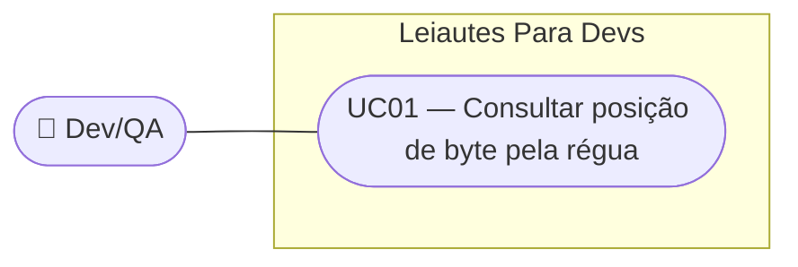

# SPEC — Régua de posições em marcos de 10 no visualizador

## Dados da SPEC

| Campo            | Valor                                                                            |
| ---------------- | --------------------------------------------------------------------------------- |
| Número da US     | US36                                                                               |
| Prioridade       | P1                                                                                 |
| Status           | Draft                                                                              |
| Data de criação  | 2026-09-13                                                                         |
| Slug             | `us36-regua-numerica-visualizador`                                                |
| Card Trello      | https://trello.com/c/RYQMJdLo/38-us36-régua-de-posições-em-marcos-de-10-no-visualizador |

---

## Contexto

O painel visualizador do arquivo (`ArquivoVisualizador.vue`, introduzido na US15) exibe uma régua de posições fixa no topo do terminal. Hoje essa régua mostra um dígito por posição, ciclando de 0 a 9 (`123456789012345...`), conforme a RN06 da SPEC da US15. Essa representação é ambígua: ao olhar para a régua, o usuário não consegue ler diretamente a posição absoluta de um caractere — precisa contar manualmente a partir do início da linha ou de algum ponto de referência conhecido.

Como o produto existe justamente para que devs e QAs verifiquem se um campo está posicionado corretamente em um arquivo de largura fixa (CNAB/RCB), a régua é uma peça central da UX de validação. Uma régua que exige contagem manual contradiz o propósito da ferramenta. Esta US substitui o padrão cíclico por marcos numéricos absolutos a cada 10 posições (1, 11, 21, 31, 41…), que podem ser lidos diretamente sem contagem.

O componente `ArquivoVisualizador.vue` é compartilhado entre todos os leiautes (hoje só CNAB240 está implementado; RCB001 e CNAB400 vão reutilizá-lo) — a mudança é feita uma única vez, sem lógica condicional por leiaute.

---

## Escopo

### Incluso

- Substituição do texto da régua (`reguaTexto` em `ArquivoVisualizador.vue`) de dígitos cíclicos para marcos numéricos a cada 10 posições
- Marco "1" na primeira posição; marcos subsequentes em 11, 21, 31… até o marco "301", que fecha visualmente a régua logo após o limite de conteúdo de 300 posições
- Preenchimento em branco entre um marco e o próximo
- Alinhamento exato de cada marco com a coluna de caractere correspondente à sua posição no conteúdo do arquivo abaixo
- A string da régua passa a ter 303 caracteres (300 posições de conteúdo + os 3 dígitos do rótulo do marco "301"), para que esse último marco não seja truncado

### Excluído

- Alteração do limite de conteúdo/inspeção do arquivo (permanece 300 posições — RN06 da US15); apenas a string visual da régua cresce para acomodar o rótulo do último marco
- Separadores visuais adicionais entre marcos (ticks, traços, linhas guia)
- Alteração do comportamento de highlight de foco/erro (US16) — inalterado por esta US
- Intervalo entre marcos configurável pelo usuário
- Alteração da régua de leiautes ainda não implementados (RCB001, CNAB400) além do que o componente compartilhado já herda automaticamente

---

## Regras de Negócio

### RN01 — Marco inicial na posição 1

A régua sempre exibe o número "1" começando exatamente na primeira posição (coluna) do conteúdo do arquivo.

### RN02 — Marcos a cada 10 posições

A partir da posição 1, a régua exibe um novo marco numérico a cada 10 posições: 1, 11, 21, 31, 41, 51... até o marco "301", que fecha a régua imediatamente após o limite de conteúdo de 300 posições (RN06 da US15, inalterada). O valor de cada marco é sempre a posição absoluta (1-based) em que ele começa.

### RN03 — Espaço em branco entre marcos

Entre o final de um marco numérico e o início do próximo, a régua exibe apenas espaços em branco — sem dígitos cíclicos, sem separadores visuais adicionais.

### RN04 — Alinhamento caractere-a-caractere

Cada marco numérico deve iniciar exatamente na coluna de caractere que corresponde à sua posição no conteúdo das linhas abaixo. Como a régua e o conteúdo usam a mesma fonte monoespaçada (`--lpd-font-mono`) e cada posição ocupa exatamente 1 caractere de largura, o dígito mais à esquerda de cada marco (ex.: o "1" de "11", "21", "31"...) deve estar na coluna exata da posição correspondente.

### RN05 — Sem overflow entre marcos

Como os marcos vão de 1 a 3 dígitos (posições 1–9, 10–99, 100–301) e o intervalo entre marcos é de 10 posições, o texto de um marco nunca deve invadir a coluna do marco seguinte (o maior marco, "301", tem 3 caracteres, cabendo nas 10 posições de intervalo).

### RN06 — Herança das regras não alteradas da US15

Todas as demais regras da régua definidas na SPEC da US15 permanecem válidas e não são alteradas por esta US: régua sticky no topo durante o scroll vertical (RN06), fonte `--lpd-font-mono` obrigatória (RN08), régua compartilhada entre leiautes (implícito na arquitetura de `ArquivoVisualizador.vue`).

---

## Use Cases

### UC01 — Dev consulta a posição de um campo pela régua

- **Ator:** dev ou QA
- **Precondição:** página do leiaute carregada (ex.: `/cnab-240`), drawer/painel visualizador aberto, com conteúdo gerado
- **Fluxo principal:**
  1. Dev quer confirmar em qual posição um campo específico começa (ex.: "Nome da Empresa", posições 73–92, conforme UC01 da US15)
  2. Dev olha para a régua no topo do painel
  3. Dev localiza o marco "71" (o marco de dezena mais próximo antes de 73) e conta visualmente 2 posições à direita para chegar em 73
  4. Dev confirma que o valor do campo no conteúdo abaixo começa exatamente naquela coluna
- **Fluxo alternativo:** campo começa exatamente em um marco (ex.: posição 21) — dev lê o número diretamente, sem precisar contar
- **Postcondição:** dev confirma visualmente a posição do campo sem precisar contar caractere por caractere desde o início da linha

---

## Critérios de Aceitação

### CA01 — Marco "1" na primeira posição

**Dado que** o painel visualizador está aberto com conteúdo gerado
**Quando** o usuário observa o início da régua
**Então** o caractere "1" aparece exatamente na primeira coluna, alinhado com o primeiro caractere da primeira linha do arquivo

### CA02 — Marcos a cada 10 posições

**Dado que** a régua está renderizada
**Quando** o usuário percorre a régua da esquerda para a direita
**Então** os marcos numéricos aparecem na sequência 1, 11, 21, 31, 41... até a posição 301 (marco que fecha a régua logo após o limite de conteúdo de 300), cada um alinhado com sua coluna correspondente

### CA03 — Sem dígitos cíclicos remanescentes

**Dado que** a régua foi atualizada por esta US
**Quando** o usuário inspeciona qualquer trecho entre dois marcos
**Então** não há mais nenhum dígito cíclico (0–9 repetindo) — apenas espaços em branco

### CA04 — Alinhamento com o conteúdo

**Dado que** uma linha do arquivo tem um valor conhecido em uma posição específica (ex.: caractere na posição 21)
**Quando** o usuário compara a régua com o conteúdo da linha
**Então** o marco "21" da régua está exatamente na mesma coluna do caractere na posição 21 do conteúdo

### CA05 — Régua sticky preservada

**Dado que** o painel visualizador está exibindo múltiplas linhas
**Quando** o usuário rola o conteúdo verticalmente
**Então** a régua com os novos marcos permanece fixa (sticky) no topo do painel, sem regressão de comportamento em relação à US15

### CA06 — Fonte inalterada

**Dado que** a régua exibe os novos marcos
**Quando** o usuário inspeciona o estilo (DevTools ou visualmente)
**Então** a régua continua usando `--lpd-font-mono` (JetBrains Mono), sem alteração

### CA07 — Compartilhado entre leiautes

**Dado que** o componente `ArquivoVisualizador.vue` é usado por qualquer leiaute
**Quando** o painel é renderizado (verificado via CNAB240, único leiaute implementado hoje)
**Então** a régua com marcos de 10 aparece sem necessidade de configuração adicional por leiaute

---

## Custo da IA

| Métrica              | Valor                        |
| --------------------- | ----------------------------- |
| Modelo                | claude-sonnet-5               |
| Tokens de entrada     | ~45k                          |
| Tokens de saída       | ~7k                           |
| Custo estimado (USD)  | ~$0,25                        |
| Taxa de câmbio        | 1 USD = R$5,40 (2026-09-13)   |
| Custo estimado (BRL)  | ~R$1,35                       |

> Valores aproximados, apenas para a fase de geração do SPEC (interview + criação do card no Trello + SPEC.md).

## Custo Estimado do Refinamento (14/09/2026)

> Refinado em: 14/09/2026

| Métrica | Valor |
|---|---|
| Modelo | claude-sonnet-5 |
| Tokens de entrada | ~12k |
| Tokens de saída | ~1k |
| Custo estimado (USD) | ~$0,05 |
| Taxa de câmbio | 1 USD = R$5,80 (2026-08-30) |
| Custo estimado (BRL) | ~R$0,29 |
